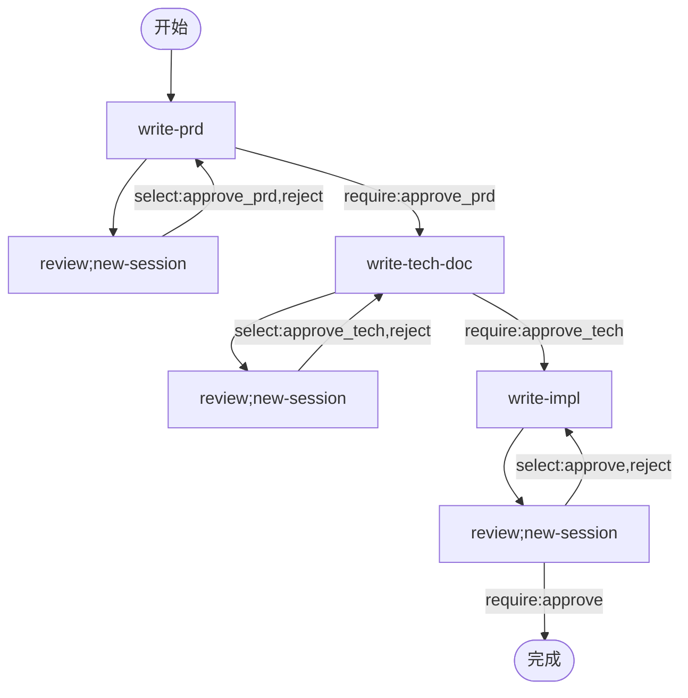

# 需求文档

## 产品信息

- 名称：Neco

- 介绍：

> 原生支持多智能体协作的智能体应用。

---

## 主要解决问题

### 现有多智能体协作方案不完善

多智能体可以用于：

- 并行执行不同操作，提升效率。
- 整理和过滤任务所需信息，保持主模型上下文干净，降低思考干扰和调用成本。

现有的主流AI Agent应用，如Claude Code等各类编码工具、OpenClaw等，在多智能体协作方面，仅提供了以下功能：

- 创建一个子Agent。
- 子Agent任务完成后，接收输出。

当出现异常情况，如任务执行时间过长/偏航等，无法第一时间纠正。

### 工作流固定问题

当前许多开发者、企业等，已经开发出了Agent独有的工作流，例如：

- PRD（需求文档、技术文档、实施计划）
- TDD（测试驱动开发）
- 让模型A开发，模型B检查

但是这个工作流仍然需要手动推进每一步，仍然有自动化空间。

并且我希望这个工作流是可以共享的。

---

## 功能特性

### 模型组/多模型提供商配置

个人认为，未来模型会往专用化、细分化的方向发展。

目前因为算力资源有限，大多数国内一线模型厂商只能提供1-2种模型，但各个模型之间的特征差异明显：

- 一部分模型脑子很好，善于思考，灵感似涌泉。
- 一部分模型更擅长执行，执行准确，输出速度快。
- 这两项都很擅长的模型，价格一般不便宜，或者速度不够快。

以及以下细分需求：

- 部分模型有图像/语言识别能力。
- 有多个提供者可选，或有同一提供者的多个API Key，希望循环使用模型，实现负载均衡或避免中断。
  - 当出现异常，尝试3次均失败时，自动尝试下一个可选模型，或当前模型的下一个API Key。

### 模型调用

- 基于OpenAI Chat Completion API。
  - OpenAI API调用使用`async-openai`这个crate。
- 流式输出
- 工具调用
  - 尽可能支持并行化工具调用
- 不需要支持更多功能，因为这些API就可以实现所有功能

- 为后续支持Anthropic、OpenAI Responses、OpenRouter、Github Copilot等预留接口。

### Session管理

- 存储在`~/.local/neco/(session_id)/(agent_ulid).toml`目录下。目录下存储所有的上下文内容。
- **Session ID与Agent ULID的关系**：
  - Session ID是顶级容器的ULID，在创建Session时生成
  - Agent ULID是每个Agent实例的ULID，在Agent开始对话时生成
  - 第一个Agent（最上层）的Agent ULID与Session ID相同
- Session ID使用ULID（Universally Unique Lexicographically Sortable Identifier）。使用`ulid`这个crate。

#### 消息内容存储

- 使用TOML存储消息内容：

- 参考：`(agent_ulid).toml`。不同Agent使用不同文件。

```toml
# Agent配置
prompts = ["base"]

# Agent层级关系（用于SubAgent模式）
parent_ulid = "01HF..."  # 父Agent的ULID，最上层Agent此字段省略不填

# Agent消息列表
[[messages]]
role = "user"
content = "xxx"

[[messages]]
role = "ass"
content = "xxx"
```

- 上述`agent_ulid`在Agent开始对话时生成。
- 目录结构：`~/.local/neco/(session_id)/(agent_ulid).toml`
  - 对于最上层Agent，`(agent_ulid)` 与 `(session_id)` 相同
- 目录结构：`~/.local/neco/(session_id)/(agent_ulid).toml`
- 通过`parent_ulid`字段可以恢复完整的Agent树形结构。

### MCP

- 使用`rmcp`这个crate。
- 同时支持`local`和`http`两种形式。

### Skills

- 参考：[agentskills.io](https://agentskills.io/)。
- 按需加载

### 上下级智能体之间的协作

- 基于`SubAgent`模式。

- 添加上下级智能体之间的沟通工具，上下级模型之间可以直接在会话中传递内容。
- 上级可以要求下级执行汇报。
- 灵感来自现代公司分工。

- 多层智能体树形结构：
  - 最上层智能体直接与用户对话，每个Session只有一个最上层智能体。
  - 每个智能体都可以有多个下级。可以设置例外情况，例如执行智能体只能用于执行。
  - 上层智能体发现任务可以拆分且并行执行时，生成多个下级智能体。
  - 最终会形成一个动态的树形结构。

#### SubAgent创建行为

- 可以指定使用的Agent（来自配置目录的`agents`下的Agent定义）。
- 默认可以覆盖`model`、`model_group`、`prompts`等字段。

### 自定义工作流

- 在没有定义工作流时，默认工作流只有一个节点。

- 使用Mermaid图 + 每个节点一个.md文件表示node

- 多个节点可以同时运行。
- 如果箭头有出节点，则必须调用出节点工具，该节点才能结束运行。
  - 箭头如果没有文字，则单纯表示将消息传递给下游Agent，对应工具为`workflow:message`。
  - 如果有文字，则表示条件：
    - select表示单选项选择，如果被选择了，将对应计数器+1
    - require表示需要该选项计数器>0，执行后计数器-1
    - 对应工具为`workflow:xxx`，其中xxx为这个选项
  - 都要求带上`message`参数，表示传递的信息内容。

- 节点选项：
  - new-session表示一直启用新session而不是复用session

#### 工作流Session层次结构

- 工作流Session：存储工作流状态（计数器、全局变量）
- 节点Session：工作流Session的子Session，存储节点执行上下文
- `new-session`创建的节点Session自动关联到工作流Session

- 使用示例：
  - 定义PRD流程
  - 执行/审阅循环流程

#### 重要概念：双层结构区分

Neco系统中存在**两个独立的层次结构**，它们在不同层面运作：

##### **1. 工作流节点之间的图结构（Workflow-Level Graph）**

- **定义方式**：通过Mermaid图（`workflow.mermaid`）静态定义
- **结构类型**：有向图（DAG），节点之间通过边（edges）连接
- **转换控制**：由边条件（`select`/`require`计数器）控制节点之间的转换
- **存储位置**：工作流Session存储计数器、全局变量
- **生命周期**：工作流启动时创建，工作流完成时销毁
- **示例**：`WRITE_PRD --> REVIEW_PRD`（节点之间的转换）

##### **2. 单个节点下的Agent树结构（Node-Level Agent Tree）**

- **定义方式**：运行时动态创建（Agent实例化）
- **结构类型**：树形结构，Agent之间通过`parent_ulid`建立父子关系
- **协作方式**：父子Agent通过通信工具直接传递内容
- **存储位置**：节点Session下的Agent TOML文件
- **生命周期**：节点启动时创建Agent树，节点完成时销毁
- **示例**：根Agent创建多个子Agent并行研究不同主题

##### **关键区别**

- 工作流图定义"**做什么任务**"（任务编排）
- Agent树定义"**怎么做任务**"（任务执行）
- 工作流边控制**节点之间**的转换，不控制**Agent之间**的关系
- `parent_ulid`用于Agent树的父子关系，不用于工作流节点之间的关系

### 模块化提示词与工具，以及按需加载

- 模块化提示词、工具、MCP、Skills等实例的目的是，支持内容的按需加载。
- 添加一个统一的`Activate`工具，用于加载未加载的内容。

---

## 实现要求

- 只使用大语言模型。暂不添加对Embeddings、Rerank、Apply等额外模型的支持。

---

## 工具注意事项

- 工具名应小写。以下工具名默认转换成小写格式。

### 1、Read

- 读取文件
- 实现 Hashline 技术。Agent 读到的每一行代码，末尾都会打上一个强绑定的内容哈希值，格式类似下文的`AKVK`，称为“行哈希”。

```text
AKVK| function hello() {
VNXJ|   return "world";
AIMB| }
```

- 假设当前行号为`N`，则每一行的哈希值，来源于第`N`行到第`MAX(N-4,1)`行的内容之和。使用`xxhash-rust`这个crate。
- 以上示例仅供格式参考，实际生成的哈希值不一定要与此相同。

### 2、Edit

- 编辑文件
- 传入开始行哈希和结束行哈希（都是闭区间），以及修改后的内容。
  - 选择匹配的第一行。

---

## 参考配置方式

- 配置目录：`~/.config/neco`
- 本节的所有“配置路径”，都是相对于配置目录的路径。

- 配置目录（\`~/.config/neco\`）和Session目录（\`~/.local/neco\`）分离的原因:
  1. **配置目录**: 存放用户配置、Agent定义、工作流定义等**相对静态**的内容
  2. **Session目录**: 存放运行时数据、消息历史、状态等**动态生成**的内容

### 基本配置文件

- 配置路径（按照以下优先级）：
  - 全局配置（优先级最高）：`neco.toml`
  - 带标签的全局配置（优先级低于全局配置）：`neco.xxx.toml`，其中的`xxx`可以是任何合法文件名字符串，按照文件名顺序应用。

**配置合并策略**：

- 标量类型（字符串、数字）：后加载的配置覆盖先加载的配置
- 数组类型：后加载的配置替换先加载的配置（如需追加，使用特殊语法`models = ["+C"]`）
- 对象类型：深层次合并（递归合并每个字段）
- 除了TOML格式外，也支持YAML格式，数据定义、配置形式等都一致。所有TOML格式配置文件比所有YAML格式的优先级更高。例如：`neco.dev.toml`的优先级比`neco.yaml`更高。

- 格式如下：

```toml

# 模型组定义
[model_groups.think]
models = ["zhipuai/glm-4.7"]
# 对应 model_providers.zhipuai （完全匹配）

[model_groups.balanced]
models = ["zhipuai/glm-4.7", "minimax-cn/MiniMax-M2.5"]

[model_groups.act]
models = ["zhipuai/glm-4.7-flashx"]

[model_groups.image]
models = ["zhipuai/glm-4.6v"]

# 以下设置应内置于代码中
[model_providers.zhipuai]
type = "openai" # 使用OpenAI Chat接口
name = "ZhipuAI"
base = "https://open.bigmodel.cn/api/paas/v4"
api_key_env = "ZHIPU_API_KEY"

# 以下设置应内置于代码中
[model_providers.zhipuai-coding-plan]
type = "openai" # 使用OpenAI Chat接口
name = "ZhipuAI Coding Plan"
base = "https://open.bigmodel.cn/api/coding/paas/v4"
api_key_env = "ZHIPU_API_KEY"

# MiniMax参考配置
[model_providers.minimax-cn]
type = "openai" # 使用OpenAI Chat接口
name = "MiniMax (CN)"
base = "https://api.minimaxi.com/v1"
api_key_envs = ["MINIMAX_API_KEY", "MINIMAX_API_KEY_2"]

# MCP参考：本地stdio形式
# 当command存在时，优先采用本地stdio形式
[mcp_servers.context7]
command = "npx"
args = ["-y", "@upstash/context7-mcp"]

[mcp_servers.context7.env]
MY_ENV_VAR = "MY_ENV_VALUE"

# MCP参考：HTTP形式
# 当url字段存在时，默认采用HTTP形式
# 如果与之前的模式冲突，优先采用之前的模式（本地stdio）
[mcp_servers.figma]
url = "https://mcp.figma.com/mcp"
bearer_token_env_var = "FIGMA_OAUTH_TOKEN"
http_headers = { "X-Figma-Region" = "us-east-1" }
```

#### API密钥配置（三种方式，只能使用一种）

- 方式1: 单个环境变量名

```toml
api_key_env = "API_KEY"
```

- 方式2: 多个环境变量名（轮询使用）

```toml
api_key_envs = ["API_KEY_1", "API_KEY_2"]
```

- 方式3: 直接写入密钥（不推荐，仅用于测试）

```toml
api_key = "sk-..."
```

- 优先级: api_key > api_key_env > api_key_envs
- api_key_envs 轮询策略: 按数组顺序轮询，遇到失败则尝试下一个

### 提示词组件定义

- 路径：`prompts/xxx.md`
- 单个Markdown文件即为一个提示词组件，用于插入提示词。
- 该Markdown文件的内容即为该组件的提示词。
- 无头部信息。`xxx`即为这个提示词组件的`name`。

#### 内置提示词组件

- `base`：任何时候都加载。包含如何加载未加载的内容的提示。
- `multi-agent`：如果这个Agent可以生成下级Agent，则加载。
- `multi-agent-child`：如果这个模型有上级Agent，则加载。

#### 工具提示词组件

- 在工具定义处，随工具加载。

### Agent定义

- 路径：`agents/xxx.md`
- 单个Markdown文件即为一个Agent定义。
- 该Markdown文件的内容即为该Agent的提示词。

#### Agent头部信息

```yaml
# （可选）激活的提示词组件。按顺序激活。
# 在未定义prompts的情况下，默认只有base启用。
prompts:
  - base
  - multi-agent 
```

### 工作流定义

- 工作流根路径：`workflows/xxx/`

#### 参考：PRD工作流

- 相对工作流根路径的路径：`workflow.mermaid`



- **Agent查找优先级**：
  1. `workflows/xxx/agents/`（工作流特定，优先）
  2. `~/.config/neco/agents/`（全局配置，后备）
  同名Agent：工作流特定覆盖全局配置

- 此时，工作流目录或配置目录的`agents`目录，应该有：
  1. `write-prd.md`
  2. `write-tech-doc.md`
  3. `write-impl.md`
  4. `review.md`

---

## 用户接口

基本的运行逻辑都一致，只在界面上有区别。

### A. 直接输入输出

传入`-m 消息内容`参数，直接执行，输出结果。

- 输出结束后也输出`--session xxxxxxxx`参考参数，用于接续对话上下文。（Session管理部分见下文）
- 使用`ratatui`渲染。
- 使用ratatui的`Viewport::Inline`模式，非全屏TUI。
  - 按行渲染输出，不切换到alternate screen（全屏）。
  - 保留终端历史记录，TUI在当前光标下方显示。

### B. 终端REPL

- 使用ratatui的`Viewport::Inline`模式，非全屏TUI。
  - REPL界面不占用全屏，保留终端历史记录。

### C. 后台运行模式

参考ZeroClaw项目的架构设计:

1. **守护进程**: neco作为系统服务运行，管理Session生命周期
2. **IPC通信**: 使用gRPC或Unix Socket与前端交互
3. **状态暴露**: 提供HTTP API查询Session状态和进度
4. **多前端支持**: 支持CLI、Web UI、IDE插件等多种前端

与ZeroClaw的主要区别:

- ZeroClaw是通用自动化工具，Neco专注于AI Agent协作
- Neco的Session管理更复杂（支持智能体树）

### 要求

- 模式A和B都使用`ratatui`的`Viewport::Inline`模式（非全屏TUI），不使用alternate screen（全屏模式）。
- 模式A和B共享渲染逻辑。
- 以下逻辑要求分离至不同crate：
  - 核心执行逻辑
  - 终端输出逻辑
  - 后台Agent与外部接口

### 错误处理机制

1. **模型调用错误**:
   - 网络错误: 自动重试3次，每次间隔指数退避（1s, 2s, 4s）
   - API错误（4xx）: 不重试，直接返回错误给Agent
   - API错误（5xx）: 重试3次
   - 所有重试失败后，尝试model_group中的下一个模型

2. **工具调用错误**:
   - 工具执行失败: 将错误信息返回给Agent，由Agent决定如何处理（重试、跳过或终止）
   - Agent对工具错误的最终决定即为节点状态（无需额外workflow配置介入）
   - 工具超时: 默认30秒超时，可配置

3. **配置错误**:
   - 启动时配置验证失败: 立即报错退出，不启动
   - 运行时配置热加载失败: 回滚到上一版本，记录错误日志

4. **工作流错误**:
   - 节点执行失败: 根据workflow配置决定是否继续或中断
   - 死锁检测: 超过5分钟无进度时，中断工作流并报错
