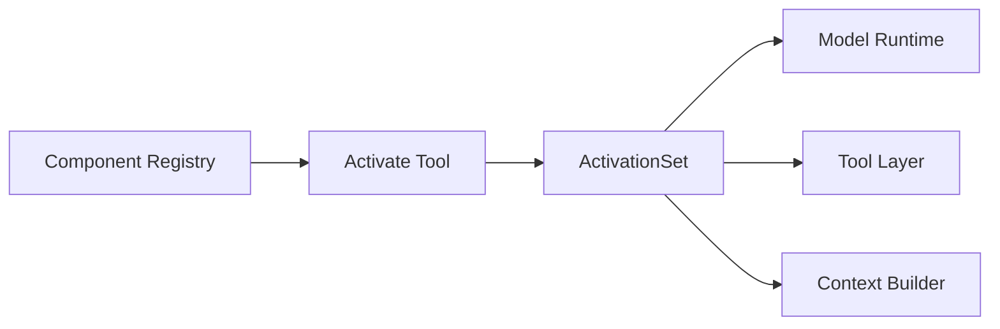
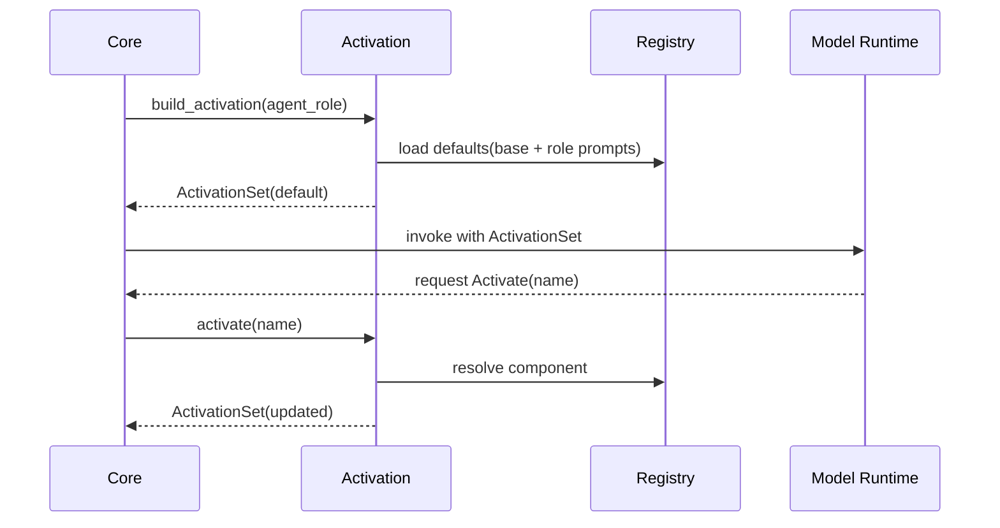
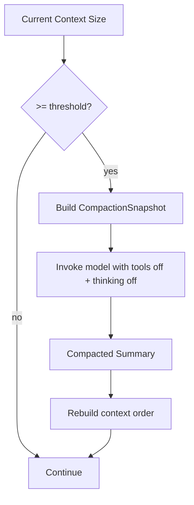

# TECH-ACTIVATION-COMPACTION

## 1. 范围

本文件描述按需加载与上下文压缩的内部关系：激活集合构建、动态加载、压缩触发与重组顺序。

## 2. 激活子系统结构



## 3. 关键数据结构（伪类型）

```text
ActivationSet {
  prompts[]
  tools[]
  mcps[]
  skills[]
}

CompactionPolicy {
  auto_enabled
  threshold_percent   // default 90
  manual_trigger_cmd  // /compact
}

CompactionSnapshot {
  default_activated
  dynamic_activated
  conversation_history
}
```

## 4. 默认激活与动态激活流



## 5. 上下文压缩流



重组顺序约束：

1. 默认激活内容。
2. 压缩输出内容。
3. 历史上动态激活过的 Tool/MCP/Skill。

## 6. 压缩伪代码

```text
function compact_if_needed(ctx, policy):
  if policy.auto_enabled and ctx.usage_percent >= policy.threshold_percent:
    return run_compaction(ctx)
  return ctx

function run_compaction(ctx):
  snapshot = capture(ctx)
  summary = call_model(
    messages = snapshot.conversation_history,
    tools = [],
    thinking = false
  )
  return rebuild_context(
    defaults = snapshot.default_activated,
    summary = summary,
    dynamic = snapshot.dynamic_activated
  )
```

## 7. 设计约束

1. `Activate` 是统一入口，避免 Prompt/Tool/MCP/Skill 各自暴露不同激活协议。
2. 压缩阶段必须关闭工具与思考模式，保证结果为纯文本总结。
3. 手动压缩与自动压缩走同一执行路径，仅触发源不同。
4. MCP 连接层使用 `rmcp`，并通过同一激活集合统一承载 `local` 与 `http` 两种端点形态。
