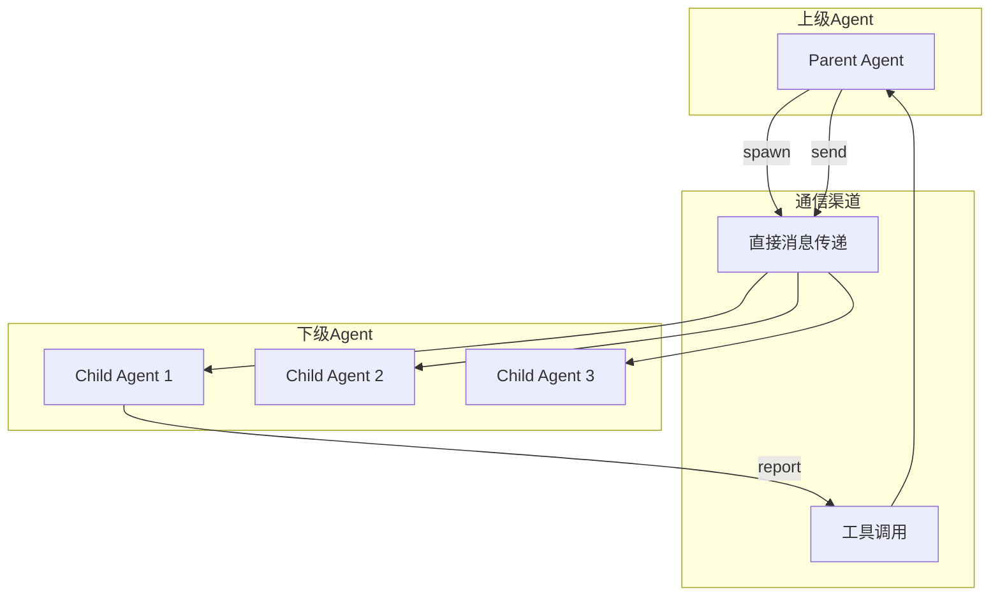
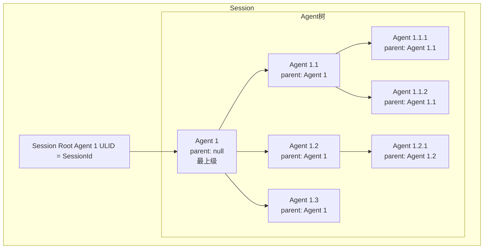
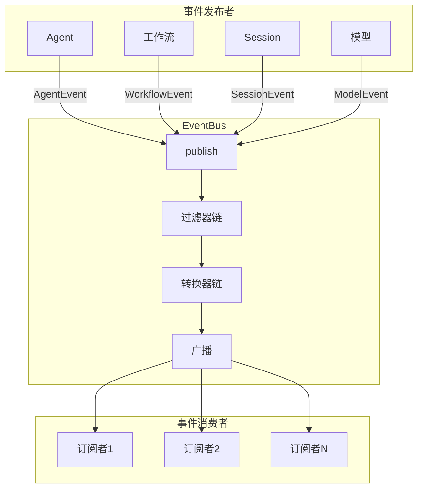
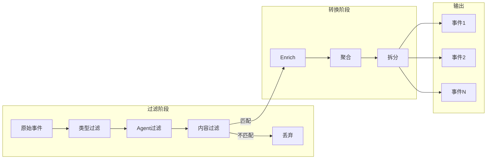
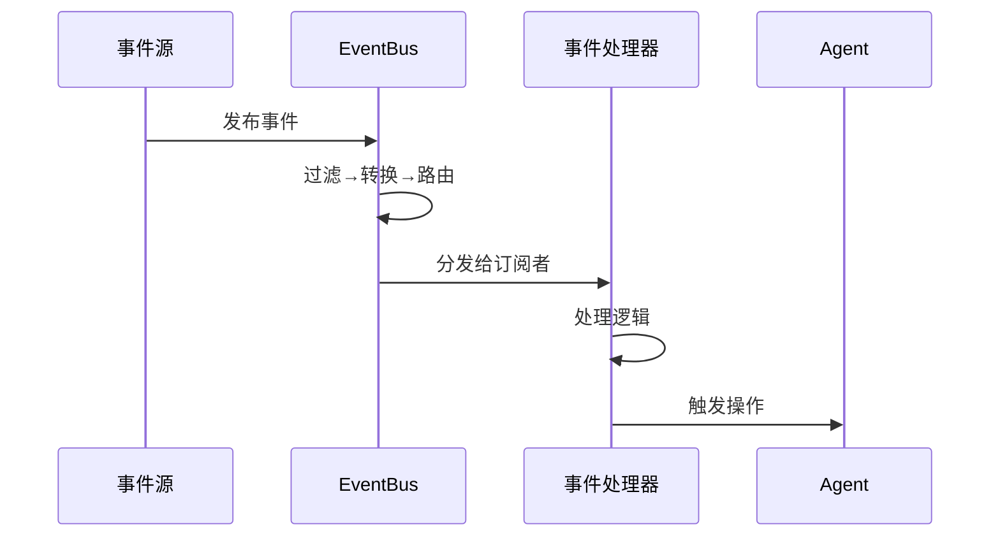

# TECH-AGENT: 多智能体协作模块

本文档描述Neco项目的多智能体协作模块设计，包括SubAgent模式、通信机制和Agent生命周期。

## 1. 模块概述

多智能体协作模块实现SubAgent模式，支持动态创建下级Agent、上下级通信和Agent树形结构管理。

## 2. 核心概念

### 2.1 SubAgent模式



**设计原则：**
- **层次化结构**：上级Agent可以创建多个下级Agent
- **通信隔离**：下级Agent不能直接相互通信，必须通过上级
- **生命周期管理**：上级Agent可以监控和控制下级Agent
- **权限继承**：下级Agent继承上级的部分权限

### 2.2 Agent树结构



## 3. 数据结构设计

> **注意**: 
> - `Agent` 和 `AgentConfig` 结构定义见 [TECH-SESSION.md#32-agent结构](TECH-SESSION.md#32-agent结构)
> - `Message` 类型定义见 [TECH-SESSION.md#33-消息结构](TECH-SESSION.md#33-消息结构)

### 3.1 Agent间通信

```rust
/// Agent间消息
#[derive(Debug, Clone)]
pub struct InterAgentMessage {
    /// 消息ID
    pub id: String,
    
    /// 发送方
    pub from: AgentUlid,
    
    /// 接收方
    pub to: AgentUlid,
    
    /// 消息类型
    pub message_type: MessageType,
    
    /// 内容
    pub content: String,
    
    /// 时间戳
    pub timestamp: DateTime<Utc>,
    
    /// 是否需要回复
    pub requires_response: bool,
}

/// 消息类型
#[derive(Debug, Clone)]
pub enum MessageType {
    /// 任务分配
    TaskAssignment {
        task_id: String,
        priority: TaskPriority,
        deadline: Option<DateTime<Utc>>,
    },
    
    /// 进度报告
    ProgressReport {
        task_id: String,
        progress: f64,
        status: TaskStatus,
    },
    
    /// 结果汇报
    ResultReport {
        task_id: String,
        result: String,
        success: bool,
    },
    
    /// 询问/澄清
    ClarificationRequest {
        question: String,
        context: String,
    },
    
    /// 普通消息
    General,
}

#[derive(Debug, Clone, Copy, PartialEq, Eq)]
pub enum TaskPriority {
    Low,
    Normal,
    High,
    Critical,
}

#[derive(Debug, Clone, Copy, PartialEq, Eq)]
pub enum TaskStatus {
    Pending,
    InProgress,
    Blocked,
    Completed,
    Failed,
}
```

## 4. Agent管理器

### 4.1 核心结构

```rust
/// Agent管理器
pub struct AgentManager {
    /// Session引用
    session: Arc<RwLock<Session>>,
    
    /// 模型客户端
    model_client: Arc<dyn ModelClient>,
    
    /// 工具注册表
    tool_registry: Arc<ToolRegistry>,
    
    /// 配置
    config: ConfigManager,
    
    /// 消息发送通道
    message_tx: mpsc::Sender<InterAgentMessage>,
}

impl AgentManager {
    /// 创建根Agent
    pub async fn create_root_agent(
        &self,
        agent_id: &str,
    ) -> Result<AgentUlid, AgentError> {
        // TODO: 实现创建根Agent的逻辑
        // 1. 查找Agent定义
        // 2. 解析Agent定义
        // 3. 创建Session
        // 4. 加载提示词
    }
    
    /// 生成下级Agent
    pub async fn spawn_child_agent(
        &self,
        parent_ulid: AgentUlid,
        agent_id: &str,
        overrides: AgentConfigOverrides,
    ) -> Result<AgentUlid, AgentError> {
        // TODO: 实现生成下级Agent的逻辑
        // 1. 检查父Agent存在性和权限
        // 2. 检查数量限制
        // 3. 查找并解析Agent定义
        // 4. 应用配置覆盖
        // 5. 创建子Agent
        // 6. 加载提示词
        // 7. 添加child提示词
    }
    
    /// 查找Agent定义
    async fn find_agent_definition(
        &self,
        agent_id: &str,
    ) -> Result<AgentDefinition, AgentError> {
        // TODO: 实现查找Agent定义的逻辑
        // 1. 先在工作流目录查找
        // 2. 在配置目录查找
        // 3. 如果都不存在则返回错误
    }
}
```

### 4.2 Agent提示词加载

```rust
impl AgentManager {
    /// 加载Agent提示词
    async fn load_agent_prompts(
        &self,
        session: &mut Session,
        ulid: &AgentUlid,
    ) -> Result<(), AgentError> {
        // TODO: 实现加载Agent提示词的逻辑
        // 1. 获取Agent配置
        // 2. 加载每个提示词组件
        // 3. 合并为系统消息
        // 4. 添加为第一条消息
    }
    
    /// 加载提示词组件
    async fn load_prompt_component(
        &self,
        name: &str,
    ) -> Result<String, AgentError> {
        // TODO: 实现加载提示词组件的逻辑
        // 1. 检查内置提示词
        // 2. 从文件加载自定义提示词
        // 3. 返回提示词内容或错误
    }
    
    /// 为子Agent添加child提示词
    async fn add_child_prompt(
        &self,
        session: &mut Session,
        child_ulid: &AgentUlid,
    ) -> Result<(), AgentError> {
        // TODO: 实现为子Agent添加child提示词的逻辑
        // 1. 检查是否为子Agent
        // 2. 加载multi-agent-child提示词
        // 3. 添加到Agent消息历史
    }
}
```

## 5. 事件驱动架构

> 参考 OpenFang 的 EventBus + TriggerEngine 模式设计

### 5.1 EventBus 发布订阅流程



### 5.2 事件过滤/转换流程



### 5.3 事件类型定义

#### 核心接口定义

```rust
/// 事件 trait - 所有事件的基 trait
#[async_trait]
pub trait Event: Send + Sync + dyn_clone::DynClone + std::fmt::Debug {
    fn event_type(&self) -> &str;
    fn timestamp(&self) -> DateTime<Utc>;
    fn source_id(&self) -> Option<AgentUlid>;
    fn to_json(&self) -> serde_json::Result<serde_json::Value>;
}

/// 事件元数据
#[derive(Debug, Clone, Serialize, Deserialize)]
pub struct EventMetadata {
    pub id: EventUlid,
    pub event_type: String,
    pub timestamp: DateTime<Utc>,
    pub source_id: Option<AgentUlid>,
    pub session_id: Option<SessionUlid>,
    pub correlation_id: Option<EventUlid>,
    pub tags: SmallVec<[String; 4]>,
}
```

#### 事件类型

| 事件类型 | 描述 | 包含字段 |
|----------|------|----------|
| `AgentCreated` | Agent创建事件 | agent_ulid, parent_ulid |
| `AgentStateChanged` | Agent状态变更 | agent_ulid, old_state, new_state |
| `MessageAdded` | 消息添加 | agent_ulid, message_id, role |
| `ToolCalled` | 工具调用 | agent_ulid, tool_name, args |
| `ToolResult` | 工具结果 | agent_ulid, tool_name, result |
| `WorkflowStarted` | 工作流启动 | session_id, workflow_def |
| `WorkflowNodeStarted` | 节点启动 | session_id, node_id |
| `WorkflowNodeCompleted` | 节点完成 | session_id, node_id, result |
| `WorkflowTransition` | 工作流转场 | session_id, from_node, to_node |
| `SessionCreated` | Session创建 | session_id, session_type |
| `ContextCompact` | 上下文压缩 | agent_ulid, before_tokens, after_tokens |

#### 统一事件类型

```rust
/// Agent 事件
#[derive(Debug, Clone, Serialize, Deserialize)]
#[serde(tag = "sub_type")]
pub enum AgentEvent {
    AgentCreated { agent_ulid: AgentUlid, parent_ulid: Option<AgentUlid>, agent_type: String },
    AgentStateChanged { agent_ulid: AgentUlid, old_state: String, new_state: String },
    MessageAdded { agent_ulid: AgentUlid, message_id: String, role: String, content_length: usize },
    ToolCalled { agent_ulid: AgentUlid, tool_name: String, args: serde_json::Value },
    ToolResult { agent_ulid: AgentUlid, tool_name: String, result: serde_json::Value, success: bool },
    AgentTerminated { agent_ulid: AgentUlid, reason: Option<String> },
}

/// 工作流事件
#[derive(Debug, Clone, Serialize, Deserialize)]
#[serde(tag = "sub_type")]
pub enum WorkflowEvent {
    WorkflowStarted { session_id: SessionUlid, workflow_def: String },
    WorkflowNodeStarted { session_id: SessionUlid, node_id: String },
    WorkflowNodeCompleted { session_id: SessionUlid, node_id: String, result: serde_json::Value },
    WorkflowTransition { session_id: SessionUlid, from_node: Option<String>, to_node: String },
    WorkflowCompleted { session_id: SessionUlid, final_result: serde_json::Value },
}

/// Session 事件
#[derive(Debug, Clone, Serialize, Deserialize)]
#[serde(tag = "sub_type")]
pub enum SessionEvent {
    SessionCreated { session_id: SessionUlid, session_type: String },
    SessionClosed { session_id: SessionUlid },
    ContextCompact { agent_ulid: AgentUlid, before_tokens: u32, after_tokens: u32 },
}

/// 统一事件类型
#[derive(Debug, Clone, Serialize, Deserialize)]
#[serde(tag = "type")]
pub enum Event {
    Agent(AgentEvent),
    Workflow(WorkflowEvent),
    Session(SessionEvent),
}
```

### 5.4 EventBus 核心结构

```rust
/// 事件总线配置
#[derive(Debug, Clone)]
pub struct EventBusConfig {
    pub channel_capacity: usize,
    pub max_subscribers: usize,
    pub enable_filtering: bool,
    pub enable_transformation: bool,
}

impl Default for EventBusConfig {
    fn default() -> Self { /* ... */ }
}

/// 事件总线 - 核心结构定义
pub struct EventBus {
    config: EventBusConfig,
    sender: broadcast::Sender<Arc<dyn Event>>,
    subscribers: Arc<RwLock<HashMap<String, mpsc::Sender<Arc<dyn Event>>>>>,
    filters: Arc<RwLock<Vec<Arc<dyn EventFilter>>>>,
    transformers: Arc<RwLock<Vec<Arc<dyn EventTransformer>>>>,
    metrics: Arc<RwLock<EventBusMetrics>>,
}

/// 事件指标
#[derive(Debug, Default)]
pub struct EventBusMetrics {
    pub events_published: u64,
    pub events_delivered: u64,
    pub events_filtered: u64,
    pub active_subscribers: usize,
}

/// EventBus 核心接口
impl EventBus {
    pub fn new(config: EventBusConfig) -> Self { /* ... */ }
    
    /// 发布事件
    pub async fn publish(&self, event: Arc<dyn Event>);
    
    /// 订阅事件
    pub async fn subscribe(
        &self,
        id: impl Into<String>,
        filter: Option<Arc<dyn EventFilter>>,
    ) -> mpsc::Receiver<Arc<dyn Event>>;
    
    /// 取消订阅
    pub async fn unsubscribe(&self, id: &str);
    
    /// 添加过滤器
    pub async fn add_filter(&self, filter: Arc<dyn EventFilter>);
    
    /// 添加转换器
    pub async fn add_transformer(&self, transformer: Arc<dyn EventTransformer>);
    
    /// 获取指标
    pub async fn metrics(&self) -> EventBusMetrics;
}

/// TODO: EventBus 实现要点
/// 1. 使用 broadcast::Sender 实现多订阅者（支持多消费者）
/// 2. 过滤器在 publish 时链式调用，任一过滤不匹配则丢弃
/// 3. 转换器可返回 None（丢弃原事件）或新事件（支持一拆多）
/// 4. 指标使用 RwLock 保护，定期上报 Prometheus
/// 5. 考虑支持同步/异步两种订阅模式


### 5.5 事件过滤器

```rust
/// 事件过滤器 trait
#[async_trait]
pub trait EventFilter: Send + Sync + std::fmt::Debug {
    async fn should_process(&self, event: &Arc<dyn Event>) -> bool;
    fn name(&self) -> &str;
}

/// 按事件类型过滤
pub struct EventTypeFilter {
    allowed_types: Vec<String>,
}

/// 按 Agent ID 过滤
pub struct AgentFilter {
    agent_ids: Vec<AgentUlid>,
}

/// 按时间范围过滤
pub struct TimeFilter {
    start: Option<DateTime<Utc>>,
    end: Option<DateTime<Utc>>,
}

/// 内容过滤器（关键词匹配）
pub struct ContentFilter {
    keywords: Vec<String>,
    exclude_keywords: Vec<String>,
}

/// 组合过滤器
pub struct CompositeFilter {
    filters: Vec<Arc<dyn EventFilter>>,
    mode: FilterMode,
}

#[derive(Debug, Clone)]
pub enum FilterMode {
    All,  // 所有过滤器都通过
    Any,  // 任意一个过滤器通过
}

/// TODO: 过滤器实现要点
/// 1. EventTypeFilter: 使用 HashSet 提升查找性能
/// 2. AgentFilter: 支持前缀匹配和正则
/// 3. TimeFilter: 使用 i64 时间戳比较，避免 DateTime 开销
/// 4. ContentFilter: 预编译正则表达式，避免每次匹配重新编译
/// 5. CompositeFilter: 支持 All/Any 模式，可嵌套组合
```

### 5.6 事件转换器

```rust
/// 事件转换器 trait
#[async_trait]
pub trait EventTransformer: Send + Sync + std::fmt::Debug {
    async fn transform(&self, event: Arc<dyn Event>) -> Option<Arc<dyn Event>>;
    fn name(&self) -> &str;
}

/// 事件 enricher - 添加额外上下文
pub struct EventEnricher {
    enrichments: HashMap<String, serde_json::Value>,
}

/// 事件聚合器 - 将多个事件聚合成一个
pub struct EventAggregator {
    window_size: usize,
    window_duration: std::time::Duration,
}

/// 事件拆分器 - 将一个事件拆分为多个
pub struct EventSplitter;

/// TODO: 转换器实现要点
/// 1. EventEnricher: 从外部服务获取上下文（如用户信息、工作流状态），合并到事件元数据
/// 2. EventAggregator: 使用 BTreeMap 按时间窗口聚合，触发条件：数量达到 window_size 或时间超过 window_duration
/// 3. EventSplitter: 适用于批量操作事件，拆分为单个事件便于细粒度处理
/// 4. 转换器可链式组合，返回 Vec<Arc<dyn Event>> 实现一拆多
```

### 5.7 触发器引擎

```rust
/// 触发模式
pub enum TriggerPattern {
    All,                                              // 匹配所有事件
    Lifecycle { events: Vec<LifecycleEvent> },         // 生命周期事件
    AgentSpawned { agent_type: Option<String> },      // Agent创建匹配
    AgentTerminated,                                   // Agent终止
    SystemKeyword { keywords: Vec<String> },           // 系统关键词匹配
    MemoryUpdate { threshold: f32 },                  // 内存更新
    ContentMatch { pattern: String },                 // 内容匹配（正则）
}

/// 生命周期事件
#[derive(Debug, Clone, Copy, PartialEq, Eq)]
pub enum LifecycleEvent {
    Created, Started, Paused, Resumed, Stopped, Completed, Failed,
}

/// 触发处理器
pub struct TriggerHandler {
    pub id: String,
    pub pattern: TriggerPattern,
    pub action: TriggerAction,
    pub enabled: bool,
}

/// 触发动作
pub enum TriggerAction {
    ExecuteTool { tool_name: String, args: serde_json::Value },
    SendMessage { target: AgentUlid, content: String },
    Callback { callback_id: String },
    Log { level: tracing::Level, message: String },
    EmitEvent { event_type: String, payload: serde_json::Value },
}

/// 触发引擎
pub struct TriggerEngine {
    event_bus: Arc<EventBus>,
    handlers: Arc<RwLock<HashMap<String, TriggerHandler>>>,
}

/// 触发引擎核心接口
impl TriggerEngine {
    pub fn new(event_bus: Arc<EventBus>) -> Self { /* ... */ }
    
    pub async fn register_handler(&self, handler: TriggerHandler);
    
    pub async fn unregister_handler(&self, id: &str);
    
    pub async fn handle_event(&self, event: Arc<dyn Event>);
}

/// TODO: 触发器引擎实现要点
/// 1. 模式匹配使用 HashMap 缓存正则编译结果，避免重复编译
/// 2. 支持优先级（priority字段），高优先级 handler 先执行
/// 3. ExecuteTool: 通过 ToolRegistry 执行，需处理工具不存在、参数错误等
/// 4. SendMessage: 通过 AgentManager 发送内部消息
/// 5. Callback: 预注册异步回调函数，支持超时和重试
/// 6. EmitEvent: 重新发布到 EventBus，可触发其他触发器（需防环）
/// 7. 考虑支持触发器别名（alias）和动态启用/禁用
```

### 5.8 事件流处理



### 5.9 零分配事件设计

```rust
/// 使用 SmallVec 优化小事件存储
pub struct CompactEvent {
    pub metadata: EventMetadata,
    pub payload: SmallVec<[u8; 256]>,
}

/// 预分配的事件通道
pub struct EventChannel {
    sender: mpsc::Sender<Arc<CompactEvent>>,
    receiver: mpsc::Receiver<Arc<CompactEvent>>,
}

impl EventChannel {
    pub fn new(capacity: usize) -> Self { /* ... */ }
}

/// TODO: 零分配优化要点
/// 1. CompactEvent 使用 SmallVec<[u8; 256]> 避免小事件堆分配
/// 2. EventMetadata 中的 tags 使用 SmallVec<[String; 4]> 减少分配
/// 3. 批量事件使用 Vec<Arc<CompactEvent>> 而非独立发送
/// 4. 考虑使用 object_pool 或 slab 减少 Event 对象分配
```

## 6. Agent通信工具

### 6.1 spawn工具

```rust
/// multi-agent::spawn 工具
pub struct SpawnAgentTool {
    agent_manager: Arc<AgentManager>,
}

impl ToolProvider for SpawnAgentTool {
    fn name(&self) -> &str {
        "multi-agent::spawn"
    }
    
    fn description(&self) -> &str {
        "生成一个下级Agent来执行特定任务"
    }
    
    fn schema(&self) -> Value {
        json!({
            "type": "object",
            "properties": {
                "agent_id": {
                    "type": "string",
                    "description": "要生成的Agent标识（如 'researcher'）"
                },
                "task": {
                    "type": "string",
                    "description": "分配给下级Agent的任务描述"
                },
                "model_group": {
                    "type": "string",
                    "description": "覆盖使用的模型组（可选）"
                },
                "prompts": {
                    "type": "array",
                    "items": { "type": "string" },
                    "description": "覆盖使用的提示词组件（可选）"
                }
            },
            "required": ["agent_id", "task"]
        })
    }
    
    async fn execute(
        &self,
        args: Value,
    ) -> Result<ToolResult, ToolError> {
        // TODO: 实现spawn工具执行逻辑
        // 1. 解析参数（agent_id, task等）
        // 2. 构建配置覆盖
        // 3. 生成子Agent
        // 4. 发送初始任务
        // 5. 返回结果
    }
}
```

### 6.2 send工具

```rust
/// multi-agent::send 工具
pub struct SendMessageTool {
    agent_manager: Arc<AgentManager>,
    message_tx: mpsc::Sender<InterAgentMessage>,
}

impl ToolProvider for SendMessageTool {
    fn name(&self) -> &str {
        "multi-agent::send"
    }
    
    fn description(&self) -> &str {
        "向指定Agent发送消息"
    }
    
    fn schema(&self) -> Value {
        json!({
            "type": "object",
            "properties": {
                "target_agent": {
                    "type": "string",
                    "description": "目标Agent的ULID"
                },
                "message": {
                    "type": "string",
                    "description": "消息内容"
                },
                "message_type": {
                    "type": "string",
                    "enum": ["task", "query", "response", "general"],
                    "description": "消息类型"
                }
            },
            "required": ["target_agent", "message"]
        })
    }
    
    async fn execute(
        &self,
        args: Value,
    ) -> Result<ToolResult, ToolError> {
        // TODO: 实现send工具执行逻辑
        // 1. 解析参数（target_agent, message等）
        // 2. 解析目标ULID
        // 3. 验证通信权限
        // 4. 发送消息
        // 5. 返回结果
    }
}
```

### 6.3 report工具（下级向上级汇报）

```rust
/// 下级Agent向上级汇报
pub struct ReportTool {
    agent_manager: Arc<AgentManager>,
}

impl ToolProvider for ReportTool {
    fn name(&self) -> &str {
        "multi-agent::report"
    }
    
    fn description(&self) -> &str {
        "向上级Agent汇报任务进度或结果"
    }
    
    fn schema(&self) -> Value {
        json!({
            "type": "object",
            "properties": {
                "report_type": {
                    "type": "string",
                    "enum": ["progress", "result", "question"],
                    "description": "汇报类型"
                },
                "content": {
                    "type": "string",
                    "description": "汇报内容"
                },
                "progress": {
                    "type": "number",
                    "description": "进度百分比（0-100）"
                }
            },
            "required": ["report_type", "content"]
        })
    }
    
    async fn execute(
        &self,
        args: Value,
    ) -> Result<ToolResult, ToolError> {
        // TODO: 实现report工具执行逻辑
        // 1. 获取父Agent信息
        // 2. 解析汇报参数
        // 3. 根据汇报类型构建消息
        // 4. 发送汇报消息
        // 5. 返回结果
    }
}
```

## 7. 消息处理流程

### 7.1 消息路由器

```rust
/// Agent消息路由器
pub struct AgentMessageRouter {
    /// 消息接收队列
    rx: mpsc::Receiver<InterAgentMessage>,
    
    /// Agent管理器
    agent_manager: Arc<AgentManager>,
    
    /// 等待回复的回调
    pending_responses: Arc<RwLock<HashMap<String, oneshot::Sender<InterAgentMessage>>>>,
}

impl AgentMessageRouter {
    /// 启动消息路由循环
    pub async fn run(mut self) {
        // TODO: 实现消息路由循环
        // 持续接收并处理消息
        while let Some(msg) = self.rx.recv().await {
            self.handle_message(msg).await;
        }
    }
    
    /// 处理单条消息
    async fn handle_message(
        &self,
        msg: InterAgentMessage,
    ) {
        // TODO: 实现单条消息处理逻辑
        // 1. 存储消息到Session
        // 2. 检查是否有等待的回调
        // 3. 触发目标Agent处理
    }
    
    /// 发送消息并等待回复
    pub async fn send_and_wait(
        &self,
        msg: InterAgentMessage,
        timeout: Duration,
    ) -> Result<InterAgentMessage, AgentError> {
        // TODO: 实现发送消息并等待回复的逻辑
        // 1. 创建等待通道
        // 2. 注册等待回调
        // 3. 发送消息
        // 4. 等待回复或超时
    }
}
```

### 7.2 Agent消息处理

```rust
impl AgentManager {
    /// 处理Agent的消息
    pub async fn process_agent_message(
        &self,
        ulid: AgentUlid,
    ) -> Result<(), AgentError> {
        // TODO: 实现Agent消息处理逻辑
        // 1. 获取Agent上下文和检查状态
        // 2. 更新状态为运行中
        // 3. 调用模型
        // 4. 处理响应或错误
    }
}
```

## 8. 错误处理

> **注意**: 所有模块错误类型统一在 `neco-core` 中汇总为 `AppError`。见 [TECH.md#5.3-统一错误类型设计](TECH.md#5.3-统一错误类型设计)。
>
> `AgentError` 为模块内部错误，在模块边界通过 `From` 实现或映射函数转换为 `AppError::Agent`。

```rust
#[derive(Debug, Error)]
pub enum AgentError {
    #[error("Agent未找到")]
    AgentNotFound,
    
    #[error("父Agent未找到")]
    ParentNotFound,
    
    #[error("Agent定义未找到: {0}")]
    AgentDefinitionNotFound(String),
    
    #[error("提示词未找到: {0}")]
    PromptNotFound(String),
    
    #[error("该Agent不能创建下级Agent")]
    CannotSpawnChildren,
    
    #[error("已达到最大下级Agent数量")]
    MaxChildrenReached,
    
    #[error("通信权限不足")]
    CommunicationNotAllowed,
    
    #[error("没有上级Agent")]
    NoParentAgent,
    
    #[error("模型调用错误: {0}")]
    Model(#[from] ModelError),
    
    #[error("工具错误: {0}")]
    Tool(#[from] ToolError),
    
    #[error("IO错误: {0}")]
    Io(#[from] std::io::Error),
    
    #[error("超时")]
    Timeout,
    
    #[error("通道已关闭")]
    ChannelClosed,
}
```

---

*关联文档：*
- [TECH.md](TECH.md) - 总体架构文档
- [TECH-SESSION.md](TECH-SESSION.md) - Session管理模块
- [TECH-WORKFLOW.md](TECH-WORKFLOW.md) - 工作流模块
- [TECH-PROMPT.md](TECH-PROMPT.md) - 提示词组件模块
