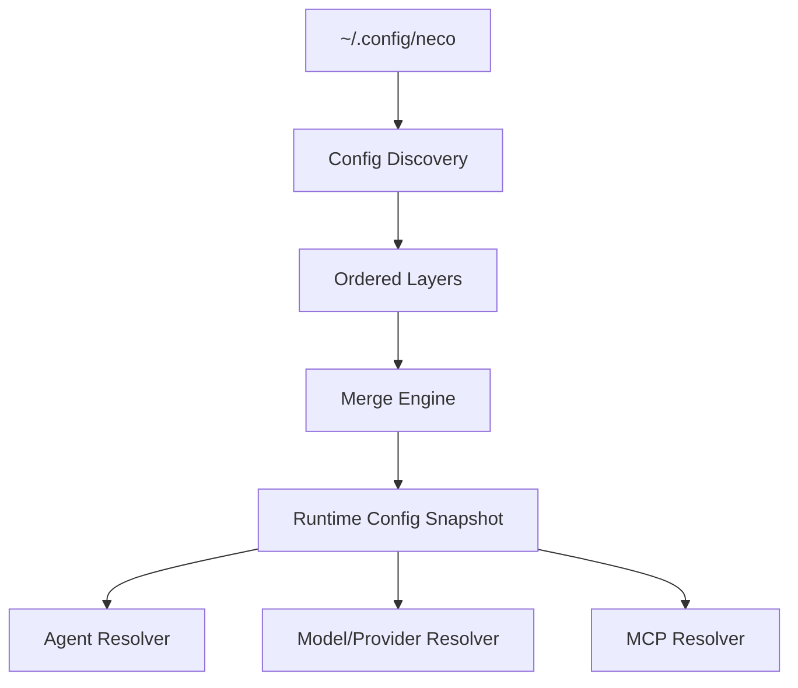
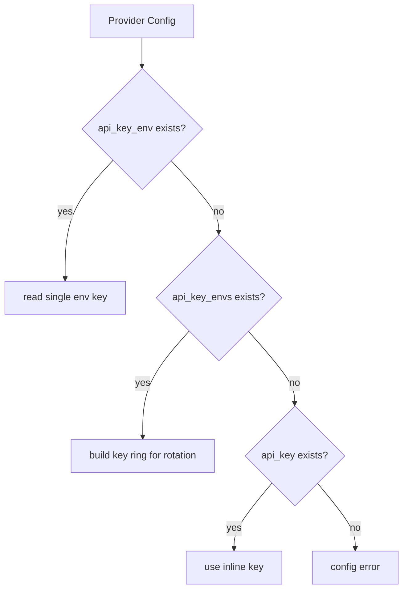
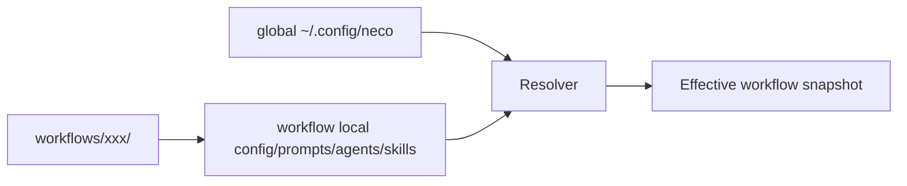

# TECH-CONFIG-RESOLUTION

## 1. 范围

本文件描述配置解析内部流程：文件发现顺序、合并策略、Key 优先级、工作流局部覆盖与 Agent 查找链路。

## 2. 配置面结构



## 3. 关键数据结构（伪类型）

```text
ConfigLayer {
  source_path
  format            // toml|yaml
  load_order
  payload
}

MergedConfig {
  model_groups
  model_providers
  mcp_servers
  prompts
  agents
  workflows
}

ApiKeyPolicy {
  single_env?
  multi_envs[]
  inline_key?
}
```

## 4. 解析顺序（内部算法）


层顺序规则在引擎内编码，不在调用方重复判断。

## 5. 合并策略模型

```text
for each key:
  if scalar: overwrite by later layer
  if array: replace by later layer
    if item starts with "+":
      append semantic item after removing "+"
  if object: recursive merge
```

## 6. API Key 解析流



## 7. 工作流局部配置覆盖



Agent 查找优先级：

1. `workflows/xxx/agents/`
2. 全局 `~/.config/neco/agents/`

## 8. 伪代码

```text
function load_effective_config(context):
  layers = discover_and_sort(context)
  cfg = empty
  for layer in layers:
    cfg = merge(cfg, layer.payload)
  validate(cfg)
  return cfg

function resolve_agent(workflow_id, agent_name):
  if exists(workflow_local_agent): return workflow_local_agent
  return global_agent
```

## 9. 生命周期约束

1. 启动时校验失败立即终止。
2. 运行时热加载失败回滚到上一快照，并记录错误日志。
