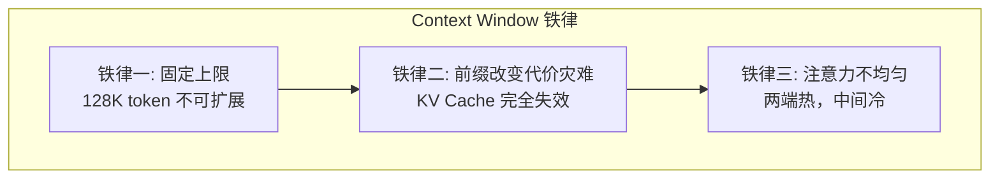
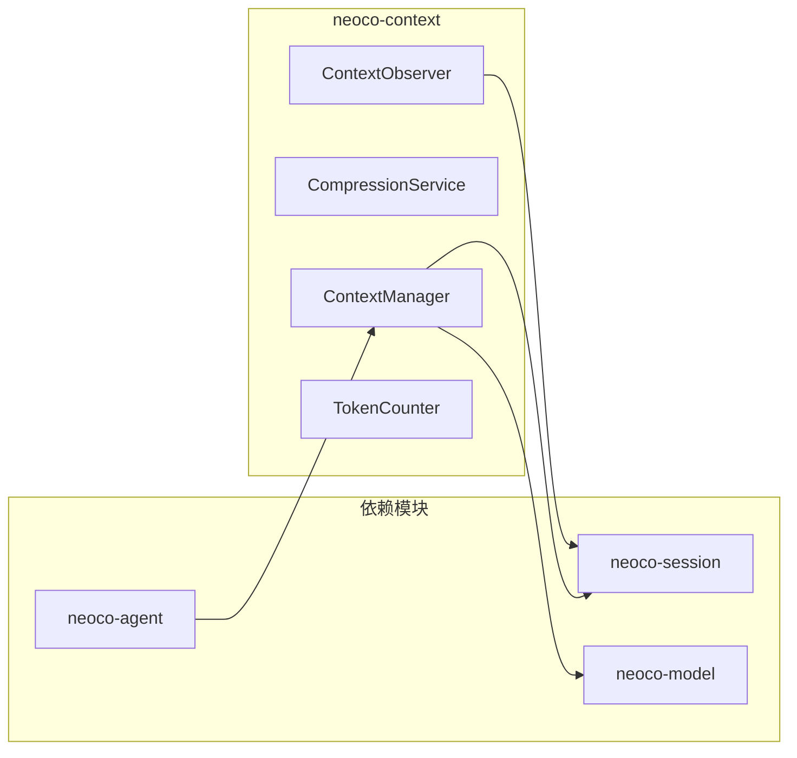
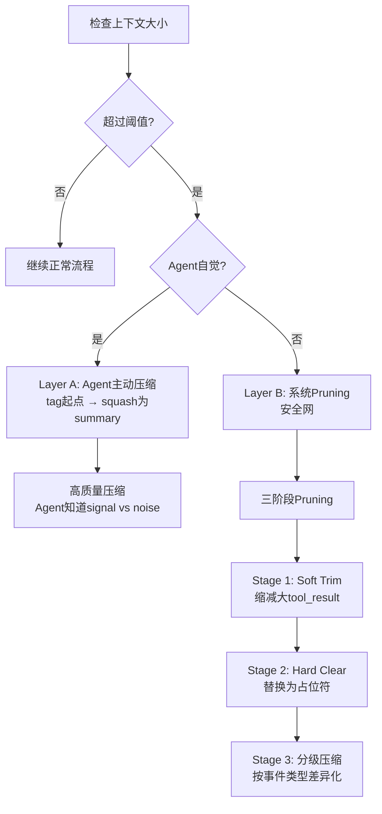
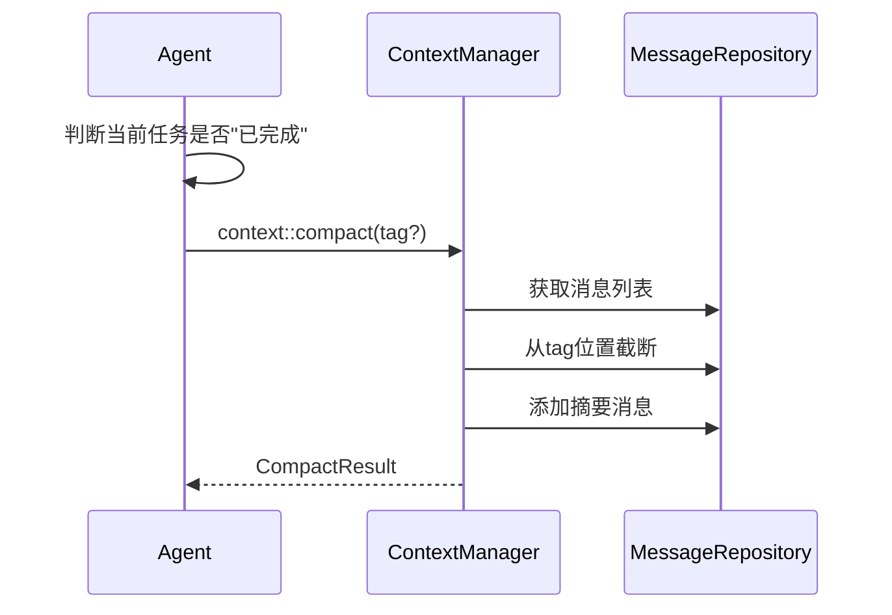
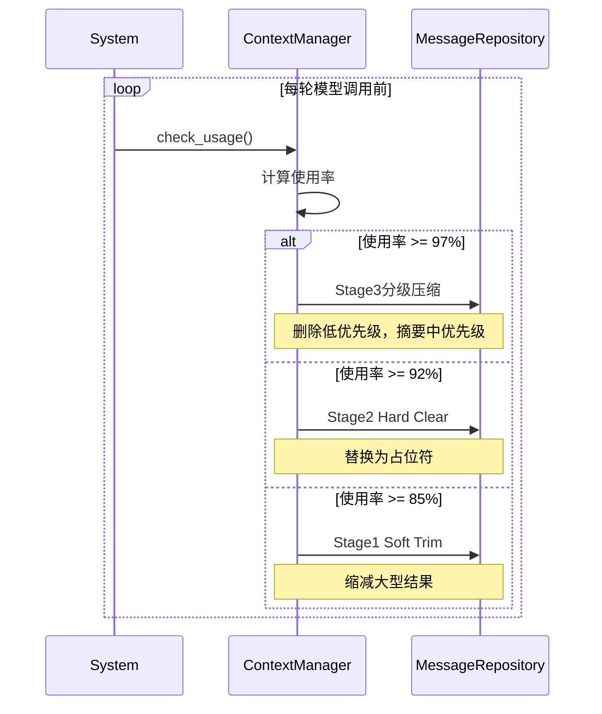
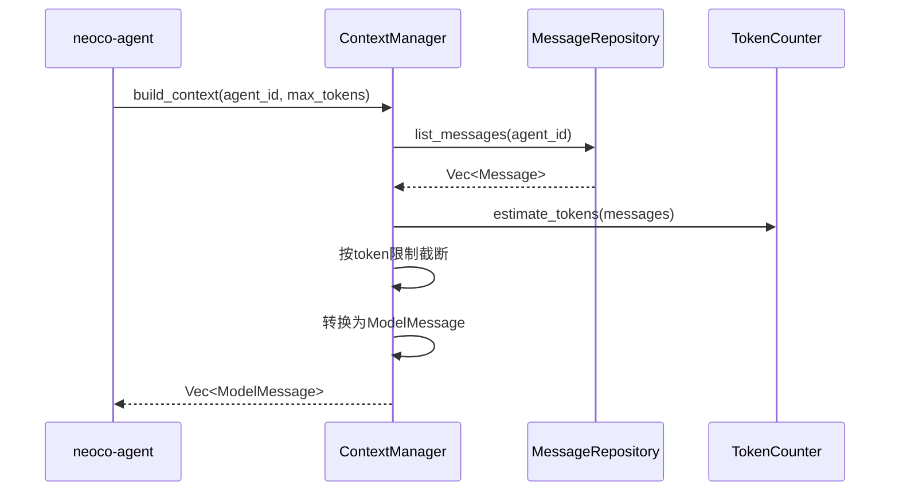
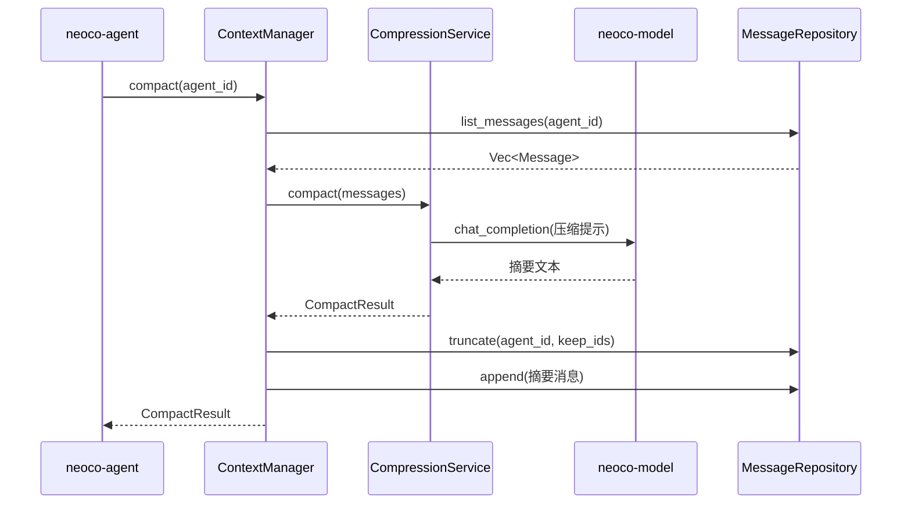
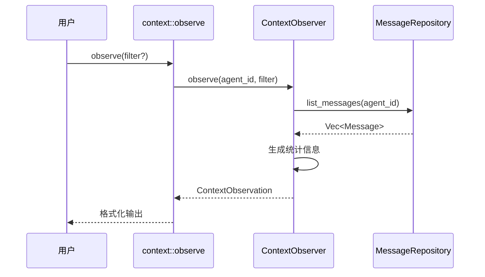
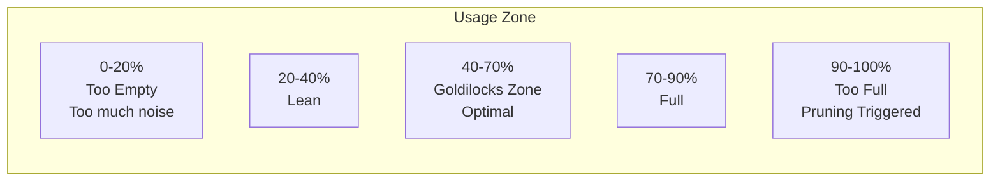

# TECH-CONTEXT: 上下文管理模块

本文档描述NeoCo项目的上下文管理模块设计，采用领域驱动设计，分离领域模型与基础设施。

> **核心理念**：Context Window 就是一块 Arena Allocator。管理上下文不是"写prompt"，而是内存管理。

## 0. Arena Allocator 心智模型

### 0.1 核心隐喻

将 LLM 的上下文窗口想象成一块预先分配好的连续内存：

| Arena Allocator | Context Window |
|-----------------|----------------|
| 固定大小的内存块 | 固定上限的 token 窗口 |
| 指针只往前推 (bump) | 只能在末尾追加消息 |
| 连续内存块，无碎片 | 前缀稳定，KV Cache 命中 |
| 批量释放而非逐个回收 | 按区间压缩，而非单条消息 |

### 0.2 三条铁律



**铁律一**：固定上限。128K token 就是 128K，是最稀缺的资源。

**铁律二**：前缀改变是灾难性的。KV Cache 匹配从第一个 token 逐一比对，第一个不同之后全部 cache miss。

**铁律三**：注意力不均匀。LLM 对开头和末尾 token 注意力最强，中间会衰减（Lost in the Middle）。

### 0.3 五条设计原则

| 原则 | Arena 对应 | 上下文工程实践 |
|------|------------|---------------|
| Append-Only AMAP | 指针只往前推 | 在末尾追加 user/assistant/tool_result，不在中间插入 |
| Demand Paging | 按需分配对象 | 技能按需加载，不预装到 system prompt | 保持前缀稳定：按需加载确保追加顺序不变，KV Cache 匹配从第一个 token 逐一比对，前缀不变才能命中 cache |
| Spatial Locality | 相邻分配 | 相关信息物理相邻，指南附着在 tool_result 上 |
| Goldilocks Zone | 最佳 arena 大小 | 维持 40-70% 使用率 |
| 批量释放 | reset 而非 free | 按区间压缩，不逐条删除 |

### 0.4 Pruning 和 RAG 是补救手段

```text
原则（布局）                    补救手段（trick）
─────────────────────────────────────────────────
Append-only → 前缀稳定         Pruning → 布局失效后的止损
Demand Paging → 不浪费空间     RAG → 信息被 prune 后的恢复
Spatial Locality → 注意力集中  
Goldilocks Zone → 信噪比最优   
```

**核心原则**：先把布局做对，补救手段自然用得少。

---

## 1. 模块概述

上下文管理模块负责：
1. 监控上下文大小，触发自动或手动压缩
2. 提供上下文观测功能

### 1.1 模块边界



### 1.2 核心职责

| 组件 | 职责 |
|------|------|
| `ContextManager` | 上下文生命周期管理、触发压缩 |
| `CompressionService` | 执行压缩逻辑、调用模型生成摘要 |
| `ContextObserver` | 提供上下文观测能力 |
| `TokenCounter` | Token数量估算 |

## 2. 核心概念

### 2.1 压缩触发条件

> **设计原则**：Pruning 是布局失效后的止损操作，不是核心策略。



**两层压缩模型：**

| Layer | 触发条件 | 压缩质量 | 说明 |
|-------|---------|---------|------|
| Agent主动 | 上下文大小 ≥ 窗口×90% 且 Agent自觉判断"已完成" | 高 | Agent判断"这段研究/调试已完成" → tag起点 → squash为summary，局限性：Agent可能误判何时算"已完成"，导致压缩过早或过晚 |
| Layer B (系统Pruning) | 布局失效 | 低 | 安全网，理想情况下永不触发 |

#### Layer A: Agent主动压缩机制

> **设计意图**：让Agent像熟练的开发者一样，自觉管理内存。Agent最清楚哪些工作"已完成"，哪些是"待处理"。

**触发流程**：



**Agent判断"已完成"的信号**：
- 任务目标达成（如：完成代码审查、修复bug、完成调研）
- 进入等待用户反馈阶段
- 主动调用 `context::compact` 工具

**摘要生成**：
- 使用轻量模型（关闭thinking，关闭工具）
- 摘要长度限制：TODO+提示（建议原始大小的20-30%）
- 保留关键决策、代码片段、错误教训

**局限性**：
- Agent可能误判何时算"已完成"
- 压缩过早导致信息丢失
- 压缩过晚导致频繁触发系统Pruning

**触发方式：**

| 方式 | 触发条件 | 说明 |
|-----|---------|------|
| Agent主动 | Agent调用 context::compact | Agent自觉管理内存 |
| 自动触发 | 上下文大小 ≥ 窗口×90% | 达到模型上下文窗口的90%时自动触发，作为安全网 |
| 手动触发 | /compact命令 | 用户主动 |

#### Layer B: 三阶段系统Pruning

> **设计意图**：作为安全网，在Agent未能及时压缩时自动触发。理想情况下永不触发。

**三阶段执行策略**：

| 阶段 | 触发条件 | 操作 | 压缩率 | 影响 |
|------|---------|------|--------|------|
| Stage 1: Soft Trim | 使用率 ≥ 85% | 缩减大型tool_result的内容，保留结构 | ~20-30% | 低，工具结果被截断 |
| Stage 2: Hard Clear | 使用率 ≥ 92% | 将tool_result替换为占位符（类型+摘要） | ~40-50% | 中，仅保留摘要 |
| Stage 3: 分级压缩 | 使用率 ≥ 97% | 按事件类型差异化处理 | ~60-70% | 高，按重要性分级 |

**Stage 1: Soft Trim 策略**：
- 识别大型tool_result（>1KB）
- 保留前512字符 + 后256字符 + 中间省略提示
- 保留JSON结构，截断长字符串值
- TODO+提示：保留原始大小的30-50%

**Stage 2: Hard Clear 策略**：
- 将完整的tool_result替换为占位符
- 格式：`[Tool: <tool_name> - <result_type> - <summary>]`
- 保留工具调用结构，仅丢失执行结果详情
- TODO+提示：适合需要恢复原始数据时使用RAG

**Stage 3: 分级压缩 策略**：
- 按事件类型分配保留优先级
- 高优先级（保留）：错误信息、关键决策、用户确认
- 中优先级（摘要）：文件修改、代码审查结果
- 低优先级（删除）：重复性日志、调试输出

**触发流程**：



**与Layer A的区别**：
- Layer A：Agent主动，高质量，有语义理解
- Layer B：系统自动，无语义，按规则执行

## 3. 核心Trait定义

### 3.1 ContextManager

```rust
#[async_trait]
pub trait ContextManager: Send + Sync {
    /// 构建上下文消息列表
    async fn build_context(
        &self,
        agent_ulid: &AgentUlid,
        max_tokens: usize,
    ) -> Result<Vec<ModelMessage>, ContextError>;
    
    /// 检查是否需要压缩
    async fn should_compact(&self, agent_ulid: &AgentUlid) -> bool;
    
    /// 执行压缩
    async fn compact(
        &self,
        agent_ulid: &AgentUlid,
    ) -> Result<CompactResult, ContextError>;
    
    /// 获取上下文统计信息
    async fn get_stats(
        &self,
        agent_ulid: &AgentUlid,
    ) -> Result<ContextStats, ContextError>;
}
```

### 3.2 ContextManager实现

```rust
pub struct ContextManagerImpl {
    session_repo: Arc<dyn SessionRepository>,
    message_repo: Arc<dyn MessageRepository>,
    compression_service: Arc<CompressionService>,
    config: ContextConfig,
}

#[async_trait]
impl ContextManager for ContextManagerImpl {
    async fn build_context(
        &self,
        agent_ulid: &AgentUlid,
        max_tokens: usize,
    ) -> Result<Vec<ModelMessage>, ContextError> {
        // TODO: 实现上下文构建
        // 1. 从MessageRepository获取消息
        // 2. 按token限制截断
        // 3. 转换为ModelMessage返回
        unimplemented!()
    }
    
    async fn should_compact(&self, agent_ulid: &AgentUlid) -> bool {
        // TODO: 实现压缩检查
        // 1. 从MessageRepository获取消息
        // 2. 计算token数量
        // 3. 判断是否超过阈值
        unimplemented!()
    }
    
    async fn compact(
        &self,
        agent_ulid: &AgentUlid,
    ) -> Result<CompactResult, ContextError> {
        // TODO: 实现压缩
        // 1. 获取消息列表
        // 2. 调用CompressionService
        // 3. 截断旧消息
        // 4. 添加摘要消息
        unimplemented!()
    }
    
    async fn get_stats(
        &self,
        agent_ulid: &AgentUlid,
    ) -> Result<ContextStats, ContextError> {
        // TODO: 实现统计获取
        unimplemented!()
    }
}

## 4. 数据流

### 4.1 消息获取流程



### 4.2 压缩执行流程



### 4.3 观测流程



## 5. 上下文观测

### 5.1 Goldilocks Zone

> 维持 40-70% 使用率是最佳状态。

**Core Metric**: usage_percent = total_tokens / context_window_size



**Goldilocks Zone Metrics**:

| Zone | Usage | Feature | Suggestion |
|------|-------|---------|------------|
| Empty | 0-20% | Too much irrelevant info | Check if system prompt is too verbose |
| Lean | 20-40% | May lack context | Normal range, can continue |
| **Goldilocks** | **40-70%** | **Best SNR, enough space** | **Keep in this range** |
| Full | 70-90% | Space tight | Agent should consider compact |
| Too Full | 90%+ | Pruning triggered | System pruning kicks in |

**Why 40-70%?**
- Enough space: Reserve 30-60K tokens for tool calls and responses
- SNR: Avoid history diluting attention
- Buffer: Leave room for unexpected big tasks
- Compression: Higher quality summaries when compacting in this range

**Usage Calculation**:
```
usage_percent = (total_tokens / context_window_size) * 100
```
- `total_tokens`: TODO: Calculate via TokenCounter
- `context_window_size`: Actual model context window (e.g., 128K)

**Dynamic Adjustment**:
- Long tasks (code refactor): 60-70% acceptable, need more history
- Short tasks (single Q&A): 30-50% recommended, fast closure
- TODO: Adjust target zone based on task type

### 5.2 Context Dashboard

Agent 通过 context::observe 工具可以看到上下文仪表盘：

```text
[Context Dashboard]
• Usage:           78.2% (100k/128k)
• Steps since tag: 35 (last: 'auth-refactor')
• Pruning status:  Stage 1 approaching
• Est. turns left: ~12
```

Agent 可根据此信息主动决定：
- 78% 使用率 → 决定主动压缩
- 12% 使用率 → 继续工作

### 5.3 观测接口定义

```rust
#[async_trait]
pub trait ContextObserver: Send + Sync {
    async fn observe(
        &self,
        agent: &Agent,
        filter: Option<ContextFilter>,
    ) -> Result<ContextObservation, ContextError>;
}

pub struct ContextFilter {
    pub roles: Option<Vec<Role>>,
    pub min_id: Option<MessageId>,
    pub max_id: Option<MessageId>,
    pub with_tool_calls: Option<bool>,
    pub sort_by: Option<SortBy>,  // TODO: 支持排序方式
    pub sort_order: Option<SortOrder>,  // TODO: 升序/降序
}

#[derive(Debug, Clone, Copy, PartialEq, Eq)]
pub enum SortBy {
    Id,       // 按消息ID排序
    Timestamp, // 按时间戳排序
    Size,     // 按大小排序
}

#[derive(Debug, Clone, Copy, PartialEq, Eq)]
pub enum SortOrder {
    Asc,  // 升序（默认）
    Desc, // 降序
}

pub struct ContextObservation {
    pub messages: Vec<MessageSummary>,  // 消息列表（按sort参数排序，默认按ID升序）
    pub stats: ContextStats,
    pub grouped: MessageGroups,  // TODO: 按角色分组的内容
}

pub struct MessageGroups {
    pub system_prompts: Vec<GroupedMessage>,  // 系统提示词列表
    pub user_messages: Vec<GroupedMessage>,   // 用户消息列表
    pub assistant_messages: Vec<GroupedMessage>, // 助手消息列表
    pub tool_results: Vec<GroupedMessage>,    // 工具返回列表
}

pub struct GroupedMessage {
    pub id: MessageId,
    pub content: String,  // 完整内容（不同于preview，是完整内容）
    pub size_chars: usize,
    pub size_tokens: usize,
}

pub struct MessageSummary {
    pub id: MessageId,
    pub role: Role,
    pub content_preview: String,
    pub size_chars: usize,
    pub size_tokens: usize,
    pub timestamp: DateTime<Utc>,
}

pub struct ContextStats {
    pub total_messages: usize,
    pub total_chars: usize,
    pub total_tokens: usize,
    pub usage_percent: f64,
    pub role_counts: HashMap<Role, usize>,
    pub steps_since_tag: usize,
    pub last_tag: Option<String>,
    pub pruning_stage: Option<PruningStage>,
    pub estimated_turns_left: usize,
}

#[derive(Debug, Clone, Copy, PartialEq, Eq)]
pub enum PruningStage {
    Stage1SoftTrim,
    Stage2HardClear,
    Stage3分级压缩,
}
```

### 5.4 context::observe 工具

**功能**：查看当前上下文的详细信息。

**返回内容**（与REQUIREMENT.md一致）：
1. **消息列表**：默认按ID升序，可通过`sort_by`参数覆盖
2. **每条消息的类型**：system/user/assistant/tool
3. **每条消息的大小**：字符数/预估token数
4. **总消息数量**
5. **总上下文大小**
6. **分组内容**：
   - 系统提示词列表（system_prompts）
   - 用户消息列表（user_messages）
   - 助手消息列表（assistant_messages）
   - 工具返回列表（tool_results）
7. **统计信息**：使用率、Pruning阶段、预估剩余轮次等

**输出格式**：TODO+提示 - 格式化为结构化的表格或列表，便于阅读

**过滤参数**：
- `roles`: 按角色过滤（如只查看tool类型）
- `sort_by`: 排序方式（id/timestamp/size）
- `sort_order`: 升序/降序
- `min_id`/`max_id`: 按ID范围过滤

```rust
pub struct ContextObserveTool {
    observer: Arc<dyn ContextObserver>,
}

#[async_trait]
impl ToolExecutor for ContextObserveTool {
    fn definition(&self) -> &ToolDefinition {
        // [TODO] 实现工具定义
        // 1. 定义工具ID和描述
        // 2. 定义参数schema
        // 3. 设置超时时间
        unimplemented!()
    }
    
    async fn execute(
        &self,
        context: &ToolContext,
        args: Value,
    ) -> Result<ToolResult, ToolError> {
        // TODO: 实现观测功能
        unimplemented!()
    }
}
```

## 6. 上下文压缩

### 6.1 压缩配置

```rust
pub struct ContextConfig {
    pub auto_compact_enabled: bool,
    pub auto_compact_threshold: f64,
    pub compact_model_group: ModelGroupRef,
    pub keep_recent_messages: usize,
}

pub struct ModelGroupRef(String);

impl ModelGroupRef {
    // TODO: 实现构造方法
    pub fn new(s: impl Into<String>) -> Self {
        todo!()
    }
    
    // TODO: 实现转换为字符串
    pub fn as_str(&self) -> &str {
        todo!()
    }
}

impl Default for ContextConfig {
    // TODO: 实现默认值
    fn default() -> Self {
        todo!()
    }
}
```

### 6.2 压缩结果

```rust
pub struct CompactResult {
    pub original_count: usize,
    pub compacted_count: usize,
    pub summary: String,
    pub preserved_ids: Vec<MessageId>,
    pub token_savings: TokenSavings,
    pub duration: Duration,
}

#[derive(Debug, Clone)]
pub struct TokenSavings {
    pub before: u32,
    pub after: u32,
    pub saved: u32,
    pub saved_percent: f64,
}
```

### 6.3 压缩服务

```rust
pub struct CompressionService {
    model_client: Arc<dyn ModelClient>,
    config: ContextConfig,
    token_counter: Arc<dyn TokenCounter>,
}

impl CompressionService {
    pub fn should_compact(&self, messages: &[Message], context_window: usize) -> bool {
        // [TODO] 实现压缩条件检查
        // 1. 计算当前token数量
        // 2. 计算阈值
        // 3. 比较判断是否需要压缩
        unimplemented!()
    }
    
    pub async fn compact(
        &self,
        messages: &[Message],
    ) -> Result<CompactResult, ContextError> {
        // TODO: 实现压缩逻辑
        // 1. 分离保留/压缩消息
        // 2. 调用模型生成摘要
        // 3. 构建新消息列表
        // 4. 返回结果
        unimplemented!()
    }
}
```

## 7. Token计数

```rust
pub trait TokenCounter: Send + Sync {
    fn estimate_string_tokens(&self, text: &str) -> usize;
    fn estimate_tokens(&self, messages: &[Message]) -> usize;
    fn estimate_message_tokens(&self, message: &Message) -> usize;
}

pub struct SimpleCounter;

impl TokenCounter for SimpleCounter {
    fn estimate_string_tokens(&self, text: &str) -> usize {
        // [TODO] 实现字符串token估算
        // 1. 考虑字符编码和token化方式
        // 2. 返回估算的token数量
        unimplemented!()
    }
    
    fn estimate_tokens(&self, messages: &[Message]) -> usize {
        // [TODO] 实现消息列表token估算
        // 1. 遍历每条消息
        // 2. 累加每条消息的token数
        unimplemented!()
    }
    
    fn estimate_message_tokens(&self, message: &Message) -> usize {
        // [TODO] 实现单条消息token估算
        // 1. 计算内容部分的token
        // 2. 计算tool_calls部分的token
        // 3. 考虑role等额外开销
        unimplemented!()
    }
}
```

## 8. 错误处理

```rust
#[derive(Debug, Error)]
pub enum ContextError {
    #[error("Agent不存在: {0}")]
    AgentNotFound(AgentUlid),
    
    #[error("模型调用错误: {0}")]
    Model(#[from] ModelError),
    
    #[error("没有可压缩的消息")]
    NothingToCompact,
    
    #[error("Token计算错误: {0}")]
    TokenCalculation(String),
    
    #[error("配置错误: {0}")]
    Config(String),
}
```

---

*关联文档：*
- [TECH.md](TECH.md) - 总体架构文档
- [TECH-SESSION.md](TECH-SESSION.md) - Session管理模块
- [TECH-MODEL.md](TECH-MODEL.md) - 模型服务模块
