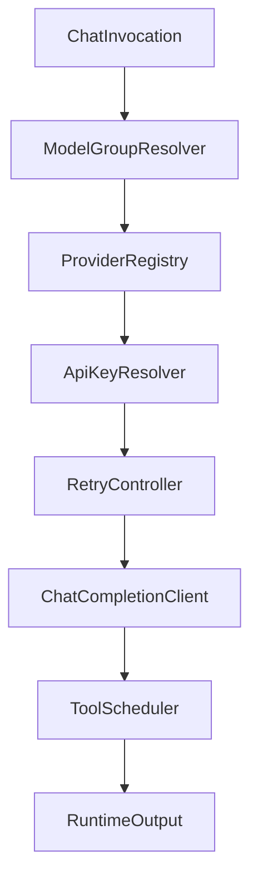
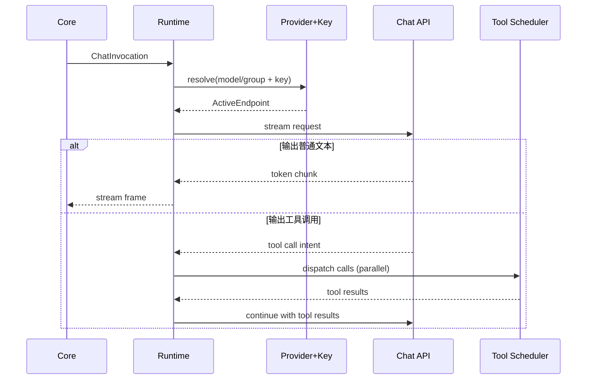
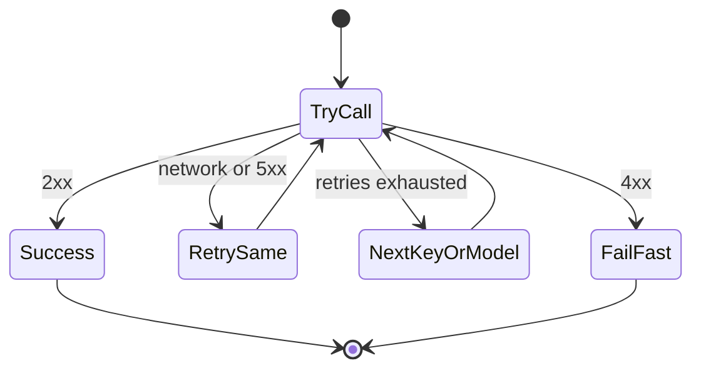

# TECH-MODEL-RUNTIME

## 1. 范围

本文件描述模型运行时内部关系：模型组解析、提供商路由、API Key 选择、重试与回退、工具并行调用。

## 2. 内部模块关系



## 3. 关键数据结构（伪类型）

```text
ModelProviderConfig {
  provider_id
  type              // openai chat completion
  base_url
  api_key_env?
  api_key_envs[]
  api_key?
}

ModelGroup {
  group_id
  model_refs[]      // provider/model
}

ModelAttemptState {
  model_index
  key_index
  retry_index       // 0..2
  next_backoff_sec  // 1,2,4
}

ChatInvocation {
  session_id
  agent_ulid
  model_or_group
  messages[]
  tools[]
  stream=true
}
```

## 4. 数据流



## 5. 错误与回退状态机



规则内化：

1. 网络错误与 5xx 进入 3 次指数退避重试。
2. 4xx 直接返回，不走重试。
3. 单模型重试耗尽后，切换到同组下一个模型或下一个 Key。

## 6. 核心伪代码

```text
function invoke_chat(invocation):
  cursor = init_attempt(invocation.model_or_group)
  while cursor.has_candidate():
    result = call_with_retry(cursor.current_candidate)
    if result.ok: return result
    if result.is_4xx: return fail(result)
    cursor = cursor.next_candidate()
  return fail(all_attempts_exhausted)

function call_with_retry(candidate):
  for backoff in [1,2,4]:
    r = chat_completion(candidate)
    if r.ok: return r
    if r.is_4xx: return r
    sleep(backoff)
  return last_error
```

## 7. 设计约束

1. 工具能力来自调用时的 `ActivationSet`，而不是运行时硬编码。
2. 流式输出与工具调用可以交织，但持久化顺序必须保持单一时间线。
3. 运行时通过 `async-openai` 适配 OpenAI Chat Completion 语义，其他提供商仅保留接口层抽象。
