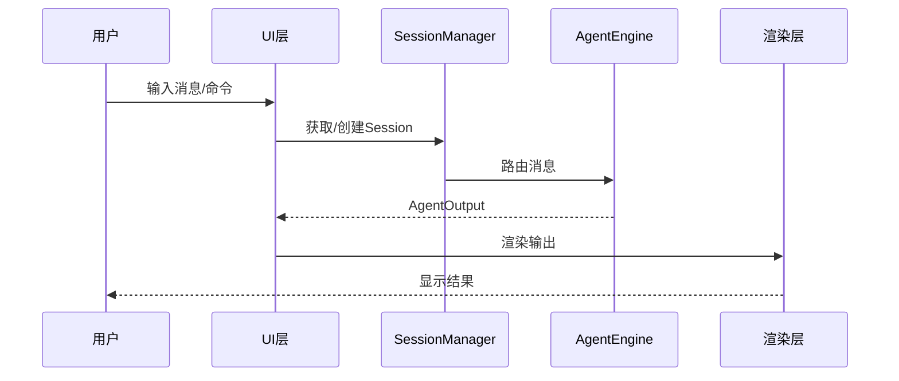

# TECH-PROMPT: 提示词组件模块

本文档描述Neco项目的提示词组件（Prompt Components）设计。

## 1. 模块概述

提示词组件是用于组合Agent提示词的静态片段，在Agent初始化时加载。

## 1.1 整体数据流图



## 2. 核心概念

### 2.1 提示词组件定义

提示词组件存储在配置目录的 `prompts/` 子目录下。

```
# prompts/ 子目录结构
.neco/prompts/
├── base.md              # 基础提示词
├── multi-agent.md       # 多智能体提示词
└── custom.md           # 自定义提示词
```

### 2.2 组件类型

| 组件 | 加载条件 | 说明 |
|------|---------|------|
| `base` | 默认 | 始终加载 |
| `multi-agent` | 可创建子Agent时 | Agent可以生成下级 |
| `multi-agent-child` | 作为子Agent时 | Agent有上级 |

## 3. 提示词内容

### 3.1 base 提示词

```markdown
# base 提示词组件

你是Neco，一个原生支持多智能体协作的AI助手。

## 可用工具

- activate: 激活额外能力
- fs: 文件系统操作
- mcp: MCP服务器工具
- multi-agent: 多智能体协作
- question: 向用户提问

## 注意事项

- 谨慎使用文件写入操作
- 遇到错误时先尝试理解原因再重试
```

### 3.2 multi-agent 提示词

```markdown
# multi-agent 提示词组件

你有能力生成下级Agent来协助完成任务。

## 使用场景

1. 并行研究：需要同时研究多个不同主题
2. 分工协作：不同方面需要不同专业知识

## 创建下级Agent

使用 `multi-agent::spawn` 工具
```

## 4. Agent配置

```yaml
# Agent头部信息
prompts:
  - base
  - multi-agent
```

## 5. 接口规范

### 5.1 PromptLoader 接口

提示词加载器负责从文件系统加载提示词组件。

```rust
pub trait PromptLoader {
    fn load(&self, component: &str) -> Result<String, PromptError>;
    fn list_components(&self) -> Result<Vec<String>, PromptError>;
}
```

**参数说明：**
- `component: &str` - 提示词组件名称（如 "base", "multi-agent"）

**返回值定义：**
- `Result<String, PromptError>` - 成功返回提示词内容，失败返回错误

### 5.2 PromptBuilder 接口

提示词构建器负责组合多个组件生成最终提示词。

```rust
pub trait PromptBuilder {
    fn build(&self, components: &[String]) -> Result<String, PromptError>;
}
```

**参数说明：**
- `components: &[String]` - 要组合的组件名称列表

**返回值定义：**
- `Result<String, PromptError>` - 成功返回组合后的完整提示词，失败返回错误

### 5.3 SessionManager 接口

会话管理器负责管理用户会话和消息路由。

```rust
pub trait SessionManager {
    async fn get_or_create(&self, session_id: &str) -> Result<Session, SessionError>;
    async fn route_message(&self, session: &Session, message: &str) -> Result<AgentOutput, RouteError>;
}
```

**参数说明：**
- `session_id: &str` - 会话唯一标识符
- `session: &Session` - 会话实例引用
- `message: &str` - 用户消息内容

**返回值定义：**
- `Result<Session, SessionError>` - 成功返回会话实例
- `Result<AgentOutput, RouteError>` - 成功返回Agent输出

### 5.4 AgentEngine 接口

Agent引擎负责处理消息并生成响应。

```rust
pub trait AgentEngine {
    async fn process(&self, session: &Session, input: &str) -> Result<AgentOutput, AgentError>;
}
```

**参数说明：**
- `session: &Session` - 会话实例引用
- `input: &str` - 用户输入内容

**返回值定义：**
- `Result<AgentOutput, AgentError>` - 成功返回Agent输出结果

## 6. Daemon API

### 6.1 概述

Daemon API 提供后台服务接口，支持与外部系统集成。

### 6.2 请求/响应格式

#### 6.2.1 创建会话

**请求：**
```json
POST /api/v1/sessions
Content-Type: application/json

{
    "session_id": "session_001",
    "config": {
        "model": "gpt-4",
        "temperature": 0.7
    }
}
```

**响应：**
```json
{
    "status": "success",
    "session_id": "session_001",
    "created_at": "2026-03-07T10:00:00Z"
}
```

#### 6.2.2 发送消息

**请求：**
```json
POST /api/v1/sessions/{session_id}/messages
Content-Type: application/json

{
    "content": "帮我分析这段代码",
    "type": "text"
}
```

**响应：**
```json
{
    "status": "success",
    "message_id": "msg_001",
    "output": {
        "content": "分析结果...",
        "type": "text"
    },
    "timestamp": "2026-03-07T10:01:00Z"
}
```

#### 6.2.3 获取会话状态

**请求：**
```json
GET /api/v1/sessions/{session_id}/status
```

**响应：**
```json
{
    "status": "active",
    "session_id": "session_001",
    "message_count": 5,
    "last_activity": "2026-03-07T10:01:00Z"
}
```

#### 6.2.4 终止会话

**请求：**
```json
DELETE /api/v1/sessions/{session_id}
```

**响应：**
```json
{
    "status": "success",
    "session_id": "session_001",
    "terminated_at": "2026-03-07T10:05:00Z"
}
```

### 6.3 错误响应格式

```json
{
    "status": "error",
    "error": {
        "code": "SESSION_NOT_FOUND",
        "message": "会话不存在",
        "details": {}
    }
}
```

## 7. TODO 示例

### 7.1 CLI 运行逻辑

```rust
pub async fn run(&self) -> Result<(), UiError> {
    // TODO: 实现CLI运行逻辑
    // - 解析CliArgs
    // - 初始化SessionManager
    // - 执行消息处理循环
}
```

### 7.2 提示词加载

```rust
pub fn load(&self, component: &str) -> Result<String, PromptError> {
    // TODO: 实现提示词加载
    // - 验证组件名称
    // - 读取文件内容
    // - 返回提示词字符串
}
```

---

*关联文档：*
- [TECH.md](TECH.md) - 总体架构文档
- [TECH-AGENT.md](TECH-AGENT.md) - Agent模块
- [TECH-SESSION.md](TECH-SESSION.md) - Session管理模块
