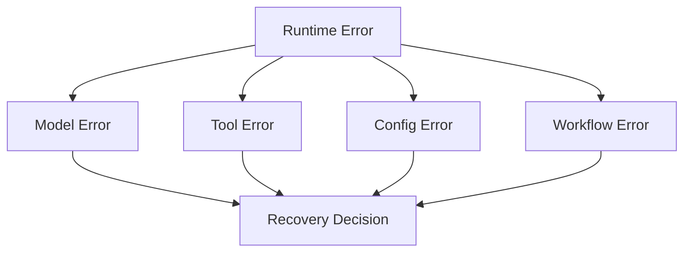
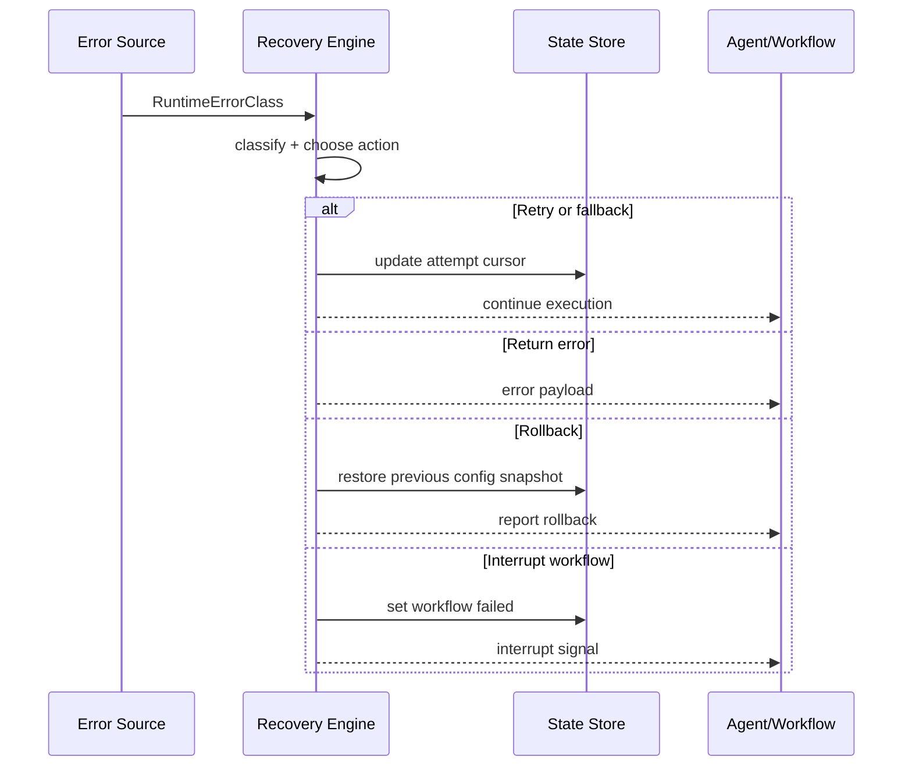
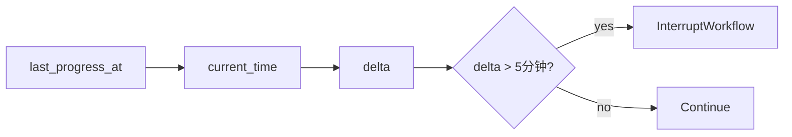
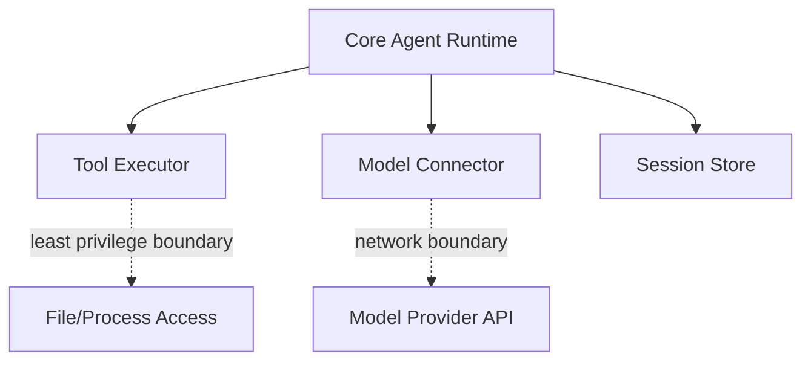

# TECH-RELIABILITY-ISOLATION

## 1. 范围

本文件描述可靠性与隔离设计内部关系：错误分类、重试与降级、配置回滚、工作流停滞中断、权限边界。

## 2. 错误分层结构



## 3. 错误分类数据结构（伪类型）

```text
RuntimeErrorClass =
  Model { kind: network|api4xx|api5xx|exhausted }
  | Tool { kind: execution|timeout }
  | Config { kind: startup_invalid|hot_reload_invalid }
  | Workflow { kind: node_failed|stalled }

RecoveryAction =
  RetrySame
  | FallbackNextCandidate
  | ReturnToAgent
  | FailFast
  | RollbackSnapshot
  | InterruptWorkflow
```

## 4. 决策流



## 5. 场景化策略矩阵

| 场景 | 动作 |
|---|---|
| 模型网络错误 | 同候选重试（指数退避） |
| 模型 5xx | 同候选重试（指数退避） |
| 模型 4xx | 直接返回错误 |
| 候选耗尽 | 切换到下一模型或下一 Key |
| 工具执行失败 | 返回给 Agent 决策 |
| 工具超时 | 以超时错误返回（默认 30s，可配置） |
| 启动配置非法 | 立即终止启动 |
| 运行时热加载非法 | 回滚到上一快照并记录错误 |
| 工作流节点失败 | 按工作流规则决定继续或中断 |
| 工作流无进度超阈值 | 中断并标记失败 |

## 6. 工作流停滞检测



## 7. 权限隔离边界（抽象）



边界约束：

1. 核心编排与外部副作用执行分离。
2. 错误上下文在边界处结构化传递，不丢失分类信息。
3. 隔离策略为可扩展策略接口，不与单一工具实现耦合。

## 8. 伪代码

```text
function recover(err):
  switch err.class:
    case Model(network|api5xx): return retry_or_fallback()
    case Model(api4xx): return fail_fast(err)
    case Tool(_): return return_to_agent(err)
    case Config(startup_invalid): return fail_fast(err)
    case Config(hot_reload_invalid): return rollback_snapshot(err)
    case Workflow(stalled): return interrupt_workflow(err)
    case Workflow(node_failed): return apply_workflow_policy(err)
```
