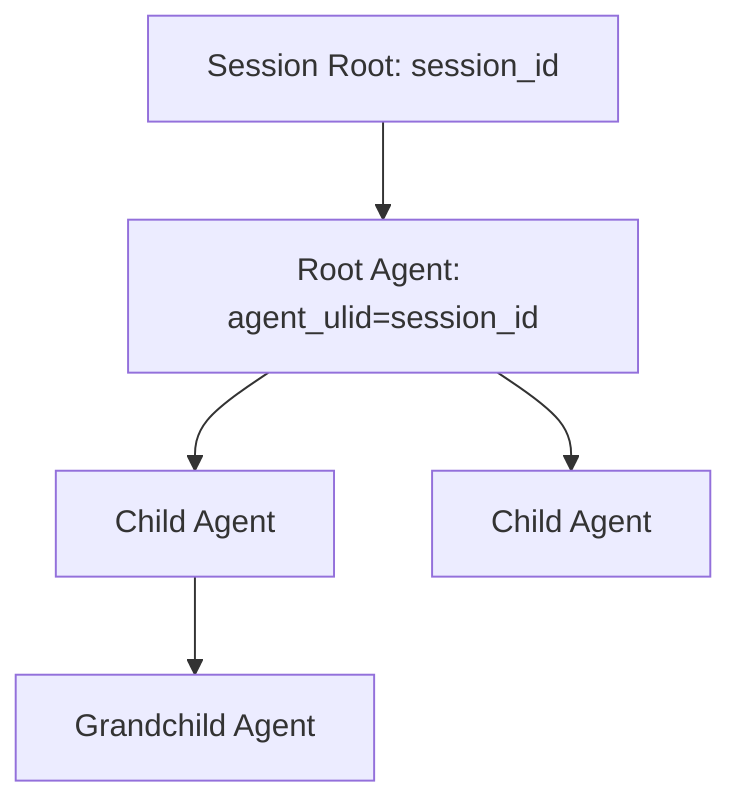
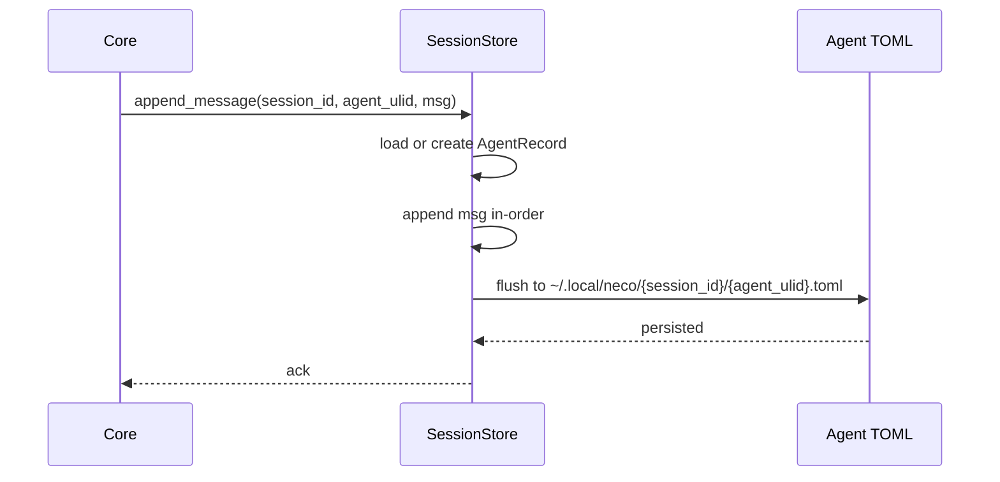
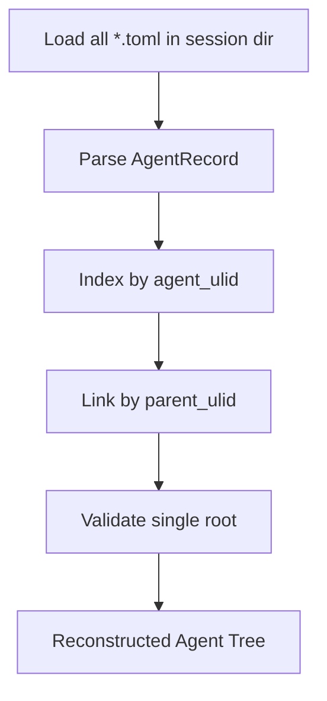

# TECH-SESSION-AGENT-TREE

## 1. 范围

本文件描述 Session 与 Agent 树的内部数据关系、持久化格式、恢复流程与生命周期边界。

## 2. 内部结构图



## 3. 关键数据结构（伪类型）

```text
SessionIdentity {
  session_id
  root_agent_ulid   // equals session_id
}

AgentRecord {
  agent_ulid
  parent_ulid?
  prompts[]
  messages[]
}

AgentMessage {
  seq_no
  role            // user/assistant/tool...
  content
  created_at
}

SessionFileRef {
  path = ~/.local/neco/{session_id}/{agent_ulid}.toml
}
```

## 4. 写入数据流



## 5. 树恢复流程



树恢复约束：

1. 根节点必须唯一，且 `agent_ulid=session_id`。
2. 非根节点必须存在可解析的 `parent_ulid`。
3. 消息序列只允许追加，不允许跨 Agent 混写。

## 6. SubAgent 创建关系

```text
function create_subagent(parent, agent_def, overrides):
  child = new AgentRecord
  child.parent_ulid = parent.agent_ulid
  child.prompts = merge_prompts(agent_def.prompts, overrides.prompts)
  child.model = overrides.model ?? agent_def.model
  child.model_group = overrides.model_group ?? agent_def.model_group
  persist(child)
  return child.agent_ulid
```

## 7. 与工作流节点会话的映射

节点模式下的路径使用同一通用格式：

```text
~/.local/neco/{workflow_session_id}/{node_session_id}.toml
```

其中 `node_session_id` 同时是该节点根 Agent ULID。  
工作流层仅持有“节点会话索引”，Agent 树仍由 `parent_ulid` 管理。
