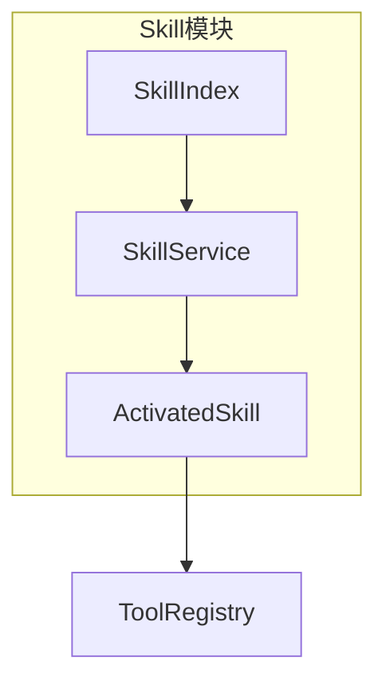
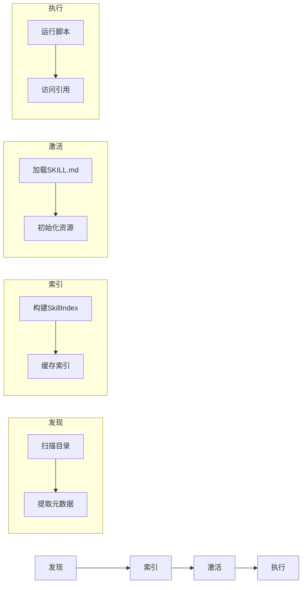

# TECH-SKILL: Skills模块

本文档描述Neco项目的Skills模块设计。

## 1. 模块概述

Skills是轻量级、开放的格式，用于通过专业知识和工作流程来扩展AI代理的能力。

## 2. 核心概念

### 2.1 Skill定义

Skill是包含指令、脚本和资源的文件夹：

```
my-skill/
├── SKILL.md          # 必需：指令和元数据（YAML frontmatter + Markdown指令）
├── scripts/          # 可选：可执行脚本（Shell、Python、Rust等）
├── references/       # 可选：参考资料（文档、数据文件、配置模板）
└── assets/           # 可选：资源文件（图片、图标、二进制文件）
```

**目录用途说明：**
- `scripts/`: 存放可执行脚本，用于扩展Skill的执行能力。脚本可通过ToolRegistry注册为可调用工具。
- `references/`: 存放参考资料，如API文档、代码片段、数据文件等，可在运行时按需加载。
- `assets/`: 存放静态资源，如图标、图片、二进制文件等，供Skill展示或处理使用。

### 2.2 渐进式披露

| 阶段 | 加载内容 | 上下文消耗 |
|------|---------|-----------|
| 发现阶段 | 名称 + 描述 | ~50-100 tokens |
| 激活阶段 | 完整SKILL.md | 完整内容 |
| 执行阶段 | scripts/references | 按需 |

### 2.3 核心组件关系



### 2.4 数据流图



## 3. SKILL.md格式

```yaml
---
name: rust-coding-assistant
description: 提供Rust语言最佳实践、unsafe代码检查等能力
tags:
  - rust
  - security
---

# 技能指令内容
...
```

## 4. Skill服务

### 4.1 SkillService Trait

```rust
#[async_trait]
pub trait SkillService: Send + Sync {
    async fn discover_skills(&self) -> Result<Vec<SkillDefinition>, SkillError>;
    async fn activate(&self, skill_id: &SkillId) -> Result<ActivatedSkill, SkillError>;
    async fn deactivate(&self, skill_id: &SkillId) -> Result<(), SkillError>;
}
```

### 4.2 ActivatedSkill 结构

```rust
pub struct ActivatedSkill {
    pub id: SkillId,
    pub name: String,
    pub instruction: String,
    pub metadata: SkillMetadata,
    pub resources: SkillResources,
    pub tools: Vec<ToolDescriptor>,
}

pub struct SkillMetadata {
    pub version: String,
    pub author: Option<String>,
    pub tags: Vec<String>,
    pub dependencies: Vec<String>,
}

pub struct SkillResources {
    pub base_path: PathBuf,
    pub scripts: HashMap<String, ScriptInfo>,
    pub references: HashMap<String, ReferenceInfo>,
    pub assets: HashMap<String, AssetInfo>,
}

pub struct ScriptInfo {
    pub path: PathBuf,
    pub language: ScriptLanguage,
    pub entry_point: Option<String>,
}

pub struct ReferenceInfo {
    pub path: PathBuf,
    pub content_type: String,
}

pub struct AssetInfo {
    pub path: PathBuf,
    pub mime_type: String,
}

#[derive(Debug, Clone, Copy)]
pub enum ScriptLanguage {
    Shell,
    Python,
    Rust,
    JavaScript,
}
```

### 4.3 核心数据结构

```rust
pub struct SkillService {
    skills: Arc<RwLock<HashMap<SkillId, Skill>>>,
    index: Arc<RwLock<SkillIndex>>,
}

pub struct Skill {
    pub id: SkillId,
    pub name: String,
    pub description: String,
    pub content: String,
    pub tags: Vec<String>,
}

#[derive(Debug, Clone, Default)]
pub struct SkillIndex {
    pub skills: Vec<SkillInfo>,
}

pub struct SkillInfo {
    pub id: SkillId,
    pub name: String,
    pub description: String,
    pub tags: Vec<String>,
}
```

### 4.4 加载流程

```rust
impl SkillService {
    pub async fn load_index(&self) -> Result<SkillIndex, SkillError> {
        // 扫描策略：
        // 1. 扫描配置的skills目录（默认 ~/.neco/skills 或项目内 ./skills）
        // 2. 遍历顶层目录，每个有效目录视为一个Skill
        // 3. 解析SKILL.md的YAML frontmatter提取元数据
        // 4. 验证必需字段（name, description）
        
        // 缓存策略：
        // - 首次加载：完整扫描所有Skill目录
        // - 增量更新：监听文件变化事件，动态更新索引
        // - 缓存失效：基于mtime检测文件修改
        
        let mut index = SkillIndex::default();
        
        // 扫描skills目录
        let skills_path = self.config.skills_dir.clone();
        let mut entries = tokio::fs::read_dir(&skills_path).await
            .map_err(|e| SkillError::LoadFailed(e.to_string()))?;
        
        while let Some(entry) = entries.next_entry().await
            .map_err(|e| SkillError::LoadFailed(e.to_string()))? {
            let path = entry.path();
            if path.is_dir() {
                let skill_path = path.join("SKILL.md");
                if skill_path.exists() {
                    if let Ok(skill_info) = self.parse_skill_info(&skill_path).await {
                        index.skills.push(skill_info);
                    }
                }
            }
        }
        
        // 缓存索引
        let mut index_lock = self.index.write().await;
        *index_lock = index.clone();
        
        Ok(index)
    }
    
    async fn parse_skill_info(&self, path: &Path) -> Result<SkillInfo, SkillError> {
        let content = tokio::fs::read_to_string(path).await
            .map_err(|e| SkillError::LoadFailed(e.to_string()))?;
        
        // 解析YAML frontmatter
        let (metadata, _) = frontmatter::parse(&content)
            .map_err(|e| SkillError::LoadFailed(e.to_string()))?;
        
        Ok(SkillInfo {
            id: SkillId::from(metadata.name.clone()),
            name: metadata.name,
            description: metadata.description,
            tags: metadata.tags,
        })
    }
    
    pub async fn load_skill(&self, id: &SkillId) -> Result<Skill, SkillError> {
        // TODO: 加载完整SKILL.md
        unimplemented!()
    }
    
    pub async fn activate(&self, id: &SkillId) -> Result<ActivatedSkill, SkillError> {
        // TODO: 激活Skill
        unimplemented!()
    }
}
```

## 5. 错误处理

```rust
#[derive(Debug, Error)]
pub enum SkillError {
    #[error("Skill未找到: {0}")]
    NotFound(SkillId),
    
    #[error("加载失败: {0}")]
    LoadFailed(String),
    
    #[error("激活失败: {0}")]
    ActivationFailed(String),
}
```

---

*关联文档：*
- [TECH.md](TECH.md) - 总体架构文档
- [TECH-TOOL.md](TECH-TOOL.md) - 工具模块
- [TECH-AGENT.md](TECH-AGENT.md) - Agent模块
