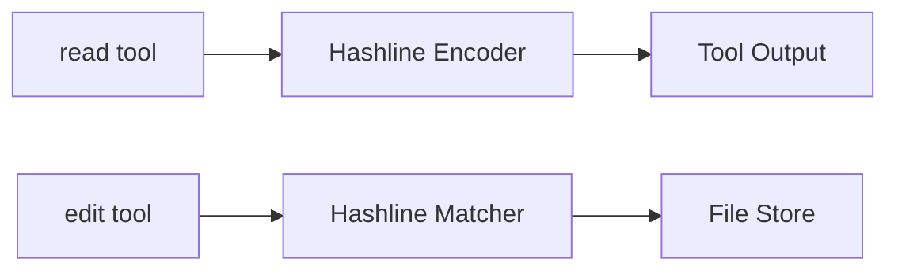
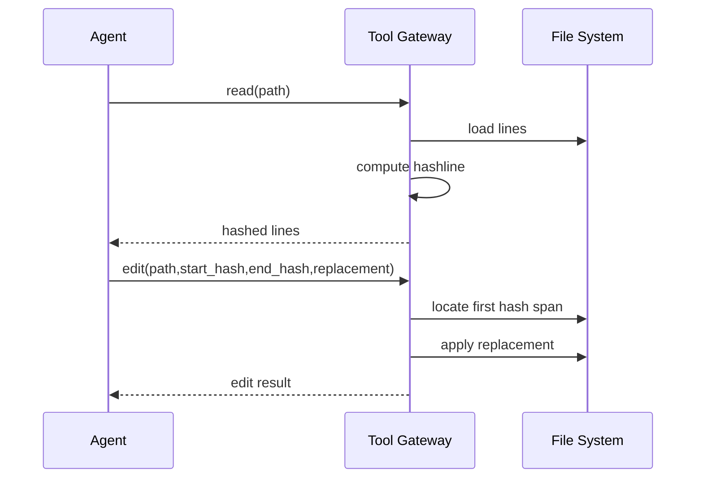

# TECH-TOOLS-INTERFACE

## 1. 范围

本文件描述工具层与用户接口层内部关系：`read/edit` 协议、Hashline 算法、A/B/C 三种交互模式与共享渲染边界。

## 2. 工具层结构



## 3. `read` 数据模型

```text
ReadOutputLine {
  hash4
  original_line
  rendered = "{hash4}| {original_line}"
}

HashInputWindow {
  start_line = max(N-4, 1)
  end_line = N
  merged_text
}
```

Hashline 规则：每行哈希由该行向前最多 4 行的窗口文本计算，使用 xxHash（实现依赖 `xxhash-rust`）。

## 4. `edit` 匹配模型

```text
EditRequest {
  start_hash
  end_hash
  replacement_text
}

EditMatch {
  first_start_line
  first_end_line
  closed_interval = [start, end]
}
```

匹配策略：按文件顺序选择首个满足 `start_hash + end_hash` 的闭区间并替换。

## 5. 工具调用数据流



## 6. 用户接口三模式内部关系

```mermaid
flowchart TB
    subgraph UIA[Mode A: Direct I/O]
        A1[input -m] --> A2[run once]
        A2 --> A3[print result + session id]
    end

    subgraph UIB[Mode B: Inline REPL]
        B1[input box] --> B2[shared renderer]
        B2 --> B3[status line]
        B3 --> B4[/new /exit /compact]
    end

    subgraph UIC[Mode C: Daemon]
        C1[daemon runtime] --> C2[IPC gRPC or Unix Socket]
        C1 --> C3[HTTP status API]
    end

    CORE[Core Execution] --> UIA
    CORE --> UIB
    CORE --> UIC
```

## 7. crate 边界（逻辑分层）

```text
crate_core_exec       // 任务执行、模型调度、会话状态
crate_terminal_view   // A/B 模式输出与渲染
crate_daemon_gateway  // C 模式后台、IPC、状态查询
```

约束：

1. A 与 B 共用一套消息渲染逻辑，避免输出语义分叉。
2. A/B 终端呈现采用 `ratatui`，并固定使用 `Viewport::Inline`。
3. C 模式对外暴露状态查询 `HTTP API`，与 IPC 通道职责分离。

## 8. 命令通道伪代码

```text
if mode == direct:
  run_once(message)
if mode == repl:
  loop:
    if command: handle(/new|/exit|/compact)
    else run_once(input)
if mode == daemon:
  serve_ipc()
  serve_http_status()
```
