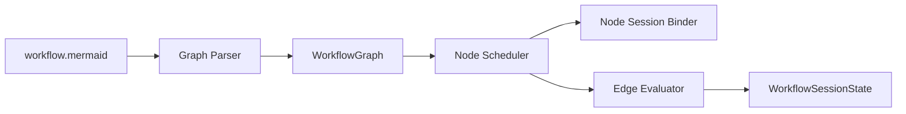
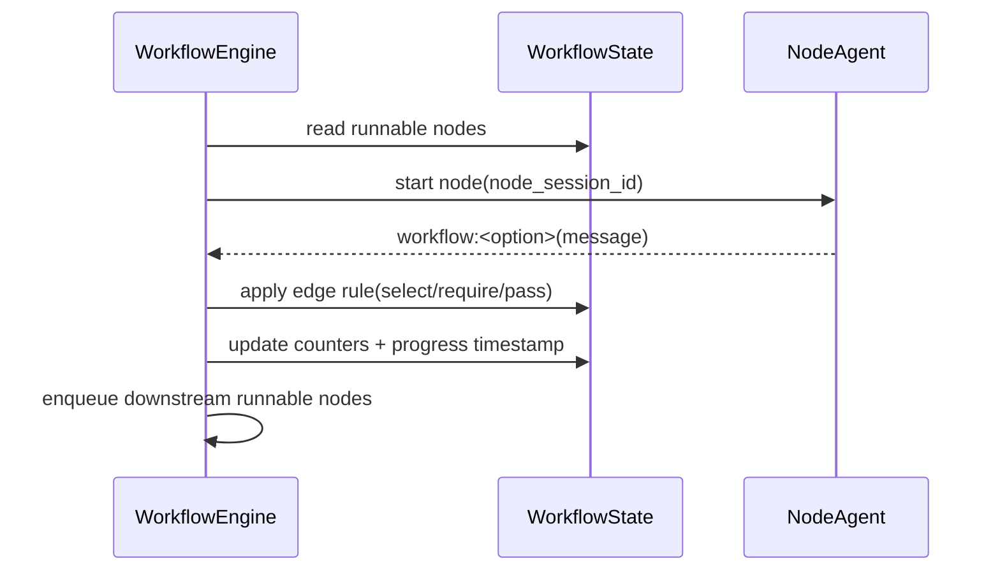
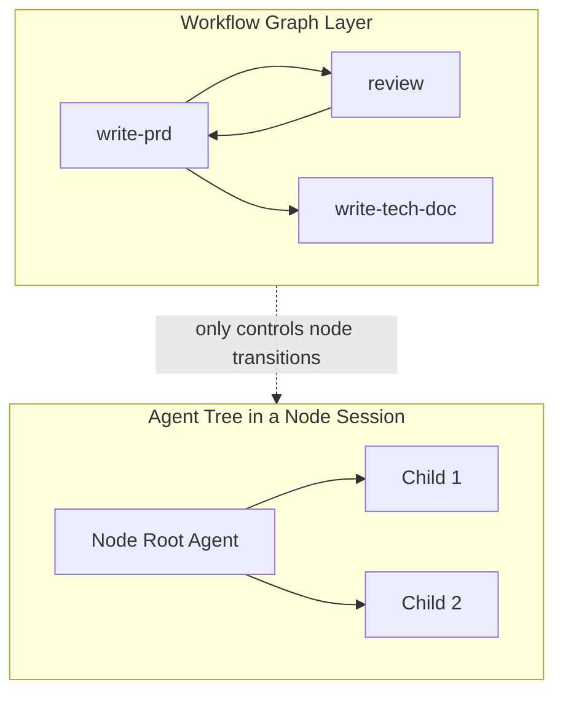
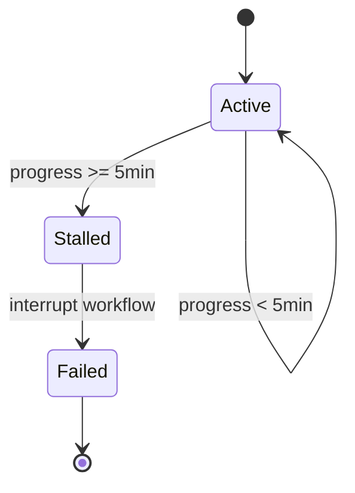

# TECH-WORKFLOW-ENGINE

## 1. 范围

本文件描述工作流引擎内部结构：图解析、节点调度、边条件计数器、节点会话绑定与死锁检测。

## 2. 工作流内部组件



## 3. 关键数据结构（伪类型）

```text
WorkflowGraph {
  nodes[]
  edges[]            // from,to,rule
}

EdgeRule =
  Pass
  | Select { counter_key, option }
  | Require { counter_key }

WorkflowSessionState {
  workflow_session_id
  counters: map<string, int>
  global_vars: map<string, string>
  node_sessions: map<node_id, node_session_id>
  last_progress_at
}

NodeRuntimeState {
  node_id
  status            // ready/running/waiting/finished/failed
  session_id
}
```

## 4. 节点调度数据流



## 5. 双层结构分离（工作流图 vs Agent树）



## 6. 边条件计算伪代码

```text
function on_transition(node, option, message):
  edge = find_edge(node, option)
  // workflow:pass 表示无条件边，等价于 Pass 规则
  if edge.rule is Select(counter):
    counters[counter] += 1
    unlock(edge.to)
  else if edge.rule is Require(counter):
    if counters[counter] > 0: unlock(edge.to)
    else keep_waiting(edge.to)
  else:
    unlock(edge.to)     // pass
  store_transition_message(node, edge.to, message)
```

## 7. `new-session` 语义

1. 节点声明 `new-session` 时，总是创建新的节点 Session。
2. 新节点 Session 自动归属当前 workflow session。
3. 节点重入时是否复用会话，取决于是否声明 `new-session`。

## 8. 无进度检测



无进度超过阈值时，工作流进入中断失败路径并上报错误。
