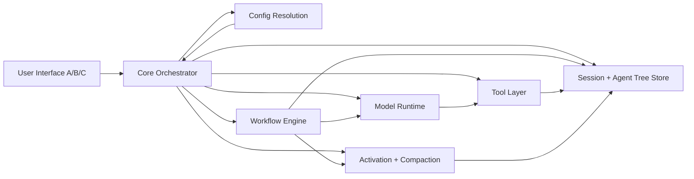
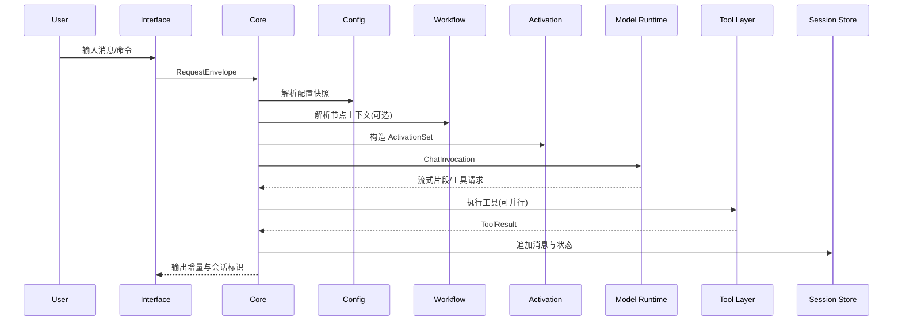
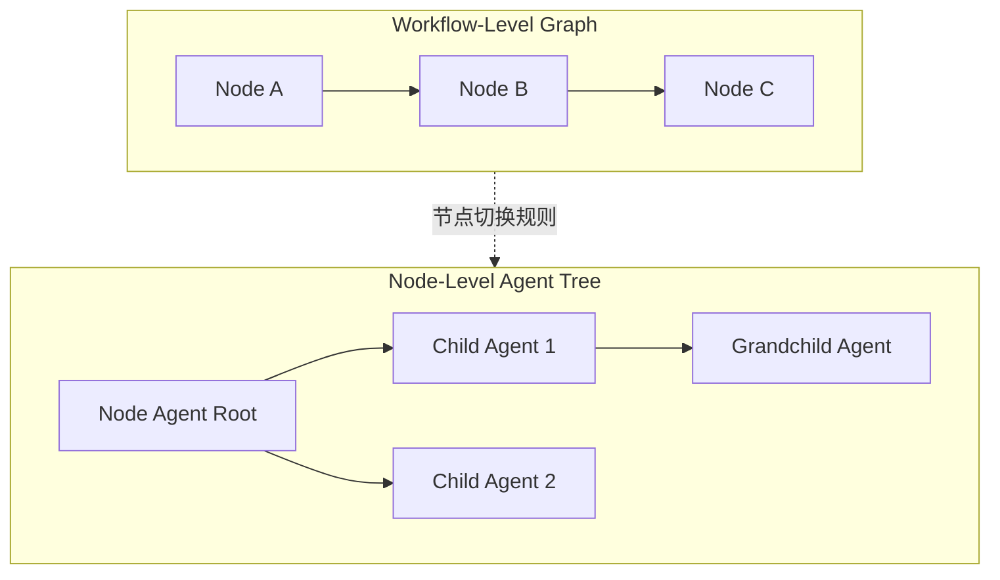

# TECH

## 1. 文档定位

本文件只描述跨模块关系，不展开模块内部实现细节。  
模块内部关系见 `TECH-*.md`。

## 2. 全局模块图

```mermaid
flowchart LR
    UI[User Interface A/B/C] --> CORE[Core Orchestrator]
    CORE --> CFG[Config Resolution]
    CORE --> WF[Workflow Engine]
    CORE --> ACT[Activation + Compaction]
    CORE --> MR[Model Runtime]
    CORE --> TL[Tool Layer]
    CORE --> SS[Session + Agent Tree Store]

    WF --> SS
    WF --> ACT
    WF --> MR
    MR --> TL
    TL --> SS
    ACT --> SS
    CFG --> CORE
```

## 3. 跨模块核心数据结构

| 数据结构 | 生产模块 | 消费模块 | 作用 |
|---|---|---|---|
| `SessionIdentity` | Session | Workflow, UI, Model Runtime | 统一追踪一次会话及其树结构 |
| `AgentNodeRef` | Session | Workflow, Activation, Tool Layer | 标识当前执行主体 |
| `WorkflowSessionState` | Workflow | Core, Session | 存储计数器、全局变量、节点会话索引 |
| `ActivationSet` | Activation | Model Runtime, Tool Layer | 描述当前已激活的 Prompt/Tool/MCP/Skill |
| `ChatInvocation` | Core | Model Runtime | 模型调用输入快照 |
| `ModelAttemptState` | Model Runtime | Reliability | 跟踪模型/Key/重试游标 |
| `ToolCallEnvelope` | Model Runtime | Tool Layer | 工具调用的统一包装 |
| `RuntimeErrorClass` | 各模块 | Reliability | 错误分流与回退决策输入 |

## 4. 端到端数据流（统一入口）

```mermaid
sequenceDiagram
    participant U as User
    participant UI as Interface
    participant C as Core
    participant CFG as Config
    participant WF as Workflow
    participant A as Activation
    participant M as Model Runtime
    participant T as Tool Layer
    participant S as Session Store

    U->>UI: 输入消息/命令
    UI->>C: RequestEnvelope
    C->>CFG: 解析配置快照
    C->>WF: 解析节点上下文(可选)
    C->>A: 构造 ActivationSet
    C->>M: ChatInvocation
    M-->>C: 流式片段/工具请求
    C->>T: 执行工具(可并行)
    T-->>C: ToolResult
    C->>S: 追加消息与状态
    C-->>UI: 输出增量与会话标识
```

## 5. 双层结构的跨模块约束

```mermaid
flowchart TB
    subgraph L1[Workflow-Level Graph]
        N1[Node A]
        N2[Node B]
        N3[Node C]
        N1 --> N2
        N2 --> N3
    end

    subgraph L2[Node-Level Agent Tree]
        R[Node Agent Root]
        C1[Child Agent 1]
        C2[Child Agent 2]
        G1[Grandchild Agent]
        R --> C1
        R --> C2
        C1 --> G1
    end

    L1 -.节点切换规则.-> L2
```

跨模块不变量：

1. 工作流图只控制“节点之间转换”，不控制节点内 Agent 层级。
2. `parent_ulid` 仅用于 Agent 树恢复，不参与工作流边计算。
3. 节点 Agent 同时是节点内根 Agent，其 ULID 与节点 Session ID 同值。
4. 首个 Agent 的 ULID 与顶层 Session ID 同值。

## 6. 外部架构参考（抽象映射）

仅保留结构模式，不导入额外功能：

1. ZeroClaw 参考点：多 crate 分层、运行时与接口层解耦、以文档索引组织复杂系统。
2. OpenFang 参考点：`kernel/runtime/types/memory/api/cli` 分工清晰，适合作为 Neco 的“核心执行-外部接口-状态存储”边界范式。

来源：

- https://github.com/zeroclaw-labs/zeroclaw
- https://raw.githubusercontent.com/zeroclaw-labs/zeroclaw/main/Cargo.toml
- https://raw.githubusercontent.com/RightNow-AI/openfang/main/README.md
- https://raw.githubusercontent.com/RightNow-AI/openfang/main/Cargo.toml

## 7. 覆盖索引（避免重复）

| 需求主题 | 主要文档 |
|---|---|
| 模型组/调用/重试/回退 | `TECH-MODEL-RUNTIME.md` |
| Session 与 Agent 树 | `TECH-SESSION-AGENT-TREE.md` |
| 工作流图与节点会话 | `TECH-WORKFLOW-ENGINE.md` |
| 按需加载与压缩 | `TECH-ACTIVATION-COMPACTION.md` |
| 配置解析与优先级 | `TECH-CONFIG-RESOLUTION.md` |
| 工具与用户接口 | `TECH-TOOLS-INTERFACE.md` |
| 错误与权限隔离 | `TECH-RELIABILITY-ISOLATION.md` |
