# Neco 技术设计文档

## 文档信息

- **项目名称**: Neco
- **文档版本**: 0.1.0
- **最后更新**: 2026-02-27
- **作者**: MiyakoMeow

---

## 架构核心：内生联系总览

Neco的技术架构围绕**多层智能体树形结构**展开，各模块通过以下核心设计相互关联：

### 一、树形架构作为核心组织形式

```
Session (1) ←→ AgentTree (1) ←→ AgentNode (N)
     ↓                ↓               ↓
 MemoryContext    CoordinationBus   ModelSelector
```

**内生关系**：
- **Session ↔ AgentTree**：一对一绑定，Session生命周期 = 智能体树生命周期
- **AgentTree ↔ AgentNode**：树形管理，根智能体（Root）直接与用户对话，递归创建子节点
- **AgentNode.nodeType ↔ ModelGroup**：不同类型智能体使用不同模型（think/balanced/act）

### 二、两层记忆系统的设计约束

```
纯LLM架构 (无Embeddings)
     ↓
记忆检索依赖关键词匹配
     ↓
需要两层结构：索引层（快速检索）+ 内容层（按需加载）
```

**内生关系**：
- **纯LLM架构 → 两层记忆**：无Embeddings模型，必须通过标题/摘要快速筛选
- **workspace分类 ↔ 智能体树**：特定目录会话只加载相关记忆，减少上下文污染
- **MemoryLibrary → SessionContext**：Session启动时激活记忆，形成MemoryContext

### 三、并发模型贯穿全栈

```
Arc<T> (共享不可变)
  ├── Config (全局配置)
  ├── ModelConfig.current_index (AtomicUsize, 无锁轮询)
  └── AgentTree.nodes (Arc<RwLock<HashMap>>)

Arc<RwLock<T>> (共享可变，读多写少)
  ├── AgentTree.nodes (智能体树管理)
  ├── SharedState (跨智能体通信)
  └── MemoryIndex (记忆索引)
```

**内生关系**：
- **智能体树并发 → Arc<RwLock>**：多层级智能体并发访问树结构，需要读写锁
- **模型轮询 → AtomicUsize**：无锁轮询支持高并发，避免Mutex竞争
- **父子通信 → 单向通道**：上行汇报和下行指令，无循环依赖风险

### 四、懒加载与按需启动策略

```
MCP服务器懒加载
     ↓
McpServerManager.get_client() (按需连接)
     ↓
ToolExecutor.execute() (触发工具调用)
     ↓
AgentNode (创建子智能体)
```

**内生关系**：
- **MCP懒加载 ↔ 工具执行**：只有智能体调用工具时才启动MCP服务器
- **Skills懒加载 ↔ 记忆激活**：按上下文关键词激活Skills，避免全量加载
- **子智能体生命周期 ↔ 任务分解**：根智能体根据任务复杂度动态创建子节点

### 五、树形架构驱动的通信协议

```
AgentNode (父子关系)
     ↓
CoordinationEnvelope (消息类型：Report/Command)
     ↓
InMemoryMessageBus (父子路由：上行汇报/下行指令)
```

**内生关系**：
- **树形结构 → 消息路由**：仅支持父子通信（上行汇报进度、下行发送指令）
- **消息总线 ↔ AgentTree**：每个节点维护父节点引用，直接向父节点发送消息
- **进度追踪 → 父子链式传递**：子节点→父节点→根智能体，形成清晰的汇报线

### 六、纯LLM架构的技术约束

```
无Embeddings/Rerank/Apply模型
     ↓
记忆检索依赖关键词匹配
     ↓
两层记忆结构：索引层（快速检索）+ 内容层（按需加载）
```

**内生关系**：
- **纯LLM → 关键词检索**：MemoryLibrary.recall使用标题匹配+相似度分数
- **两层记忆 → 内容激活**：先检索索引层，再加载完整内容
- **workspace分类 → 上下文隔离**：特定目录会话只加载相关记忆

### 设计决策连锁反应

| 决策 | 直接影响 | 间接影响 |
|------|----------|----------|
| 采用树形智能体结构 | 需要AgentTree管理器 | 消息总线支持父子路由；Session持久化需要序列化树 |
| 使用纯LLM架构 | 无Embeddings模型 | 两层记忆结构；关键词检索匹配；LLM重新排序 |
| MCP懒加载策略 | 延迟启动服务器 | 工具执行触发连接；需要连接复用机制 |
| Arc+RwLock并发模型 | 共享可变状态 | 智能体树并发访问；模型无锁轮询 |
| Jujutsu版本控制 | Session持久化 | Git Workspace兼容层；提交历史管理 |

---

## 目录

1. [项目概述](#项目概述)
2. [核心架构](#核心架构)
3. [数据结构设计](#数据结构设计)
4. [系统模块](#系统模块)
5. [数据流动](#数据流动)
6. [多智能体协作](#多智能体协作)
7. [记忆系统](#记忆系统)
8. [模型配置](#模型配置)
9. [接口层](#接口层)
10. [扩展系统](#扩展系统)
11. [可配置性](#可配置性)
12. [技术约束](#技术约束)

---

## 项目概述

### 核心目标

Neco 是一个**原生支持多智能体协作**的智能体应用，解决现有AI Agent在多智能体协作方面的不足：

- **双向通信**: 上下级智能体之间可以直接在会话中传递内容
- **实时纠偏**: 上级可随时要求下级汇报，第一时间发现并纠正异常
- **简洁记忆**: 两层记忆框架，避免内容膨胀
- **多模型配置**: 支持专用化模型配置和负载均衡

### 技术栈

- **语言**: Rust (Edition 2024)
- **异步运行时**: Tokio
- **LLM接口**: async-openai
- **工具协议**: MCP (rmcp)
- **技能系统**: AgentSkills兼容
- **终端UI**: ratatui
- **外部协议**: ACP (Agent Client Protocol)

---

## 核心架构

### 架构分层

```mermaid
graph TB
    subgraph "接口层"
        CLI[CLI终端]
        REPL[REPL模式]
        ACP[ACP协议]
        Auto[智能模式]
    end

    subgraph "控制层"
        Orchestrator[编排器]
        Router[任务路由]
        Supervisor[智能体监督]
    end

    subgraph "执行层"
        Agent[根智能体]
        AgentTree[智能体树]
        Tools[工具执行器]
    end

    subgraph "数据层"
        Session[Session管理]
        Memory[记忆系统]
        Config[配置管理]
    end

    subgraph "协议层"
        LLM[LLM接口]
        MCP[MCP客户端]
        Skills[技能系统]
    end

    CLI --> Orchestrator
    REPL --> Orchestrator
    ACP --> Orchestrator
    Auto --> Orchestrator

    Orchestrator --> Router
    Router --> Agent
    Router --> AgentTree
    AgentTree --> Agent

    Agent --> Session
    Agent --> Memory
    Agent --> Tools

    Agent --> LLM
    Tools --> MCP
    Agent --> Skills
```



### 核心原则

#### 1. 所有权与生命周期

遵循Rust所有权模型，确保内存安全：

```mermaid
graph LR
    A[Session创建] -->|拥有| B[SessionContext]
    B -->|引用| C[MessageHistory]
    B -->|拥有| D[AgentTree]
    D -->|管理| E[AgentNode]
    E -->|包含| F[AgentSession]
    F -->|临时| G[AgentInstance]
    G -->|释放| H[Drop]
```



#### 2. 并发模型

- **共享不可变数据**: 使用 `Arc<T>` 共享配置和只读状态
- **独享可变数据**: 使用 `&mut T` 或 `Mutex<T>` 保护可变状态
- **异步任务**: 使用 `tokio::spawn` 创建后台任务
- **通信**: 使用 `mpsc` 通道进行消息传递

#### 3. 错误处理

- **预期错误**: 使用 `Result<T, E>` 返回
- **领域错误**: 使用 `thiserror` 定义结构化错误
- **应用错误**: 使用 `anyhow` 提供上下文

---

## 数据结构设计

### 1. Session管理

#### SessionContext

会话上下文是整个智能体交互的核心数据结构：

```rust
/// 会话上下文
///
/// # 生命周期
/// - 创建于用户首次交互
/// - 存储在 `~/.local/neco/{session_id}/` 目录
/// - 使用Jujutsu进行版本管理
///
/// # 树形智能体架构
/// 每个Session包含一个AgentTree，管理所有子智能体
/// 根智能体（Root Agent）直接与用户对话，可递归创建子节点
pub struct SessionContext {
    /// 唯一会话ID（基于UUID v7，具有时间排序特性）
    pub id: SessionId,

    /// 会话元数据
    pub metadata: SessionMetadata,

    /// 对话历史
    pub history: Vec<ConversationMessage>,

    /// 智能体树（管理所有子智能体）
    ///
    /// # 树形结构
    /// - 根智能体（Root Agent）：每个Session唯一，直接与用户对话
    /// - 子智能体（Child Agent）：由根或其他子智能体创建
    /// - 执行智能体（ActOnly）：只能执行工具，不能创建子节点
    pub agent_tree: Arc<AgentTree>,

    /// 共享状态（用于跨智能体通信）
    pub shared_state: Arc<RwLock<SharedState>>,

    /// 配置快照
    pub config: Arc<Config>,
}

/// 会话ID（Newtype模式）
#[derive(Debug, Clone, PartialEq, Eq, Hash)]
pub struct SessionId(Uuid);

impl SessionId {
    /// 生成新的会话ID（使用UUID v7）
    pub fn new() -> Self {
        Self(Uuid::new_v7())  // 时间排序特性
    }
}
```

**设计决策**:
- **Newtype模式**: `SessionId` 提供类型安全，防止与其他UUID混淆
- **Arc + RwLock**: 支持多线程共享访问，读多写少场景优化
- **UUID v7**: 时间有序，便于排序和调试

#### SessionMetadata

```rust
/// 会话元数据
#[derive(Debug, Clone, Serialize, Deserialize)]
pub struct SessionMetadata {
    /// 创建时间
    pub created_at: DateTime<Utc>,

    /// 最后更新时间
    pub updated_at: DateTime<Utc>,

    /// 会话标题（自动生成或用户指定）
    pub title: Option<String>,

    /// 工作目录
    pub workspace: PathBuf,

    /// 当前模式（Plan/Execute/等）
    pub mode: SessionMode,

    /// 用户偏好设置
    pub preferences: UserPreferences,
}
```

### 2. 消息系统

#### ConversationMessage

```rust
/// 对话消息
///
/// # 设计原则
/// - 使用 `Arc` 避免大对象复制
/// - 区分用户消息和工具调用结果
#[derive(Debug, Clone, Serialize, Deserialize)]
pub enum ConversationMessage {
    /// 用户消息
    User(UserMessage),

    /// 助手消息（可能包含工具调用）
    Assistant(AssistantMessage),

    /// 工具执行结果
    Tool(ToolResult),

    /// 系统提示（通常在历史开头）
    System(SystemMessage),
}

/// 用户消息
#[derive(Debug, Clone, Serialize, Deserialize)]
pub struct UserMessage {
    pub content: ContentBlock,
    pub timestamp: DateTime<Utc>,
    pub attachments: Vec<Attachment>,  // 图片、文件等
}

/// 助手消息
#[derive(Debug, Clone, Serialize, Deserialize)]
pub struct AssistantMessage {
    pub content: Option<ContentBlock>,
    pub tool_calls: Vec<ToolCall>,
    pub reasoning: Option<String>,  // 思考过程
    pub timestamp: DateTime<Utc>,
}

/// 内容块（支持多媒体）
#[derive(Debug, Clone, Serialize, Deserialize)]
pub enum ContentBlock {
    Text(TextContent),
    Image(ImageContent),
    Audio(AudioContent),
}
```

#### ToolCall

```rust
/// 工具调用
///
/// # 生命周期
/// 1. Pending: 等待执行
/// 2. InProgress: 正在执行
/// 3. Completed: 成功完成
/// 4. Failed: 执行失败
#[derive(Debug, Clone, Serialize, Deserialize)]
pub struct ToolCall {
    /// 工具调用ID（用于关联结果）
    pub id: ToolCallId,

    /// 工具名称
    pub name: String,

    /// 参数（JSON）
    pub arguments: Value,

    /// 执行状态
    pub status: ToolCallStatus,

    /// 执行结果（完成后）
    pub result: Option<ToolResult>,
}

/// 工具调用ID（Newtype）
#[derive(Debug, Clone, PartialEq, Eq, Hash)]
pub struct ToolCallId(String);
```

### 3. 配置系统

#### ModelConfig

```rust
/// 模型配置（对应TOML中的model_groups）
#[derive(Debug, Clone, Serialize, Deserialize)]
pub struct ModelConfig {
    /// 模型组名称（think/balanced/act/image）
    pub name: String,

    /// 模型列表（支持负载均衡）
    pub models: Vec<ModelReference>,

    /// 当前模型索引（用于轮询）
    #[serde(skip)]
    pub current_index: Arc<AtomicUsize>,
}

/// 模型引用
#[derive(Debug, Clone, Serialize, Deserialize)]
pub struct ModelReference {
    /// 模型标识符（如 zhipuai/glm-4.7）
    pub model: String,

    /// 提供商名称
    pub provider: String,
}

/// 提供商配置
#[derive(Debug, Clone, Serialize, Deserialize)]
pub struct ProviderConfig {
    /// 提供商类型（openai/anthropic/等）
    pub r#type: ProviderType,

    /// 显示名称
    pub name: String,

    /// API基础URL
    pub base: String,

    /// API密钥环境变量名（支持多个）
    pub env_keys: Vec<String>,

    /// 重试配置
    pub retry: RetryConfig,
}
```

**设计决策**:
- **AtomicUsize**: 无锁轮询，支持并发访问
- **Vec<String>**: 多个API密钥，自动故障转移

### 4. 子智能体管理（树形结构）

**重要**：Neco采用**树形架构**管理子智能体，而非扁平注册表。详细设计见[Section 6: 多智能体协作](#多智能体协作)。

#### AgentNode（简化定义）

```rust
/// 智能体节点（树的节点）
///
/// # 在SessionContext中的使用
/// SessionContext包含一个AgentTree实例，管理整棵树
/// 完整定义见Section 6
#[derive(Debug, Clone)]
pub struct AgentNode {
    /// 节点ID
    pub id: AgentId,

    /// 节点类型（Root/Child/ActOnly）
    pub node_type: AgentNodeType,

    /// 父节点ID（None表示根智能体）
    pub parent_id: Option<AgentId>,

    /// 子节点ID列表
    pub children: Vec<AgentId>,

    /// 智能体会话（包含状态、任务等）
    pub session: AgentSession,

    /// 创建时间
    pub created_at: DateTime<Utc>,
}

/// 智能体会话（与AgentNode一一对应）
#[derive(Debug, Clone)]
pub struct AgentSession {
    /// 会话ID（与AgentNode.id相同）
    pub id: AgentId,

    /// 任务描述
    pub task: String,

    /// 当前状态
    pub status: AgentStatus,

    /// 开始时间
    pub started_at: DateTime<Utc>,

    /// 完成时间
    pub completed_at: Option<DateTime<Utc>>,

    /// 执行结果
    pub result: Option<ToolResult>,

    /// Tokio任务句柄（用于取消）
    #[serde(skip)]
    handle: Option<JoinHandle<()>>,
}

#[derive(Debug, Clone, Serialize, Deserialize)]
pub enum AgentStatus {
    Created,
    Running,
    Paused,
    Completed,
    Failed,
}

/// 智能体节点类型
#[derive(Debug, Clone, PartialEq, Eq)]
pub enum AgentNodeType {
    /// 根智能体（每个Session唯一）
    Root,

    /// 子智能体（可以创建下级）
    Child,

    /// 执行智能体（只能执行工具，不能创建下级）
    ActOnly,
}

/// 智能体ID（Newtype）
#[derive(Debug, Clone, PartialEq, Eq, Hash)]
pub struct AgentId(String);

impl AgentId {
    /// 生成新的智能体ID
    pub fn new() -> Self {
        Self(Uuid::new_v4().to_string())
    }
}
```

**设计要点**：
- **树形结构**：AgentNode通过parent_id和children形成树形关系
- **类型约束**：AgentNodeType限制节点能力（如ActOnly不能创建子节点）
- **并发安全**：AgentTree使用Arc<RwLock<HashMap<AgentId, AgentNode>>>保护内部状态
- **生命周期**：AgentSession的状态转换详见[Section 6.5: 子智能体生命周期](#5-子智能体生命周期状态机)

### 5. 记忆系统

#### MemoryEntry

```rust
/// 记忆条目
///
/// # 两层结构
/// 1. 标题 + 摘要（用于检索）
/// 2. 完整内容（激活时加载）
#[derive(Debug, Clone, Serialize, Deserialize)]
pub struct MemoryEntry {
    /// 记忆ID
    pub id: MemoryId,

    /// 标题
    pub title: String,

    /// 摘要（用于快速浏览）
    pub summary: String,

    /// 完整内容
    pub content: String,

    /// 类别（用户偏好/特定目录）
    pub category: MemoryCategory,

    /// 关联的session（可选）
    pub session_id: Option<SessionId>,

    /// 创建时间
    pub created_at: DateTime<Utc>,

    /// 访问计数
    pub access_count: AtomicU32,
}

/// 记忆类别
#[derive(Debug, Clone, Serialize, Deserialize)]
pub enum MemoryCategory {
    /// 全局用户偏好
    Global,

    /// 特定目录记忆
    Directory { path: PathBuf },

    /// Explore结果
    ExploreResult,

    /// 问题解决记录
    Solution { topic: String },
}
```

**设计决策**:
- **两层结构**: 摘要 + 完整内容，减少内存占用
- **按目录分类**: 特定目录会话只加载相关记忆
- **访问计数**: 用于LRU淘汰

---

## 系统模块

### 1. LLM接口层

#### LLMClient Trait

```rust
/// LLM客户端trait
///
/// # 设计原则
/// - 提供商无关抽象
/// - 支持流式和非流式调用
/// - 统一的错误处理
#[async_trait]
pub trait LLMClient: Send + Sync {
    /// 聊天补全（非流式）
    async fn chat_completion(
        &self,
        request: ChatCompletionRequest,
    ) -> Result<ChatCompletionResponse, LLMError>;

    /// 聊天补全（流式）
    async fn chat_completion_stream(
        &self,
        request: ChatCompletionRequest,
    ) -> impl Stream<Item = Result<ChatCompletionChunk, LLMError>> + Send;

    /// 支持工具调用
    fn supports_tools(&self) -> bool;
}
```

#### OpenAIAdapter

```rust
/// OpenAI兼容接口适配器
///
/// 使用 async-openai crate 实现
/// 支持的提供商：OpenAI、ZhipuAI、MiniMax等兼容OpenAI Chat API的服务
pub struct OpenAIAdapter {
    /// 客户端
    client: Client<OpenAIConfig>,

    /// 模型配置
    model_config: ModelConfig,

    /// 重试策略
    retry: RetryStrategy,
}

impl OpenAIAdapter {
    /// 创建新适配器
    pub fn new(config: &ProviderConfig, model_config: ModelConfig)
        -> Result<Self, ConfigError>
    {
        // 从环境变量读取API密钥
        let api_key = Self::find_api_key(&config.env_keys)?;

        // 构建OpenAI配置
        let openai_config = OpenAIConfig::new()
            .with_api_key(api_key)
            .with_api_base(&config.base);

        let client = Client::with_config(openai_config);

        Ok(Self {
            client,
            model_config,
            retry: RetryStrategy::from_config(&config.retry),
        })
    }

    /// 查找可用的API密钥
    fn find_api_key(env_keys: &[String]) -> Result<String, ConfigError> {
        for key in env_keys {
            if let Ok(value) = std::env::var(key) {
                if !value.is_empty() {
                    return Ok(value);
                }
            }
        }
        Err(ConfigError::NoApiKey)
    }
}

#[async_trait]
impl LLMClient for OpenAIAdapter {
    async fn chat_completion(
        &self,
        mut request: ChatCompletionRequest,
    ) -> Result<ChatCompletionResponse, LLMError> {
        // 选择模型（带故障转移）
        let model_ref = self.select_model().await?;

        request.model = model_ref.model.clone();

        // 重试逻辑
        self.retry.execute(|| async {
            let openai_req = self.to_openai_request(&request)?;
            let response = self.client.chat().create(openai_req).await?;
            Ok(self.from_openai_response(response))
        }).await
    }

    async fn chat_completion_stream(
        &self,
        mut request: ChatCompletionRequest,
    ) -> impl Stream<Item = Result<ChatCompletionChunk, LLMError>> + Send {
        // 选择模型
        let model_ref = self.select_model().await.unwrap();
        request.model = model_ref.model.clone();

        // 创建流
        let stream = self.client.chat()
            .create_stream(self.to_openai_request(&request).unwrap())
            .await
            .unwrap();

        // 转换流
        async_stream::stream! {
            while let Some(chunk) = stream.next().await {
                match chunk {
                    Ok(c) => yield Ok(self.from_openai_chunk(c)),
                    Err(e) => yield Err(LLMError::from(e)),
                }
            }
        }
    }
}
```

#### 未来提供商支持计划

当前版本（v0.1.0）主要支持OpenAI兼容API。以下是计划支持的提供商：

| 提供商 | 状态 | 计划版本 | 说明 |
|--------|------|----------|------|
| ✅ OpenAI | 已支持 | v0.1.0 | 通过async-openai |
| ✅ ZhipuAI | 已支持 | v0.1.0 | 兼容OpenAI API |
| ✅ MiniMax | 已支持 | v0.1.0 | 兼容OpenAI API |
| 🔄 Anthropic | 计划中 | v0.2.0 | 需要独立适配器 |
| 🔄 OpenRouter | 计划中 | v0.2.0 | 聚合多个提供商 |
| 🔄 GitHub Copilot | 计划中 | v0.3.0 | 需要特殊认证 |
| ❌ Google Gemini | 未计划 | - | 低优先级 |
| ❌ Claude API | 未计划 | - | 已有Anthropic |

**Anthropic适配器设计（预留）**：

```rust
#[cfg(feature = "anthropic")]
/// Anthropic Claude适配器
pub struct AnthropicAdapter {
    /// 客户端
    client: anthropic::Client,

    /// 模型配置
    model_config: ModelConfig,
}

#[cfg(feature = "anthropic")]
#[async_trait]
impl LLMClient for AnthropicAdapter {
    async fn chat_completion(
        &self,
        request: ChatCompletionRequest,
    ) -> Result<ChatCompletionResponse, LLMError> {
        // 转换为Anthropic格式
        let anthropic_req = self.to_anthropic_request(request)?;

        // 调用API
        let response = self.client.messages().create(&anthropic_req).await?;

        // 转换回通用格式
        Ok(self.from_anthropic_response(response))
    }
}
```

### 2. 工具执行层

#### ToolExecutor

```rust
/// 工具执行器
///
/// # 职责
/// - 工具查找和调用
/// - 并行/串行执行
/// - 结果收集和错误处理
pub struct ToolExecutor {
    /// MCP客户端注册表
    mcp_clients: Arc<RwLock<HashMap<String, DynMcpClient>>>,

    /// 内置工具
    builtin_tools: HashMap<String, Box<dyn BuiltinTool>>,

    /// 执行配置
    config: ToolConfig,
}

impl ToolExecutor {
    /// 并行执行工具调用
    pub async fn execute_parallel(
        &self,
        calls: Vec<ToolCall>,
    ) -> Vec<ToolResult> {
        use futures::future::join_all;

        let futures: Vec<_> = calls.into_iter()
            .map(|call| self.execute_single(call))
            .collect();

        join_all(futures).await
    }

    /// 执行单个工具调用
    async fn execute_single(&self, call: ToolCall) -> ToolResult {
        // 查找工具
        let tool = self.find_tool(&call.name)
            .unwrap_or_else(|| ToolResult::error(format!("Tool not found: {}", call.name)));

        match tool {
            Tool::Mcp(client, tool_name) => {
                // MCP工具调用
                client.call_tool(&tool_name, call.arguments).await
            }
            Tool::Builtin(builtin) => {
                // 内置工具调用
                builtin.execute(call.arguments).await
            }
        }
    }
}
```

### 3. Session管理层

#### SessionManager

```rust
/// Session管理器
///
/// # 职责
/// - Session创建和加载
/// - 持久化（Jujutsu集成）
/// - 清理和回收
pub struct SessionManager {
    /// Session存储目录
    sessions_dir: PathBuf,

    /// 活跃Session缓存
    active_sessions: Arc<RwLock<HashMap<SessionId, SessionContext>>>,
}

impl SessionManager {
    /// 创建新Session
    pub async fn create_session(
        &self,
        workspace: PathBuf,
        config: Arc<Config>,
    ) -> Result<SessionContext, SessionError> {
        // 生成Session ID
        let session_id = SessionId::new();

        // 创建Session目录
        let session_dir = self.sessions_dir.join(session_id.to_string());
        fs::create_dir_all(&session_dir)
            .await
            .map_err(SessionError::IoError)?;

        // 初始化Git仓库（Jujutsu）
        self.init_jujutsu_repo(&session_dir).await?;

        // 创建根智能体会话
        let root_session = AgentSession {
            id: AgentId::new(),
            task: "根智能体：管理整个会话".to_string(),
            status: AgentStatus::Running,
            started_at: Utc::now(),
            completed_at: None,
            result: None,
            handle: None,
        };

        // 创建智能体树（包含根智能体）
        let agent_tree = AgentTree::new(root_session).await;

        // 创建Session上下文
        let context = SessionContext {
            id: session_id.clone(),
            metadata: SessionMetadata {
                created_at: Utc::now(),
                updated_at: Utc::now(),
                title: None,
                workspace,
                mode: SessionMode::Execute,
                preferences: UserPreferences::default(),
            },
            history: Vec::new(),
            agent_tree: Arc::new(agent_tree),
            shared_state: Arc::new(RwLock::new(SharedState::new())),
            config,
        };

        // 保存初始状态
        self.save_session(&context).await?;

        // 缓存
        self.active_sessions.write()
            .map_err(|_| SessionError::LockPoisoned)?
            .insert(session_id.clone(), context.clone());

        Ok(context)
    }

    /// 保存Session（Jujutsu提交）
    async fn save_session(&self, context: &SessionContext)
        -> Result<(), SessionError>
    {
        let session_dir = self.sessions_dir.join(context.id.to_string());

        // 序列化上下文
        let content = serde_json::to_string_pretty(context)
            .map_err(SessionError::SerializationError)?;

        // 写入临时文件
        let temp_file = session_dir.join("session.json.tmp");
        fs::write(&temp_file, content)
            .await
            .map_err(SessionError::IoError)?;

        // 原子替换
        let target_file = session_dir.join("session.json");
        fs::rename(&temp_file, &target_file)
            .await
            .map_err(SessionError::IoError)?;

        // Jujutsu提交
        self.jujutsu_commit(&session_dir, "Update session").await?;

        Ok(())
    }
}
```

---

## 数据流动

### 1. 主循环流程

```mermaid
sequenceDiagram
    participant U as 用户
    participant O as 编排器
    participant A as 主智能体
    participant L as LLM接口
    participant T as 工具执行器
    participant S as 子智能体
    participant M as 记忆系统

    U->>O: 发送消息
    O->>M: 加载相关记忆
    M-->>O: 返回记忆

    O->>A: 创建/更新Session
    A->>L: 构建请求（历史+工具）
    L-->>A: 流式响应

    loop 工具调用循环
        A->>A: 解析工具调用
        A->>T: 执行工具（并行）
        par 并行执行
            T->>MCP: MCP工具
            T->>Builtin: 内置工具
            T->>S: 子智能体
        end
        T-->>A: 返回结果
        A->>L: 继续对话（结果作为输入）
        L-->>A: 流式响应
    end

    A->>M: 保存重要信息
    A-->>O: 最终响应
    O-->>U: 输出结果
```



### 2. 工具调用流程

```mermaid
stateDiagram-v2
    [*] --> ParseResult: LLM返回响应

    ParseResult --> HasToolCalls: 解析工具调用

    HasToolCalls --> ExecuteTools: 有工具调用
    HasToolCalls --> [*]: 无工具调用

    ExecuteTools --> CheckParallel: 检查是否可并行

    CheckParallel --> ParallelExecute: 可并行
    CheckParallel --> SerialExecute: 依赖前置结果

    ParallelExecute --> CollectResults: 并行执行
    SerialExecute --> CollectResults: 串行执行

    CollectResults --> BuildMessages: 构建后续消息

    BuildMessages --> CallLLM: 调用LLM
    CallLLM --> ParseResult
```



### 3. 子智能体交互流程

```mermaid
sequenceDiagram
    participant MA as 主智能体
    participant Reg as 注册表
    participant SA as 子智能体
    participant Bus as 消息总线

    MA->>Reg: 创建子智能体任务
    Reg->>Reg: 检查并发限制
    Reg-->>MA: 返回session_id

    MA->>SA: 启动任务（tokio::spawn）
    activate SA

    SA->>Bus: 发送进度更新
    Bus-->>MA: 推送通知

    MA->>Bus: 请求汇报
    Bus-->>SA: 转发请求
    SA-->>Bus: 返回状态
    Bus-->>MA: 转发状态

    SA->>SA: 任务完成
    SA->>Reg: 标记完成
    deactivate SA

    MA->>Reg: 获取结果
    Reg-->>MA: 返回结果
```



### 4. 记忆系统流程

```mermaid
graph TB
    subgraph "存储阶段"
        A[会话结束] --> B{是否重要?}
        B -->|是| C[提取关键信息]
        B -->|否| Z[结束]
        C --> D[生成标题+摘要]
        D --> E[分类]
        E --> F[存储到记忆库]
    end

    subgraph "检索阶段"
        G[新会话开始] --> H[读取目录]
        H --> I[匹配相关记忆]
        I --> J[激活完整内容]
        J --> K[注入上下文]
    end

    F --> G
```



---

## 多智能体协作

### 1. 树形架构设计

#### 核心概念

Neco采用**多层智能体树形结构**，每个Session形成一个动态的智能体树：

```mermaid
graph TB
    subgraph "Level 0: 根智能体"
        Root[根智能体<br/>(Root Agent)<br/>直接与用户对话<br/>Session唯一]
    end

    subgraph "Level 1: 子智能体"
        E1[Explore Agent<br/>(探索)]
        C1[Code Agent<br/>(编码)]
        D1[Doc Agent<br/>(文档)]
    end

    subgraph "Level 2: 孙智能体"
        E2[Explore-Sub1]
        E3[Explore-Sub2]
        C2[Code-Sub1]
    end

    subgraph "特殊类型"
        A[执行智能体<br/>(Act Only)<br/>只能执行工具<br/>不能创建子节点]
    end

    Root -->|任务拆分| E1
    Root -->|并行任务| C1
    Root -->|独立任务| D1

    E1 -->|子任务| E2
    E1 -->|子任务| E3
    C1 -->|协助| C2

    Root -.->|委托执行| A
```

#### AgentNode结构

```rust
/// 智能体节点（树的节点）
///
/// # 树形结构
/// - 每个Session只有一个根智能体（Root Agent）
/// - 根智能体直接与用户对话
/// - 每个智能体可以有多个子节点
/// - 形成动态的树形结构
#[derive(Debug, Clone)]
pub struct AgentNode {
    /// 节点ID
    pub id: AgentId,

    /// 节点类型
    pub node_type: AgentNodeType,

    /// 父节点ID（None表示根智能体）
    pub parent_id: Option<AgentId>,

    /// 子节点ID列表
    pub children: Vec<AgentId>,

    /// 智能体会话
    pub session: AgentSession,

    /// 创建时间
    pub created_at: DateTime<Utc>,
}

/// 智能体节点类型
#[derive(Debug, Clone, PartialEq, Eq)]
pub enum AgentNodeType {
    /// 根智能体（每个Session唯一）
    Root,

    /// 子智能体（可以创建下级）
    Child,

    /// 执行智能体（只能执行工具，不能创建下级）
    ActOnly,
}

/// 智能体ID（Newtype）
#[derive(Debug, Clone, PartialEq, Eq, Hash)]
pub struct AgentId(String);

impl AgentId {
    /// 生成新的智能体ID
    pub fn new() -> Self {
        Self(Uuid::new_v4().to_string())
    }
}
```

#### AgentTree管理器

```rust
/// 智能体树管理器
///
/// # 职责
/// - 维护智能体树结构
/// - 管理节点生命周期
/// - 执行树遍历和查询
pub struct AgentTree {
    /// 所有节点（agent_id -> node）
    nodes: Arc<RwLock<HashMap<AgentId, AgentNode>>>,

    /// 根智能体ID
    root_id: Arc<RwLock<Option<AgentId>>>,

    /// 节点类型约束
    type_constraints: HashMap<AgentNodeType, NodeTypeConstraints>,
}

/// 节点类型约束
#[derive(Debug, Clone)]
pub struct NodeTypeConstraints {
    /// 是否可以创建子节点
    pub can_create_children: bool,

    /// 最大子节点数（None=无限制）
    pub max_children: Option<usize>,

    /// 允许的子节点类型
    pub allowed_child_types: Vec<AgentNodeType>,
}

impl AgentTree {
    /// 创建新树（初始化根智能体）
    pub async fn new(root_session: AgentSession) -> Self {
        let root_id = AgentId::new();
        let root_node = AgentNode {
            id: root_id.clone(),
            node_type: AgentNodeType::Root,
            parent_id: None,
            children: Vec::new(),
            session: root_session,
            created_at: Utc::now(),
        };

        let mut nodes = HashMap::new();
        nodes.insert(root_id.clone(), root_node);

        Self {
            nodes: Arc::new(RwLock::new(nodes)),
            root_id: Arc::new(RwLock::new(Some(root_id))),
            type_constraints: Self::default_constraints(),
        }
    }

    /// 添加子节点
    pub async fn add_child(
        &self,
        parent_id: &AgentId,
        node_type: AgentNodeType,
        session: AgentSession,
    ) -> Result<AgentId, TreeError> {
        // 1. 验证父节点存在
        let mut nodes = self.nodes.write().await;
        let parent = nodes.get(parent_id)
            .ok_or_else(|| TreeError::ParentNotFound(parent_id.clone()))?;

        // 2. 验证父节点类型约束
        let parent_constraints = self.type_constraints.get(&parent.node_type)
            .ok_or_else(|| TreeError::UnknownNodeType(parent.node_type.clone()))?;

        if !parent_constraints.can_create_children {
            return Err(TreeError::CannotCreateChildren(parent.node_type.clone()));
        }

        // 3. 验证子节点数量限制
        if let Some(max) = parent_constraints.max_children {
            if parent.children.len() >= max {
                return Err(TreeError::TooManyChildren(parent.id.clone()));
            }
        }

        // 4. 创建新节点
        let child_id = AgentId::new();
        let child_node = AgentNode {
            id: child_id.clone(),
            node_type,
            parent_id: Some(parent_id.clone()),
            children: Vec::new(),
            session,
            created_at: Utc::now(),
        };

        // 5. 更新父节点的子节点列表
        let parent = nodes.get_mut(parent_id).unwrap();
        parent.children.push(child_id.clone());

        // 6. 插入新节点
        nodes.insert(child_id.clone(), child_node);

        Ok(child_id)
    }

    /// 获取根智能体
    pub async fn root(&self) -> Option<AgentNode> {
        let root_id = self.root_id.read().await;
        let nodes = self.nodes.read().await;
        root_id.as_ref().and_then(|id| nodes.get(id).cloned())
    }

    /// 获取节点
    pub async fn get(&self, agent_id: &AgentId) -> Option<AgentNode> {
        let nodes = self.nodes.read().await;
        nodes.get(agent_id).cloned()
    }

    /// 移除节点（及其所有子节点）
    pub async fn remove(&self, agent_id: &AgentId) -> Result<(), TreeError> {
        // 1. 不能删除根智能体
        let root_id = self.root_id.read().await;
        if root_id.as_ref() == Some(agent_id) {
            return Err(TreeError::CannotRemoveRoot);
        }

        let mut nodes = self.nodes.write().await;

        // 2. 递归删除所有子节点
        self.remove_recursive(&mut nodes, agent_id)?;

        // 3. 从父节点的子列表中移除
        if let Some(node) = nodes.get(agent_id) {
            if let Some(parent_id) = &node.parent_id {
                if let Some(parent) = nodes.get_mut(parent_id) {
                    parent.children.retain(|id| id != agent_id);
                }
            }
        }

        // 4. 删除节点本身
        nodes.remove(agent_id);

        Ok(())
    }

    /// 递归删除子树
    fn remove_recursive(
        &self,
        nodes: &mut HashMap<AgentId, AgentNode>,
        agent_id: &AgentId,
    ) -> Result<(), TreeError> {
        if let Some(node) = nodes.get(agent_id) {
            // 先删除所有子节点
            for child_id in node.children.clone() {
                self.remove_recursive(nodes, &child_id)?;
            }
            // 然后删除自己
            nodes.remove(agent_id);
        }
        Ok(())
    }

    /// 广度优先遍历
    pub async fn bfs_traverse<F>(&self, mut visitor: F)
    where
        F: FnMut(&AgentNode),
    {
        let nodes = self.nodes.read().await;
        let mut queue = VecDeque::new();

        // 从根节点开始
        if let Some(root_id) = self.root_id.read().await.as_ref() {
            if let Some(root) = nodes.get(root_id) {
                queue.push_back(root.id.clone());
            }
        }

        while let Some(agent_id) = queue.pop_front() {
            if let Some(node) = nodes.get(&agent_id) {
                visitor(node);
                // 将子节点加入队列
                for child_id in &node.children {
                    queue.push_back(child_id.clone());
                }
            }
        }
    }

    /// 获取节点路径（从根到该节点）
    pub async fn get_path(&self, agent_id: &AgentId) -> Vec<AgentNode> {
        let mut path = Vec::new();
        let nodes = self.nodes.read().await;

        let mut current_id = Some(agent_id.clone());
        while let Some(id) = current_id {
            if let Some(node) = nodes.get(&id) {
                path.push(node.clone());
                current_id = node.parent_id.clone();
            } else {
                break;
            }
        }

        path.reverse();
        path
    }

    /// 默认类型约束
    fn default_constraints() -> HashMap<AgentNodeType, NodeTypeConstraints> {
        let mut constraints = HashMap::new();

        // Root: 可以创建子节点，无限制
        constraints.insert(AgentNodeType::Root, NodeTypeConstraints {
            can_create_children: true,
            max_children: None,
            allowed_child_types: vec![
                AgentNodeType::Child,
                AgentNodeType::ActOnly,
            ],
        });

        // Child: 可以创建子节点，但ActOnly除外
        constraints.insert(AgentNodeType::Child, NodeTypeConstraints {
            can_create_children: true,
            max_children: Some(10),  // 限制防止过度分叉
            allowed_child_types: vec![
                AgentNodeType::Child,
                AgentNodeType::ActOnly,
            ],
        });

        // ActOnly: 不能创建子节点
        constraints.insert(AgentNodeType::ActOnly, NodeTypeConstraints {
            can_create_children: false,
            max_children: Some(0),
            allowed_child_types: vec![],
        });

        constraints
    }
}
```

### 2. 协作架构（树形结构）

```mermaid
graph TB
    subgraph "Level 0: 根智能体（Root Agent）"
        Root[根智能体<br/>直接与用户对话<br/>任务分解与汇总]
    end

    subgraph "Level 1: 子智能体"
        E1[Explore Agent<br/>探索代码库]
        C1[Code Agent<br/>代码修改]
        D1[Doc Agent<br/>文档生成]
    end

    subgraph "Level 2: 孙智能体"
        E2[Explore-Sub1<br/>探索模块A]
        E3[Explore-Sub2<br/>探索模块B]
        C2[Code-Sub1<br/>实现功能]
    end

    Root -->|任务拆分| E1
    Root -->|并行任务| C1
    Root -->|独立任务| D1

    E1 -->|子任务| E2
    E1 -->|子任务| E3
    C1 -->|协助| C2

    E2 -.->|进度汇报| E1
    E3 -.->|进度汇报| E1
    E1 -.->|进度汇总| Root
    C2 -.->|进度汇报| C1
    C1 -.->|进度汇总| Root
    D1 -.->|进度汇报| Root

    Root -.->|纠正指令| E1
    Root -.->|纠正指令| C1
    E1 -.->|纠正指令| E2
```



**通信模式说明**：
- **实线箭头**：父子关系（任务委派）
- **虚线箭头**：父子通信（上行汇报/下行指令）
- **限制**：只支持父子通信，无兄弟通信或跨层级通信

### 3. 动态树形成过程

```mermaid
sequenceDiagram
    participant U as 用户
    participant Root as 根智能体
    participant Tree as AgentTree
    participant E1 as Explore Agent
    participant E2 as Explore-Sub1
    participant C1 as Code Agent

    U->>Root: 用户请求："分析整个项目并修复bug"

    Root->>Root: 分析任务
    Root->>Root: 发现可以拆分为：
    Root->>Root: - 探索项目结构
    Root->>Root: - 修复代码bug

    Note over Root,Tree: 步骤1: 创建Level 1节点
    Root->>Tree: add_child(root, Explore, ...)
    Tree-->>Root: agent_id_explore_1

    Root->>Tree: add_child(root, Code, ...)
    Tree-->>Root: agent_id_code_1

    Root->>E1: 启动探索任务
    activate E1

    E1->>E1: 探索项目
    E1->>E1: 发现项目很大，可以拆分

    Note over E1,Tree: 步骤2: 创建Level 2节点
    E1->>Tree: add_child(explore_1, Explore, ...)
    Tree-->>E1: agent_id_explore_sub1

    E1->>E2: 启动子探索
    activate E2

    Note over Root,E1: 步骤3: 树形结构形成
    Root->>Tree: bfs_traverse()
    Tree-->>Root: [Root, E1, C1, E2]

    Note over Root,E2: 步骤4: 父子通信链
    E2->>E1: 进度报告（上行）
    E1->>Root: 进度汇总（上行）
    Root->>U: 整体进度

    E2->>E2: 子任务完成
    E1->>E1: 任务完成
    Root->>C1: 开始修复bug
```



#### 树的形成规则

1. **根智能体创建**：Session开始时自动创建
2. **任务拆分**：根智能体分析任务，决定是否拆分
3. **并行执行**：当子任务可以并行时，创建多个子节点
4. **递归拆分**：子智能体可以继续拆分任务，形成更深的层级
5. **动态调整**：根据实际情况添加或删除节点

#### 树的约束规则

```rust
/// 树的约束规则
impl AgentTree {
    /// 验证树的结构完整性
    pub async fn validate(&self) -> Result<(), TreeError> {
        let nodes = self.nodes.read().await;

        // 1. 检查是否有且仅有一个根节点
        let root_count = nodes.values()
            .filter(|n| n.node_type == AgentNodeType::Root)
            .count();
        if root_count != 1 {
            return Err(TreeError::InvalidRootCount(root_count));
        }

        // 2. 检查所有非根节点都有父节点
        for (id, node) in nodes.iter() {
            if node.node_type != AgentNodeType::Root {
                if node.parent_id.is_none() {
                    return Err(TreeError::OrphanNode(id.clone()));
                }
            }
        }

        // 3. 检查父-子关系的一致性
        for (id, node) in nodes.iter() {
            for child_id in &node.children {
                if let Some(child) = nodes.get(child_id) {
                    if child.parent_id.as_ref() != Some(id) {
                        return Err(TreeError::InconsistentParent(
                            child_id.clone(),
                            id.clone(),
                            child.parent_id.clone().unwrap_or_default()
                        ));
                    }
                } else {
                    return Err(TreeError::MissingChild(child_id.clone()));
                }
            }
        }

        // 4. 检查节点类型约束
        for node in nodes.values() {
            let constraints = self.type_constraints.get(&node.node_type)
                .ok_or_else(|| TreeError::UnknownNodeType(node.node_type.clone()))?;

            if !constraints.can_create_children && !node.children.is_empty() {
                return Err(TreeError::IllegalChildren(node.id.clone(), node.node_type.clone()));
            }

            if let Some(max) = constraints.max_children {
                if node.children.len() > max {
                    return Err(TreeError::TooManyChildren(node.id.clone()));
                }
            }

            for child_id in &node.children {
                if let Some(child) = nodes.get(child_id) {
                    if !constraints.allowed_child_types.contains(&child.node_type) {
                        return Err(TreeError::InvalidChildType(
                            node.id.clone(),
                            child.id.clone(),
                            child.node_type.clone()
                        ));
                    }
                }
            }
        }

        Ok(())
    }
}
```

### 4. 父子通信

Neco采用严格的**父子通信模式**，智能体只能与其直接父节点或直接子节点通信。

#### 通信模式

```mermaid
graph TB
    subgraph "上行通信（汇报）"
        Child[子节点] -->|进度报告| Parent[父节点]
        Child -->|任务完成| Parent
        Child -->|错误报告| Parent
    end

    subgraph "下行通信（指令）"
        Parent -->|任务委派| Child
        Parent -->|暂停/取消| Child
        Parent -->|参数调整| Child
    end

    subgraph "不可达（跨层级）"
        Parent -.x.孙子节点
        兄弟节点 -.x.兄弟节点
    end
```

#### CoordinationEnvelope

```rust
/// 协调信封（父子通信消息）
#[derive(Debug, Clone)]
pub struct CoordinationEnvelope {
    /// 消息ID（唯一）
    pub id: MessageId,

    /// 发送者（子节点或父节点）
    pub from: AgentId,

    /// 接收者（必须为父子关系）
    pub to: AgentId,

    /// 消息类型
    pub message: CoordinationMessage,

    /// 时间戳
    pub timestamp: DateTime<Utc>,
}

/// 协调消息类型
#[derive(Debug, Clone)]
pub enum CoordinationMessage {
    /// 上行：进度报告
    Report {
        progress: f32,  // 0.0 - 1.0
        message: String,
    },

    /// 上行：任务完成
    Completed {
        result: ToolResult,
    },

    /// 上行：错误报告
    Error {
        error: String,
    },

    /// 下行：任务委派
    Command {
        command: Command,
    },

    /// 下行：查询状态
    Query {
        query: Query,
    },
}

#[derive(Debug, Clone)]
pub enum Command {
    Pause,
    Resume,
    Cancel,
    UpdateParameters { params: Value },
}

#[derive(Debug, Clone)]
pub enum Query {
    Status,
    Progress,
    Result,
}
```

#### ParentChannel（父子通信通道）

```rust
/// 父子通信通道
///
/// # 设计原则
/// - 每个AgentNode维护一个到其父节点的通道
/// - 父节点通过AgentTree.children管理所有子节点的通道
pub struct ParentChannel {
    /// 发送到父节点的通道（上行）
    tx_to_parent: mpsc::Sender<CoordinationEnvelope>,

    /// 从子节点接收的通道（下行）
    rx_from_children: Arc<Mutex<HashMap<AgentId, mpsc::Receiver<CoordinationEnvelope>>>>,
}

impl ParentChannel {
    /// 创建父子通信通道
    pub fn new(parent_id: Option<AgentId>) -> (Self, Vec<mpsc::Receiver<CoordinationEnvelope>>) {
        // 如果有父节点，创建上行通道
        let (tx_to_parent, _rx_for_parent) = mpsc::channel(100);

        // 下行通道由父节点统一管理
        let rx_from_children = Arc::new(Mutex::new(HashMap::new()));

        (
            Self {
                tx_to_parent,
                rx_from_children,
            },
            vec![_rx_for_parent],
        )
    }

    /// 发送消息给父节点（上行）
    pub async fn send_to_parent(&self, envelope: CoordinationEnvelope)
        -> Result<(), ChannelError>
    {
        self.tx_to_parent.send(envelope)
            .await
            .map_err(ChannelError::SendFailed)
    }

    /// 从子节点接收消息（下行）
    pub async fn receive_from_child(&self, child_id: &AgentId)
        -> Option<CoordinationEnvelope>
    {
        let mut receivers = self.rx_from_children.lock().await;
        receivers.get_mut(child_id)?.recv().await.ok()
    }

    /// 注册子节点通道（由父节点调用）
    pub fn register_child(&self, child_id: AgentId, rx: mpsc::Receiver<CoordinationEnvelope>) {
        let mut receivers = self.rx_from_children.lock().unwrap();
        receivers.insert(child_id, rx);
    }
}
```

#### 在AgentNode中的集成

```rust
impl AgentNode {
    /// 发送进度报告给父节点
    pub async fn report_progress(&self, progress: f32, message: String)
        -> Result<(), ChannelError>
    {
        if let Some(ref parent_channel) = self.parent_channel {
            let envelope = CoordinationEnvelope {
                id: MessageId::new(),
                from: self.id.clone(),
                to: self.parent_id.clone().unwrap(),
                message: CoordinationMessage::Report { progress, message },
                timestamp: Utc::now(),
            };
            parent_channel.send_to_parent(envelope).await?;
        }
        Ok(())
    }

    /// 发送任务完成给父节点
    pub async fn report_completion(&self, result: ToolResult)
        -> Result<(), ChannelError>
    {
        if let Some(ref parent_channel) = self.parent_channel {
            let envelope = CoordinationEnvelope {
                id: MessageId::new(),
                from: self.id.clone(),
                to: self.parent_id.clone().unwrap(),
                message: CoordinationMessage::Completed { result },
                timestamp: Utc::now(),
            };
            parent_channel.send_to_parent(envelope).await?;
        }
        Ok(())
    }

    /// 发送指令给子节点
    pub async fn send_command_to_child(&self, child_id: &AgentId, command: Command)
        -> Result<(), ChannelError>
    {
        if let Some(ref parent_channel) = self.parent_channel {
            // 找到子节点的上行通道
            let envelope = CoordinationEnvelope {
                id: MessageId::new(),
                from: self.id.clone(),
                to: child_id.clone(),
                message: CoordinationMessage::Command { command },
                timestamp: Utc::now(),
            };

            // 通过子节点的下行通道发送
            // (实际实现需要AgentTree维护子节点的通道引用)
        }
        Ok(())
    }
}
```

#### 通信流程示例

```mermaid
sequenceDiagram
    participant Root as 根智能体
    participant Child as 子智能体
    participant GrandChild as 孙智能体

    Note over Root,GrandChild: 任务委派（下行）
    Root->>Child: Command(任务分解)
    Child->>GrandChild: Command(执行任务)

    Note over Root,GrandChild: 进度汇报（上行）
    GrandChild->>Child: Report(50%)
    Child->>Root: Report(25%)

    Note over Root,GrandChild: 任务完成（上行）
    GrandChild->>Child: Completed(结果)
    Child->>Root: Completed(汇总结果)

    Note over Root,GrandChild: 跨层级不可达
    Root-.x. GrandChild: 不能直接通信
```

### 5. 子智能体生命周期（状态机）

在树形架构中，每个AgentNode会经历以下状态转换：

```mermaid
stateDiagram-v2
    [*] --> Created: AgentTree.add_child()

    Created --> Running: 任务启动（tokio::spawn）

    Running --> Running: 进度更新（通过CoordinationEnvelope）

    Running --> Paused: 收到暂停请求（根智能体或父节点）
    Running --> Completed: 任务完成
    Running --> Failed: 执行失败

    Paused --> Running: 恢复执行
    Paused --> Failed: 超时或取消

    Completed --> [*]: AgentTree.remove()（自动回收子树）
    Failed --> [*]: AgentTree.remove()（保留错误信息）
```

**状态转换触发条件**：
- `Created → Running`：父节点调用`tokio::spawn`启动子节点任务
- `Running → Paused`：根智能体或父节点发送`CoordinationEnvelope::Command(Pause)`
- `Running → Completed`：子节点任务返回`Ok(ToolResult)`
- `Running → Failed`：子节点任务返回`Err(SubAgentError)`或超时
- `Completed/Failed → [*]`：父节点调用`AgentTree.remove()`回收子树

**与树形架构的关系**：
- 每个AgentNode包含一个`AgentSession`，管理其状态
- 父节点负责监控子节点状态，决定是否暂停或取消
- 子节点完成后，父节点决定是否保留或删除子树
- 根智能体协调整棵树的状态，确保整体任务完成

---

## 记忆系统

### 1. 两层记忆架构

```mermaid
graph TB
    subgraph "第一层：索引"
        A[标题]
        B[摘要]
        C[类别]
        D[时间戳]
        E[访问计数]
    end

    subgraph "第二层：内容"
        F[完整内容]
        G[相关上下文]
        H[关联Session]
    end

    A --> F
    B --> F
    C --> F
    D --> F
    E --> F
```



### 2. 记忆存储结构

```rust
/// 记忆库
pub struct MemoryLibrary {
    /// 存储目录
    library_dir: PathBuf,

    /// 索引（内存）
    index: Arc<RwLock<MemoryIndex>>,

    /// 全局记忆（用户偏好）
    global: Arc<RwLock<Vec<MemoryEntry>>>,

    /// 目录记忆（按路径）
    by_directory: Arc<RwLock<HashMap<PathBuf, Vec<MemoryEntry>>>>,
}

/// 记忆索引
struct MemoryIndex {
    /// 标题 -> 记忆ID
    by_title: HashMap<String, MemoryId>,

    /// 类别 -> 记忆ID列表
    by_category: HashMap<MemoryCategory, Vec<MemoryId>>,

    /// 时间范围 -> 记忆ID
    by_time: BTreeMap<DateTime<Utc>, Vec<MemoryId>>,
}

impl MemoryLibrary {
    /// 存储记忆
    pub async fn store(&self, entry: MemoryEntry) -> Result<(), MemoryError> {
        // 1. 生成唯一ID
        let id = MemoryId::new();

        // 2. 确定存储路径
        let path = self.get_storage_path(&entry);

        // 3. 写入文件
        let content = serde_json::to_string_pretty(&entry)?;
        fs::write(&path, content).await?;

        // 4. 更新索引
        let mut index = self.index.write().await;
        index.by_title.insert(entry.title.clone(), id.clone());
        index.by_category
            .entry(entry.category.clone())
            .or_insert_with(Vec::new)
            .push(id.clone());

        // 5. 按类别分类
        match entry.category {
            MemoryCategory::Global => {
                self.global.write().await.push(entry);
            }
            MemoryCategory::Directory { ref path } => {
                self.by_directory.write().await
                    .entry(path.clone())
                    .or_insert_with(Vec::new)
                    .push(entry);
            }
            _ => {}
        }

        Ok(())
    }

    /// 检索记忆
    pub async fn recall(&self, query: &str, limit: usize)
        -> Vec<MemoryEntry>
    {
        // 1. 搜索标题
        let mut results = Vec::new();

        // 2. 模糊匹配
        let index = self.index.read().await;
        for (title, id) in &index.by_title {
            if title.contains(query) || similarity_score(query, title) > 0.7 {
                // 加载完整内容
                if let Ok(entry) = self.load_by_id(id).await {
                    results.push(entry);
                }
            }
        }

        // 3. 按相关性排序
        results.sort_by(|a, b| {
            b.access_count.load(Ordering::Relaxed)
                .cmp(&a.access_count.load(Ordering::Relaxed))
        });

        results.truncate(limit);
        results
    }

    /// 获取特定目录记忆
    pub async fn recall_for_directory(
        &self,
        dir: &Path,
    ) -> Vec<MemoryEntry> {
        self.by_directory.read().await
            .get(dir)
            .map(|v| v.clone())
            .unwrap_or_default()
    }
}
```

### 3. 记忆激活策略

```rust
/// 记忆激活器
///
/// # 职责
/// - 决定何时激活记忆
/// - 选择相关记忆
/// - 注入到上下文
pub struct MemoryActivator {
    library: Arc<MemoryLibrary>,
    config: MemoryConfig,
}

impl MemoryActivator {
    /// 为新会话激活记忆
    pub async fn activate_for_session(
        &self,
        workspace: &Path,
        query: Option<&str>,
    ) -> Vec<MemoryEntry> {
        let mut memories = Vec::new();

        // 1. 全局用户偏好
        memories.extend(
            self.library.recall_for_directory(Path::new("")).await
        );

        // 2. 工作目录相关记忆
        memories.extend(
            self.library.recall_for_directory(workspace).await
        );

        // 3. 按查询检索
        if let Some(q) = query {
            memories.extend(
                self.library.recall(q, self.config.max_recall).await
            );
        }

        // 4. 去重
        memories.sort_by_key(|m| m.id.clone());
        memories.dedup_by_key(|m| m.id.clone());

        // 5. 限制数量
        memories.truncate(self.config.max_active);

        memories
    }
}
```

---

## 模型配置

### 1. 配置结构

```toml
# 模型组配置
[model_groups.think]
models = ["zhipuai/glm-4.7"]

[model_groups.balanced]
models = ["zhipuai/glm-4.7", "minimax-cn/MiniMax-M2.5"]

[model_groups.act]
models = ["zhipuai/glm-4.7-flashx"]

[model_groups.image]
models = ["zhipuai/glm-4.6v"]

# 提供商配置（内置）
[model_providers.zhipuai]
type = "openai"
name = "ZhipuAI"
base = "https://open.bigmodel.cn/api/paas/v4"
env_key = "ZHIPU_API_KEY"

[model_providers.zhipuai-coding-plan]
type = "openai"
name = "ZhipuAI Coding Plan"
base = "https://open.bigmodel.cn/api/coding/paas/v4"
env_key = "ZHIPU_API_KEY"

[model_providers.minimax-cn]
type = "openai"
name = "MiniMax (CN)"
base = "https://api.minimaxi.com/v1"
env_keys = ["MINIMAX_API_KEY", "MINIMAX_API_KEY_2"]
```

### 2. 模型选择器

```rust
/// 模型选择器
///
/// # 职责
/// - 根据任务类型选择模型组
/// - 负载均衡和故障转移
pub struct ModelSelector {
    groups: HashMap<String, ModelConfig>,
    providers: HashMap<String, ProviderConfig>,
}

impl ModelSelector {
    /// 选择模型（带故障转移）
    pub async fn select(&self, group: &str)
        -> Result<(String, ProviderConfig), ModelError>
    {
        // 1. 获取模型组
        let group_config = self.groups.get(group)
            .ok_or_else(|| ModelError::UnknownGroup(group.to_string()))?;

        // 2. 轮询选择
        let index = group_config.current_index.fetch_add(1, Ordering::Relaxed)
            % group_config.models.len();

        // 3. 尝试每个模型
        for i in 0..group_config.models.len() {
            let idx = (index + i) % group_config.models.len();
            let model_ref = &group_config.models[idx];

            // 4. 获取提供商配置
            let provider = self.providers.get(&model_ref.provider)
                .ok_or_else(|| ModelError::UnknownProvider(model_ref.provider.clone()))?;

            // 5. 检查API密钥可用性
            if Self::has_api_key(provider).await {
                return Ok((model_ref.model.clone(), provider.clone()));
            }
        }

        Err(ModelError::NoAvailableKey)
    }

    /// 检查API密钥可用性
    async fn has_api_key(provider: &ProviderConfig) -> bool {
        for key in &provider.env_keys {
            if let Ok(value) = std::env::var(key) {
                if !value.is_empty() {
                    return true;
                }
            }
        }
        false
    }
}
```

---

## 接口层

### 1. CLI接口

#### 直接执行模式（-m参数）

```rust
/// 直接执行模式
pub struct DirectExecutionMode {
    /// Session管理器
    sessions: Arc<SessionManager>,

    /// 配置
    config: Arc<Config>,
}

impl DirectExecutionMode {
    /// 执行单次命令
    pub async fn execute(
        &self,
        message: String,
        session_id: Option<SessionId>,
    ) -> Result<DirectExecutionResult, CliError> {
        let context = if let Some(sid) = session_id {
            // 加载已有Session
            self.sessions.load_session(&sid).await?
        } else {
            // 创建新Session
            self.sessions.create_session(
                std::env::current_dir()?,
                self.config.clone(),
            ).await?
        };

        // 执行对话
        let response = self.process_message(&context, message).await?;

        // 保存Session
        self.sessions.save_session(&context).await?;

        // 返回结果和Session ID
        Ok(DirectExecutionResult {
            response,
            session_id: context.id.to_string(),
            session_hint: format!("--session {}", context.id),
        })
    }
}

/// 执行结果
pub struct DirectExecutionResult {
    /// 响应内容
    pub response: String,

    /// Session ID
    pub session_id: String,

    /// 继续对话的提示
    pub session_hint: String,
}
```

**输出示例**：

```
$ neco -m "帮我分析这个项目的架构"

[分析结果...]

---
使用以下命令继续对话：
neco -m "你的问题" --session 0192abcd-1234-5678-9abc-0123456789ab
```

#### REPL模式

```rust
/// REPL模式
pub struct ReplMode {
    /// Session
    session: SessionContext,

    /// 历史记录
    history: Vec<ReplHistoryEntry>,
}

impl ReplMode {
    /// 运行REPL循环
    pub async fn run(&mut self) -> Result<(), CliError> {
        let rl = DefaultEditor::new()?;

        loop {
            // 读取输入
            let input = rl.readline("neco> ")?;

            if input.eq_ignore_ascii_case("exit") || input.eq_ignore_ascii_case("quit") {
                break;
            }

            // 添加到历史
            self.history.push(ReplHistoryEntry {
                input: input.clone(),
                timestamp: Utc::now(),
            });

            // 执行
            let response = self.process_message(&self.session, input).await?;

            // 输出
            println!("{}", response);
        }

        Ok(())
    }
}
```

#### CLI流程

```mermaid
graph LR
    A[用户输入] --> B{-m 参数?}
    B -->|是| C[直接执行模式]
    B -->|否| D[REPL模式]

    C --> E[执行对话]
    E --> F[输出结果]
    F --> G[显示Session提示]

    D --> H[终端循环]
    H --> I[读取输入]
    I --> J{退出命令?}
    J -->|否| H
    J -->|是| K[保存并退出]
```



### 2. ACP协议实现

```rust
/// ACP Agent实现
pub struct NecoAcpAgent {
    /// Session管理器
    sessions: Arc<SessionManager>,

    /// 配置
    config: Arc<Config>,
}

#[async_trait]
impl Agent for NecoAcpAgent {
    async fn initialize(
        &self,
        _params: InitializeRequest,
    ) -> Result<InitializeResponse, AcpError> {
        Ok(InitializeResponse {
            protocol_version: PROTOCOL_VERSION,
            agent_capabilities: AgentCapabilities {
                load_session: true,
                mcp_capabilities: McpCapabilities {
                    tools: true,
                    resources: true,
                    prompts: true,
                },
                prompt_capabilities: PromptCapabilities {
                    audio: false,
                    embedded_context: true,
                    image: true,
                },
                session_capabilities: SessionCapabilities::default(),
            },
            auth_methods: vec![],
            agent_info: Some(Implementation {
                name: "Neco".to_string(),
                version: env!("CARGO_PKG_VERSION").to_string(),
            }),
        })
    }

    async fn new_session(
        &self,
        params: NewSessionRequest,
    ) -> Result<NewSessionResponse, AcpError> {
        // 创建Session
        let workspace = params.workspace
            .map(|p| p.into_std_path_buf())
            .unwrap_or_else(|| std::env::current_dir().unwrap());

        let context = self.sessions.create_session(
            workspace,
            self.config.clone(),
        ).await?;

        Ok(NewSessionResponse {
            session_id: context.id.to_string(),
        })
    }

    async fn prompt(
        &self,
        params: PromptRequest,
    ) -> Result<PromptResponse, AcpError> {
        // 加载Session
        let session_id = SessionId::from_str(&params.session_id)?;
        let mut context = self.sessions.load_session(&session_id).await?;

        // 处理消息
        for message in params.prompt {
            match message {
                PromptMessage::User { content, .. } => {
                    // 执行对话
                    let response = self.process_message(
                        &mut context,
                        content,
                    ).await?;

                    // 返回流式更新
                    self.send_update(&context, response).await;
                }
                _ => {}
            }
        }

        Ok(PromptResponse::default())
    }
}
```

### 3. ratatui界面设计

```rust
/// TUI界面
pub struct NecoTui {
    /// Session
    session: SessionContext,

    /// 终端后端
    terminal: Terminal<CrosstermBackend<io::Stdout>>,

    /// 模型运行状态
    model_status: ModelStatus,
}

#[derive(Debug, Clone)]
pub enum ModelStatus {
    Idle,
    Thinking,
    Streaming(String),
    ExecutingTools(Vec<String>),
}

impl NecoTui {
    /// 运行TUI
    pub async fn run(&mut self) -> Result<(), TuiError> {
        loop {
            // 绘制界面
            self.draw()?;

            // 处理事件
            if let Event::Key(key) = event::read()? {
                match key.code {
                    KeyCode::Char('c') => {
                        // 用户输入
                        let input = self.read_input()?;
                        self.process_input(input).await?;
                    }
                    KeyCode::Esc => {
                        // 退出
                        break;
                    }
                    _ => {}
                }
            }
        }

        Ok(())
    }

    /// 绘制界面
    fn draw(&mut self) -> Result<(), TuiError> {
        self.terminal.draw(|f| {
            // 布局
            let chunks = Layout::default()
                .direction(Direction::Vertical)
                .constraints([
                    Constraint::Length(3),  // 标题
                    Constraint::Min(0),     // 对话历史
                    Constraint::Length(3),  // 输入框
                ].as_ref())
                .split(f.size());

            // 标题栏
            let title = Paragraph::new("Neco - AI Agent")
                .block(Block::borders(Borders::ALL).title("Neco"));
            f.render_widget(title, chunks[0]);

            // 对话历史
            let history = self.render_history();
            f.render_widget(history, chunks[1]);

            // 状态栏
            let status = self.render_status();
            f.render_widget(status, chunks[2]);
        })?;
        Ok(())
    }
}
```

---

## 扩展系统

### 1. MCP集成

```rust
/// MCP客户端包装器
pub struct McpClientWrapper {
    /// RMCP客户端
    client: DynService,

    /// 服务器信息
    info: ServerInfo,
}

impl McpClientWrapper {
    /// 连接MCP服务器
    pub async fn connect(config: &McpServerConfig)
        -> Result<Self, McpError>
    {
        let client = match config.transport.clone() {
            McpTransport::Stdio { command } => {
                // 子进程
                let child = TokioChildProcess::new(Command::new(command));
                ().serve(child).await?
            }
            McpTransport::Http { url } => {
                // HTTP客户端
                let transport = StreamableHttpClientTransport::new(&url);
                ().serve(transport).await?
            }
        };

        Ok(Self {
            client,
            info: ServerInfo {
                name: config.name.clone(),
                capabilities: ServerCapabilities::default(),
            },
        })
    }

    /// 列出工具
    pub async fn list_tools(&self)
        -> Result<Vec<Tool>, McpError>
    {
        // 调用MCP list_tools
        let response = self.client.list_tools(()).await?;
        Ok(response.tools)
    }

    /// 调用工具
    pub async fn call_tool(
        &self,
        name: &str,
        arguments: Value,
    ) -> Result<ToolResult, McpError> {
        // 调用MCP call_tool
        let response = self.client.call_tool(
            name.to_string(),
            Some(arguments)
        ).await?;

        Ok(ToolResult {
            content: response.content,
            is_error: response.is_error.unwrap_or(false),
        })
    }
}
```

### 2. Skills系统

```rust
/// Skill管理器
pub struct SkillManager {
    /// Skill目录
    skills_dir: PathBuf,

    /// 懒加载：Skill索引
    index: Arc<RwLock<SkillIndex>>,
}

/// Skill索引
struct SkillIndex {
    /// 名称 -> Skill路径
    by_name: HashMap<String, PathBuf>,

    /// 关键词 -> Skill列表
    by_keyword: HashMap<String, Vec<String>>,

    /// 加载状态
    loaded: HashMap<String, Arc<Skill>>,
}

/// Skill（内存表示）
pub struct Skill {
    /// 名称
    pub name: String,

    /// 描述
    pub description: String,

    /// 触发关键词
    pub triggers: Vec<String>,

    /// 内容
    pub content: String,

    /// 允许的工具
    pub allowed_tools: Option<Vec<String>>,
}

impl SkillManager {
    /// 按上下文激活Skills
    pub async fn activate_skills(
        &self,
        context: &str,
    ) -> Vec<Arc<Skill>> {
        let mut activated = Vec::new();
        let index = self.index.read().await;

        // 1. 匹配关键词
        for (keyword, skill_names) in &index.by_keyword {
            if context.contains(keyword) {
                for skill_name in skill_names {
                    if let Some(skill) = index.loaded.get(skill_name) {
                        activated.push(skill.clone());
                    }
                }
            }
        }

        // 2. 去重
        activated.sort_by_key(|s| s.name.clone());
        activated.dedup_by_key(|s| s.name.clone());

        activated
    }

    /// 加载Skill（懒加载）
    async fn load_skill(&self, name: &str) -> Result<Arc<Skill>, SkillError> {
        let mut index = self.index.write().await;

        // 检查缓存
        if let Some(skill) = index.loaded.get(name) {
            return Ok(skill.clone());
        }

        // 加载文件
        let path = index.by_name.get(name)
            .ok_or_else(|| SkillError::NotFound(name.to_string()))?;

        let content = fs::read_to_string(path).await?;

        // 解析
        let skill = Self::parse_skill(&content)?;

        // 缓存
        let skill = Arc::new(skill);
        index.loaded.insert(name.to_string(), skill.clone());

        Ok(skill)
    }

    /// 解析SKILL.md
    fn parse_skill(content: &str) -> Result<Skill, SkillError> {
        // 提取YAML frontmatter
        let parts: Vec<&str> = content.splitn(3, "---").collect();
        if parts.len() < 3 {
            return Err(SkillError::InvalidFormat);
        }

        // 解析YAML
        let meta: SkillMetadata = serde_yaml::from_str(parts[1])?;

        // 提取内容
        let body = parts[2].to_string();

        Ok(Skill {
            name: meta.name,
            description: meta.description,
            triggers: Self::extract_triggers(&meta.description),
            content: body,
            allowed_tools: meta.allowed_tools,
        })
    }
}

/// Skill元数据（YAML frontmatter）
#[derive(Debug, Deserialize)]
struct SkillMetadata {
    name: String,
    description: String,
    #[serde(default)]
    allowed_tools: Option<Vec<String>>,
}
```

---

## 附录

### A. 错误处理层级

```rust
/// 应用错误类型
#[derive(thiserror::Error, Debug)]
pub enum NecoError {
    /// LLM相关错误
    #[error("LLM error: {0}")]
    LLM(#[from] LLMError),

    /// Session相关错误
    #[error("Session error: {0}")]
    Session(#[from] SessionError),

    /// 工具执行错误
    #[error("Tool error: {0}")]
    Tool(#[from] ToolError),

    /// 配置错误
    #[error("Config error: {0}")]
    Config(#[from] ConfigError),

    /// MCP错误
    #[error("MCP error: {0}")]
    Mcp(#[from] McpError),
}
```

### B. 并发安全保证

```rust
/// 线程安全类型总结
///
/// - Arc<T>: 共享不可变数据（配置、只读状态）
/// - Arc<Mutex<T>>: 共享可变数据（需要独占访问）
/// - Arc<RwLock<T>>: 共享可变数据（读多写少）
/// - Arc<AtomicUsize>: 共享计数器（无锁）
///
/// # 使用场景
/// - Config: Arc<Config>（不可变）
/// - Session: Arc<SessionContext>（内部使用RwLock）
/// - AgentTree: Arc<RwLock<HashMap<AgentId, AgentNode>>>（读多写少）
/// - ModelIndex: Arc<AtomicUsize>（计数器）
```

### C. 依赖关系图


---

## 可配置性

### 1. MCP懒加载

MCP服务器采用懒加载策略，按需启动：

```rust
/// MCP服务器配置
#[derive(Debug, Clone, Deserialize)]
pub struct McpServerConfig {
    /// 服务器名称
    pub name: String,

    /// 传输方式
    pub transport: McpTransport,

    /// 自动启动（默认false，懒加载）
    #[serde(default)]
    pub auto_start: bool,

    /// 启用/禁用
    #[serde(default)]
    pub enabled: bool,
}

#[derive(Debug, Clone, Deserialize)]
pub enum McpTransport {
    /// stdio传输（子进程）
    Stdio { command: String },

    /// HTTP传输
    Http { url: String },
}

/// MCP服务器管理器
pub struct McpServerManager {
    /// 服务器配置
    configs: Vec<McpServerConfig>,

    /// 活跃连接（懒加载）
    connections: Arc<RwLock<HashMap<String, McpClientWrapper>>>,
}

impl McpServerManager {
    /// 获取MCP客户端（懒加载）
    pub async fn get_client(&self, name: &str)
        -> Result<McpClientWrapper, McpError>
    {
        // 1. 检查缓存
        {
            let conns = self.connections.read().await;
            if let Some(client) = conns.get(name) {
                return Ok(client.clone());
            }
        }

        // 2. 查找配置
        let config = self.configs.iter()
            .find(|c| c.name == name)
            .ok_or_else(|| McpError::ServerNotFound(name.to_string()))?;

        // 3. 检查是否启用
        if !config.enabled {
            return Err(McpError::ServerDisabled(name.to_string()));
        }

        // 4. 建立连接
        let client = McpClientWrapper::connect(config).await?;

        // 5. 缓存连接
        let mut conns = self.connections.write().await;
        conns.insert(name.to_string(), client.clone());

        Ok(client)
    }

    /// 列出可用的MCP工具（遍历所有启用的服务器）
    pub async fn list_all_tools(&self) -> Vec<(String, Tool)> {
        let mut all_tools = Vec::new();

        for config in &self.configs {
            if !config.enabled {
                continue;
            }

            match self.get_client(&config.name).await {
                Ok(client) => {
                    if let Ok(tools) = client.list_tools().await {
                        for tool in tools {
                            all_tools.push((config.name.clone(), tool));
                        }
                    }
                }
                Err(_) => continue,
            }
        }

        all_tools
    }
}
```

**配置示例**：

```toml
[mcp_servers.filesystem]
name = "filesystem"
transport = { type = "stdio", command = "npx -y @modelcontextprotocol/server-filesystem /path/to/allowed" }
enabled = true
auto_start = false  # 懒加载

[mcp_servers.git]
name = "git"
transport = { type = "stdio", command = "npx -y @modelcontextprotocol/server-git" }
enabled = true
auto_start = false
```

### 2. OpenClaw扩展支持

OpenClaw是Claude Code的开源实现，Neco提供兼容层：

```rust
/// OpenClaw兼容适配器
pub struct OpenClawCompat {
    /// 映射表：OpenClaw工具名 -> Neco工具
    tool_mapping: HashMap<String, String>,

    /// 会话格式转换器
    session_converter: SessionConverter,
}

impl OpenClawCompat {
    /// 转换OpenClaw配置
    pub fn convert_config(openclaw_config: &Value)
        -> Result<Config, CompatError>
    {
        // 1. 提取模型配置
        let model_groups = openclaw_config["model_groups"]
            .as_object()
            .ok_or(CompatError::InvalidConfig)?;

        // 2. 转换为Neco格式
        let mut neco_config = Config::default();

        for (name, group) in model_groups {
            let models = group["models"]
                .as_array()
                .ok_or(CompatError::InvalidConfig)?;

            let model_refs: Vec<_> = models.iter()
                .filter_map(|m| m.as_str())
                .map(|m| ModelReference {
                    model: m.to_string(),
                    provider: Self::extract_provider(m),
                })
                .collect();

            neco_config.model_groups.insert(
                name.clone(),
                ModelConfig {
                    name: name.clone(),
                    models: model_refs,
                    current_index: Arc::new(AtomicUsize::new(0)),
                }
            );
        }

        Ok(neco_config)
    }

    /// 提取提供商名称
    fn extract_provider(model: &str) -> String {
        if model.starts_with("zhipuai/") {
            "zhipuai".to_string()
        } else if model.starts_with("minimax-") {
            "minimax-cn".to_string()
        } else if model.starts_with("openai/") {
            "openai".to_string()
        } else {
            "unknown".to_string()
        }
    }
}
```

**支持的OpenClaw特性**：
- ✅ MCP服务器配置
- ✅ Skills系统（兼容agentskills.io格式）
- ✅ Session管理（自动转换）
- ✅ 工具调用协议

### 3. Session管理增强

#### Git Workspace支持

```rust
/// Session存储后端
pub enum SessionStorage {
    /// 文件系统 + Jujutsu
    Jujutsu { repo_path: PathBuf },

    /// Git Workspace
    GitWorkspace { repo: git2::Repository },

    /// 内存（测试用）
    Memory,
}

impl SessionStorage {
    /// 保存Session（使用Git Workspace）
    pub async fn save_with_git(
        &self,
        context: &SessionContext,
    ) -> Result<(), SessionError> {
        match self {
            SessionStorage::GitWorkspace { repo } => {
                // 1. 写入文件
                let session_file = repo.workdir()?.join("session.json");
                let content = serde_json::to_string_pretty(context)?;
                fs::write(&session_file, content).await?;

                // 2. Git提交
                let mut index = repo.index()?;
                index.add_all(vec!["session.json"], git2::IndexAddOption::default())?;
                index.write()?;

                let tree_id = index.write_tree()?;
                let tree = repo.find_tree(tree_id)?;

                let sig = repo.signature()?;
                let parent_commit = repo.head().ok().and_then(|h| h.peel_to_commit().ok());

                let oid = repo.commit(
                    Some("HEAD"),
                    &sig,
                    &sig,
                    &format!("Update session: {}", context.id),
                    &tree,
                    parent_commit.as_ref().map(|c| c as &git2::Commit),
                )?;

                Ok(())
            }
            _ => Err(SessionError::UnsupportedStorage),
        }
    }

    /// 列出所有Session历史
    pub async fn list_history(&self)
        -> Result<Vec<SessionHistoryEntry>, SessionError>
    {
        match self {
            SessionStorage::GitWorkspace { repo } => {
                let mut walk = repo.revwalk()?;
                walk.push(repo.head()?.target().unwrap())?;

                let mut entries = Vec::new();
                for oid in walk {
                    let commit = repo.find_commit(oid?)?;
                    entries.push(SessionHistoryEntry {
                        id: commit.id().to_string(),
                        message: commit.message().unwrap_or("").to_string(),
                        time: commit.time().seconds(),
                    });
                }

                Ok(entries)
            }
            _ => Err(SessionError::UnsupportedStorage),
        }
    }
}
```

### 4. 脚本化工具调用

支持Claude的Programmatic Tool Calling：

```rust
/// 脚本化工具调用定义
#[derive(Debug, Clone, Deserialize)]
pub struct ProgrammableTool {
    /// 工具名称
    pub name: String,

    /// 描述
    pub description: String,

    /// 脚本类型
    pub script_type: ScriptType,

    /// 脚本内容或路径
    pub script: String,

    /// 参数schema
    pub parameters: JsonSchema,
}

#[derive(Debug, Clone, Deserialize)]
pub enum ScriptType {
    /// Shell脚本
    Shell,

    /// Python脚本
    Python,

    /// JavaScript (Node.js)
    JavaScript,

    /// WASM模块
    Wasm,
}

/// 脚本化工具执行器
pub struct ScriptToolExecutor {
    /// 工具定义
    tools: HashMap<String, ProgrammableTool>,

    /// 工作目录
    work_dir: PathBuf,
}

impl ScriptToolExecutor {
    /// 执行脚本工具
    pub async fn execute(
        &self,
        name: &str,
        arguments: Value,
    ) -> Result<ToolResult, ToolError> {
        let tool = self.tools.get(name)
            .ok_or_else(|| ToolError::NotFound(name.to_string()))?;

        match tool.script_type {
            ScriptType::Shell => {
                self.execute_shell(&tool, arguments).await
            }
            ScriptType::Python => {
                self.execute_python(&tool, arguments).await
            }
            ScriptType::JavaScript => {
                self.execute_javascript(&tool, arguments).await
            }
            ScriptType::Wasm => {
                self.execute_wasm(&tool, arguments).await
            }
        }
    }

    /// 执行Shell脚本
    async fn execute_shell(
        &self,
        tool: &ProgrammableTool,
        arguments: Value,
    ) -> Result<ToolResult, ToolError> {
        // 1. 准备环境变量
        let mut cmd = Command::new("sh");
        cmd.arg("-c")
            .arg(&tool.script)
            .current_dir(&self.work_dir);

        // 2. 注入参数作为环境变量
        if let Some(obj) = arguments.as_object() {
            for (key, value) in obj {
                let value_str = serde_json::to_string(value)
                    .unwrap_or_default();
                cmd.env(format!("ARG_{}", key.to_uppercase()), value_str);
            }
        }

        // 3. 执行
        let output = cmd.output()
            .await
            .map_err(ToolError::ExecutionFailed)?;

        // 4. 解析结果
        Ok(ToolResult {
            content: vec![Content::text(
                String::from_utf8_lossy(&output.stdout).to_string()
            )],
            is_error: if output.status.success() {
                None
            } else {
                Some(true)
            },
        })
    }
}
```

**配置示例**：

```toml
[[scripted_tools]]
name = "analyze_project"
description = "分析项目结构"
script_type = "python"
script = """
import os
import json
import sys

path = sys.argv[1] if len(sys.argv) > 1 else "."
structure = []
for root, dirs, files in os.walk(path):
    for file in files:
        if file.endswith(('.rs', '.toml', '.md')):
            structure.append(os.path.join(root, file))

print(json.dumps({"files": structure}))
"""
parameters = { type = "object", properties = { path = { type = "string" } } }
```

---

## 技术约束

### 1. 纯大语言模型架构

Neco采用**纯大语言模型（LLM-only）**架构，暂不支持以下模型类型：

#### 不支持的模型类型

```rust
/// 支持的模型类型
#[derive(Debug, Clone, Copy, PartialEq, Eq)]
pub enum ModelCapability {
    /// 文本生成（支持）
    TextGeneration,

    /// 图像理解（支持，通过多模态LLM）
    ImageUnderstanding,

    /// 语音处理（暂不支持，需通过外部工具）
    /// ❌ Embeddings模型
    /// ❌ Rerank模型
    /// ❌ Apply模型
    AudioProcessing,
}

/// 模型配置验证
impl ModelConfig {
    /// 验证模型类型
    pub fn validate(&self) -> Result<(), ModelError> {
        for model_ref in &self.models {
            // 检查是否为不支持的类型
            if model_ref.model.contains("embed") {
                return Err(ModelError::UnsupportedType(
                    "Embeddings模型暂不支持".to_string()
                ));
            }

            if model_ref.model.contains("rerank") {
                return Err(ModelError::UnsupportedType(
                    "Rerank模型暂不支持".to_string()
                ));
            }

            if model_ref.model.contains("apply") {
                return Err(ModelError::UnsupportedType(
                    "Apply模型暂不支持".to_string()
                ));
            }
        }

        Ok(())
    }
}
```

#### 替代方案

对于不支持的模型功能，Neco提供以下替代方案：

| 功能 | 实现方案 | 说明 |
|------|----------|------|
| 语义搜索 | 关键词匹配 + 记忆索引 | 使用`MemoryLibrary`的标题匹配和模糊搜索 |
| Rerank | LLM重新排序 | 使用主模型对搜索结果重排（可选） |
| Apply | 直接生成 | LLM直接生成内容，无需Apply模型 |

**说明**：Neco采用纯LLM架构，不依赖外部RAG系统。记忆检索通过两层结构（索引+内容）和关键词匹配实现。

### 2. 未来支持计划

虽然当前版本不支持Embeddings、Rerank、Apply等模型，但架构设计考虑了未来扩展：

```rust
/// 模型能力（预留扩展）
#[derive(Debug, Clone, Copy, PartialEq, Eq)]
pub enum FutureModelCapability {
    /// Embeddings（未来可能支持）
    #[cfg(feature = "future-embeddings")]
    Embeddings,

    /// Rerank（未来可能支持）
    #[cfg(feature = "future-rerank")]
    Rerank,

    /// Apply（未来可能支持）
    #[cfg(feature = "future-apply")]
    Apply,
}

/// 条件编译配置
#[cfg(feature = "future-embeddings")]
pub mod embeddings {
    /// Embeddings模型客户端（预留）
    pub struct EmbeddingsClient {
        // TODO: 未来实现
    }
}
```

**Cargo.toml特性标记**：

```toml
[features]
default = []

# 未来特性（当前禁用）
future-embeddings = []
future-rerank = []
future-apply = []
```

---

## 设计决策记录

### 为什么选择Jujutsu而非Git？

| 特性 | Jujutsu | Git |
|------|---------|-----|
| 分支模型 | 有向无环图 | 线性链 |
| 分支操作 | 不可变、O(1) | 需要clone |
| 合并冲突 | 自动解决多祖先 | 需要手动解决 |
| 学习曲线 | 较陡 | 较平缓 |

**决策**：选择Jujutsu作为主要版本控制系统，原因：
1. 不可变分支模型更适合Session版本管理
2. 更好的性能（大规模Session历史）
3. 提供Git Workspace兼容层（已实现）

### 为什么只用LLM？

**理由**：
1. **简化架构**：减少依赖和复杂度
2. **降低成本**：不需要部署多个模型服务
3. **统一接口**：所有功能通过LLM API调用
4. **足够实用**：两层记忆+关键词匹配满足大部分需求

**权衡**：
- ✅ 更简单的部署和维护
- ✅ 更低的运营成本
- ❌ 语义搜索准确性可能较低
- ❌ 某些功能性能较差

### 为什么两层记忆架构？

**理由**：
1. **减少内存占用**：只加载激活记忆的完整内容
2. **提升检索速度**：索引层快速过滤
3. **灵活存储**：摘要和内容可分离存储

**架构对比**：

| 方案 | 优点 | 缺点 |
|------|------|------|
| 单层（OpenClaw） | 简单 | 内存占用大 |
| 三层（OpenViking） | 精确 | 需要额外模型 |
| 两层（Neco） | 平衡 | 需要管理两层数据 |

### 为什么选择树形智能体结构？

**核心问题**：现有的多智能体协作方案（如Claude Code、OpenClaw）只提供扁平的智能体池，无法有效管理复杂的任务层级关系。

**解决方案**：采用**多层智能体树形结构**，每个Session形成一个动态的智能体树。

**架构优势**：

| 维度 | 扁平结构（传统） | 树形结构（Neco） |
|------|------------------|-----------------|
| 任务分解 | 单层拆分，难以细化 | 递归拆分，无限层级 |
| 责任划分 | 所有智能体平等 | 明确的上下级关系 |
| 进度追踪 | 全局状态，难以定位 | 树形路径，精确定位 |
| 并行控制 | 粗粒度并行 | 细粒度并行（子树级） |
| 异常处理 | 全局重试 | 局部重试（子树） |
| 通信模式 | 广播/点对点 | 仅父子通信（上行汇报/下行指令） |

**设计亮点**：

1. **根智能体唯一性**
   - 每个Session只有一个根智能体
   - 根智能体直接与用户对话
   - 负责全局任务规划和结果汇总

2. **动态树形成**
   - 根据任务复杂度自动扩展层级
   - 并行任务自动创建兄弟节点
   - 任务完成后自动回收子树

3. **类型约束系统**
   - `Root`: 可以创建子节点
   - `Child`: 可以创建子节点（有限制）
   - `ActOnly`: 不能创建子节点（叶子节点）

 4. **严格的父子通信**
    - 上行：子节点向父节点汇报进度、结果和错误
    - 下行：父节点向子节点发送指令、查询状态
    - 限制：不支持兄弟通信或跨层级通信，确保清晰的指挥链

**灵感来源**：现代公司分工制度
- CEO（根智能体）→ 部门经理（子智能体）→ 员工（孙智能体）
- 明确的汇报线和责任边界
- 灵活的任务分配和协调

**实现示例**：

```rust
// 场景：分析大型项目并修复bug
// 树形结构形成过程：

Root (根智能体)
├─ Explore Agent (探索项目结构)
│  ├─ Explore-Sub1 (分析模块A)
│  └─ Explore-Sub2 (分析模块B)
├─ Code Agent (修复bug)
│  └─ Code-Sub1 (实现具体修复)
└─ Doc Agent (生成文档)

// 对比扁平结构：
// - 扁平：所有智能体在同一池中，难以追踪任务来源
// - 树形：每个智能体有明确的父节点，便于管理和监控
```

**权衡**：
- ✅ 更清晰的责任划分
- ✅ 更细粒度的并行控制
- ✅ 更精准的异常处理
- ❌ 更复杂的实现（树管理算法）
- ❌ 更高的通信开销（层级传递）

---

**文档结束**
