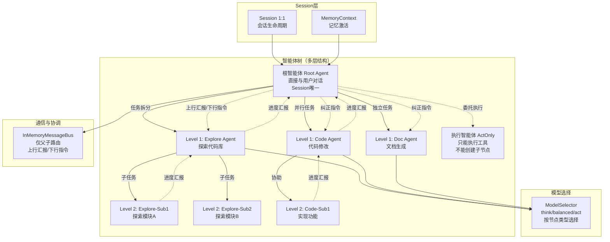
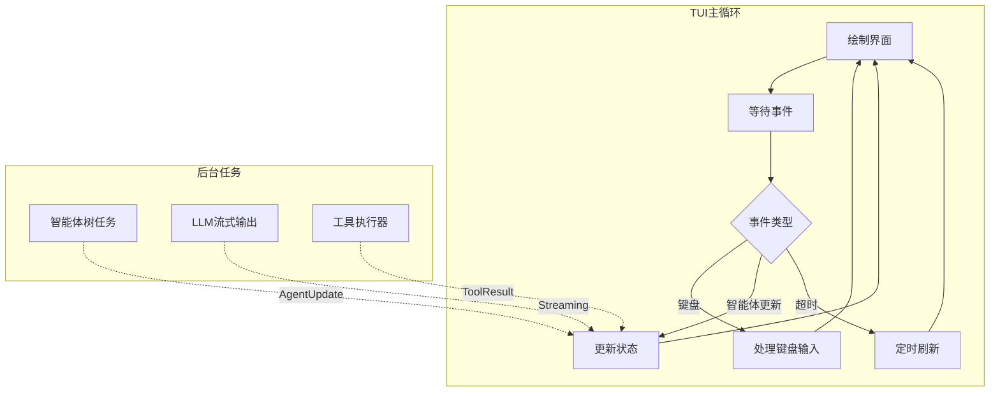
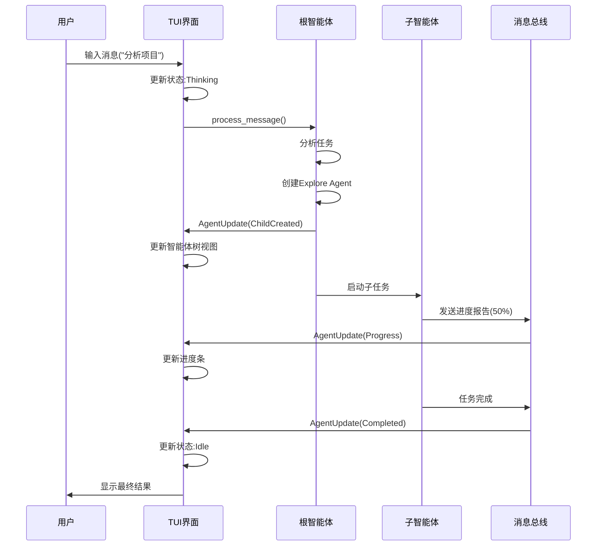
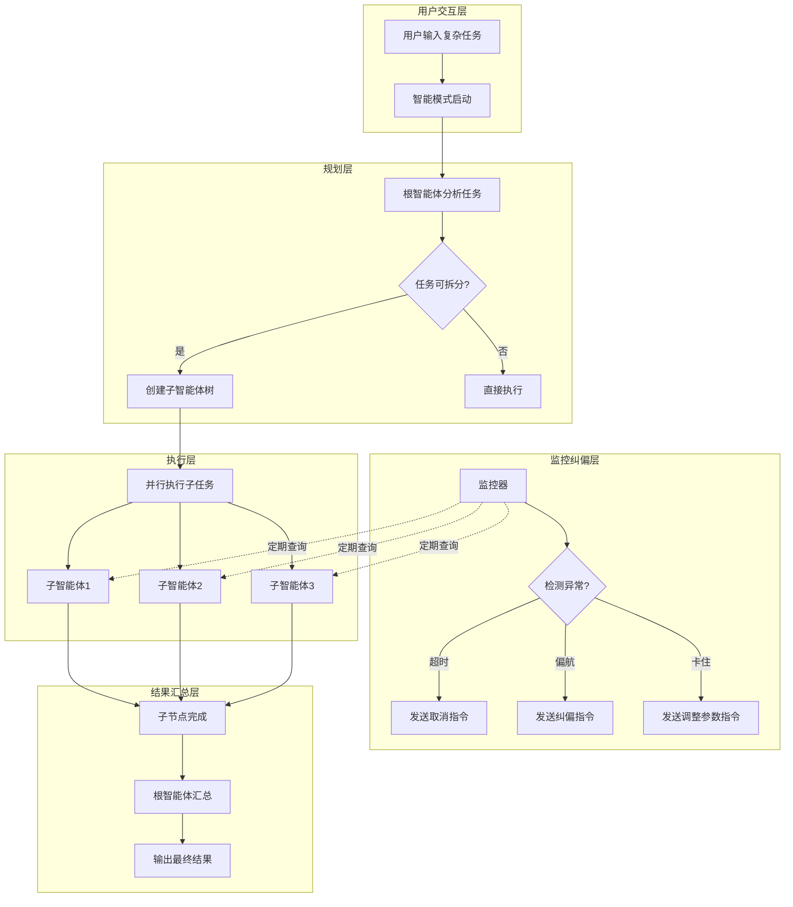

# Neco 技术设计文档

## 文档信息

- **项目名称**: Neco
- **文档版本**: 0.1.0
- **最后更新**: 2026-02-27
- **作者**: MiyakoMeow

---

## 架构核心：内生联系总览

Neco的技术架构围绕**多层智能体树形结构**展开，各模块通过以下核心设计相互关联：

### 一、树形架构作为核心组织形式



**内生关系**：
- **Session ↔ AgentTree**：一对一绑定，Session生命周期 = 智能体树生命周期
- **AgentTree ↔ AgentNode**：树形管理，根智能体（Root）直接与用户对话，递归创建子节点
- **AgentNode.nodeType ↔ ModelGroup**：不同类型智能体使用不同模型（think/balanced/act）
- **CoordinationBus ↔ 父子通信**：基于InMemoryMessageBus，仅支持父子路由（上行汇报/下行指令）
- **多层结构优势**：
  - **任务分解**：递归拆分，无限层级（vs 扁平结构的单层拆分）
  - **责任划分**：明确的上下级关系（vs 所有智能体平等）
  - **进度追踪**：树形路径，精确定位（vs 全局状态难以定位）
  - **并行控制**：细粒度并行（子树级）（vs 粗粒度并行）
  - **异常处理**：局部重试（子树）（vs 全局重试）

### 二、两层记忆系统的设计约束


**内生关系**：
- **纯LLM架构 → 两层记忆**：无Embeddings模型，必须通过标题/摘要快速筛选
- **workspace分类 ↔ 智能体树**：特定目录会话只加载相关记忆，减少上下文污染
- **MemoryLibrary → SessionContext**：Session启动时激活记忆，形成MemoryContext

### 三、Trait驱动的模块化架构（借鉴ZeroClaw）


**内生关系**：
- **Trait抽象 → 多提供商支持**：统一的LLMClient trait支持OpenAI/Anthropic/等
- **Transport抽象 → 多传输协议**：MCP支持stdio/http/sse传输层
- **Memory抽象 → 多后端存储**：Session和记忆可存储于文件系统或Jujutsu

### 四、并发模型贯穿全栈


**内生关系**：
- **智能体树并发 → Arc<RwLock>**：多层级智能体并发访问树结构，需要读写锁
- **模型轮询 → AtomicUsize**：无锁轮询支持高并发，避免Mutex竞争
- **父子通信 → 单向通道**：上行汇报和下行指令，无循环依赖风险

### 五、懒加载与按需启动策略


**内生关系**：
- **MCP懒加载 ↔ 工具执行**：只有智能体调用工具时才启动MCP服务器
- **Skills懒加载 ↔ 记忆激活**：按上下文关键词激活Skills（Compact模式），避免全量加载
- **子智能体生命周期 ↔ 任务分解**：根智能体根据任务复杂度动态创建子节点

### 六、设计决策总览

#### 核心架构决策

| 决策 | 直接影响 | 间接影响 | 权衡 |
|------|----------|----------|------|
| **采用树形智能体结构** | 需要AgentTree管理器；消息总线支持父子路由；Session持久化需要序列化树 | ✅ 更清晰的责任划分<br/>✅ 更细粒度的并行控制<br/>✅ 更精准的异常处理 | ❌ 更复杂的实现（树管理算法）<br/>❌ 更高的通信开销（层级传递） |
| **使用纯LLM架构** | 无Embeddings模型；两层记忆结构；关键词检索匹配；LLM重新排序 | ✅ 更简单的部署和维护<br/>✅ 更低的运营成本<br/>✅ 统一的API接口 | ❌ 语义搜索准确性可能较低<br/>❌ 某些功能性能较差 |
| **两层记忆架构** | 减少内存占用；提升检索速度；摘要和内容分离存储 | ✅ 平衡内存与性能<br/>✅ 灵活的存储方式 | ❌ 需要管理两层数据 |
| **Trait驱动模块化** | 统一抽象接口；支持多提供商、多传输协议、多后端存储 | ✅ 易测试和扩展<br/>✅ 提供商无关抽象 | 增加抽象层复杂度 |
| **MCP懒加载策略** | 延迟启动服务器；工具执行触发连接；需要连接复用机制 | ✅ 减少启动时间<br/>✅ 按需消耗资源 | 首次调用延迟 |
| **Arc+RwLock并发模型** | 共享可变状态；智能体树并发访问；模型无锁轮询 | ✅ 高并发支持<br/>✅ 读多写少优化 | 需要仔细管理锁 |
| **Jujutsu版本控制** | Session持久化；Git Workspace兼容层；提交历史管理 | ✅ 不可变分支更适合Session<br/>✅ 更好的性能（大规模历史） | ❌ 学习曲线较陡 |

#### 关键设计亮点

**1. 树形智能体结构（核心创新）**
- **问题**：现有方案（Claude Code、OpenClaw）只提供扁平智能体池，无法有效管理复杂任务层级
- **解决方案**：多层智能体树形结构，每个Session形成动态智能体树
  - 根智能体（Root）：每个Session唯一，直接与用户对话，负责任务规划和结果汇总
  - 子智能体（Child）：可以创建下级，有限制的子节点数
  - 执行智能体（ActOnly）：只能执行工具，不能创建子节点（叶子节点）
- **通信模式**：仅支持父子通信（上行汇报/下行指令），确保清晰的指挥链
- **灵感来源**：现代公司分工制度（CEO → 部门经理 → 员工）

**2. 纯LLM架构**
- **决策理由**：
  1. 简化架构：减少依赖和复杂度
  2. 降低成本：不需要部署多个模型服务
  3. 统一接口：所有功能通过LLM API调用
  4. 足够实用：两层记忆+关键词匹配满足大部分需求
- **不支持的功能**：Embeddings、Rerank、Apply模型
- **替代方案**：
  - 语义搜索 → 关键词匹配 + 记忆索引
  - Rerank → LLM重新排序（可选）
  - Apply → 直接生成

**3. Jujutsu vs Git**
- **选择Jujutsu的原因**：
  1. 不可变分支模型更适合Session版本管理
  2. 更好的性能（大规模Session历史）
  3. 自动解决多祖先合并冲突
  4. O(1)分支操作（vs Git的clone）
- **兼容性**：提供Git Workspace兼容层

---

## 目录

1. [项目概述](#项目概述)
2. [核心架构](#核心架构)
3. [数据结构设计](#数据结构设计)
4. [系统模块](#系统模块)
5. [数据流动](#数据流动)
6. [多智能体协作](#多智能体协作)
7. [记忆系统](#记忆系统)
8. [模型配置](#模型配置)
9. [接口层](#接口层)
10. [扩展系统](#扩展系统)
11. [可配置性](#可配置性)
12. [技术约束](#技术约束)

---

## 项目概述

### 核心目标

Neco 是一个**原生支持多智能体协作**的智能体应用，解决现有AI Agent在多智能体协作方面的不足：

- **双向通信**: 上下级智能体之间可以直接在会话中传递内容
- **实时纠偏**: 上级可随时要求下级汇报，第一时间发现并纠正异常
- **简洁记忆**: 两层记忆框架，避免内容膨胀
- **多模型配置**: 支持专用化模型配置和负载均衡

### 技术栈

- **语言**: Rust (Edition 2024)
- **异步运行时**: Tokio
- **LLM接口**: async-openai
- **工具协议**: MCP (rmcp)
- **技能系统**: AgentSkills兼容
- **终端UI**: ratatui
- **外部协议**: ACP (Agent Client Protocol)

---

## 核心架构

### 架构分层


### 核心原则

#### 1. 所有权与生命周期

遵循Rust所有权模型，确保内存安全：


#### 2. 并发模型

详见[Section 四、并发模型贯穿全栈](#四并发模型贯穿全栈)。

#### 3. 错误处理

- **预期错误**: 使用 `Result<T, E>` 返回
- **领域错误**: 使用 `thiserror` 定义结构化错误
- **应用错误**: 使用 `anyhow` 提供上下文

---

## 数据结构设计

### 1. Session管理

#### SessionContext

会话上下文是整个智能体交互的核心数据结构：

```rust
/// 会话上下文
///
/// # 生命周期
/// - 创建于用户首次交互
/// - 存储在 `~/.local/neco/{session_id}/` 目录
/// - 使用Jujutsu进行版本管理
///
/// # 树形智能体架构
/// 每个Session包含一个AgentTree，管理所有子智能体
/// 根智能体（Root Agent）直接与用户对话，可递归创建子节点
pub struct SessionContext {
    /// 唯一会话ID（基于UUID v7，具有时间排序特性）
    pub id: SessionId,

    /// 会话元数据
    pub metadata: SessionMetadata,

    /// 对话历史
    pub history: Vec<ConversationMessage>,

    /// 智能体树（管理所有子智能体）
    ///
    /// # 树形结构
    /// - 根智能体（Root Agent）：每个Session唯一，直接与用户对话
    /// - 子智能体（Child Agent）：由根或其他子智能体创建
    /// - 执行智能体（ActOnly）：只能执行工具，不能创建子节点
    pub agent_tree: Arc<AgentTree>,

    /// 共享状态（用于跨智能体通信）
    pub shared_state: Arc<RwLock<SharedState>>,

    /// 配置快照
    pub config: Arc<Config>,
}

/// 会话ID（Newtype模式）
#[derive(Debug, Clone, PartialEq, Eq, Hash)]
pub struct SessionId(Uuid);

impl SessionId {
    /// 生成新的会话ID（使用UUID v7）
    pub fn new() -> Self {
        Self(Uuid::new_v7())  // 时间排序特性
    }
}
```

**设计决策**:
- **Newtype模式**: `SessionId` 提供类型安全，防止与其他UUID混淆
- **Arc + RwLock**: 支持多线程共享访问，读多写少场景优化
- **UUID v7**: 时间有序，便于排序和调试

#### SessionMetadata

```rust
/// 会话元数据
#[derive(Debug, Clone, Serialize, Deserialize)]
pub struct SessionMetadata {
    /// 创建时间
    pub created_at: DateTime<Utc>,

    /// 最后更新时间
    pub updated_at: DateTime<Utc>,

    /// 会话标题（自动生成或用户指定）
    pub title: Option<String>,

    /// 工作目录
    pub workspace: PathBuf,

    /// 当前模式（Plan/Execute/等）
    pub mode: SessionMode,

    /// 用户偏好设置
    pub preferences: UserPreferences,
}
```

### 2. 消息系统

#### ConversationMessage

```rust
/// 对话消息
///
/// # 设计原则
/// - 使用 `Arc` 避免大对象复制
/// - 区分用户消息和工具调用结果
#[derive(Debug, Clone, Serialize, Deserialize)]
pub enum ConversationMessage {
    /// 用户消息
    User(UserMessage),

    /// 助手消息（可能包含工具调用）
    Assistant(AssistantMessage),

    /// 工具执行结果
    Tool(ToolResult),

    /// 系统提示（通常在历史开头）
    System(SystemMessage),
}

/// 用户消息
#[derive(Debug, Clone, Serialize, Deserialize)]
pub struct UserMessage {
    pub content: ContentBlock,
    pub timestamp: DateTime<Utc>,
    pub attachments: Vec<Attachment>,  // 图片、文件等
}

/// 助手消息
#[derive(Debug, Clone, Serialize, Deserialize)]
pub struct AssistantMessage {
    pub content: Option<ContentBlock>,
    pub tool_calls: Vec<ToolCall>,
    pub reasoning: Option<String>,  // 思考过程
    pub timestamp: DateTime<Utc>,
}

/// 内容块（支持多媒体）
#[derive(Debug, Clone, Serialize, Deserialize)]
pub enum ContentBlock {
    Text(TextContent),
    Image(ImageContent),
    Audio(AudioContent),
}
```

#### ToolCall

```rust
/// 工具调用
///
/// # 生命周期
/// 1. Pending: 等待执行
/// 2. InProgress: 正在执行
/// 3. Completed: 成功完成
/// 4. Failed: 执行失败
#[derive(Debug, Clone, Serialize, Deserialize)]
pub struct ToolCall {
    /// 工具调用ID（用于关联结果）
    pub id: ToolCallId,

    /// 工具名称
    pub name: String,

    /// 参数（JSON）
    pub arguments: Value,

    /// 执行状态
    pub status: ToolCallStatus,

    /// 执行结果（完成后）
    pub result: Option<ToolResult>,
}

/// 工具调用ID（Newtype）
#[derive(Debug, Clone, PartialEq, Eq, Hash)]
pub struct ToolCallId(String);
```

### 3. 配置系统

#### ModelConfig

```rust
/// 模型配置（对应TOML中的model_groups）
#[derive(Debug, Clone, Serialize, Deserialize)]
pub struct ModelConfig {
    /// 模型组名称（think/balanced/act/image）
    pub name: String,

    /// 模型列表（支持负载均衡）
    pub models: Vec<ModelReference>,

    /// 当前模型索引（用于轮询）
    #[serde(skip)]
    pub current_index: Arc<AtomicUsize>,
}

/// 模型引用
#[derive(Debug, Clone, Serialize, Deserialize)]
pub struct ModelReference {
    /// 模型标识符（如 zhipuai/glm-4.7）
    pub model: String,

    /// 提供商名称
    pub provider: String,
}

/// 提供商配置
#[derive(Debug, Clone, Serialize, Deserialize)]
pub struct ProviderConfig {
    /// 提供商类型（openai/anthropic/等）
    pub r#type: ProviderType,

    /// 显示名称
    pub name: String,

    /// API基础URL
    pub base: String,

    /// API密钥环境变量名（支持多个）
    pub env_keys: Vec<String>,

    /// 重试配置
    pub retry: RetryConfig,
}
```

**设计决策**:
- **AtomicUsize**: 无锁轮询，支持并发访问
- **Vec<String>**: 多个API密钥，自动故障转移

### 4. 子智能体管理（树形结构）

**重要**：Neco采用**树形架构**管理子智能体，而非扁平注册表。详见[Section 6.1: 动态树形成过程](#1-动态树形成过程)。

---

## 系统模块

### 1. LLM接口层

#### LLMClient Trait（借鉴async-openai最佳实践）

```rust
/// LLM客户端trait
///
/// # 设计原则
/// - 提供商无关抽象（借鉴ZeroClaw的Provider trait）
/// - 支持流式和非流式调用
/// - 统一的错误处理和响应格式
/// - 支持原生工具调用和Prompt-Guided回退
#[async_trait]
pub trait LLMClient: Send + Sync {
    /// 获取提供商能力
    fn capabilities(&self) -> ProviderCapabilities;

    /// 聊天补全（非流式）
    async fn chat_completion(
        &self,
        request: ChatCompletionRequest,
    ) -> Result<ChatResponse, LLMError>;

    /// 聊天补全（流式）
    async fn chat_completion_stream(
        &self,
        request: ChatCompletionRequest,
    ) -> Pin<Box<dyn Stream<Item = Result<StreamChunk, LLMError>> + Send>>;

    /// 转换工具定义（提供商原生格式）
    fn convert_tools(&self, tools: &[ToolSpec]) -> ToolsPayload;
}

/// 提供商能力声明
#[derive(Debug, Clone, Default)]
pub struct ProviderCapabilities {
    /// 原生工具调用（非Prompt-Guided）
    pub native_tool_calling: bool,

    /// 视觉能力（图像输入）
    pub vision: bool,

    /// 推理模型支持（reasoning_content）
    pub reasoning: bool,

    /// 流式响应支持
    pub streaming: bool,
}

/// 聊天响应（统一格式）
#[derive(Debug, Clone)]
pub struct ChatResponse {
    /// 文本内容
    pub text: Option<String>,

    /// 推理内容（reasoning models）
    pub reasoning: Option<String>,

    /// 工具调用
    pub tool_calls: Vec<ToolCall>,

    /// Token使用统计
    pub usage: Option<TokenUsage>,
}

/// 流式分块
#[derive(Debug, Clone)]
pub struct StreamChunk {
    /// 增量文本
    pub delta: String,

    /// 是否为最终分块
    pub is_final: bool,

    /// Token计数
    pub token_count: usize,
}
```

#### OpenAIAdapter（async-openai实现）

```rust
/// OpenAI兼容接口适配器
///
/// 使用 async-openai crate 实现
/// 支持的提供商：OpenAI、ZhipuAI、MiniMax等兼容OpenAI Chat API的服务
pub struct OpenAIAdapter {
    /// async-openai客户端
    client: async_openai::Client<async_openai::config::OpenAIConfig>,

    /// 模型配置
    model_config: Arc<ModelConfig>,

    /// 重试策略
    retry: RetryStrategy,
}

impl OpenAIAdapter {
    /// 创建新适配器
    pub fn new(config: &ProviderConfig, model_config: Arc<ModelConfig>)
        -> Result<Self, ConfigError>
    {
        // 从环境变量读取API密钥（支持多个）
        let api_key = Self::find_api_key(&config.env_keys)?;

        // 构建OpenAI配置
        let openai_config = async_openai::config::OpenAIConfig::default()
            .with_api_key(api_key)
            .with_api_base(&config.base)
            .with_org_id(config.org_id.as_deref().unwrap_or(""));

        // 配置HTTP客户端（超时、代理）
        let http_client = reqwest::Client::builder()
            .timeout(Duration::from_secs(120))
            .connect_timeout(Duration::from_secs(10))
            .build()
            .map_err(ConfigError::HttpClientBuild)?;

        let client = async_openai::Client::with_config(
            async_openai::config::ClientConfig::new(api_key, config.base.parse()?)
                .with_http_client(http_client)
        );

        Ok(Self {
            client,
            model_config,
            retry: RetryStrategy::from_config(&config.retry),
        })
    }

    /// 查找可用的API密钥（循环故障转移）
    fn find_api_key(env_keys: &[String]) -> Result<String, ConfigError> {
        for key in env_keys {
            if let Ok(value) = std::env::var(key) {
                if !value.is_empty() {
                    return Ok(value);
                }
            }
        }
        Err(ConfigError::NoApiKey)
    }
}

#[async_trait]
impl LLMClient for OpenAIAdapter {
    fn capabilities(&self) -> ProviderCapabilities {
        ProviderCapabilities {
            native_tool_calling: true,
            vision: true,
            reasoning: self.model_config.models.iter()
                .any(|m| m.model.contains("glm-4.7") || m.model.contains("deepseek")),
            streaming: true,
        }
    }

    async fn chat_completion(
        &self,
        request: ChatCompletionRequest,
    ) -> Result<ChatResponse, LLMError> {
        // 选择模型（带故障转移）
        let model_ref = self.select_model_with_fallback().await?;

        // 转换为async-openai格式
        let openai_req = self.to_openai_request(&request, &model_ref.model)?;

        // 执行请求（带重试）
        let response = self.retry.execute(|| async {
            self.client.chat().create(openai_req.clone()).await
                .map_err(LLMError::from)
        }).await?;

        // 转换响应（支持reasoning_content）
        Ok(self.from_openai_response(response))
    }

    async fn chat_completion_stream(
        &self,
        request: ChatCompletionRequest,
    ) -> Pin<Box<dyn Stream<Item = Result<StreamChunk, LLMError>> + Send>> {
        // 选择模型
        let model_ref = match self.select_model_with_fallback().await {
            Ok(m) => m,
            Err(e) => return Box::pin(stream::once(Err(e))),
        };

        let openai_req = match self.to_openai_request(&request, &model_ref.model) {
            Ok(req) => req,
            Err(e) => return Box::pin(stream::once(Err(e))),
        };

        // 创建流
        let stream = match self.client.chat().create_stream(openai_req).await {
            Ok(s) => s,
            Err(e) => return Box::pin(stream::once(Err(e.into()))),
        };

        // 转换流
        Box::pin(async_stream::stream! {
            while let Some(chunk_result) = stream.next().await {
                match chunk_result {
                    Ok(chunk) => yield Ok(self.from_openai_chunk(chunk)),
                    Err(e) => yield Err(LLMError::from(e)),
                }
            }
        })
    }

    fn convert_tools(&self, tools: &[ToolSpec]) -> ToolsPayload {
        // 转换为OpenAI原生格式
        let openai_tools: Vec<serde_json::Value> = tools.iter()
            .map(|t| serde_json::json!({
                "type": "function",
                "function": {
                    "name": t.name,
                    "description": t.description,
                    "parameters": t.parameters_schema
                }
            }))
            .collect();

        ToolsPayload::OpenAI { tools: openai_tools }
    }
}
```

#### 推理模型支持（reasoning_content）

```rust
/// 响应消息（支持推理模型）
#[derive(Debug, Deserialize)]
pub struct ResponseMessage {
    /// 主要内容
    #[serde(default)]
    pub content: Option<String>,

    /// 推理/思考内容（DeepSeek-R1, Kimi, GLM-4.7）
    #[serde(default)]
    pub reasoning_content: Option<String>,
}

impl ResponseMessage {
    /// 获取有效内容
    fn effective_content(&self) -> String {
        match &self.content {
            Some(c) if !c.is_empty() => c.clone(),
            _ => self.reasoning_content.clone().unwrap_or_default(),
        }
    }
}

/// 转换响应（支持reasoning_content）
impl OpenAIAdapter {
    fn from_openai_response(&self, response: ChatCompletionResponse)
        -> ChatResponse
    {
        let message = &response.choices[0].message;

        ChatResponse {
            text: message.content.clone(),
            reasoning: message.reasoning_content.clone(),
            tool_calls: message.tool_calls.as_ref()
                .map(|t| t.iter().map(|tc| self.from_openai_tool_call(tc)).collect())
                .unwrap_or_default(),
            usage: response.usage.map(|u| TokenUsage {
                prompt_tokens: u.prompt_tokens,
                completion_tokens: u.completion_tokens,
                total_tokens: u.total_tokens,
            }),
        }
    }
}
```

#### 工具调用处理（Native + Prompt-Guided）

```rust
/// 工具负载类型（支持多种提供商格式）
#[derive(Debug, Clone)]
pub enum ToolsPayload {
    /// OpenAI原生格式
    OpenAI { tools: Vec<serde_json::Value> },

    /// Anthropic格式
    Anthropic { tools: Vec<serde_json::Value> },

    /// Gemini格式
    Gemini { function_declarations: Vec<serde_json::Value> },

    /// Prompt-Guided回退（非原生支持）
    PromptGuided { instructions: String },
}

/// 工具调用循环（参考ZeroClaw）
pub async fn tool_call_loop(
    client: &dyn LLMClient,
    initial_messages: Vec<ConversationMessage>,
    tools: &[ToolSpec],
    max_iterations: usize,
) -> Result<String, LLMError> {
    let mut messages = initial_messages;
    let mut last_text = String::new();

    for _iteration in 0..max_iterations {
        // 1. 调用LLM
        let request = ChatCompletionRequest {
            messages: messages.clone(),
            tools: Some(client.convert_tools(tools)),
            tool_choice: Some("auto".to_string()),
            ..Default::default()
        };

        let response = client.chat_completion(request).await?;

        // 2. 检查是否有工具调用
        if response.tool_calls.is_empty() {
            return Ok(response.text.unwrap_or_default());
        }

        // 3. 并行执行工具
        let results = execute_tools_parallel(response.tool_calls).await?;

        // 4. 将结果添加到历史
        for result in results {
            messages.push(ConversationMessage::Tool(result));
        }

        last_text = response.text.unwrap_or_default();
    }

    Ok(last_text)
}
```

### 2. 工具执行层

#### ToolExecutor

```rust
/// 工具执行器
///
/// # 职责
/// - 工具查找和调用
/// - 并行/串行执行
/// - 结果收集和错误处理
pub struct ToolExecutor {
    /// MCP客户端注册表
    mcp_clients: Arc<RwLock<HashMap<String, DynMcpClient>>>,

    /// 内置工具
    builtin_tools: HashMap<String, Box<dyn BuiltinTool>>,

    /// 执行配置
    config: ToolConfig,
}

impl ToolExecutor {
    /// 并行执行工具调用
    pub async fn execute_parallel(
        &self,
        calls: Vec<ToolCall>,
    ) -> Vec<ToolResult> {
        use futures::future::join_all;

        let futures: Vec<_> = calls.into_iter()
            .map(|call| self.execute_single(call))
            .collect();

        join_all(futures).await
    }

    /// 执行单个工具调用
    async fn execute_single(&self, call: ToolCall) -> ToolResult {
        // 查找工具
        let tool = self.find_tool(&call.name)
            .unwrap_or_else(|| ToolResult::error(format!("Tool not found: {}", call.name)));

        match tool {
            Tool::Mcp(client, tool_name) => {
                // MCP工具调用
                client.call_tool(&tool_name, call.arguments).await
            }
            Tool::Builtin(builtin) => {
                // 内置工具调用
                builtin.execute(call.arguments).await
            }
        }
    }
}
```

### 3. Session管理层

#### SessionManager

```rust
/// Session管理器
///
/// # 职责
/// - Session创建和加载
/// - 持久化（Jujutsu集成）
/// - 清理和回收
pub struct SessionManager {
    /// Session存储目录
    sessions_dir: PathBuf,

    /// 活跃Session缓存
    active_sessions: Arc<RwLock<HashMap<SessionId, SessionContext>>>,
}

impl SessionManager {
    /// 创建新Session
    pub async fn create_session(
        &self,
        workspace: PathBuf,
        config: Arc<Config>,
    ) -> Result<SessionContext, SessionError> {
        // 生成Session ID
        let session_id = SessionId::new();

        // 创建Session目录
        let session_dir = self.sessions_dir.join(session_id.to_string());
        fs::create_dir_all(&session_dir)
            .await
            .map_err(SessionError::IoError)?;

        // 初始化Git仓库（Jujutsu）
        self.init_jujutsu_repo(&session_dir).await?;

        // 创建根智能体会话
        let root_session = AgentSession {
            id: AgentId::new(),
            task: "根智能体：管理整个会话".to_string(),
            status: AgentStatus::Running,
            started_at: Utc::now(),
            completed_at: None,
            result: None,
            handle: None,
        };

        // 创建智能体树（包含根智能体）
        let agent_tree = AgentTree::new(root_session).await;

        // 创建Session上下文
        let context = SessionContext {
            id: session_id.clone(),
            metadata: SessionMetadata {
                created_at: Utc::now(),
                updated_at: Utc::now(),
                title: None,
                workspace,
                mode: SessionMode::Execute,
                preferences: UserPreferences::default(),
            },
            history: Vec::new(),
            agent_tree: Arc::new(agent_tree),
            shared_state: Arc::new(RwLock::new(SharedState::new())),
            config,
        };

        // 保存初始状态
        self.save_session(&context).await?;

        // 缓存
        self.active_sessions.write()
            .map_err(|_| SessionError::LockPoisoned)?
            .insert(session_id.clone(), context.clone());

        Ok(context)
    }

    /// 保存Session（Jujutsu提交）
    async fn save_session(&self, context: &SessionContext)
        -> Result<(), SessionError>
    {
        let session_dir = self.sessions_dir.join(context.id.to_string());

        // 序列化上下文
        let content = serde_json::to_string_pretty(context)
            .map_err(SessionError::SerializationError)?;

        // 写入临时文件
        let temp_file = session_dir.join("session.json.tmp");
        fs::write(&temp_file, content)
            .await
            .map_err(SessionError::IoError)?;

        // 原子替换
        let target_file = session_dir.join("session.json");
        fs::rename(&temp_file, &target_file)
            .await
            .map_err(SessionError::IoError)?;

        // Jujutsu提交
        self.jujutsu_commit(&session_dir, "Update session").await?;

        Ok(())
    }
}
```

---

## 数据流动

### 1. 主循环流程


### 2. 工具调用流程


### 3. 子智能体交互流程


### 4. 记忆系统流程


---

## 多智能体协作

### 1. 动态树形成过程


#### 树的形成规则

1. **根智能体创建**：Session开始时自动创建
2. **任务拆分**：根智能体分析任务，决定是否拆分
3. **并行执行**：当子任务可以并行时，创建多个子节点
4. **递归拆分**：子智能体可以继续拆分任务，形成更深的层级
5. **动态调整**：根据实际情况添加或删除节点

#### 树的约束规则

```rust
/// 树的约束规则
impl AgentTree {
    /// 验证树的结构完整性
    pub async fn validate(&self) -> Result<(), TreeError> {
        let nodes = self.nodes.read().await;

        // 1. 检查是否有且仅有一个根节点
        let root_count = nodes.values()
            .filter(|n| n.node_type == AgentNodeType::Root)
            .count();
        if root_count != 1 {
            return Err(TreeError::InvalidRootCount(root_count));
        }

        // 2. 检查所有非根节点都有父节点
        for (id, node) in nodes.iter() {
            if node.node_type != AgentNodeType::Root {
                if node.parent_id.is_none() {
                    return Err(TreeError::OrphanNode(id.clone()));
                }
            }
        }

        // 3. 检查父-子关系的一致性
        for (id, node) in nodes.iter() {
            for child_id in &node.children {
                if let Some(child) = nodes.get(child_id) {
                    if child.parent_id.as_ref() != Some(id) {
                        return Err(TreeError::InconsistentParent(
                            child_id.clone(),
                            id.clone(),
                            child.parent_id.clone().unwrap_or_default()
                        ));
                    }
                } else {
                    return Err(TreeError::MissingChild(child_id.clone()));
                }
            }
        }

        // 4. 检查节点类型约束
        for node in nodes.values() {
            let constraints = self.type_constraints.get(&node.node_type)
                .ok_or_else(|| TreeError::UnknownNodeType(node.node_type.clone()))?;

            if !constraints.can_create_children && !node.children.is_empty() {
                return Err(TreeError::IllegalChildren(node.id.clone(), node.node_type.clone()));
            }

            if let Some(max) = constraints.max_children {
                if node.children.len() > max {
                    return Err(TreeError::TooManyChildren(node.id.clone()));
                }
            }

            for child_id in &node.children {
                if let Some(child) = nodes.get(child_id) {
                    if !constraints.allowed_child_types.contains(&child.node_type) {
                        return Err(TreeError::InvalidChildType(
                            node.id.clone(),
                            child.id.clone(),
                            child.node_type.clone()
                        ));
                    }
                }
            }
        }

        Ok(())
    }
}
```

### 2. 父子通信（借鉴ZeroClaw InMemoryMessageBus）

Neco采用严格的**父子通信模式**，智能体只能与其直接父节点或直接子节点通信。

#### 通信模式

```mermaid
graph TB
    subgraph "上行通信（汇报）"
        Child[子节点] -->|进度报告| Parent[父节点]
        Child -->|任务完成| Parent
        Child -->|错误报告| Parent
    end

    subgraph "下行通信（指令）"
        Parent -->|任务委派| Child
        Parent -->|暂停/取消| Child
        Parent -->|参数调整| Child
    end

    subgraph "不可达（跨层级）"
        Parent -.x.孙子节点
        兄弟节点 -.x.兄弟节点
    end
```

#### InMemoryMessageBus（简化版）

```rust
/// 内存消息总线（父子通信）
///
/// # 设计原则（借鉴ZeroClaw）
/// - 仅支持父子路由（上行汇报/下行指令）
/// - 每个Agent有独立的消息队列
/// - 支持关联追踪（correlation_id）
pub struct InMemoryMessageBus {
    /// 消息队列（agent_id -> receiver）
    queues: Arc<RwLock<HashMap<AgentId, mpsc::Sender<CoordinationEnvelope>>>>,

    /// 死信队列（无效消息）
    dead_letter: Arc<Mutex<Vec<CoordinationEnvelope>>>,
}

impl InMemoryMessageBus {
    /// 创建新总线
    pub fn new() -> Self {
        Self {
            queues: Arc::new(RwLock::new(HashMap::new())),
            dead_letter: Arc::new(Mutex::new(Vec::new())),
        }
    }

    /// 注册Agent队列
    pub async fn register(&self, agent_id: &AgentId)
        -> mpsc::Receiver<CoordinationEnvelope>
    {
        let (tx, rx) = mpsc::channel(100);
        self.queues.write().await.insert(agent_id.clone(), tx);
        rx
    }

    /// 发送消息（父子路由验证）
    pub async fn send(&self, envelope: CoordinationEnvelope)
        -> Result<(), ChannelError>
    {
        // TODO: 验证父子关系
        let queues = self.queues.read().await;

        if let Some(tx) = queues.get(&envelope.to) {
            tx.send(envelope).await
                .map_err(ChannelError::SendFailed)
        } else {
            // 目标Agent不存在，进入死信队列
            self.dead_letter.lock().await.push(envelope);
            Err(ChannelError::AgentNotFound)
        }
    }

    /// 广播消息（仅限下行：父节点 → 所有子节点）
    pub async fn broadcast_to_children(
        &self,
        from: &AgentId,
        message: CoordinationMessage,
        child_ids: &[AgentId],
    ) -> Result<(), ChannelError> {
        let queues = self.queues.read().await;

        for child_id in child_ids {
            if let Some(tx) = queues.get(child_id) {
                let envelope = CoordinationEnvelope {
                    id: MessageId::new(),
                    from: from.clone(),
                    to: child_id.clone(),
                    message: message.clone(),
                    timestamp: Utc::now(),
                };

                let _ = tx.send(envelope).await;
            }
        }

        Ok(())
    }
}
```

#### CoordinationEnvelope（增强版）

```rust
/// 协调信封（父子通信消息）
///
/// # 增强特性（借鉴ZeroClaw）
/// - correlation_id: 用于请求-响应关联
/// - causation_id: 用于因果追踪
#[derive(Debug, Clone)]
pub struct CoordinationEnvelope {
    /// 消息ID（唯一）
    pub id: MessageId,

    /// 会话ID
    pub session_id: SessionId,

    /// 发送者（子节点或父节点）
    pub from: AgentId,

    /// 接收者（必须为父子关系）
    pub to: AgentId,

    /// 关联ID（请求-响应匹配）
    pub correlation_id: Option<MessageId>,

    /// 因果ID（追踪消息链）
    pub causation_id: Option<MessageId>,

    /// 消息类型
    pub message: CoordinationMessage,

    /// 时间戳
    pub timestamp: DateTime<Utc>,
}

/// 协调消息类型（增强版）
#[derive(Debug, Clone)]
pub enum CoordinationMessage {
    /// 上行：进度报告
    Report {
        progress: f32,  // 0.0 - 1.0
        message: String,
    },

    /// 上行：任务完成
    Completed {
        result: ToolResult,
    },

    /// 上行：错误报告
    Error {
        error: String,
        details: Option<String>,
    },

    /// 下行：任务委派
    Command {
        command: Command,
    },

    /// 下行：查询状态
    Query {
        query: Query,
        /// correlation_id用于响应匹配
        correlation_id: MessageId,
    },

    /// 下行：查询响应
    QueryResponse {
        query: Query,
        result: serde_json::Value,
        correlation_id: MessageId,
    },
}

#[derive(Debug, Clone)]
pub enum Command {
    Pause,
    Resume,
    Cancel,
    UpdateParameters { params: serde_json::Value },
    RequestReport,  // 请求子节点汇报进度
}

#[derive(Debug, Clone)]
pub enum Query {
    Status,
    Progress,
    Result,
    Capabilities,
}
```

#### AgentNode中的通信集成

```rust
impl AgentNode {
    /// 发送进度报告给父节点（上行）
    pub async fn report_progress(
        &self,
        bus: &InMemoryMessageBus,
        progress: f32,
        message: String,
    ) -> Result<(), ChannelError> {
        if let Some(ref parent_id) = self.parent_id {
            let envelope = CoordinationEnvelope {
                id: MessageId::new(),
                session_id: self.session_id.clone(),
                from: self.id.clone(),
                to: parent_id.clone(),
                correlation_id: None,
                causation_id: Some(self.last_message_id),  // 因果追踪
                message: CoordinationMessage::Report { progress, message },
                timestamp: Utc::now(),
            };

            bus.send(envelope).await?;
        }
        Ok(())
    }

    /// 发送任务完成给父节点（上行）
    pub async fn report_completion(
        &self,
        bus: &InMemoryMessageBus,
        result: ToolResult,
    ) -> Result<(), ChannelError> {
        if let Some(ref parent_id) = self.parent_id {
            let envelope = CoordinationEnvelope {
                id: MessageId::new(),
                session_id: self.session_id.clone(),
                from: self.id.clone(),
                to: parent_id.clone(),
                correlation_id: None,
                causation_id: Some(self.last_message_id),
                message: CoordinationMessage::Completed { result },
                timestamp: Utc::now(),
            };

            bus.send(envelope).await?;
        }
        Ok(())
    }

    /// 发送指令给所有子节点（下行广播）
    pub async fn send_command_to_children(
        &self,
        bus: &InMemoryMessageBus,
        command: Command,
    ) -> Result<(), ChannelError> {
        bus.broadcast_to_children(
            &self.id,
            CoordinationMessage::Command { command },
            &self.children,
        ).await
    }

    /// 查询子节点状态（下行查询）
    pub async fn query_child(
        &self,
        bus: &InMemoryMessageBus,
        child_id: &AgentId,
        query: Query,
    ) -> Result<serde_json::Value, ChannelError> {
        let correlation_id = MessageId::new();

        // 发送查询
        let envelope = CoordinationEnvelope {
            id: MessageId::new(),
            session_id: self.session_id.clone(),
            from: self.id.clone(),
            to: child_id.clone(),
            correlation_id: Some(correlation_id.clone()),
            causation_id: Some(self.last_message_id),
            message: CoordinationMessage::Query {
                query,
                correlation_id: correlation_id.clone(),
            },
            timestamp: Utc::now(),
        };

        bus.send(envelope).await?;

        // 等待响应（超时保护）
        timeout(Duration::from_secs(5), async {
            let mut rx = self.message_rx.lock().await;
            loop {
                if let Some(envelope) = rx.recv().await {
                    if let CoordinationMessage::QueryResponse { correlation_id: resp_id, result, .. } = envelope.message {
                        if resp_id == correlation_id {
                            return Ok(result);
                        }
                    }
                }
            }
        }).await?
    }

    /// 处理消息循环
    pub async fn handle_messages(&self, bus: &InMemoryMessageBus) {
        let mut rx = self.message_rx.lock().await;

        while let Some(envelope) = rx.recv().await {
            match envelope.message {
                CoordinationMessage::Command { command } => {
                    self.handle_command(command).await;
                }
                CoordinationMessage::Query { query, correlation_id } => {
                    let result = self.handle_query(query).await;
                    let response = CoordinationEnvelope {
                        id: MessageId::new(),
                        session_id: self.session_id.clone(),
                        from: self.id.clone(),
                        to: envelope.from,
                        correlation_id: Some(correlation_id),
                        causation_id: Some(envelope.id),
                        message: CoordinationMessage::QueryResponse {
                            query,
                            result,
                            correlation_id,
                        },
                        timestamp: Utc::now(),
                    };
                    let _ = bus.send(response).await;
                }
                _ => {}
            }
        }
    }
}
```

#### 通信流程示例（增强版）

```mermaid
sequenceDiagram
    participant Root as 根智能体
    participant Child as 子智能体
    participant GrandChild as 孙智能体
    participant Bus as InMemoryMessageBus

    Note over Root,Bus: 任务委派（下行）
    Root->>Bus: send(Command(任务分解))
    Bus->>Child: deliver(Command)
    Child->>Bus: send(Command(执行任务))
    Bus->>GrandChild: deliver(Command)

    Note over Root,Bus: 进度汇报（上行）
    GrandChild->>Bus: send(Report(50%))
    Bus->>Child: deliver(Report)
    Child->>Bus: send(Report(25%))
    Bus->>Root: deliver(Report)

    Note over Root,Bus: 查询状态（下行查询+响应）
    Root->>Bus: send(Query(Status) + correlation_id)
    Bus->>Child: deliver(Query)
    Child->>Bus: send(QueryResponse(result, correlation_id))
    Bus->>Root: deliver(QueryResponse)

    Note over Root,Bus: 跨层级不可达
    Root-.x. GrandChild: 不能直接通信
```

### 3. 子智能体生命周期（状态机）

在树形架构中，每个AgentNode会经历以下状态转换：

```mermaid
stateDiagram-v2
    [*] --> Created: AgentTree.add_child()

    Created --> Running: 任务启动（tokio::spawn）

    Running --> Running: 进度更新（通过CoordinationEnvelope）

    Running --> Paused: 收到暂停请求（根智能体或父节点）
    Running --> Completed: 任务完成
    Running --> Failed: 执行失败

    Paused --> Running: 恢复执行
    Paused --> Failed: 超时或取消

    Completed --> [*]: AgentTree.remove()（自动回收子树）
    Failed --> [*]: AgentTree.remove()（保留错误信息）
```

**状态转换触发条件**：
- `Created → Running`：父节点调用`tokio::spawn`启动子节点任务
- `Running → Paused`：根智能体或父节点发送`CoordinationEnvelope::Command(Pause)`
- `Running → Completed`：子节点任务返回`Ok(ToolResult)`
- `Running → Failed`：子节点任务返回`Err(SubAgentError)`或超时
- `Completed/Failed → [*]`：父节点调用`AgentTree.remove()`回收子树

**与树形架构的关系**：
- 每个AgentNode包含一个`AgentSession`，管理其状态
- 父节点负责监控子节点状态，决定是否暂停或取消
- 子节点完成后，父节点决定是否保留或删除子树
- 根智能体协调整棵树的状态，确保整体任务完成

---

## 记忆系统

### 1. 两层记忆架构


### 2. 记忆存储结构

```rust
/// 记忆库
pub struct MemoryLibrary {
    /// 存储目录
    library_dir: PathBuf,

    /// 索引（内存）
    index: Arc<RwLock<MemoryIndex>>,

    /// 全局记忆（用户偏好）
    global: Arc<RwLock<Vec<MemoryEntry>>>,

    /// 目录记忆（按路径）
    by_directory: Arc<RwLock<HashMap<PathBuf, Vec<MemoryEntry>>>>,
}

/// 记忆索引
struct MemoryIndex {
    /// 标题 -> 记忆ID
    by_title: HashMap<String, MemoryId>,

    /// 类别 -> 记忆ID列表
    by_category: HashMap<MemoryCategory, Vec<MemoryId>>,

    /// 时间范围 -> 记忆ID
    by_time: BTreeMap<DateTime<Utc>, Vec<MemoryId>>,
}

impl MemoryLibrary {
    /// 存储记忆
    pub async fn store(&self, entry: MemoryEntry) -> Result<(), MemoryError> {
        // 1. 生成唯一ID
        let id = MemoryId::new();

        // 2. 确定存储路径
        let path = self.get_storage_path(&entry);

        // 3. 写入文件
        let content = serde_json::to_string_pretty(&entry)?;
        fs::write(&path, content).await?;

        // 4. 更新索引
        let mut index = self.index.write().await;
        index.by_title.insert(entry.title.clone(), id.clone());
        index.by_category
            .entry(entry.category.clone())
            .or_insert_with(Vec::new)
            .push(id.clone());

        // 5. 按类别分类
        match entry.category {
            MemoryCategory::Global => {
                self.global.write().await.push(entry);
            }
            MemoryCategory::Directory { ref path } => {
                self.by_directory.write().await
                    .entry(path.clone())
                    .or_insert_with(Vec::new)
                    .push(entry);
            }
            _ => {}
        }

        Ok(())
    }

    /// 检索记忆
    pub async fn recall(&self, query: &str, limit: usize)
        -> Vec<MemoryEntry>
    {
        // 1. 搜索标题
        let mut results = Vec::new();

        // 2. 模糊匹配
        let index = self.index.read().await;
        for (title, id) in &index.by_title {
            if title.contains(query) || similarity_score(query, title) > 0.7 {
                // 加载完整内容
                if let Ok(entry) = self.load_by_id(id).await {
                    results.push(entry);
                }
            }
        }

        // 3. 按相关性排序
        results.sort_by(|a, b| {
            b.access_count.load(Ordering::Relaxed)
                .cmp(&a.access_count.load(Ordering::Relaxed))
        });

        results.truncate(limit);
        results
    }

    /// 获取特定目录记忆
    pub async fn recall_for_directory(
        &self,
        dir: &Path,
    ) -> Vec<MemoryEntry> {
        self.by_directory.read().await
            .get(dir)
            .map(|v| v.clone())
            .unwrap_or_default()
    }
}
```

### 3. 记忆激活策略

```rust
/// 记忆激活器
///
/// # 职责
/// - 决定何时激活记忆
/// - 选择相关记忆
/// - 注入到上下文
pub struct MemoryActivator {
    library: Arc<MemoryLibrary>,
    config: MemoryConfig,
}

impl MemoryActivator {
    /// 为新会话激活记忆
    pub async fn activate_for_session(
        &self,
        workspace: &Path,
        query: Option<&str>,
    ) -> Vec<MemoryEntry> {
        let mut memories = Vec::new();

        // 1. 全局用户偏好
        memories.extend(
            self.library.recall_for_directory(Path::new("")).await
        );

        // 2. 工作目录相关记忆
        memories.extend(
            self.library.recall_for_directory(workspace).await
        );

        // 3. 按查询检索
        if let Some(q) = query {
            memories.extend(
                self.library.recall(q, self.config.max_recall).await
            );
        }

        // 4. 去重
        memories.sort_by_key(|m| m.id.clone());
        memories.dedup_by_key(|m| m.id.clone());

        // 5. 限制数量
        memories.truncate(self.config.max_active);

        memories
    }
}
```

---

## 模型配置

### 1. 配置结构

```toml
# 模型组配置
[model_groups.think]
models = ["zhipuai/glm-4.7"]

[model_groups.balanced]
models = ["zhipuai/glm-4.7", "minimax-cn/MiniMax-M2.5"]

[model_groups.act]
models = ["zhipuai/glm-4.7-flashx"]

[model_groups.image]
models = ["zhipuai/glm-4.6v"]

# 提供商配置（内置）
[model_providers.zhipuai]
type = "openai"
name = "ZhipuAI"
base = "https://open.bigmodel.cn/api/paas/v4"
env_key = "ZHIPU_API_KEY"

[model_providers.zhipuai-coding-plan]
type = "openai"
name = "ZhipuAI Coding Plan"
base = "https://open.bigmodel.cn/api/coding/paas/v4"
env_key = "ZHIPU_API_KEY"

[model_providers.minimax-cn]
type = "openai"
name = "MiniMax (CN)"
base = "https://api.minimaxi.com/v1"
env_keys = ["MINIMAX_API_KEY", "MINIMAX_API_KEY_2"]
```

### 2. 模型选择器

```rust
/// 模型选择器
///
/// # 职责
/// - 根据任务类型选择模型组
/// - 负载均衡和故障转移
pub struct ModelSelector {
    groups: HashMap<String, ModelConfig>,
    providers: HashMap<String, ProviderConfig>,
}

impl ModelSelector {
    /// 选择模型（带故障转移）
    pub async fn select(&self, group: &str)
        -> Result<(String, ProviderConfig), ModelError>
    {
        // 1. 获取模型组
        let group_config = self.groups.get(group)
            .ok_or_else(|| ModelError::UnknownGroup(group.to_string()))?;

        // 2. 轮询选择
        let index = group_config.current_index.fetch_add(1, Ordering::Relaxed)
            % group_config.models.len();

        // 3. 尝试每个模型
        for i in 0..group_config.models.len() {
            let idx = (index + i) % group_config.models.len();
            let model_ref = &group_config.models[idx];

            // 4. 获取提供商配置
            let provider = self.providers.get(&model_ref.provider)
                .ok_or_else(|| ModelError::UnknownProvider(model_ref.provider.clone()))?;

            // 5. 检查API密钥可用性
            if Self::has_api_key(provider).await {
                return Ok((model_ref.model.clone(), provider.clone()));
            }
        }

        Err(ModelError::NoAvailableKey)
    }

    /// 检查API密钥可用性
    async fn has_api_key(provider: &ProviderConfig) -> bool {
        for key in &provider.env_keys {
            if let Ok(value) = std::env::var(key) {
                if !value.is_empty() {
                    return true;
                }
            }
        }
        false
    }
}
```

---

## 接口层

### 1. CLI接口

#### 直接执行模式（-m参数）

```rust
/// 直接执行模式
pub struct DirectExecutionMode {
    /// Session管理器
    sessions: Arc<SessionManager>,

    /// 配置
    config: Arc<Config>,
}

impl DirectExecutionMode {
    /// 执行单次命令
    pub async fn execute(
        &self,
        message: String,
        session_id: Option<SessionId>,
    ) -> Result<DirectExecutionResult, CliError> {
        let context = if let Some(sid) = session_id {
            // 加载已有Session
            self.sessions.load_session(&sid).await?
        } else {
            // 创建新Session
            self.sessions.create_session(
                std::env::current_dir()?,
                self.config.clone(),
            ).await?
        };

        // 执行对话
        let response = self.process_message(&context, message).await?;

        // 保存Session
        self.sessions.save_session(&context).await?;

        // 返回结果和Session ID
        Ok(DirectExecutionResult {
            response,
            session_id: context.id.to_string(),
            session_hint: format!("--session {}", context.id),
        })
    }
}

/// 执行结果
pub struct DirectExecutionResult {
    /// 响应内容
    pub response: String,

    /// Session ID
    pub session_id: String,

    /// 继续对话的提示
    pub session_hint: String,
}
```

**输出示例**：

```
$ neco -m "帮我分析这个项目的架构"

[分析结果...]

---
使用以下命令继续对话：
neco -m "你的问题" --session 0192abcd-1234-5678-9abc-0123456789ab
```

#### REPL模式

```rust
/// REPL模式
pub struct ReplMode {
    /// Session
    session: SessionContext,

    /// 历史记录
    history: Vec<ReplHistoryEntry>,
}

impl ReplMode {
    /// 运行REPL循环
    pub async fn run(&mut self) -> Result<(), CliError> {
        let rl = DefaultEditor::new()?;

        loop {
            // 读取输入
            let input = rl.readline("neco> ")?;

            if input.eq_ignore_ascii_case("exit") || input.eq_ignore_ascii_case("quit") {
                break;
            }

            // 添加到历史
            self.history.push(ReplHistoryEntry {
                input: input.clone(),
                timestamp: Utc::now(),
            });

            // 执行
            let response = self.process_message(&self.session, input).await?;

            // 输出
            println!("{}", response);
        }

        Ok(())
    }
}
```

#### CLI流程


### 2. ACP协议实现

```rust
/// ACP Agent实现
pub struct NecoAcpAgent {
    /// Session管理器
    sessions: Arc<SessionManager>,

    /// 配置
    config: Arc<Config>,
}

#[async_trait]
impl Agent for NecoAcpAgent {
    async fn initialize(
        &self,
        _params: InitializeRequest,
    ) -> Result<InitializeResponse, AcpError> {
        Ok(InitializeResponse {
            protocol_version: PROTOCOL_VERSION,
            agent_capabilities: AgentCapabilities {
                load_session: true,
                mcp_capabilities: McpCapabilities {
                    tools: true,
                    resources: true,
                    prompts: true,
                },
                prompt_capabilities: PromptCapabilities {
                    audio: false,
                    embedded_context: true,
                    image: true,
                },
                session_capabilities: SessionCapabilities::default(),
            },
            auth_methods: vec![],
            agent_info: Some(Implementation {
                name: "Neco".to_string(),
                version: env!("CARGO_PKG_VERSION").to_string(),
            }),
        })
    }

    async fn new_session(
        &self,
        params: NewSessionRequest,
    ) -> Result<NewSessionResponse, AcpError> {
        // 创建Session
        let workspace = params.workspace
            .map(|p| p.into_std_path_buf())
            .unwrap_or_else(|| std::env::current_dir().unwrap());

        let context = self.sessions.create_session(
            workspace,
            self.config.clone(),
        ).await?;

        Ok(NewSessionResponse {
            session_id: context.id.to_string(),
        })
    }

    async fn prompt(
        &self,
        params: PromptRequest,
    ) -> Result<PromptResponse, AcpError> {
        // 加载Session
        let session_id = SessionId::from_str(&params.session_id)?;
        let mut context = self.sessions.load_session(&session_id).await?;

        // 处理消息
        for message in params.prompt {
            match message {
                PromptMessage::User { content, .. } => {
                    // 执行对话
                    let response = self.process_message(
                        &mut context,
                        content,
                    ).await?;

                    // 返回流式更新
                    self.send_update(&context, response).await;
                }
                _ => {}
            }
        }

        Ok(PromptResponse::default())
    }
}
```

### 3. ratatui界面设计(TUI模式)

#### 3.1 TUI架构设计

```rust
/// TUI界面
pub struct NecoTui {
    /// Session
    session: SessionContext,

    /// 终端后端
    terminal: Terminal<CrosstermBackend<io::Stdout>>,

    /// 应用状态(共享,支持异步更新)
    app_state: Arc<RwLock<TuiAppState>>,

    /// 事件通道(键盘事件)
    tx_events: mpsc::Sender<Event>,

    /// 智能体更新通道
    rx_agent_updates: mpsc::Receiver<AgentUpdate>,
}

/// TUI应用状态
#[derive(Debug, Clone)]
pub struct TuiAppState {
    /// 当前标签页
    pub current_tab: Tab,

    /// 输入模式
    pub input_mode: InputMode,

    /// 对话历史
    pub messages: Vec<UIMessage>,

    /// 用户输入缓冲区
    pub input_buffer: String,

    /// 光标位置
    pub cursor_position: usize,

    /// 模型运行状态
    pub model_status: ModelStatus,

    /// 智能体树视图(折叠状态)
    pub agent_tree_folding: HashMap<AgentId, bool>,
}

#[derive(Debug, Clone, PartialEq)]
pub enum Tab {
    Chat,      // 对话标签
    Explorer,  // 探索标签
    Agents,    // 智能体树标签
    Memory,    // 记忆标签
    Settings,  // 设置标签
}

#[derive(Debug, Clone, Copy, PartialEq)]
pub enum InputMode {
    Normal,    // 普通模式(浏览)
    Editing,   // 编辑模式(输入)
}

#[derive(Debug, Clone)]
pub enum ModelStatus {
    Idle,                          // 空闲
    Thinking,                      // 思考中
    Streaming(String),             // 流式输出
    ExecutingTools(Vec<String>),   // 执行工具
    Error(String),                 // 错误
}

/// UI消息
#[derive(Debug, Clone)]
pub enum UIMessage {
    User { content: String, timestamp: DateTime<Utc> },
    Assistant { content: String, reasoning: Option<String>, timestamp: DateTime<Utc> },
    ToolCall { name: String, args: Value, timestamp: DateTime<Utc> },
    ToolResult { output: String, timestamp: DateTime<Utc> },
    System { content: String, level: LogLevel },
}

#[derive(Debug, Clone)]
pub enum LogLevel {
    Info,
    Warning,
    Error,
}

/// 智能体更新(从后台任务推送)
#[derive(Debug, Clone)]
pub enum AgentUpdate {
    /// 进度更新
    Progress { agent_id: AgentId, progress: f32, message: String },
    /// 状态变更
    StatusChange { agent_id: AgentId, status: AgentStatus },
    /// 工具调用
    ToolCall { agent_id: AgentId, tool_name: String },
    /// 工具完成
    ToolComplete { agent_id: AgentId, result: String },
    /// 新子节点创建
    ChildCreated { parent_id: AgentId, child_id: AgentId },
    /// 节点完成
    Completed { agent_id: AgentId, result: String },
}
```

#### 3.2 异步事件循环架构



```rust
impl NecoTui {
    /// 运行TUI(异步事件循环)
    /// 
    /// # 实现方式
    /// - 使用 `tokio::select!` 实现多路事件源并发处理
    /// - tick_rate 控制刷新率(~30 FPS)
    /// - 支持键盘事件、智能体更新、定时刷新三种事件源
    /// 
    /// # 主要用途
    /// - 主循环: 绘制界面 → 等待事件 → 处理事件 → 检查退出
    /// - 异步非阻塞: 不等待LLM响应,保持界面响应性
    pub async fn run(&mut self) -> Result<(), TuiError> {
        todo!()
    }

    /// 处理键盘事件
    /// 
    /// # 实现方式
    /// - Normal模式: 浏览命令(q=退出, i=编辑, Tab=切换标签, 方向键=滚动)
    /// - Editing模式: 文本编辑(Enter=提交, Backspace=删除, Esc=取消)
    /// - 使用 `Arc<RwLock<TuiAppState>>` 保证并发安全
    /// 
    /// # 主要用途
    /// - 用户交互入口
    /// - 输入缓冲区管理
    /// - 模式切换(Normal ↔ Editing)
    async fn handle_key_event(&self, key: KeyEvent) -> Result<(), TuiError> {
        todo!()
    }

    /// 处理智能体更新
    /// 
    /// # 实现方式
    /// - 从 mpsc::Receiver 接收后台任务推送的更新
    /// - 根据更新类型更新UI状态
    /// - 使用 tracing 记录调试信息
    /// 
    /// # 主要用途
    /// - 实时显示智能体进度
    /// - 更新工具执行状态
    /// - 显示智能体树变化(子节点创建/完成)
    async fn handle_agent_update(&self, update: AgentUpdate) -> Result<(), TuiError> {
        todo!()
    }

    /// 提交消息(异步处理)
    /// 
    /// # 实现方式
    /// - 添加用户消息到历史
    /// - 更新状态为 Thinking
    /// - 使用 tokio::spawn 在后台处理(不阻塞UI)
    /// 
    /// # 主要用途
    /// - 将用户输入传递给根智能体
    /// - 保持UI响应性(LLM处理时不冻结界面)
    async fn submit_message(&self, input: String) -> Result<(), TuiError> {
        todo!()
    }
}
```

#### 3.3 布局设计(分层结构)

```rust
/// 绘制界面
/// 
/// # 实现方式
/// - 使用 `Layout` 垂直三分布局(标题/内容/状态栏)
/// - 根据 `current_tab` 渲染不同的标签页内容
/// - 使用 `blocking_read()` 避免在渲染时持有异步锁
/// 
/// # 主要用途
/// - 渲染用户界面
/// - 响应终端尺寸变化
/// - 实时显示智能体状态
fn draw(&mut self) -> Result<(), TuiError> {
    todo!()
}

/// 渲染Agents标签页(智能体树视图)
/// 
/// # 实现方式
/// - 左右分栏: 40%树形结构 + 60%详情面板
/// - 使用 `agent_tree_folding` 控制节点展开/折叠
/// - 根据智能体状态显示不同颜色/图标
/// 
/// # 主要用途
/// - 可视化智能体树结构
/// - 实时显示每个节点的状态和进度
/// - 支持选择节点查看详情
fn render_agents_tab(f: &mut Frame, area: Rect, state: &TuiAppState) {
    todo!()
}
```

#### 3.4 与智能体树的集成



### 4. 智能模式(Auto Mode - 后台运行)

#### 4.1 智能模式架构设计

智能模式是Neco的核心创新,通过树形智能体架构实现**自主任务规划、执行和纠偏**:



#### 4.2 智能模式数据结构

```rust
/// 智能模式配置
#[derive(Debug, Clone, Deserialize)]
pub struct AutoModeConfig {
    /// 是否启用自动规划
    pub auto_planning: bool,

    /// 是否启用主动监控
    pub active_monitoring: bool,

    /// 监控间隔(秒)
    pub monitoring_interval_secs: u64,

    /// 任务超时时间(秒)
    pub task_timeout_secs: u64,

    /// 最大重试次数
    pub max_retries: usize,

    /// 是否启用后台运行
    pub background_execution: bool,
}

impl Default for AutoModeConfig {
    fn default() -> Self {
        Self {
            auto_planning: true,
            active_monitoring: true,
            monitoring_interval_secs: 5,
            task_timeout_secs: 600,  // 10分钟
            max_retries: 3,
            background_execution: true,
        }
    }
}

/// 智能模式运行器
pub struct AutoModeRunner {
    /// Session上下文
    session: SessionContext,

    /// 配置
    config: AutoModeConfig,

    /// 监控任务句柄
    monitor_task: Option<JoinHandle<()>>,
}

/// 智能体任务监控器
pub struct AgentMonitor {
    /// 智能体树
    agent_tree: Arc<AgentTree>,

    /// 配置
    config: AutoModeConfig,

    /// 消息总线(用于发送指令)
    message_bus: Arc<InMemoryMessageBus>,
}

/// 监控事件
#[derive(Debug, Clone)]
pub enum MonitorEvent {
    /// 任务超时
    Timeout { agent_id: AgentId, duration_secs: u64 },

    /// 进度停滞(超过阈值时间无更新)
    Stuck { agent_id: AgentId, last_progress: DateTime<Utc> },

    /// 状态异常(错误率过高)
    Abnormal { agent_id: AgentId, error_rate: f32 },

    /// 任务完成
    Completed { agent_id: AgentId },
}
```

#### 4.3 自动任务规划流程

```mermaid
sequenceDiagram
    participant U as 用户
    participant R as 根智能体
    participant T as AgentTree
    participant C1 as 子智能体1
    participant C2 as 子智能体2
    participant M as 监控器

    U->>R: "分析整个项目并修复bug"

    R->>R: 分析任务复杂度
    R->>R: 判断: 可拆分为探索+修复

    R->>T: add_child(Explore Agent)
    T-->>R: explore_id

    R->>T: add_child(Code Agent)
    T-->>R: code_id

    par 启动子任务
        R->>C1: 启动探索
        R->>C2: 启动修复(等待探索结果)
    end

    M->>M: 启动监控循环
    loop 每5秒
        M->>C1: 查询状态(Query(Status))
        C1-->>M: 进度30%
        M->>C2: 查询状态
        C2-->>M: 等待中
    end

    C1->>R: 探索完成,报告问题
    R->>C2: 开始修复

    C2->>R: 修复完成
    R->>U: 汇总结果
```

```rust
impl AutoModeRunner {
    /// 运行智能模式
    /// 
    /// # 实现方式
    /// - 四步流程: 获取任务 → 分析规划 → 执行 → 返回结果
    /// - 使用根智能体(Think模型)进行任务分析
    /// - 支持同步和异步执行模式
    /// 
    /// # 主要用途
    /// - 智能模式的主入口
    /// - 协调整个自动化流程
    pub async fn run(&mut self) -> Result<AutoModeResult, AutoModeError> {
        todo!()
    }

    /// 分析任务并创建规划
    /// 
    /// # 实现方式
    /// - 调用根智能体分析任务复杂度
    /// - 请求LLM返回JSON格式的执行规划
    /// - 包含: should_split标志, subtasks列表, 依赖关系
    /// 
    /// # 主要用途
    /// - 判断任务是否需要拆分
    /// - 生成子任务列表和依赖图
    async fn analyze_and_plan(&self, task: &str)
        -> Result<ExecutionPlan, AutoModeError>
    {
        todo!()
    }

    /// 执行规划
    /// 
    /// # 实现方式
    /// - 如果不需要拆分: 直接执行
    /// - 如果需要拆分:
    ///   1. 根据规划创建子智能体树
    ///   2. 按依赖顺序启动子任务(tokio::spawn)
    ///   3. 启动监控器(如果启用)
    ///   4. 等待所有任务完成
    /// 
    /// # 主要用途
    /// - 管理智能体树的生命周期
    /// - 协调子任务的并行执行
    async fn execute_plan(&mut self, plan: ExecutionPlan)
        -> Result<AutoModeResult, AutoModeError>
    {
        todo!()
    }

    /// 启动子任务
    /// 
    /// # 实现方式
    /// - 查找对应子任务的AgentNode
    /// - 使用 tokio::spawn 在后台异步执行
    /// - 执行完成后更新节点状态(Completed/Failed)
    /// 
    /// # 主要用途
    /// - 并行执行多个子任务
    /// - 非阻塞启动,不等待结果
    async fn start_subtask(&self, subtask: &SubTask) -> Result<(), AutoModeError> {
        todo!()
    }
}
```

#### 4.4 主动监控和纠偏

```rust
impl AgentMonitor {
    /// 启动监控循环
    /// 
    /// # 实现方式
    /// - 使用 `tokio::time::interval` 定期触发检查
    /// - 遍历所有运行中的智能体
    /// - 对每个节点: 查询状态 → 分析异常 → 处理事件
    /// - 所有任务完成时退出循环
    /// 
    /// # 主要用途
    /// - 主动监控所有子节点状态
    /// - 定期检查(默认每5秒)
    pub async fn start(&self) -> Result<(), MonitorError> {
        todo!()
    }

    /// 检查智能体状态
    /// 
    /// # 实现方式
    /// - 通过 AgentTree 读取节点信息
    /// - 构建状态报告(status, task, started_at, last_progress)
    /// 
    /// # 主要用途
    /// - 获取智能体的当前状态
    /// - 为异常检测提供数据
    async fn check_agent_status(&self, agent_id: &AgentId)
        -> Result<AgentStatusReport, MonitorError>
    {
        todo!()
    }

    /// 分析状态,检测异常
    /// 
    /// # 实现方式
    /// - 三种异常检测:
    ///   1. **超时**: elapsed > task_timeout_secs
    ///   2. **停滞**: last_progress超过3倍监控间隔
    ///   3. **异常**: 错误率 > 50%
    /// - 返回对应的 MonitorEvent
    /// 
    /// # 主要用途
    /// - 自动检测任务执行中的问题
    /// - 提前发现卡住/超时/频繁错误
    async fn analyze_status(&self, agent_id: &AgentId, status: &AgentStatusReport)
        -> Option<MonitorEvent>
    {
        todo!()
    }

    /// 处理监控事件(主动纠偏)
    /// 
    /// # 实现方式
    /// - **超时**: 发送Cancel指令 → 通知根智能体失败
    /// - **停滞**: 发送Pause指令 → 父智能体诊断
    /// - **异常**: 发送UpdateParameters指令(增加重试/超时倍数)
    /// - **完成**: 记录日志
    /// 
    /// # 主要用途
    /// - 自动纠偏,无需用户干预
    /// - 通过父子通信发送指令
    async fn handle_monitoring_event(&self, event: MonitorEvent)
        -> Result<(), MonitorError>
    {
        todo!()
    }

    /// 发送指令给智能体
    /// 
    /// # 实现方式
    /// - 构建 CoordinationEnvelope
    /// - 通过 InMemoryMessageBus 发送
    /// - 支持下行指令(Command/Query)
    /// 
    /// # 主要用途
    /// - 监控器向智能体发送指令
    /// - 实现纠偏操作
    async fn send_command_to_agent(&self, agent_id: &AgentId, message: CoordinationMessage)
        -> Result<(), MonitorError>
    {
        todo!()
    }
}
```

#### 4.5 智能模式数据流

```mermaid
stateDiagram-v2
    [*] --> TaskAnalysis: 用户输入任务

    TaskAnalysis --> DirectExecution: 单一任务
    TaskAnalysis --> TreeCreation: 复杂任务

    TreeCreation --> ParallelExecution: 创建智能体树

    state ParallelExecution {
        [*] --> SubtaskRunning
        SubtaskRunning --> Monitoring: 启动监控器

        state Monitoring {
            [*] --> CheckStatus
            CheckStatus --> Normal: 无异常
            CheckStatus --> Timeout: 超时
            CheckStatus --> Stuck: 停滞
            CheckStatus --> Abnormal: 错误率高

            Normal --> [*]
            Timeout --> SendCancel
            Stuck --> SendPause
            Abnormal --> AdjustParams

            SendCancel --> [*]
            SendPause --> [*]
            AdjustParams --> [*]
        }

        Monitoring --> SubtaskRunning: 继续
        SubtaskRunning --> [*]: 任务完成
    }

    ParallelExecution --> ResultAggregation: 所有子任务完成

    ResultAggregation --> FinalOutput: 汇总结果
    FinalOutput --> [*]
```

#### 4.6 使用场景对比

| 特性 | 直接执行模式 | REPL模式 | TUI模式 | 智能模式 |
|------|-------------|----------|---------|----------|
| **交互方式** | 单次命令 | 循环交互 | 图形界面 | 后台自主 |
| **适用场景** | 快速查询 | 调试对话 | 可视化监控 | 复杂任务 |
| **智能体树** | 无/简单 | 按需创建 | 实时展示 | 自动创建+管理 |
| **进度反馈** | 无 | 实时输出 | 可视化 | 主动监控 |
| **纠偏能力** | 无 | 手动 | 手动干预 | 自动纠偏 |
| **并发执行** | 否 | 否 | 可视化 | 自动并行 |
| **用户干预** | 无 | 实时 | 按键/鼠标 | 异步通知 |

**智能模式优势总结**:

1. **自主规划**: 根智能体自动分析任务复杂度,决定是否拆分
2. **动态树构建**: 根据任务需求动态创建多层智能体树
3. **并行执行**: 无依赖的子任务自动并行,提升效率
4. **主动监控**: 监控器定期查询所有子节点状态
5. **自动纠偏**: 检测到超时/停滞/异常时自动发送指令
6. **细粒度控制**: 支持暂停/恢复/取消/参数调整
7. **责任清晰**: 树形结构明确每个节点的责任范围
8. **精确定位**: 通过agent_id精确定位问题节点

---

## 扩展系统

### 1. MCP集成（基于rmcp）

#### MCP传输抽象（借鉴ZeroClaw）

```rust
/// MCP传输trait（支持多种传输协议）
#[async_trait]
pub trait McpTransport: Send + Sync {
    /// 发送JSON-RPC请求并接收响应
    async fn send_and_recv(&mut self, request: &JsonRpcRequest)
        -> Result<JsonRpcResponse, McpError>;

    /// 关闭连接
    async fn close(&mut self) -> Result<(), McpError>;
}

/// Stdio传输（子进程通信）
pub struct StdioTransport {
    child: tokio::process::Child,
    stdin: ChildStdin,
    stdout: ChildStdout,
}

#[async_trait]
impl McpTransport for StdioTransport {
    async fn send_and_recv(&mut self, request: &JsonRpcRequest)
        -> Result<JsonRpcResponse, McpError>
    {
        // 发送请求到stdin
        let request_line = serde_json::to_string(request)?;
        writeln!(self.stdin, "{}", request_line).await?;

        // 从stdout读取响应
        let mut response_line = String::new();
        self.stdout.read_line(&mut response_line).await?;

        // 解析JSON-RPC响应
        Ok(serde_json::from_str(&response_line)?)
    }

    async fn close(&mut self) -> Result<(), McpError> {
        self.child.kill().await?;
        Ok(())
    }
}

/// HTTP传输
pub struct HttpTransport {
    client: reqwest::Client,
    base_url: String,
    headers: HashMap<String, String>,
}

#[async_trait]
impl McpTransport for HttpTransport {
    async fn send_and_recv(&mut self, request: &JsonRpcRequest)
        -> Result<JsonRpcResponse, McpError>
    {
        let response = self.client
            .post(&self.base_url)
            .headers(self.headers.iter()
                .map(|(k, v)| (HeaderName::from_bytes(k.as_bytes()).unwrap(),
                           HeaderValue::from_str(v).unwrap()))
                .collect())
            .json(request)
            .timeout(Duration::from_secs(30))
            .send()
            .await?;

        Ok(response.json().await?)
    }

    async fn close(&mut self) -> Result<(), McpError> {
        // HTTP无状态，无需关闭
        Ok(())
    }
}
```

#### MCP客户端（连接握手）

```rust
/// MCP客户端
pub struct McpClient {
    /// 传输层
    transport: Box<dyn McpTransport>,

    /// 服务器配置
    config: McpServerConfig,

    /// 原子请求ID生成器
    next_id: Arc<AtomicU64>,

    /// 工具缓存
    tools: Arc<RwLock<HashMap<String, McpToolDef>>>,
}

impl McpClient {
    /// 连接MCP服务器（初始化握手）
    pub async fn connect(config: McpServerConfig) -> Result<Self, McpError> {
        // 1. 创建传输层
        let mut transport = Self::create_transport(&config)?;

        // 2. 发送initialize请求
        let init_id = 0;
        let init_req = JsonRpcRequest::new(
            init_id,
            "initialize",
            json!({
                "protocolVersion": "2024-11-05",
                "capabilities": {},
                "clientInfo": {
                    "name": "neco",
                    "version": env!("CARGO_PKG_VERSION")
                }
            })
        );

        let init_response = transport.send_and_recv(&init_req).await?;
        // 验证初始化响应...

        // 3. 发送initialized通知
        let notif = JsonRpcRequest::notification(
            "notifications/initialized",
            json!(null)
        );
        transport.send_and_recv(&notif).await.ok(); // 通知无响应

        // 4. 获取工具列表
        let list_req = JsonRpcRequest::new(
            1,
            "tools/list",
            json!(null)
        );
        let tools_response = transport.send_and_recv(&list_req).await?;
        let tools_list: McpToolsListResult = serde_json::from_value(tools_response.result)?;

        // 5. 缓存工具定义
        let mut tools_map = HashMap::new();
        for tool in tools_list.tools {
            tools_map.insert(tool.name.clone(), tool);
        }

        Ok(Self {
            transport: Box::new(transport),
            config,
            next_id: Arc::new(AtomicU64::new(2)),
            tools: Arc::new(RwLock::new(tools_map)),
        })
    }

    /// 创建传输层（工厂模式）
    fn create_transport(config: &McpServerConfig) -> Result<Box<dyn McpTransport>, McpError> {
        match &config.transport {
            McpTransportType::Stdio { command } => {
                let args: Vec<&str> = command.split_whitespace().collect();
                let mut child = tokio::process::Command::new(args[0])
                    .args(&args[1..])
                    .stdin(Stdio::piped())
                    .stdout(Stdio::piped())
                    .spawn()?;

                let stdin = child.stdin.take().ok_or(McpError::NoStdin)?;
                let stdout = child.stdout.take().ok_or(McpError::NoStdout)?;

                Ok(Box::new(StdioTransport { child, stdin, stdout }))
            }
            McpTransportType::Http { url, headers } => {
                Ok(Box::new(HttpTransport {
                    client: reqwest::Client::new(),
                    base_url: url.clone(),
                    headers: headers.clone(),
                }))
            }
        }
    }

    /// 调用工具（命名空间隔离：server__tool）
    pub async fn call_tool(
        &self,
        tool_name: &str,
        arguments: serde_json::Value,
    ) -> Result<serde_json::Value, McpError> {
        let id = self.next_id.fetch_add(1, Ordering::Relaxed);

        let request = JsonRpcRequest::new(
            id,
            "tools/call",
            json!({
                "name": tool_name,
                "arguments": arguments
            })
        );

        let response = self.transport.send_and_recv(&request).await?;

        // 超时保护（可配置，默认180s）
        timeout(Duration::from_secs(self.config.tool_timeout_secs.unwrap_or(180)), async {
            Ok(response.result)
        }).await?
    }

    /// 列出所有工具
    pub async fn list_tools(&self) -> Vec<McpToolDef> {
        self.tools.read().await.values().cloned().collect()
    }
}
```

#### MCP注册表（懒加载管理）

```rust
/// MCP服务器注册表
pub struct McpRegistry {
    /// 服务器配置
    configs: Vec<McpServerConfig>,

    /// 活跃连接（懒加载）
    connections: Arc<RwLock<HashMap<String, Arc<McpClient>>>>,

    /// 工具索引（扁平化：server__tool）
    tool_index: Arc<RwLock<HashMap<String, ToolIndexEntry>>>,
}

/// 工具索引条目
struct ToolIndexEntry {
    server_name: String,
    original_name: String,
    description: Option<String>,
}

impl McpRegistry {
    /// 创建注册表（不立即连接）
    pub fn new(configs: Vec<McpServerConfig>) -> Self {
        Self {
            configs,
            connections: Arc::new(RwLock::new(HashMap::new())),
            tool_index: Arc::new(RwLock::new(HashMap::new())),
        }
    }

    /// 获取MCP客户端（懒加载）
    pub async fn get_client(&self, server_name: &str)
        -> Result<Arc<McpClient>, McpError>
    {
        // 1. 检查缓存
        {
            let conns = self.connections.read().await;
            if let Some(client) = conns.get(server_name) {
                return Ok(client.clone());
            }
        }

        // 2. 查找配置
        let config = self.configs.iter()
            .find(|c| c.name == server_name)
            .ok_or_else(|| McpError::ServerNotFound(server_name.to_string()))?;

        // 3. 检查是否启用
        if !config.enabled {
            return Err(McpError::ServerDisabled(server_name.to_string()));
        }

        // 4. 建立连接
        let client = McpClient::connect(config.clone()).await?;

        // 5. 缓存连接
        let client = Arc::new(client);
        let mut conns = self.connections.write().await;
        conns.insert(server_name.to_string(), client.clone());

        // 6. 更新工具索引
        self.update_tool_index(server_name, &client).await;

        Ok(client)
    }

    /// 更新工具索引
    async fn update_tool_index(&self, server_name: &str, client: &McpClient) {
        let tools = client.list_tools().await;
        let mut index = self.tool_index.write().await;

        for tool in tools {
            // 命名空间隔离：server__tool
            let prefixed = format!("{}__{}", server_name, tool.name);
            index.insert(prefixed, ToolIndexEntry {
                server_name: server_name.to_string(),
                original_name: tool.name.clone(),
                description: tool.description,
            });
        }
    }

    /// 列出所有可用工具（跨所有服务器）
    pub async fn list_all_tools(&self) -> Vec<(String, String)> {
        let mut all_tools = Vec::new();

        for config in &self.configs {
            if !config.enabled {
                continue;
            }

            match self.get_client(&config.name).await {
                Ok(client) => {
                    let tools = client.list_tools().await;
                    for tool in tools {
                        let prefixed = format!("{}__{}", config.name, tool.name);
                        all_tools.push((prefixed, tool.description.unwrap_or_default()));
                    }
                }
                Err(_) => continue, // 非致命：跳过失败的服务器
            }
        }

        all_tools
    }

    /// 路由工具调用（server__tool → client.call_tool）
    pub async fn call_tool(
        &self,
        prefixed_name: &str,
        arguments: serde_json::Value,
    ) -> Result<serde_json::Value, McpError> {
        // 1. 解析工具名
        let parts: Vec<&str> = prefixed_name.split("__").collect();
        if parts.len() != 2 {
            return Err(McpError::InvalidToolName(prefixed_name.to_string()));
        }

        let server_name = parts[0];
        let tool_name = parts[1];

        // 2. 获取客户端（懒加载）
        let client = self.get_client(server_name).await?;

        // 3. 调用工具
        client.call_tool(tool_name, arguments).await
    }
}
```

### 2. Skills系统（懒加载架构，借鉴ZeroClaw）

#### 两阶段加载策略

```rust
/// Skills提示注入模式
#[derive(Debug, Clone, Copy, PartialEq, Eq)]
pub enum SkillsPromptInjectionMode {
    /// 完整模式：将所有Skill内容注入系统提示
    Full,

    /// 紧凑模式：仅注入元数据，Agent按需读取
    Compact,
}

/// Skill元数据（紧凑模式）
#[derive(Debug, Clone, Serialize, Deserialize)]
pub struct SkillMetadata {
    /// Skill名称
    pub name: String,

    /// 简短描述
    pub description: String,

    /// 存储位置（Agent按需读取）
    pub location: PathBuf,

    /// 触发关键词
    pub triggers: Vec<String>,

    /// 允许的工具列表
    pub allowed_tools: Option<Vec<String>>,
}

/// Skill完整内容（Full模式）
#[derive(Debug, Clone)]
pub struct SkillContent {
    /// 元数据
    pub metadata: SkillMetadata,

    /// 完整内容
    pub content: String,
}
```

#### Skill管理器（懒加载）

```rust
/// Skill管理器
pub struct SkillManager {
    /// Skills目录
    skills_dir: PathBuf,

    /// 元数据索引（始终加载）
    metadata_index: Arc<RwLock<HashMap<String, SkillMetadata>>>,

    /// 完整内容缓存（按需加载）
    content_cache: Arc<RwLock<HashMap<String, Arc<SkillContent>>>>,

    /// 提示注入模式
    injection_mode: SkillsPromptInjectionMode,
}

impl SkillManager {
    /// 扫描Skills目录（仅加载元数据）
    pub async fn scan_skills(&self) -> Result<(), SkillError> {
        let mut index = self.metadata_index.write().await;

        // 递归扫描所有SKILL.md文件
        let mut entries = fs::read_dir(&self.skills_dir).await?;
        while let Some(entry) = entries.next_entry().await? {
            let path = entry.path();

            // 读取SKILL.md
            let skill_path = path.join("SKILL.md");
            if !skill_path.exists() {
                continue;
            }

            // 解析YAML frontmatter（仅元数据）
            let content = fs::read_to_string(&skill_path).await?;
            let metadata = Self::parse_metadata(&content, &skill_path)?;

            // 构建关键词索引
            for trigger in &metadata.triggers {
                // TODO: 构建倒排索引
            }

            index.insert(metadata.name.clone(), metadata);
        }

        Ok(())
    }

    /// 解析Skill元数据（仅YAML frontmatter）
    fn parse_metadata(content: &str, location: &Path)
        -> Result<SkillMetadata, SkillError>
    {
        // 提取YAML frontmatter
        let parts: Vec<&str> = content.splitn(3, "---").collect();
        if parts.len() < 3 {
            return Err(SkillError::InvalidFormat);
        }

        // 解析YAML
        let meta: SkillMetadataYaml = serde_yaml::from_str(parts[1])?;

        // 提取触发词
        let triggers = Self::extract_triggers(&meta.description);

        Ok(SkillMetadata {
            name: meta.name,
            description: meta.description,
            location: location.to_path_buf(),
            triggers,
            allowed_tools: meta.allowed_tools,
        })
    }

    /// 激活Skills（根据注入模式）
    pub async fn activate_skills(
        &self,
        context: &str,
    ) -> Vec<ActivatedSkill> {
        let index = self.metadata_index.read().await;
        let mut activated = Vec::new();

        // 匹配关键词
        for (name, metadata) in index.iter() {
            if metadata.triggers.iter().any(|t| context.contains(t)) {
                match self.injection_mode {
                    SkillsPromptInjectionMode::Full => {
                        // 完整模式：加载内容
                        if let Ok(content) = self.load_content(name).await {
                            activated.push(ActivatedSkill::Full(content));
                        }
                    }
                    SkillsPromptInjectionMode::Compact => {
                        // 紧凑模式：仅元数据
                        activated.push(ActivatedSkill::Compact(metadata.clone()));
                    }
                }
            }
        }

        activated
    }

    /// 加载Skill完整内容（懒加载）
    async fn load_content(&self, name: &str)
        -> Result<Arc<SkillContent>, SkillError>
    {
        // 1. 检查缓存
        {
            let cache = self.content_cache.read().await;
            if let Some(content) = cache.get(name) {
                return Ok(content.clone());
            }
        }

        // 2. 读取文件
        let metadata = {
            let index = self.metadata_index.read().await;
            index.get(name).cloned()
                .ok_or_else(|| SkillError::NotFound(name.to_string()))?
        };

        let content = fs::read_to_string(&metadata.location).await?;

        // 3. 解析完整内容
        let skill_content = SkillContent {
            metadata: metadata.clone(),
            content,
        };

        // 4. 缓存
        let skill_content = Arc::new(skill_content);
        let mut cache = self.content_cache.write().await;
        cache.insert(name.to_string(), skill_content.clone());

        Ok(skill_content)
    }
}

/// 激活的Skill
#[derive(Debug, Clone)]
pub enum ActivatedSkill {
    /// 完整内容（Full模式）
    Full(Arc<SkillContent>),

    /// 仅元数据（Compact模式）
    Compact(SkillMetadata),
}
```

#### 提示注入（Full vs Compact）

```rust
/// 将Skills注入到系统提示
impl SkillManager {
    /// 生成Skills提示（根据模式）
    pub async fn inject_into_prompt(
        &self,
        activated: Vec<ActivatedSkill>,
    ) -> String {
        match self.injection_mode {
            SkillsPromptInjectionMode::Full => {
                // Full模式：注入完整内容
                let mut prompt = String::from("<skills>\n");

                for skill in activated {
                    if let ActivatedSkill::Full(content) = skill {
                        prompt.push_str(&format!(
                            "  <skill name=\"{}\">\n{}\n  </skill>\n",
                            content.metadata.name,
                            content.content
                        ));
                    }
                }

                prompt.push_str("</skills>");
                prompt
            }

            SkillsPromptInjectionMode::Compact => {
                // Compact模式：仅注入元数据
                let mut prompt = String::from("<skills>\n");

                for skill in activated {
                    if let ActivatedSkill::Compact(metadata) = skill {
                        prompt.push_str(&format!(
                            "  <skill>\n\
                             <name>{}</name>\n\
                             <description>{}</description>\n\
                             <location>{}</location>\n\
                             </skill>\n",
                            metadata.name,
                            metadata.description,
                            metadata.location.display()
                        ));
                    }
                }

                prompt.push_str("\n\
                 INSTRUCTION: When you need to use a skill, read the SKILL.md file \
                 at the specified <location> to get the full content.\n\
                 Only read the file when actually needed for the task.");
                prompt.push_str("</skills>");
                prompt
            }
        }
    }
}
```

#### 安全审计（借鉴ZeroClaw）

```rust
/// Skill安全审计器
pub struct SkillAuditor {
    /// 是否允许脚本
    allow_scripts: bool,

    /// 最大文件大小（防止zip bomb）
    max_file_size: usize,
}

impl SkillAuditor {
    /// 审计Skill目录
    pub async fn audit_skill_directory(
        &self,
        skill_dir: &Path,
    ) -> Result<AuditReport, SkillError> {
        let mut report = AuditReport {
            skill_name: skill_dir.file_name().unwrap().to_string_lossy().to_string(),
            issues: Vec::new(),
            is_safe: true,
        };

        // 1. 检查文件大小
        for entry in fs::read_dir(skill_dir).await? {
            let entry = entry.await?;
            let metadata = entry.metadata().await?;

            if metadata.len() > self.max_file_size as u64 {
                report.issues.push(AuditIssue::FileTooLarge {
                    path: entry.path(),
                    size: metadata.len(),
                });
                report.is_safe = false;
            }
        }

        // 2. 检查路径遍历
        if skill_dir.components().any(|c| c.as_os_str() == "..") {
            report.issues.push(AuditIssue::PathTraversal);
            report.is_safe = false;
        }

        // 3. 检查原生二进制（仅允许WASM）
        for entry in fs::read_dir(skill_dir).await? {
            let entry = entry.await?;
            if entry.path().extension().and_then(|s| s.to_str()) == Some("exe")
                || entry.path().extension().and_then(|s| s.to_str()) == Some("bin")
            {
                report.issues.push(AuditIssue::NativeBinary {
                    path: entry.path(),
                });
                report.is_safe = false;
            }
        }

        // 4. 检查脚本（如果禁止）
        if !self.allow_scripts {
            for entry in fs::read_dir(skill_dir).await? {
                let entry = entry.await?;
                if let Some(ext) = entry.path().extension() {
                    match ext.to_str() {
                        Some("sh") | Some("ps1") | Some("bat") => {
                            report.issues.push(AuditIssue::ScriptNotAllowed {
                                path: entry.path(),
                            });
                            report.is_safe = false;
                        }
                        _ => {}
                    }
                }
            }
        }

        Ok(report)
    }
}

/// 审计报告
#[derive(Debug, Clone)]
pub struct AuditReport {
    pub skill_name: String,
    pub issues: Vec<AuditIssue>,
    pub is_safe: bool,
}

#[derive(Debug, Clone)]
pub enum AuditIssue {
    FileTooLarge { path: PathBuf, size: u64 },
    PathTraversal,
    NativeBinary { path: PathBuf },
    ScriptNotAllowed { path: PathBuf },
}
```

---

## 附录

### A. 错误处理层级

```rust
/// 应用错误类型
#[derive(thiserror::Error, Debug)]
pub enum NecoError {
    /// LLM相关错误
    #[error("LLM error: {0}")]
    LLM(#[from] LLMError),

    /// Session相关错误
    #[error("Session error: {0}")]
    Session(#[from] SessionError),

    /// 工具执行错误
    #[error("Tool error: {0}")]
    Tool(#[from] ToolError),

    /// 配置错误
    #[error("Config error: {0}")]
    Config(#[from] ConfigError),

    /// MCP错误
    #[error("MCP error: {0}")]
    Mcp(#[from] McpError),
}
```

### B. 依赖关系图

```mermaid
graph TD
    A[neco] --> B[async-openai]
    A --> C[rmcp]
    A --> D[ratatui]
    A --> E[tokio]
    A --> F[serde]
    A --> G[anyhow]
    A --> H[thiserror]

    B --> I[reqwest]
    C --> J[schemars]
    D --> K[crossterm]
    E --> L[futures]
```

---

## 可配置性

### 1. MCP懒加载

MCP服务器采用懒加载策略，按需启动：

```rust
/// MCP服务器配置
#[derive(Debug, Clone, Deserialize)]
pub struct McpServerConfig {
    /// 服务器名称
    pub name: String,

    /// 传输方式
    pub transport: McpTransport,

    /// 自动启动（默认false，懒加载）
    #[serde(default)]
    pub auto_start: bool,

    /// 启用/禁用
    #[serde(default)]
    pub enabled: bool,
}

#[derive(Debug, Clone, Deserialize)]
pub enum McpTransport {
    /// stdio传输（子进程）
    Stdio { command: String },

    /// HTTP传输
    Http { url: String },
}

/// MCP服务器管理器
pub struct McpServerManager {
    /// 服务器配置
    configs: Vec<McpServerConfig>,

    /// 活跃连接（懒加载）
    connections: Arc<RwLock<HashMap<String, McpClientWrapper>>>,
}

impl McpServerManager {
    /// 获取MCP客户端（懒加载）
    pub async fn get_client(&self, name: &str)
        -> Result<McpClientWrapper, McpError>
    {
        // 1. 检查缓存
        {
            let conns = self.connections.read().await;
            if let Some(client) = conns.get(name) {
                return Ok(client.clone());
            }
        }

        // 2. 查找配置
        let config = self.configs.iter()
            .find(|c| c.name == name)
            .ok_or_else(|| McpError::ServerNotFound(name.to_string()))?;

        // 3. 检查是否启用
        if !config.enabled {
            return Err(McpError::ServerDisabled(name.to_string()));
        }

        // 4. 建立连接
        let client = McpClientWrapper::connect(config).await?;

        // 5. 缓存连接
        let mut conns = self.connections.write().await;
        conns.insert(name.to_string(), client.clone());

        Ok(client)
    }

    /// 列出可用的MCP工具（遍历所有启用的服务器）
    pub async fn list_all_tools(&self) -> Vec<(String, Tool)> {
        let mut all_tools = Vec::new();

        for config in &self.configs {
            if !config.enabled {
                continue;
            }

            match self.get_client(&config.name).await {
                Ok(client) => {
                    if let Ok(tools) = client.list_tools().await {
                        for tool in tools {
                            all_tools.push((config.name.clone(), tool));
                        }
                    }
                }
                Err(_) => continue,
            }
        }

        all_tools
    }
}
```

**配置示例**：

```toml
[mcp_servers.filesystem]
name = "filesystem"
transport = { type = "stdio", command = "npx -y @modelcontextprotocol/server-filesystem /path/to/allowed" }
enabled = true
auto_start = false  # 懒加载

[mcp_servers.git]
name = "git"
transport = { type = "stdio", command = "npx -y @modelcontextprotocol/server-git" }
enabled = true
auto_start = false
```

### 2. OpenClaw扩展支持

OpenClaw是Claude Code的开源实现，Neco提供兼容层：

```rust
/// OpenClaw兼容适配器
pub struct OpenClawCompat {
    /// 映射表：OpenClaw工具名 -> Neco工具
    tool_mapping: HashMap<String, String>,

    /// 会话格式转换器
    session_converter: SessionConverter,
}

impl OpenClawCompat {
    /// 转换OpenClaw配置
    pub fn convert_config(openclaw_config: &Value)
        -> Result<Config, CompatError>
    {
        // 1. 提取模型配置
        let model_groups = openclaw_config["model_groups"]
            .as_object()
            .ok_or(CompatError::InvalidConfig)?;

        // 2. 转换为Neco格式
        let mut neco_config = Config::default();

        for (name, group) in model_groups {
            let models = group["models"]
                .as_array()
                .ok_or(CompatError::InvalidConfig)?;

            let model_refs: Vec<_> = models.iter()
                .filter_map(|m| m.as_str())
                .map(|m| ModelReference {
                    model: m.to_string(),
                    provider: Self::extract_provider(m),
                })
                .collect();

            neco_config.model_groups.insert(
                name.clone(),
                ModelConfig {
                    name: name.clone(),
                    models: model_refs,
                    current_index: Arc::new(AtomicUsize::new(0)),
                }
            );
        }

        Ok(neco_config)
    }

    /// 提取提供商名称
    fn extract_provider(model: &str) -> String {
        if model.starts_with("zhipuai/") {
            "zhipuai".to_string()
        } else if model.starts_with("minimax-") {
            "minimax-cn".to_string()
        } else if model.starts_with("openai/") {
            "openai".to_string()
        } else {
            "unknown".to_string()
        }
    }
}
```

**支持的OpenClaw特性**：
- ✅ MCP服务器配置
- ✅ Skills系统（兼容agentskills.io格式）
- ✅ Session管理（自动转换）
- ✅ 工具调用协议

### 3. Session管理增强

#### Git Workspace支持

```rust
/// Session存储后端
pub enum SessionStorage {
    /// 文件系统 + Jujutsu
    Jujutsu { repo_path: PathBuf },

    /// Git Workspace
    GitWorkspace { repo: git2::Repository },

    /// 内存（测试用）
    Memory,
}

impl SessionStorage {
    /// 保存Session（使用Git Workspace）
    pub async fn save_with_git(
        &self,
        context: &SessionContext,
    ) -> Result<(), SessionError> {
        match self {
            SessionStorage::GitWorkspace { repo } => {
                // 1. 写入文件
                let session_file = repo.workdir()?.join("session.json");
                let content = serde_json::to_string_pretty(context)?;
                fs::write(&session_file, content).await?;

                // 2. Git提交
                let mut index = repo.index()?;
                index.add_all(vec!["session.json"], git2::IndexAddOption::default())?;
                index.write()?;

                let tree_id = index.write_tree()?;
                let tree = repo.find_tree(tree_id)?;

                let sig = repo.signature()?;
                let parent_commit = repo.head().ok().and_then(|h| h.peel_to_commit().ok());

                let oid = repo.commit(
                    Some("HEAD"),
                    &sig,
                    &sig,
                    &format!("Update session: {}", context.id),
                    &tree,
                    parent_commit.as_ref().map(|c| c as &git2::Commit),
                )?;

                Ok(())
            }
            _ => Err(SessionError::UnsupportedStorage),
        }
    }

    /// 列出所有Session历史
    pub async fn list_history(&self)
        -> Result<Vec<SessionHistoryEntry>, SessionError>
    {
        match self {
            SessionStorage::GitWorkspace { repo } => {
                let mut walk = repo.revwalk()?;
                walk.push(repo.head()?.target().unwrap())?;

                let mut entries = Vec::new();
                for oid in walk {
                    let commit = repo.find_commit(oid?)?;
                    entries.push(SessionHistoryEntry {
                        id: commit.id().to_string(),
                        message: commit.message().unwrap_or("").to_string(),
                        time: commit.time().seconds(),
                    });
                }

                Ok(entries)
            }
            _ => Err(SessionError::UnsupportedStorage),
        }
    }
}
```

### 4. 脚本化工具调用

支持Claude的Programmatic Tool Calling：

```rust
/// 脚本化工具调用定义
#[derive(Debug, Clone, Deserialize)]
pub struct ProgrammableTool {
    /// 工具名称
    pub name: String,

    /// 描述
    pub description: String,

    /// 脚本类型
    pub script_type: ScriptType,

    /// 脚本内容或路径
    pub script: String,

    /// 参数schema
    pub parameters: JsonSchema,
}

#[derive(Debug, Clone, Deserialize)]
pub enum ScriptType {
    /// Shell脚本
    Shell,

    /// Python脚本
    Python,

    /// JavaScript (Node.js)
    JavaScript,

    /// WASM模块
    Wasm,
}

/// 脚本化工具执行器
pub struct ScriptToolExecutor {
    /// 工具定义
    tools: HashMap<String, ProgrammableTool>,

    /// 工作目录
    work_dir: PathBuf,
}

impl ScriptToolExecutor {
    /// 执行脚本工具
    pub async fn execute(
        &self,
        name: &str,
        arguments: Value,
    ) -> Result<ToolResult, ToolError> {
        let tool = self.tools.get(name)
            .ok_or_else(|| ToolError::NotFound(name.to_string()))?;

        match tool.script_type {
            ScriptType::Shell => {
                self.execute_shell(&tool, arguments).await
            }
            ScriptType::Python => {
                self.execute_python(&tool, arguments).await
            }
            ScriptType::JavaScript => {
                self.execute_javascript(&tool, arguments).await
            }
            ScriptType::Wasm => {
                self.execute_wasm(&tool, arguments).await
            }
        }
    }

    /// 执行Shell脚本
    async fn execute_shell(
        &self,
        tool: &ProgrammableTool,
        arguments: Value,
    ) -> Result<ToolResult, ToolError> {
        // 1. 准备环境变量
        let mut cmd = Command::new("sh");
        cmd.arg("-c")
            .arg(&tool.script)
            .current_dir(&self.work_dir);

        // 2. 注入参数作为环境变量
        if let Some(obj) = arguments.as_object() {
            for (key, value) in obj {
                let value_str = serde_json::to_string(value)
                    .unwrap_or_default();
                cmd.env(format!("ARG_{}", key.to_uppercase()), value_str);
            }
        }

        // 3. 执行
        let output = cmd.output()
            .await
            .map_err(ToolError::ExecutionFailed)?;

        // 4. 解析结果
        Ok(ToolResult {
            content: vec![Content::text(
                String::from_utf8_lossy(&output.stdout).to_string()
            )],
            is_error: if output.status.success() {
                None
            } else {
                Some(true)
            },
        })
    }
}
```

**配置示例**：

```toml
[[scripted_tools]]
name = "analyze_project"
description = "分析项目结构"
script_type = "python"
script = """
import os
import json
import sys

path = sys.argv[1] if len(sys.argv) > 1 else "."
structure = []
for root, dirs, files in os.walk(path):
    for file in files:
        if file.endswith(('.rs', '.toml', '.md')):
            structure.append(os.path.join(root, file))

print(json.dumps({"files": structure}))
"""
parameters = { type = "object", properties = { path = { type = "string" } } }
```

---

## 技术约束

### 1. 纯大语言模型架构

Neco采用**纯大语言模型（LLM-only）**架构，暂不支持以下模型类型：

#### 不支持的模型类型

```rust
/// 支持的模型类型
#[derive(Debug, Clone, Copy, PartialEq, Eq)]
pub enum ModelCapability {
    /// 文本生成（支持）
    TextGeneration,

    /// 图像理解（支持，通过多模态LLM）
    ImageUnderstanding,

    /// 语音处理（暂不支持，需通过外部工具）
    /// ❌ Embeddings模型
    /// ❌ Rerank模型
    /// ❌ Apply模型
    AudioProcessing,
}

/// 模型配置验证
impl ModelConfig {
    /// 验证模型类型
    pub fn validate(&self) -> Result<(), ModelError> {
        for model_ref in &self.models {
            // 检查是否为不支持的类型
            if model_ref.model.contains("embed") {
                return Err(ModelError::UnsupportedType(
                    "Embeddings模型暂不支持".to_string()
                ));
            }

            if model_ref.model.contains("rerank") {
                return Err(ModelError::UnsupportedType(
                    "Rerank模型暂不支持".to_string()
                ));
            }

            if model_ref.model.contains("apply") {
                return Err(ModelError::UnsupportedType(
                    "Apply模型暂不支持".to_string()
                ));
            }
        }

        Ok(())
    }
}
```

#### 替代方案

对于不支持的模型功能，Neco提供以下替代方案：

| 功能 | 实现方案 | 说明 |
|------|----------|------|
| 语义搜索 | 关键词匹配 + 记忆索引 | 使用`MemoryLibrary`的标题匹配和模糊搜索 |
| Rerank | LLM重新排序 | 使用主模型对搜索结果重排（可选） |
| Apply | 直接生成 | LLM直接生成内容，无需Apply模型 |

**说明**：Neco采用纯LLM架构，不依赖外部RAG系统。记忆检索通过两层结构（索引+内容）和关键词匹配实现。

### 2. 未来支持计划

虽然当前版本不支持Embeddings、Rerank、Apply等模型，但架构设计考虑了未来扩展：

```rust
/// 模型能力（预留扩展）
#[derive(Debug, Clone, Copy, PartialEq, Eq)]
pub enum FutureModelCapability {
    /// Embeddings（未来可能支持）
    #[cfg(feature = "future-embeddings")]
    Embeddings,

    /// Rerank（未来可能支持）
    #[cfg(feature = "future-rerank")]
    Rerank,

    /// Apply（未来可能支持）
    #[cfg(feature = "future-apply")]
    Apply,
}

/// 条件编译配置
#[cfg(feature = "future-embeddings")]
pub mod embeddings {
    /// Embeddings模型客户端（预留）
    pub struct EmbeddingsClient {
        // TODO: 未来实现
    }
}
```

**Cargo.toml特性标记**：

```toml
[features]
default = []

# 未来特性（当前禁用）
future-embeddings = []
future-rerank = []
future-apply = []
```

---

**文档结束**
