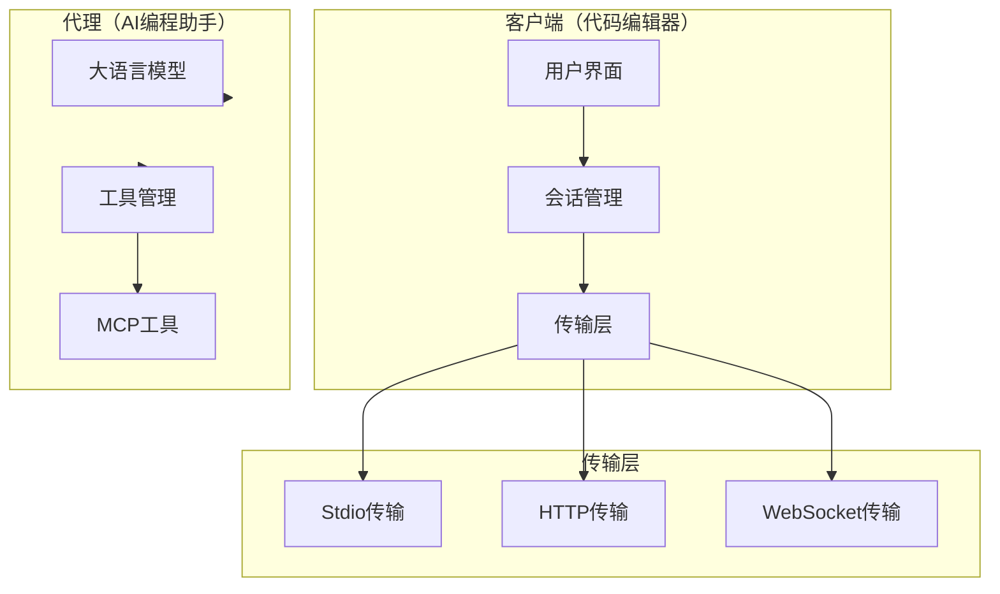
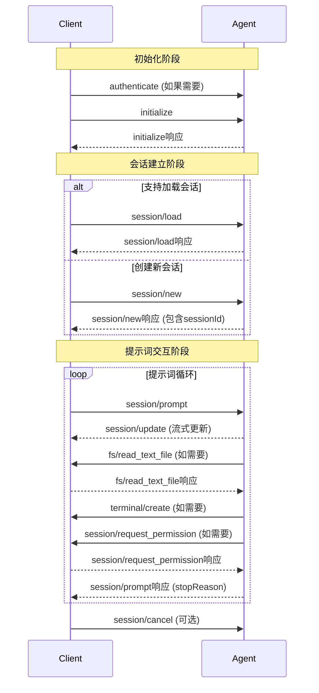
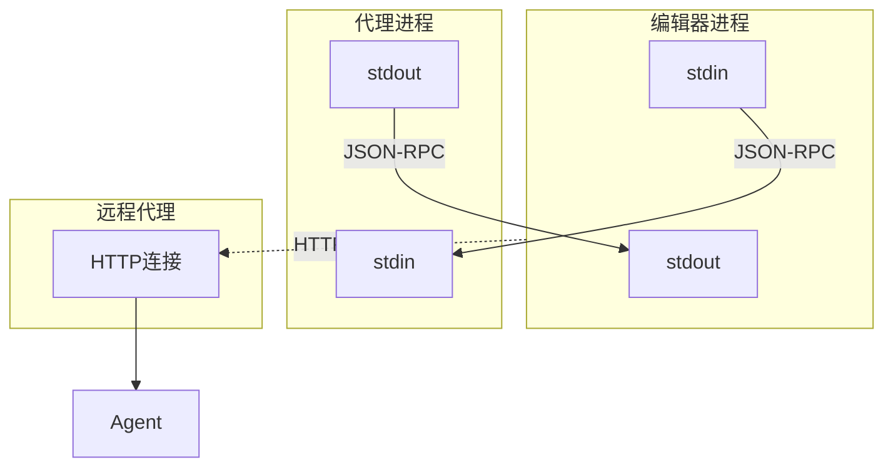
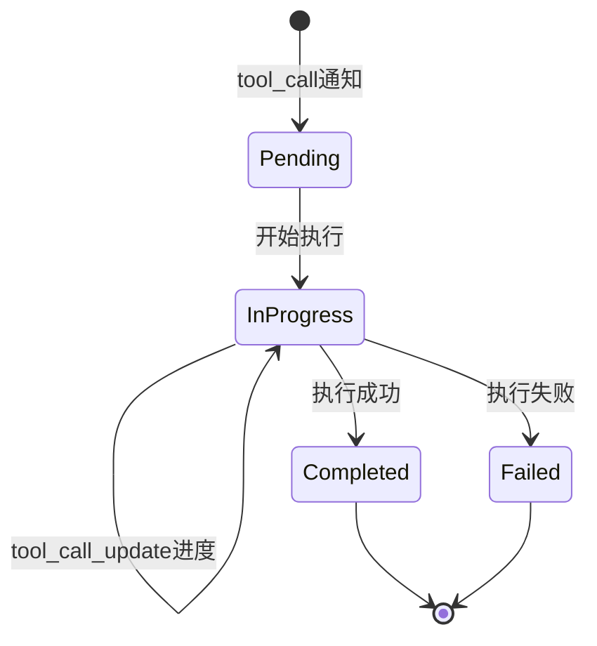
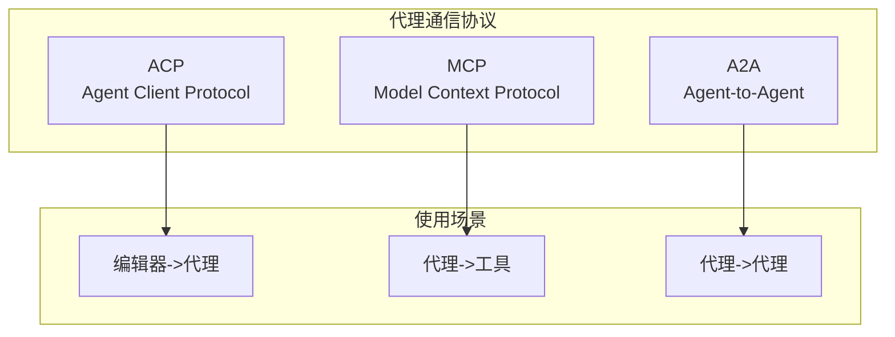
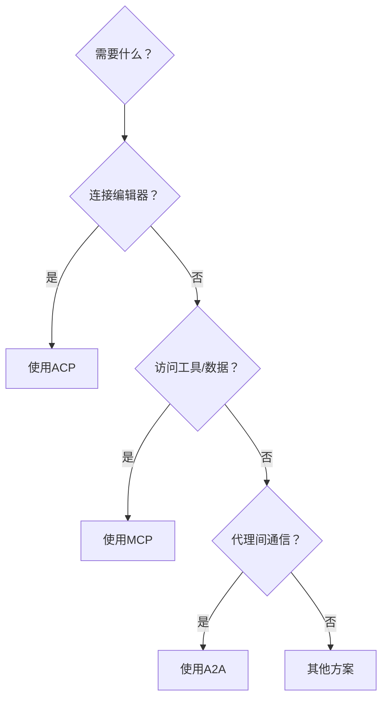

# Agent Client Protocol (ACP) SDK 彻底探索报告

> 探索目标：https://github.com/agentclientprotocol/agent-client-protocol
> 协议版本：v1 (0.6.3)

## 目录

1. [协议概述](#1-协议概述)
2. [核心概念与架构](#2-核心概念与架构)
3. [消息格式与通信机制](#3-消息格式与通信机制)
4. [客户端与服务器实现](#4-客户端与服务器实现)
5. [支持的功能与能力](#5-支持的功能与能力)
6. [与其他协议的对比](#6-与其他协议的对比)
7. [集成方式与示例代码](#7-集成方式与示例代码)
8. [生态系统与社区](#8-生态系统与社区)
9. [总结与展望](#9-总结与展望)

---

## 1. 协议概述

### 1.1 什么是 Agent Client Protocol

Agent Client Protocol（ACP）是一个开放标准，旨在标准化代码编辑器（IDE、文本编辑器等）与AI编码代理之间的通信。ACP 由 Zed Industries 主导开发，并在 GitHub 上开源。

**官方仓库**：https://github.com/agentclientprotocol/agent-client-protocol

**核心定位**：类似于 Language Server Protocol（LSP）如何标准化语言服务器的集成，ACP 标准化了AI代理与代码编辑器的集成，使得任何实现ACP的代理都可以与任何兼容ACP的编辑器配合工作。

### 1.2 协议设计目标

ACP 协议的设计遵循以下核心原则：

1. **可信（Trusted）**：ACP在用户使用代码编辑器与可信模型交互时工作，编辑器仍保留对代理工具调用的控制权
2. **用户体验优先（UX-first）**：设计解决与AI代理交互的用户体验挑战
3. **MCP友好（MCP-friendly）**：协议基于JSON-RPC构建，尽可能重用MCP类型

### 1.3 协议基本信息

| 属性 | 值 |
|------|-----|
| 当前版本 | Protocol Version 1 |
| 最新发布 | v0.6.3（2025年10月30日） |
| 许可证 | Apache 2.0 |
| Stars | 1.2k+ |
| Forks | 80+ |
| 官方网站 | https://agentclientprotocol.com/ |

---

## 2. 核心概念与架构

### 2.1 协议架构概览




### 2.2 核心组件

#### 2.2.1 客户端（Client）

客户端通常是代码编辑器（IDE、文本编辑器），负责：

- 管理环境（工作目录、文件系统访问）
- 处理用户交互
- 控制资源访问权限
- 启动和管理代理进程
- 转发用户提示词给代理
- 接收并显示代理的流式响应

#### 2.2.2 代理（Agent）

代理是使用生成式AI自主修改代码的程序，负责：

- 处理来自客户端的请求
- 使用语言模型和工具执行任务
- 管理会话状态和上下文
- 向客户端发送流式更新
- 请求文件系统和终端操作权限

### 2.3 通信模型

ACP遵循JSON-RPC 2.0规范，采用两种消息类型：

1. **通知（Notifications）**：单向消息，不期望响应
2. **方法（Methods）**：请求-响应对，期望返回结果或错误

---

## 3. 消息格式与通信机制

### 3.1 协议生命周期



### 3.2 消息格式示例

#### 3.2.1 初始化请求

```json
{
    "jsonrpc": "2.0",
    "id": 1,
    "method": "initialize",
    "params": {
        "protocolVersion": 1,
        "clientCapabilities": {
            "fs": {
                "readTextFile": true,
                "writeTextFile": true
            },
            "terminal": true
        },
        "clientInfo": {
            "name": "zed",
            "version": "0.1.0"
        }
    }
}
```

#### 3.2.2 初始化响应

```json
{
    "jsonrpc": "2.0",
    "id": 1,
    "result": {
        "protocolVersion": 1,
        "agentCapabilities": {
            "loadSession": true,
            "promptCapabilities": {
                "image": true,
                "audio": true,
                "embeddedContext": true
            },
            "mcpCapabilities": {
                "http": true,
                "sse": false
            }
        },
        "agentInfo": {
            "name": "claude",
            "version": "1.0.0"
        }
    }
}
```

### 3.3 内容块（Content Blocks）

ACP使用与MCP相同的内容块结构：

| 类型 | 描述 | 必需能力 |
|------|------|----------|
| text | 文本内容 | 必需支持 |
| image | 图像内容 | image能力 |
| audio | 音频内容 | audio能力 |
| resource | 嵌入资源 | embeddedContext能力 |
| resource_link | 资源链接 | 必需支持 |

### 3.4 传输层

ACP支持多种传输机制：



---

## 4. 客户端与服务器实现

### 4.1 官方SDK支持

| 语言 | SDK仓库 | 状态 |
|------|---------|------|
| Rust | agent-client-protocol | 官方 |
| Python | python-sdk | 官方 |
| TypeScript | typescript-sdk | 官方 |
| Kotlin | acp-kotlin-sdk | 官方 |
| Java | java-sdk | 官方 |
| Go | acp-go-sdk (Coder) | 社区 |
| Crystal | acp.cr | 社区 |
| Elixir | ACPex | 社区 |

### 4.2 Rust实现

Rust SDK是协议的参考实现，提供了最完整的功能。

核心特性：

- 异步运行时支持（tokio）
- 类型安全的协议定义
- 传输层抽象
- 完整的协议覆盖

### 4.3 Python实现

#### 安装

```bash
pip install agent-client-protocol
# 或
uv add agent-client-protocol
```

#### 代理实现示例

```python
from acp_sdk.server import Server
from acp_sdk.models import Message, MessagePart

server = Server()

@server.agent()
async def chatbot(messages: list[Message]) -> AsyncGenerator[RunYield, None]:
    # 处理消息
    query = " ".join(
        part.content
        for m in messages
        for part in m.parts
    )
    
    # 发送流式更新
    yield RunYield(
        message={"type": "agent_message_chunk", "content": {"type": "text", "text": "处理中..."}}
    )
    
    # 返回最终响应
    yield RunYieldResume(
        message={"type": "agent_message_chunk", "content": {"type": "text", "text": "完成！"}},
        stop_reason="end_turn"
    )

# 启动服务器
server.run()
```

### 4.4 TypeScript实现

```typescript
import { Client, textBlock } from '@agentclientprotocol/sdk';

const client = new Client({
  transport: 'stdio',
  command: 'path/to/agent',
  args: ['--stdio'],
});

await client.initialize();

const session = await client.createSession({
  cwd: '/path/to/project',
  mcpServers: [],
});

const response = await session.prompt({
  message: textBlock('Hello!'),
});
```

### 4.5 Go实现（Coder）

```go
type MyAgent struct{}

func (a MyAgent) Initialize(ctx context.Context, req acp.InitializeRequest) (acp.InitializeResponse, error) {
    return acp.InitializeResponse{
        ProtocolVersion: 1,
        AgentCapabilities: &acp.AgentCapabilities{
            LoadSession: acp.Ptr(true),
        },
    }, nil
}

func main() {
    agent := &MyAgent{}
    conn := acp.NewAgentSideConnection(agent, os.Stdout, os.Stdin)
}
```

### 4.6 Java实现

```java
@AcpAgent
class EchoAgent {
    @Initialize
    InitializeResponse init() {
        return InitializeResponse.ok();
    }

    @Prompt
    PromptResponse prompt(PromptRequest req, SyncPromptContext ctx) {
        ctx.sendMessage("Echo: " + req.text());
        return PromptResponse.endTurn();
    }
}

AcpAgentSupport.create(new EchoAgent())
    .transport(new StdioAcpAgentTransport())
    .run();
```

---

## 5. 支持的功能与能力

### 5.1 客户端能力

| 能力 | 描述 |
|------|------|
| fs.readTextFile | 读取文本文件 |
| fs.writeTextFile | 写入文本文件 |
| terminal | 终端操作 |

### 5.2 代理能力

| 能力 | 描述 |
|------|------|
| loadSession | 加载已有会话 |
| promptCapabilities.image | 图像内容支持 |
| promptCapabilities.audio | 音频内容支持 |
| promptCapabilities.embeddedContext | 嵌入上下文支持 |
| mcpCapabilities.http | HTTP传输支持 |
| mcpCapabilities.sse | SSE传输支持 |

### 5.3 基础方法

#### 代理端方法

| 方法 | 方向 | 描述 |
|------|------|------|
| initialize | Client->Agent | 协商协议版本和能力 |
| authenticate | Client->Agent | 身份验证 |
| session/new | Client->Agent | 创建新会话 |
| session/load | Client->Agent | 加载已有会话 |
| session/prompt | Client->Agent | 发送用户提示词 |

#### 客户端方法

| 方法 | 方向 | 描述 |
|------|------|------|
| session/request_permission | Agent->Client | 请求执行操作的权限 |
| fs/read_text_file | Agent->Client | 读取文件内容 |
| fs/write_text_file | Agent->Client | 写入文件内容 |
| terminal/create | Agent->Client | 创建终端 |
| terminal/output | Agent->Client | 获取终端输出 |
| terminal/kill | Agent->Client | 终止命令 |

### 5.4 会话更新类型

| 更新类型 | 描述 |
|----------|------|
| plan | 代理的执行计划 |
| agent_message_chunk | 流式文本响应 |
| user_message_chunk | 用户输入回显 |
| thought_message_chunk | 代理推理过程 |
| tool_call | 新工具调用 |
| tool_call_update | 工具调用进度/结果 |
| available_commands | 可用命令列表 |
| mode_change | 模式切换 |

### 5.5 工具调用流程



---

## 6. 与其他协议的对比

### 6.1 协议生态系统



### 6.2 ACP vs MCP

| 特性 | ACP | MCP |
|------|-----|-----|
| 目标 | 编辑器与代理通信 | 代理与工具/数据源通信 |
| 协议基础 | JSON-RPC 2.0 | JSON-RPC 2.0 |
| 传输层 | Stdio/HTTP/WebSocket | Stdio/HTTP/SSE |
| 复杂度 | 中等 | 较低 |

核心区别：
- **MCP** 像是给一个人更好的工具来提升性能
- **ACP** 是让人形成团队，代理贡献各自专长

### 6.3 协议选择



---

## 7. 集成方式与示例代码

### 7.1 Zed编辑器集成

在settings.json中添加：

```json
{
    "agent_servers": {
        "Echo Agent (Python)": {
            "type": "custom",
            "command": "/abs/path/to/python",
            "args": ["/abs/path/to/echo_agent.py"]
        }
    }
}
```

### 7.2 运行示例代理

```bash
# 安装依赖
pip install agent-client-protocol

# 运行示例
python examples/echo_agent.py
```

### 7.3 MCP工具桥接

```python
mcp_servers = [
    {
        "name": "filesystem",
        "command": "/path/to/mcp-filesystem",
        "args": ["--stdio"],
        "env": []
    }
]

session = await client.new_session(
    cwd="/path/to/project",
    mcp_servers=mcp_servers
)
```

---

## 8. 生态系统与社区

### 8.1 支持的编辑器

- **Zed**：原生支持ACP，是协议的主要推动者
- **JetBrains**：正在集成
- **VS Code**：社区支持

### 8.2 支持的代理

- **Claude Code**：通过ACP接口
- **Gemini CLI**：支持ACP模式（--experimental-acp）
- **OpenCode/Clawdbot**：社区支持

---

## 9. 总结与展望

### 9.1 协议优势

1. **标准化**：统一编辑器和AI代理的通信
2. **互操作性**：任何ACP代理可与任何ACP客户端配合
3. **灵活性**：支持多种传输层和扩展机制
4. **MCP集成**：与MCP无缝配合，形成完整工具链

### 9.2 应用场景

- AI编程助手与编辑器集成
- IDE扩展开发
- 自动化工作流
- 远程开发

### 9.3 快速入门建议

1. 阅读官方文档：https://agentclientprotocol.com/
2. 运行Python示例：python examples/echo_agent.py
3. 配置Zed编辑器连接示例代理
4. 用Python SDK编写自己的代理

---

## 参考资源

- 官方网站：https://agentclientprotocol.com/
- GitHub仓库：https://github.com/agentclientprotocol
- 协议规范：https://agentclientprotocol.com/protocol/
- Python SDK：https://github.com/agentclientprotocol/python-sdk

---

*报告生成时间：2026年2月*
*协议版本：v1 (0.6.3)*
