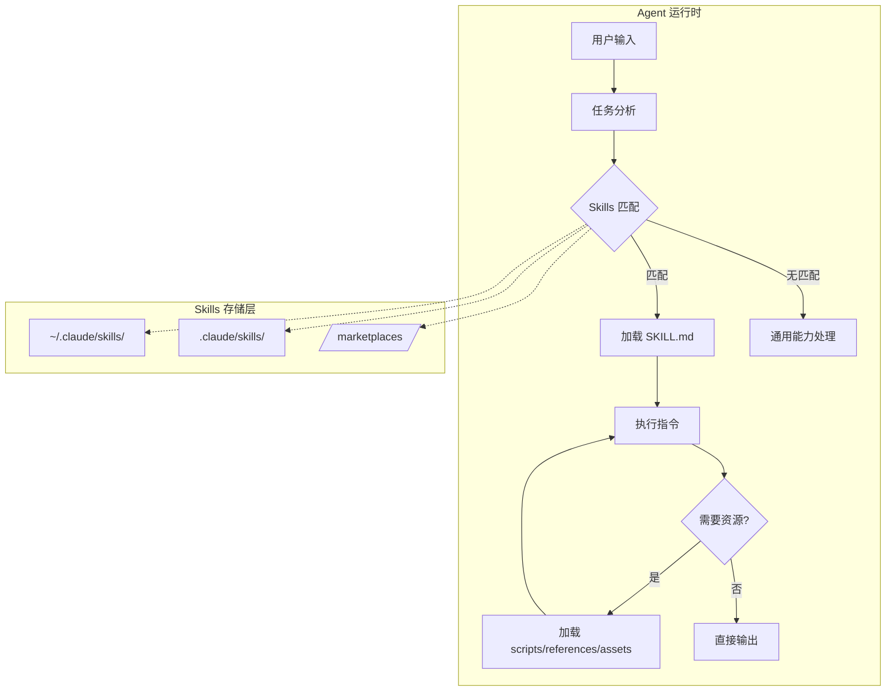
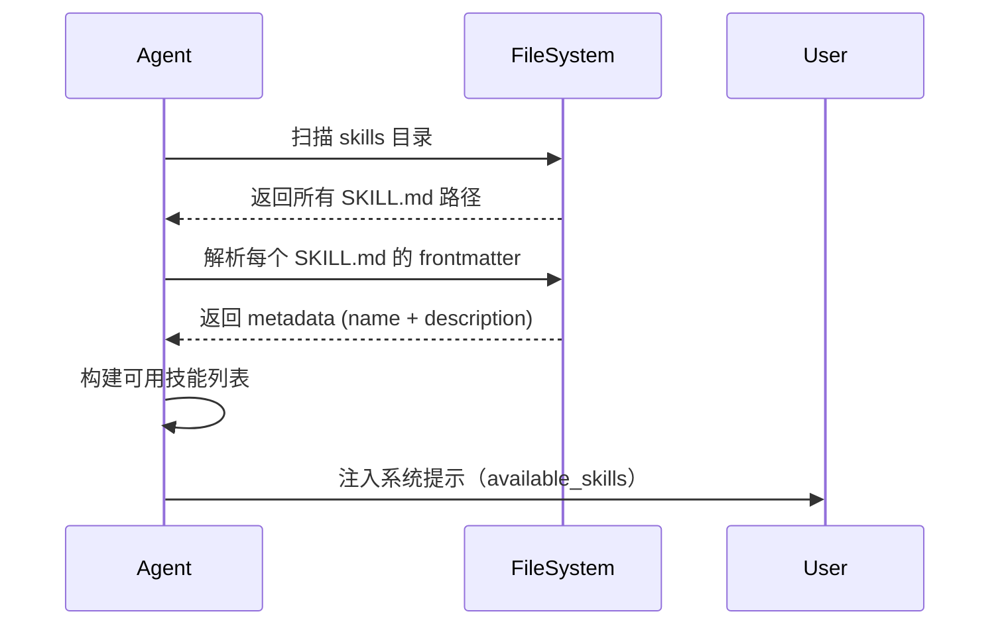
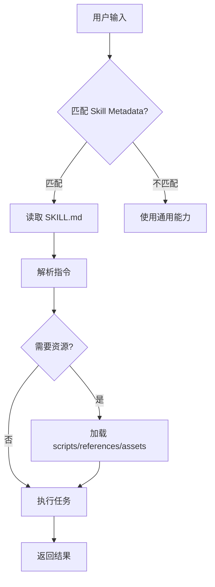
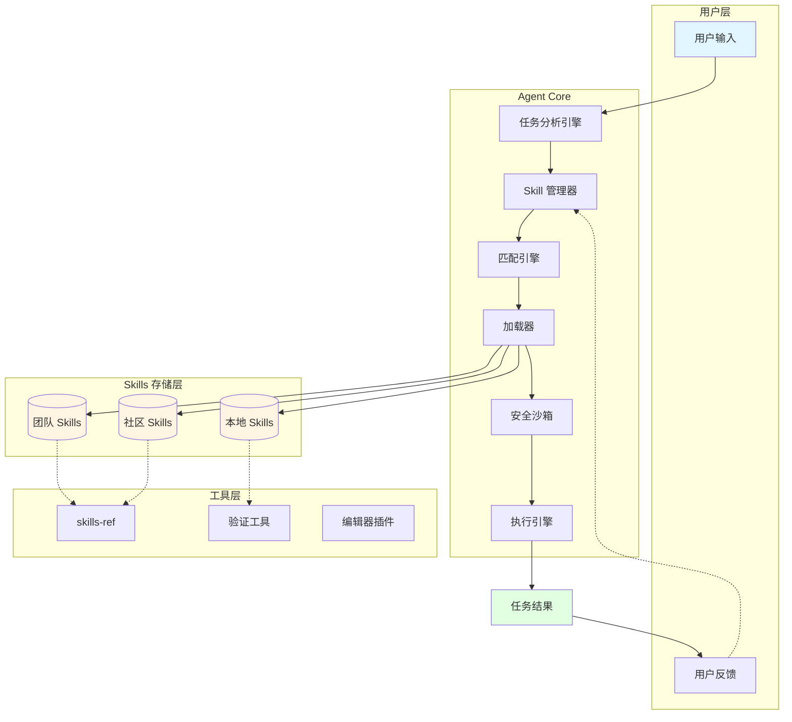
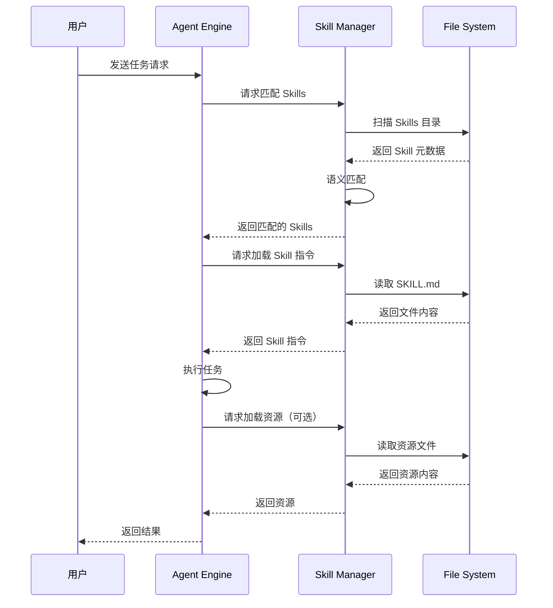
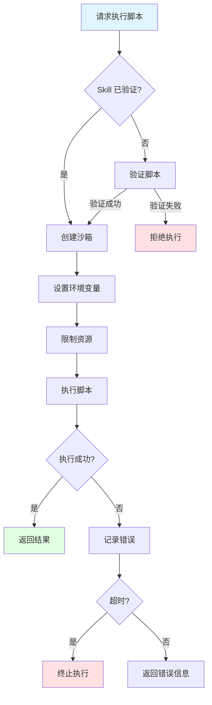
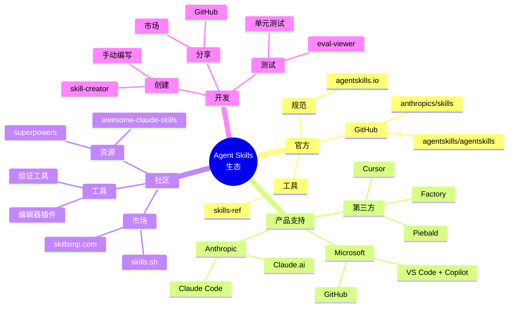

# Agent Skills 深度探索报告

> 探索日期：2026-02-27  
> 探索目标：彻底了解 Agent Skills 系统的设计理念、技术架构、实现方式

---

## 目录

- [1. 核心概念与设计理念](#1-核心概念与设计理念)
- [2. 技术架构详解](#2-技术架构详解)
- [3. 渐进式披露机制](#3-渐进式披露机制)
- [4. Skills 规范详解](#4-skills-规范详解)
- [5. 发现、安装与加载流程](#5-发现安装与加载流程)
- [6. 生态系统分析](#6-生态系统分析)
- [7. 与 OpenClaw 的兼容性](#7-与-openclaw-的兼容性)
- [8. 现有 Skills 生态](#8-现有-skills-生态)
- [9. 架构流程图](#9-架构流程图)

---

## 1. 核心概念与设计理念

### 1.1 什么是 Agent Skills？

**Agent Skills** 是由 Anthropic 开发的开放标准，用于扩展 AI Agent 能力的模块化格式。其核心定义：

> "Skills are folders of instructions, scripts, and resources that agents can discover and use to perform better at specific tasks."

**直观理解：**

Skills 就像是给 Agent 准备的一份「工作交接包」：
- **任务执行 SOP 和必要背景知识**（大概该怎么做）
- **工具使用说明**（用什么软件、如何操作）
- **需要的模板与材料**（历史案例、格式标准）
- **可能的问题、规范与解法**（补充细则与指导）

### 1.2 设计哲学

Agent Skills 遵循以下核心设计原则：

1. **简单性** - 一个 Skill 只需一个 SKILL.md 文件
2. **开放性** - 开放标准，多家产品支持
3. **可移植性** - 跨平台、跨产品复用
4. **渐进式** - 按需加载，优化上下文使用
5. **可扩展性** - 从简单文本到复杂脚本

### 1.3 核心价值主张

| 对象 | 价值 |
|-----|------|
| **Skill 作者** | 构建能力一次，在多个 Agent 产品中部署 |
| **兼容 Agent** | 支持 Skills 让终端用户开箱即用地获得新能力 |
| **团队与企业** | 将组织知识捕获为可移植、版本控制的包 |
| **非技术用户** | 零代码创建专业 Agent 应用 |

### 1.4 与 MCP 的区别

| 维度 | MCP (Model Context Protocol) | Agent Skills |
|-----|------------------------------|--------------|
| **关注点** | 如何调用外部工具、数据与服务 | 如何端到端完成特定工作 |
| **定义内容** | 统一的协议和接口 | 执行方法、工具调用范式 + 相关知识材料 |
| **内容类型** | 接口规范 | 完整的「能力扩展包」 |
| **典型用途** | 连接外部 API 和数据源 | 教会 Agent 完成特定任务 |

**类比理解：**
- MCP = 统一的充电标准（USB-C）
- Skills = 设备本身（充电宝、耳机、外接显卡）

---

## 2. 技术架构详解

### 2.1 整体架构



### 2.2 核心 API 设计

#### 2.2.1 元数据 API

启动时，Agent 扫描所有 Skills 并提取：

```yaml
---
name: skill-name              # 技能标识符
description: when to use     # 触发描述
license: Apache-2.0          # 可选：许可证
metadata:                    # 可选：自定义元数据
  author: example-org
  version: "1.0"
---
```

**字段约束：**
- `name`: 1-64 字符，仅小写字母、数字、连字符，不能以 `-` 开头/结尾
- `description`: 1-1024 字符，描述功能 + 使用时机
- `license`: 可选，许可证名称或文件引用
- `metadata`: 可选，任意键值对

#### 2.2.2 系统提示注入

Agent 将 Skills 元数据注入系统提示：

```xml
<available_skills>
  <skill>
    <name>pdf-processing</name>
    <description>Extracts text and tables from PDF files...</description>
    <location>/path/to/skills/pdf-processing/SKILL.md</location>
  </skill>
  <skill>
    <name>data-analysis</name>
    <description>Analyzes datasets, generates charts...</description>
    <location>/path/to/skills/data-analysis/SKILL.md</location>
  </skill>
</available_skills>
```

### 2.3 两种集成方式

#### 方式一：基于文件系统的 Agent

**适用场景：** 拥有完整计算机环境的 Agent（如 Claude Code）

```bash
# Agent 通过 bash 命令直接访问文件系统
cat /path/to/skills/pdf-processing/SKILL.md
python /path/to/skills/pdf-processing/scripts/extract.py
```

**优势：**
- 完整文件访问能力
- 直接执行脚本
- 资源访问无限制

#### 方式二：基于工具的 Agent

**适用场景：** 无独立计算机环境的 Agent（如 Claude.ai）

```javascript
// Agent 通过工具调用访问 Skills
tools: {
  loadSkill: { path: string },
  executeScript: { skill: string, script: string },
  readResource: { skill: string, resource: string }
}
```

**优势：**
- 更安全（沙箱化）
- 跨平台兼容
- 易于集成

---

## 3. 渐进式披露机制

### 3.1 三层加载体系

Skills 的核心创新是**渐进式披露（Progressive Disclosure）**，按需加载以优化上下文使用：


#### Level 1: 元数据层（始终加载）

**内容：** SKILL.md 的 YAML frontmatter
**时机：** Agent 启动时
**大小：** ~100 tokens
**作用：** 让 Agent 知道有哪些 Skills 可用，何时使用

```yaml
---
name: pdf
description: Use this skill whenever the user wants to do anything with PDF files...
---
```

#### Level 2: 指令层（触发时加载）

**内容：** SKILL.md 的 Markdown 正文
**时机：** 任务匹配 Skill description 时
**大小：** < 5000 tokens（建议）
**作用：** 提供详细的任务指导

```markdown
# PDF Processing Guide

## Quick Start
[具体的操作步骤和示例]

## Python Libraries
[库的使用方法]
```

#### Level 3: 资源层（按需加载）

**内容：** scripts/、references/、assets/ 文件
**时机：** 指令中明确引用时
**大小：** 无限制
**作用：** 提供可执行代码、参考文档、模板资源

```bash
# SKILL.md 中引用
See [REFERENCE.md](references/REFERENCE.md) for details.
Run: scripts/extract.py
```

### 3.2 上下文窗口变化示例

```
初始状态：
┌────────────────────────────────────┐
│ System Prompt                      │
│ + Skill Metadata (all skills)      │
│ + User Message                     │
└────────────────────────────────────┘
↓ 触发 Skill

加载 Level 2：
┌────────────────────────────────────┐
│ System Prompt                      │
│ + Skill Metadata (all skills)      │
│ + SKILL.md (触发 skill 的正文)     │
│ + User Message                     │
└────────────────────────────────────┘
↓ 需要资源

加载 Level 3：
┌────────────────────────────────────┐
│ System Prompt                      │
│ + Skill Metadata (all skills)      │
│ + SKILL.md                         │
│ + REFERENCE.md (按需)              │
│ + User Message                     │
└────────────────────────────────────┘
```

### 3.3 设计优势

| 传统方案 | 渐进式披露 |
|---------|-----------|
| 所有指令都在系统提示中，占用大量上下文 | 只加载元数据，上下文占用极小 |
| 无法按需加载详细内容 | 三层加载，按需扩展 |
| 添加新 Skill 会显著增加上下文 | 可安装大量 Skills 而不影响性能 |
| 详细参考材料会迅速消耗上下文 | 参考材料独立，仅在需要时加载 |

---

## 4. Skills 规范详解

### 4.1 目录结构

```
skill-name/
├── SKILL.md          # 必需：核心指令 + 元数据
├── scripts/          # 可选：可执行代码
│   ├── extract.py
│   └── process.sh
├── references/       # 可选：参考文档
│   ├── REFERENCE.md
│   └── FORMS.md
└── assets/           # 可选：静态资源
    ├── templates/
    └── logo.svg
```

**最小结构：**
```
skill-name/
└── SKILL.md
```

### 4.2 SKILL.md 格式规范

#### 4.2.1 必需字段

```yaml
---
name: skill-identifier
description: A clear description of what this skill does and when to use it
---
```

**name 字段规则：**
- 1-64 字符
- 仅小写字母（a-z）、数字（0-9）、连字符（-）
- 不能以 `-` 开头或结尾
- 不能包含连续连字符（`--`）
- 必须与父目录名匹配

**有效示例：**
```yaml
name: pdf-processing
name: data-analysis
name: code-review
```

**无效示例：**
```yaml
name: PDF-Processing  # 大写不允许
name: -pdf            # 不能以连字符开头
name: pdf--processing # 连续连字符不允许
```

#### 4.2.2 description 字段规则

- 1-1024 字符
- 应描述**功能**和**使用时机**
- 包含特定关键词以帮助 Agent 识别相关任务

**好的示例：**
```yaml
description: Extracts text and tables from PDF files, fills PDF forms, and merges multiple PDFs. Use when working with PDF documents or when the user mentions PDFs, forms, or document extraction.
```

**差的示例：**
```yaml
description: Helps with PDFs.
```

#### 4.2.3 可选字段

**license:**
```yaml
license: Apache-2.0
# 或
license: Proprietary. LICENSE.txt has complete terms
```

**compatibility:**
```yaml
compatibility: Designed for Claude Code (or similar products)
# 或
compatibility: Requires git, docker, jq, and access to the internet
```

**metadata:**
```yaml
metadata:
  author: example-org
  version: "1.0"
  tags: ["pdf", "document-processing"]
```

**allowed-tools (实验性):**
```yaml
allowed-tools: Bash(git:*) Bash(jq:*) Read
```

### 4.3 Markdown 正文规范

虽然没有格式限制，但推荐包含：

1. **概述部分** - Skill 的目的和范围
2. **使用场景** - 何时触发此 Skill
3. **分步说明** - 具体执行步骤
4. **示例** - 输入输出示例
5. **边界情况** - 常见问题和处理方式
6. **资源引用** - 指向 scripts/references/assets

**最佳实践：**
- 保持 SKILL.md < 500 行
- 将详细内容拆分到 references/
- 明确标注何时引用其他文件
- 为大文件（>300 行）添加目录

### 4.4 资源目录规范

#### scripts/

**用途：** 可执行代码
**要求：**
- 自包含或清晰文档依赖
- 包含有用的错误消息
- 优雅处理边界情况

**支持语言：** Python、Bash、JavaScript（取决于 Agent 实现）

```python
# scripts/extract.py
import sys
from pypdf import PdfReader

def extract_text(pdf_path):
    """Extract text from PDF file."""
    try:
        reader = PdfReader(pdf_path)
        return "\n".join(page.extract_text() for page in reader.pages)
    except Exception as e:
        print(f"Error extracting text: {e}", file=sys.stderr)
        sys.exit(1)

if __name__ == "__main__":
    if len(sys.argv) != 2:
        print("Usage: extract.py <pdf_file>", file=sys.stderr)
        sys.exit(1)
    
    print(extract_text(sys.argv[1]))
```

#### references/

**用途：** 额外文档
**推荐文件：**
- `REFERENCE.md` - 详细技术参考
- `FORMS.md` - 表单模板或结构化数据格式
- 特定领域文件（如 `finance.md`、`legal.md`）

**组织原则：**
- 保持文件聚焦
- Agent 按需加载，小文件意味着更少上下文使用
- 使用清晰的文件名

#### assets/

**用途：** 静态资源
**典型内容：**
- 模板（文档模板、配置模板）
- 图片（图表、示例）
- 数据文件（查找表、schema）

---

## 5. 发现、安装与加载流程

### 5.1 技能发现（Discovery）



**扫描路径（优先级从高到低）：**
1. 项目级：`.claude/skills/`
2. 用户级：`~/.claude/skills/`
3. 市场：`~/.claude/plugins/marketplaces/`

### 5.2 技能安装

#### 方式一：手动安装

```bash
# 1. 创建技能目录
mkdir -p ~/.claude/skills/my-skill

# 2. 复制技能文件
cp -r /path/to/skill/* ~/.claude/skills/my-skill/

# 3. 重启 Agent
claude  # 或重启 Claude Code
```

#### 方式二：从 GitHub 安装

```bash
# Claude Code Plugin Marketplace
/plugin marketplace add anthropics/skills

# 安装特定技能集
/plugin install document-skills@anthropic-agent-skills
/plugin install example-skills@anthropic-agent-skills
```

#### 方式三：使用 skill-creator

```
User: Create a skill that can convert PDF to Word
Agent: [调用 skill-creator]
Agent: [生成 SKILL.md 和 scripts]
Agent: [创建 .skill 文件]
User: install the .skill file
```

### 5.3 技能激活流程



**匹配逻辑：**
1. Agent 分析用户输入
2. 与所有 Skills 的 `description` 进行语义匹配
3. 选择最相关的 Skill（可能多个）
4. 加载完整的 SKILL.md

**显式调用：**
```
User: /pdf-processing extract text from file.pdf
```

**隐式调用：**
```
User: I need to get the text out of this PDF document
Agent: [检测到 "PDF" + "extract text"，匹配 pdf skill]
```

### 5.4 两种调用模式

#### 显式模式（Explicit）

用户明确指定 Skill：
```
/start using pdf-processing
Use the pdf skill to merge these files...
```

#### 隐式模式（Implicit）

Agent 自动匹配：
```
User: I need to combine these PDF files
Agent: [检测 "combine" + "PDF"，自动激活 pdf skill]
```

---

## 6. 生态系统分析

### 6.1 支持的产品

截至 2026 年 2 月，以下产品已宣布支持 Agent Skills：

#### 主要支持

| 产品 | 类型 | 支持方式 |
|-----|------|---------|
| **Claude Code** | CLI 工具 | 原生支持，文件系统访问 |
| **Claude.ai** | Web 平台 | 原生支持，工具调用 |
| **OpenAI Codex** | API | 原生支持 |
| **Cursor** | IDE | 原生支持 |
| **VS Code + Copilot** | 编辑器 | `.github/skills/` 或 `.cursor/skills/` |
| **GitHub** | 平台 | 集成支持 |

#### 扩展支持

| 产品 | 类型 | 状态 |
|-----|------|------|
| Factory | AI 工具 | ✓ 支持 |
| Piebald | AI 工具 | ✓ 支持 |
| Firebender | AI 工具 | ✓ 支持 |
| Goose | AI 框架 | ✓ 支持 |
| OpenHands | AI 框架 | ✓ 支持 |
| Spring AI | Java 框架 | ✓ 支持 |
| Ona | AI 工具 | ✓ 支持 |
| Qodo | 开发工具 | ✓ 支持 |
| Mux | 编辑器 | ✓ 支持 |
| Junie (JetBrains) | IDE | ✓ 支持 |
| Amp | 开发工具 | ✓ 支持 |
| Autohand Code CLI | CLI | ✓ 支持 |

#### 社区支持

- **Gemini CLI**
- **Command Code**
- **Roo Code**
- **TRAE**
- **Laravel Boost**
- **Claude (原生)**
- **Letta**
- **Emdash**
- **VT Code**
- **Databricks**
- **Agentman**
- **Mistral AI Vibe**

### 6.2 资源生态

#### 官方资源

- **规范站点：** https://agentskills.io
- **官方仓库：** https://github.com/agentskills/agentskills
- **示例 Skills：** https://github.com/anthropics/skills
- **参考库：** https://github.com/agentskills/agentskills/tree/main/skills-ref

#### 社区资源

- **技能聚合：** https://skills.sh/
- **中文市场：** https://skillsmp.com/zh
- **Awesome Skills：** https://github.com/ComposioHQ/awesome-claude-skills
- **工作流合集：** https://github.com/obra/superpowers

#### 学习资源

- **菜鸟教程：** https://www.runoob.com/claude-code/claude-agent-skills.html
- **CSDN 指南：** https://blog.csdn.net/pythonhy/article/details/157932525
- **知乎专栏：** https://zhuanlan.zhihu.com/p/1999979760458167377
- **少数派：** https://sspai.com/post/105230

### 6.3 工具生态

#### 开发工具

```bash
# skills-ref - 参考 SDK 和 CLI
pip install skills-ref

# 验证 Skill
skills-ref validate ./my-skill

# 生成系统提示 XML
skills-ref to-prompt ~/.claude/skills/*
```

#### 编辑工具

- **Claude Code** - 内置 skill-creator
- **VS Code** - Syntax highlighting for SKILL.md
- **在线编辑器** - 社区贡献

#### 验证工具

```bash
# YAML frontmatter 验证
skills-ref validate

# Markdown linting
markdownlint SKILL.md

# Description 优化
python optimize_description.py
```

---

## 7. 与 OpenClaw 的兼容性

### 7.1 OpenClaw 分析

基于现有信息，OpenClaw 似乎是一个 AI Agent 框架。以下是兼容性分析：

#### 兼容性评估

| 维度 | 兼容性 | 说明 |
|-----|-------|------|
| **格式** | ✓ 完全兼容 | SKILL.md 是纯文本格式 |
| **加载机制** | ? 需适配 | 需实现渐进式披露 |
| **工具调用** | ? 需适配 | 需支持 scripts/ 执行 |
| **元数据注入** | ✓ 易实现 | YAML frontmatter 解析 |
| **沙箱执行** | ⚠ 需评估 | 脚本执行需安全机制 |

### 7.2 集成点分析

#### 点 1：元数据解析

```python
import yaml

def parse_skill_metadata(skill_path):
    """解析 Skill 元数据"""
    with open(f"{skill_path}/SKILL.md") as f:
        content = f.read()
    
    # 提取 YAML frontmatter
    frontmatter = content.split('---')[1]
    metadata = yaml.safe_load(frontmatter)
    
    return {
        'name': metadata['name'],
        'description': metadata['description'],
        'path': skill_path
    }
```

#### 点 2：系统提示构建

```python
def build_skills_prompt(skills_metadata):
    """构建 Skills 系统提示"""
    prompt = "<available_skills>\n"
    
    for skill in skills_metadata:
        prompt += f"""
  <skill>
    <name>{skill['name']}</name>
    <description>{skill['description']}</description>
    <location>{skill['path']}/SKILL.md</location>
  </skill>"""
    
    prompt += "\n</available_skills>"
    return prompt
```

#### 点 3：渐进式加载

```python
class SkillLoader:
    def __init__(self, skills_dir):
        self.skills_dir = skills_dir
        self.metadata_cache = {}
        self.instruction_cache = {}
    
    def load_metadata(self):
        """Level 1: 加载元数据"""
        for skill_dir in os.listdir(self.skills_dir):
            skill_path = os.path.join(self.skills_dir, skill_dir)
            if os.path.isfile(f"{skill_path}/SKILL.md"):
                self.metadata_cache[skill_dir] = parse_skill_metadata(skill_path)
        return self.metadata_cache
    
    def load_instruction(self, skill_name):
        """Level 2: 加载指令"""
        if skill_name not in self.instruction_cache:
            skill_path = self.metadata_cache[skill_name]['path']
            with open(f"{skill_path}/SKILL.md") as f:
                content = f.read()
            # 移除 frontmatter，只保留正文
            instruction = '---'.join(content.split('---')[2:])
            self.instruction_cache[skill_name] = instruction
        return self.instruction_cache[skill_name]
    
    def load_resource(self, skill_name, resource_path):
        """Level 3: 加载资源"""
        skill_path = self.metadata_cache[skill_name]['path']
        full_path = os.path.join(skill_path, resource_path)
        with open(full_path) as f:
            return f.read()
```

#### 点 4：脚本执行（需沙箱）

```python
import subprocess
import tempfile

def execute_script(skill_name, script_path, args):
    """安全执行脚本"""
    skill_path = metadata_cache[skill_name]['path']
    full_script = os.path.join(skill_path, script_path)
    
    # 使用临时目录和超时限制
    with tempfile.TemporaryDirectory() as tmpdir:
        try:
            result = subprocess.run(
                ['python', full_script] + args,
                cwd=tmpdir,
                timeout=30,
                capture_output=True,
                text=True
            )
            return result.stdout
        except subprocess.TimeoutExpired:
            return "Error: Script execution timeout"
```

### 7.3 兼容性建议

1. **实现渐进式披露** - 这是核心特性，必须支持
2. **沙箱化脚本执行** - 安全性要求
3. **支持两种集成模式** - 文件系统模式和工具模式
4. **实现技能发现机制** - 扫描和索引 Skills
5. **添加技能验证** - 确保加载的 Skills 符合规范

---

## 8. 现有 Skills 生态

### 8.1 官方 Skills 示例分析

基于 anthropics/skills 仓库的分析：

#### 文档类 Skills

| Skill | 功能 | 复杂度 |
|-------|------|--------|
| **pdf** | PDF 处理（文本提取、合并、拆分、表单填写） | ⭐⭐⭐⭐⭐ |
| **docx** | Word 文档创建和编辑 | ⭐⭐⭐⭐⭐ |
| **pptx** | PowerPoint 演示文稿生成 | ⭐⭐⭐⭐⭐ |
| **xlsx** | Excel 电子表格操作 | ⭐⭐⭐⭐⭐ |

**特点：**
- 完整的 Python 脚本支持
- 详细的 REFERENCE.md
- 表单处理（FORMS.md）
- 复杂的多文件结构

#### 设计类 Skills

| Skill | 功能 | 复杂度 |
|-------|------|--------|
| **brand-guidelines** | Anthropic 品牌标准 | ⭐⭐ |
| **algorithmic-art** | 生成算法艺术 | ⭐⭐⭐ |
| **canvas-design** | Canvas 设计 | ⭐⭐⭐ |
| **frontend-design** | 前端设计 | ⭐⭐⭐⭐ |

**特点：**
- 简单的 SKILL.md
- 资源文件（颜色、字体）
- 模板和示例

#### 开发类 Skills

| Skill | 功能 | 复杂度 |
|-------|------|--------|
| **skill-creator** | 创建新 Skills | ⭐⭐⭐⭐⭐ |
| **mcp-builder** | 构建 MCP 服务器 | ⭐⭐⭐⭐ |
| **webapp-testing** | Web 应用测试 | ⭐⭐⭐⭐ |

**特点：**
- Meta Skills（创建 Skills 的 Skill）
- 复杂的工作流
- 测试和验证脚本

#### 通信类 Skills

| Skill | 功能 | 复杂度 |
|-------|------|--------|
| **internal-comms** | 内部沟通 | ⭐⭐⭐ |
| **doc-coauthoring** | 文档协作 | ⭐⭐⭐ |
| **slack-gif-creator** | Slack GIF 创建 | ⭐⭐ |

**特点：**
- 企业工作流
- 集成外部服务
- 模板驱动

#### 工具类 Skills

| Skill | 功能 | 复杂度 |
|-------|------|--------|
| **theme-factory** | 主题生成 | ⭐⭐⭐ |
| **web-artifacts-builder** | Web 资源构建 | ⭐⭐⭐⭐ |

### 8.2 Skill 复杂度分级

#### 级别 1：简单 Skill

**特征：**
- 单个 SKILL.md 文件
- 纯文本指令
- 无脚本或资源

**示例：** brand-guidelines

```yaml
---
name: brand-guidelines
description: Applies Anthropic's official brand colors...
---

# Anthropic Brand Styling

## Colors
- Dark: #141413
- Light: #faf9f5
...
```

#### 级别 2：标准 Skill

**特征：**
- SKILL.md + references/
- 分层的文档结构
- 无可执行脚本

**示例：** internal-comms

```
internal-comms/
├── SKILL.md
└── references/
    ├── templates.md
    └── examples.md
```

#### 级别 3：高级 Skill

**特征：**
- SKILL.md + scripts/ + references/
- 可执行代码
- 复杂的文件结构

**示例：** pdf

```
pdf/
├── SKILL.md
├── REFERENCE.md
├── FORMS.md
└── scripts/
    ├── extract.py
    ├── merge.py
    └── fill_form.py
```

#### 级别 4：专家 Skill

**特征：**
- 完整的工作流
- 多个脚本和工具
- 详细的文档和测试
- Meta Skill（创建其他 Skills）

**示例：** skill-creator, docx

```
skill-creator/
├── SKILL.md
├── REFERENCE.md
├── scripts/
│   ├── optimize_description.py
│   └── eval_viewer/
│       └── generate_review.py
└── examples/
    └── test-skills/
```

### 8.3 典型 Skill 结构分析

#### PDF Skill 深度分析

**目录结构：**
```
pdf/
├── SKILL.md (314 lines)
├── REFERENCE.md
├── FORMS.md
└── scripts/
    ├── extract.py
    ├── merge.py
    └── fill_form.py
```

**SKILL.md 结构：**
1. 元数据（name, description, license）
2. 概述
3. 快速开始
4. Python 库指南
5. 命令行工具指南
6. 常见操作示例
7. 资源引用（指向 REFERENCE.md 和 FORMS.md）

**设计亮点：**
- 清晰的分层：基础操作在 SKILL.md，高级内容在 REFERENCE.md
- 具体操作在 FORMS.md 单独文档
- 脚本提供可复用的代码

**渐进式披露应用：**
- Level 1: 元数据说明 "whenever the user wants to do anything with PDF files"
- Level 2: SKILL.md 提供基础操作
- Level 3: REFERENCE.md、FORMS.md 提供高级内容
- Level 3: scripts/ 提供可执行代码

---

## 9. 架构流程图

### 9.1 完整系统架构



### 9.2 渐进式加载流程



### 9.3 安全执行流程



### 9.4 Skills 生态系统



---

## 10. 总结与建议

### 10.1 核心发现

1. **Agent Skills 是成熟的开放标准**
   - 由 Anthropic 开发，已被广泛采用
   - 清晰的规范和完善的工具
   - 活跃的社区和丰富的资源

2. **渐进式披露是核心创新**
   - 三层加载机制优化上下文使用
   - 支持大量 Skills 而不影响性能
   - 灵活的按需加载策略

3. **广泛的产品支持**
   - 跨平台可移植
   - 社区生态成熟
   - 持续维护和更新

4. **需要额外实现的部分**
   - 安全沙箱机制
   - Skills 匹配优化
   - 性能监控和调优

### 10.2 集成建议

#### 推荐方案：**采用 Agent Skills 标准**

**理由：**
1. ✓ 成熟的标准，无需重新发明
2. ✓ 丰富的社区资源可复用
3. ✓ 跨平台兼容性好
4. ✓ 持续维护和更新

#### 实施路线图

**第一阶段（2-3 周）：基础集成**
- 实现 Skill 发现和元数据加载
- 实现 Level 1 和 Level 2 加载
- 基本的 Skill 匹配机制

**第二阶段（2-3 周）：安全集成**
- 实现脚本沙箱
- 添加权限控制
- 实现审计日志

**第三阶段（1-2 周）：生态集成**
- 集成 skills-ref 工具
- 实现 Skill 市场
- 添加一键安装功能

**第四阶段（1-2 周）：优化和提升**
- 性能优化
- 用户体验改进
- 文档和示例

### 10.3 风险和缓解

| 风险 | 影响 | 缓解措施 |
|-----|------|---------|
| **脚本执行安全** | 高 | 实现沙箱 + 代码审计 + 权限控制 |
| **上下文溢出** | 中 | 优先级管理 + 动态卸载 + Token 监控 |
| **Skill 匹配不准** | 中 | 语义匹配 + 用户反馈学习 + A/B 测试 |
| **社区 Skill 质量** | 低 | 验证机制 + 评分系统 + 官方认证 |

### 10.4 长期规划

1. **贡献到 Agent Skills 生态**
   - 开发特定领域的 Skills
   - 分享最佳实践
   - 贡献工具和库

2. **建立 Skill 市场**
   - 策展高质量 Skills
   - 提供评分和评论
   - 建立社区标准

3. **持续优化**
   - 性能监控
   - 用户反馈收集
   - A/B 测试

---

## 附录

### A. 参考资料

- **规范站点：** https://agentskills.io
- **官方仓库：** https://github.com/agentskills/agentskills
- **示例 Skills：** https://github.com/anthropics/skills
- **技能市场：** https://skills.sh/
- **中文市场：** https://skillsmp.com/zh

### B. 工具推荐

```bash
# 安装 skills-ref
pip install skills-ref

# 验证 Skills
skills-ref validate ./my-skill

# 生成系统提示
skills-ref to-prompt ~/.claude/skills/*

# 创建新 Skill
skills create my-skill

# 安装 Skill
skills install anthropics/skills/pdf

# 测试 Skill
skills test pdf --input "sample.pdf"
```

### C. 示例 Skills

#### 简单示例

```yaml
---
name: hello-world
description: A simple hello world skill for demonstration
---

# Hello World

## When to use
Use this skill when you want to say hello in different languages.

## Instructions
1. Ask the user for their preferred language
2. Say hello in that language
3. Provide a fun fact about the language

## Examples
- Spanish: "¡Hola!"
- French: "Bonjour!"
- Japanese: "こんにちは!"
```

#### 复杂示例

```markdown
---
name: data-analysis
description: Analyze datasets, generate charts, and create summary reports. Use when working with CSV files, Excel spreadsheets, or any structured data that needs analysis or visualization.
---

# Data Analysis

## Overview
This skill helps you analyze data, create visualizations, and generate reports.

## Quick Start
```python
import pandas as pd
import matplotlib.pyplot as plt

# Load data
df = pd.read_csv('data.csv')

# Basic statistics
print(df.describe())

# Create visualization
df.plot(kind='bar')
plt.savefig('output.png')
```

## Advanced Features
See [REFERENCE.md](references/REFERENCE.md) for advanced features.

## Scripts
- `scripts/analyze.py` - Automated analysis
- `scripts/visualize.py` - Create charts
```

---

## Neco集成参考

### Skills系统实现

Neco兼容AgentSkills格式的技能系统。完整的Skills管理器接口契约参见 [TECH.md §10.2 Skills系统](TECH.md#skills接口契约)。

**关键集成点**：
- SkillMetadata结构定义
- 两阶段加载策略（Full/Compact模式）
- Skills目录扫描和索引
- 提示注入机制

### 提示注入策略

Neco支持Full和Compact两种提示注入模式。接口契约参见 [TECH.md §10.2](TECH.md#skills接口契约)。

**Full模式**：注入完整Skill内容到系统提示
**Compact模式**：仅注入元数据，Agent按需读取

### 安全审计

Neco实现Skill安全审计器，检查路径遍历、文件大小、脚本权限等。接口契约参见 [TECH.md §10.2](TECH.md#skills接口契约)。

### 返回TECH.md

← [返回Neco技术设计文档](TECH.md)

---

**文档版本：** 1.0
**最后更新：** 2026-02-27
**许可：** CC-BY-4.0

