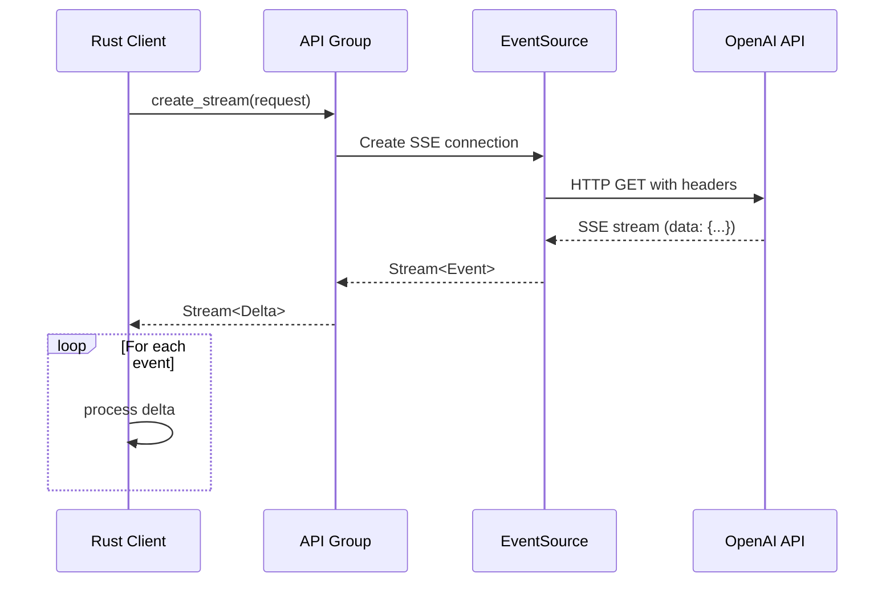
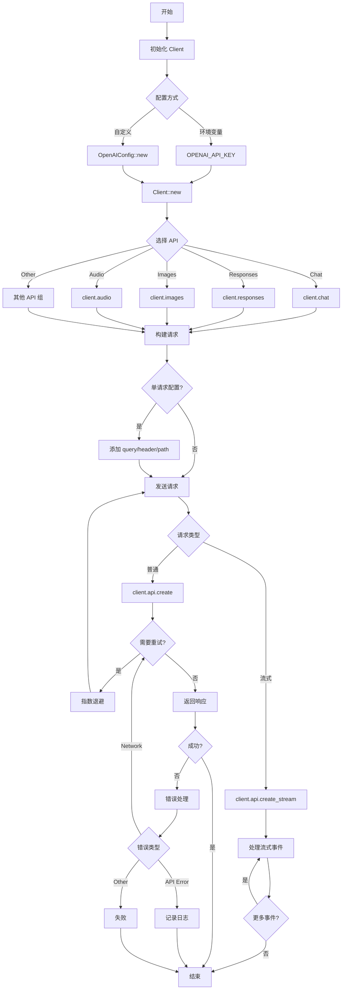

# async-openai Crate 探索报告

> 版本：0.33.0 | 最新更新：2026年2月18日
>
> 本文档全面探索 async-openai crate，包括核心API、流式输出、工具调用、错误处理等所有关键特性。

---

## 目录

1. [项目概览](#1-项目概览)
2. [核心API和功能特性](#2-核心api和功能特性)
3. [流式输出实现](#3-流式输出实现)
4. [工具调用支持](#4-工具调用支持)
5. [错误处理机制](#5-错误处理机制)
6. [配置和初始化](#6-配置和初始化)
7. [性能特性](#7-性能特性)
8. [与其他OpenAI客户端对比](#8-与其他openai客户端对比)
9. [API调用流程](#9-api调用流程)

---

## 1. 项目概览

### 1.1 基本信息

| 属性 | 值 |
|------|-----|
| **仓库名称** | async-openai |
| **最新版本** | 0.33.0 |
| **License** | MIT |
| **维护者** | Himanshu Neema (@64bit) |
| **GitHub Stars** | 1.8k+ |
| **下载量** | 327万+ (总计), 149万+ (近期) |
| **版本数** | 104个版本 |
| **Rust Edition** | 2021 |
| **文档覆盖率** | 66.46% |

### 1.2 项目定位

`async-openai` 是一个**非官方**的 Rust OpenAI 客户端库，基于 [OpenAI OpenAPI 规范](https://github.com/openai/openai-openapi) 构建。它实现了 OpenAPI 规范中的**所有 API**。

### 1.3 核心特性

✨ **独特功能**：

1. **Bring Your Own Types (BYOT)** - 支持自定义请求/响应类型
2. **SSE 流式输出** - 在支持的 API 上提供 Server-Sent Events 流式传输
3. **灵活配置** - 可为每个请求自定义路径、查询参数和请求头
4. **自动重试** - 遇到速率限制时自动使用指数退避重试（SSE 流式除外）
5. **Builder 模式** - 所有请求对象都使用符合人体工程学的构建器模式
6. **细粒度特性标志** - 支持单独启用类型或 API，加快编译速度
7. **Azure OpenAI 支持** - 支持 Azure OpenAI Service（仅限符合 OpenAI 规范的 API）
8. **WASM 支持** - 支持 WebAssembly 目标（流式和重试暂未实现）

---

## 2. 核心API和功能特性

### 2.1 支持的 API 类别

async-openai 实现了 OpenAI 规范中的所有 API，按功能分类如下：

#### **Responses API** (最新 API)
- **功能**：Responses、Conversations、Streaming events
- **Feature Flag**: `responses`
- **类型**: `response-types`

#### **Webhooks**
- **功能**：Webhook Events
- **Feature Flag**: `webhook`
- **类型**: `webhook-types`

#### **Platform APIs**
| API | Feature Flag | 用途 |
|-----|--------------|------|
| Audio | `audio` | 语音转文字、文字转语音、音频流式传输 |
| Video | `video` | 视频生成 (Sora) |
| Images | `image` | 图像生成、编辑、变体、流式传输 |
| Embeddings | `embedding` | 文本向量化 |
| Evals | `evals` | 评估创建和管理 |
| Fine-tuning | `finetuning` | 模型微调 |
| Graders | `grader` | 评分器 |
| Batch | `batch` | 批量 API 请求（50%折扣） |
| Files | `file` | 文件上传和管理 |
| Uploads | `upload` | 大文件分块上传 |
| Models | `model` | 模型列表和详情 |
| Moderations | `moderation` | 内容审核 |

#### **Vector Stores**
- **功能**：Vector stores、Vector store files、Vector store file batches
- **Feature Flag**: `vectorstore`
- **用途**：为 Assistants API 提供向量存储

#### **ChatKit** (Beta)
- **Feature Flag**: `chatkit`
- **用途**：ChatKit API 用于管理会话和线程

#### **Containers**
- **Feature Flag**: `container`
- **用途**：为 Code Interpreter 工具创建和管理容器文件

#### **Skills**
- **Feature Flag**: `skill`
- **用途**：Skills API (新增功能)

#### **Realtime**
- **Feature Flag**: `realtime`
- **用途**：Realtime API 用于创建会话、管理 WebRTC 连接

#### **Chat Completions**
- **Feature Flag**: `chat-completion`
- **功能**：Chat Completions、Streaming

#### **Assistants** (Beta)
- **Feature Flag**: `assistant`
- **功能**：Assistants、Threads、Messages、Runs、Run steps、Streaming

#### **Administration**
- **Feature Flag**: `administration`
- **功能**：Admin API Keys、Invites、Users、Groups、Roles、Projects 等

#### **Legacy**
- **Feature Flag**: `completions`
- **说明**：旧的 Completions API（推荐使用 Chat Completions）

### 2.2 核心模块结构

```
async_openai/
├── Client (主客户端)
├── config/ (配置)
│   ├── OpenAIConfig
│   ├── AzureConfig
│   └── Config (trait)
├── error/ (错误处理)
│   ├── OpenAIError
│   ├── StreamError
│   ├── ApiError
│   └── WrappedError
├── types/ (类型定义)
│   ├── audio/
│   ├── video/
│   ├── images/
│   ├── chat/
│   ├── embeddings/
│   ├── responses/
│   ├── assistants/
│   └── ...
├── webhooks/ (Webhook 支持)
└── traits/ (Trait 定义)
```

### 2.3 客户端 API 分组

Client 对象提供了多个 API 组访问器：

```rust
let client = Client::new();

// 各个 API 组
client.responses()      // Responses API
client.chat()           // Chat Completions
client.audio()          // Audio API
client.images()         // Images API
client.embeddings()     // Embeddings API
client.files()          // Files API
client.assistants()     // Assistants API (已弃用)
client.models()         // Models API
client.batches()        // Batch API
client.fine_tuning()    // Fine-tuning API
client.realtime()       // Realtime API
client.admin()          // Administration API
// ... 更多 API 组
```

---

## 3. 流式输出实现

### 3.1 支持流式输出的 API

以下 API 支持 SSE (Server-Sent Events) 流式输出：

| API | 流式方法 | 说明 |
|-----|---------|------|
| **Responses** | `create_stream()` | Responses API 流式输出 |
| **Chat Completions** | `create_stream()` | 聊天补全流式输出 |
| **Completions** | `create_stream()` | 旧版补全流式输出 |
| **Assistants** | `create_stream()` | Assistants 流式运行 |
| **Audio** | `create_stream()` | 语音合成流式输出 |
| **Images** | `create_stream()` | 图像生成流式输出 |

### 3.2 流式输出核心机制

async-openai 使用以下 crate 实现流式输出：

- **`reqwest-eventsource`** (0.6.0) - EventSource 客户端
- **`eventsource-stream`** (0.2) - SSE 流处理
- **`tokio-stream`** (0.1) - Tokio 流工具
- **`futures`** (0.3) - Future 和 Stream 抽象

### 3.3 流式输出 API 调用流程



### 3.4 流式输出代码示例

#### Chat Completions 流式输出

```rust
use async_openai::{
    Client,
    types::{
        chat::{ChatCompletionArgs, ChatCompletionMessage, Role},
        CreateChatCompletionResponse,
    },
};

#[tokio::main]
async fn main() -> Result<(), Box<dyn std::error::Error>> {
    let client = Client::new();

    let request = ChatCompletionArgs::default()
        .model("gpt-4o")
        .messages(vec![
            ChatCompletionMessage {
                role: Role::User,
                content: "写一首关于Rust编程的诗",
                ..Default::default()
            }
        ])
        .build()?;

    // 创建流式响应
    let mut stream = client.chat().create_stream(request).await?;

    // 处理每个增量
    while let Some(response) = stream.next().await {
        match response {
            Ok(CreateChatCompletionResponse {
                choices: Some(choices),
                ..
            }) => {
                for choice in choices {
                    if let Some(delta) = choice.delta.content {
                        print!("{}", delta);
                        // 立即刷新缓冲区
                        use std::io::Write;
                        std::io::stdout().flush().ok();
                    }
                }
            }
            Err(e) => {
                eprintln!("Stream error: {}", e);
                break;
            }
        }
    }

    println!(); // 换行
    Ok(())
}
```

#### Responses API 流式输出

```rust
use async_openai::{
    Client,
    types::responses::{CreateResponseArgs, Input},
};

#[tokio::main]
async fn main() -> Result<(), Box<dyn std::error::Error>> {
    let client = Client::new();

    let request = CreateResponseArgs::default()
        .model("gpt-4o-mini")
        .input("讲一个关于异步编程的故事")
        .max_output_tokens(512u32)
        .build()?;

    let mut stream = client.responses().create_stream(request).await?;

    while let Some(delta) = stream.next().await {
        if let Some(text) = delta?.output_text() {
            print!("{}", text);
        }
    }

    Ok(())
}
```

### 3.5 流式输出特点

✅ **优点**：
- 真正的流式输出，逐 token 返回
- 使用 `Stream` trait，符合 Rust 异步生态
- 自动处理 SSE 解析
- 支持取消操作

⚠️ **限制**：
- WASM 目标暂不支持流式输出
- 流式请求不支持自动重试
- 需要手动管理流的生命周期

---

## 4. 工具调用支持

### 4.1 工具调用类型

async-openai 支持多种工具调用模式：

| 工具类型 | API | 示例 |
|---------|-----|------|
| **Function Calling** | Chat Completions, Responses | 调用自定义函数 |
| **Code Interpreter** | Assistants | 代码解释器 |
| **File Search** | Assistants | 文件检索 |
| **Web Search** | Responses | 网络搜索 |

### 4.2 Function Calling 实现

#### 基本工具调用

```rust
use async_openai::{
    Client,
    types::{
        chat::{ChatCompletionArgs, ChatCompletionMessage, Role, Function, Tool},
        CreateChatCompletionResponse,
    },
};
use serde_json::json;

#[tokio::main]
async fn main() -> Result<(), Box<dyn std::error::Error>> {
    let client = Client::new();

    // 定义工具
    let get_weather = Function {
        name: "get_weather".to_string(),
        description: Some("Get the current weather in a given location".to_string()),
        parameters: Some(json!({
            "type": "object",
            "properties": {
                "location": {
                    "type": "string",
                    "description": "The city and state, e.g. San Francisco, CA"
                }
            },
            "required": ["location"]
        })),
    };

    let request = ChatCompletionArgs::default()
        .model("gpt-4o")
        .messages(vec![
            ChatCompletionMessage {
                role: Role::User,
                content: "What's the weather like in San Francisco?",
                ..Default::default()
            }
        ])
        .tools(vec![Tool::Function(get_weather)])
        .build()?;

    let response = client.chat().create(request).await?;

    // 处理工具调用
    if let Some(choice) = response.choices.first() {
        if let Some(tool_calls) = &choice.message.tool_calls {
            for tool_call in tool_calls {
                println!("Tool: {}", tool_call.function.name);
                println!("Arguments: {}", tool_call.function.arguments);

                // 执行实际的工具逻辑
                let location: serde_json::Value =
                    serde_json::from_str(&tool_call.function.arguments)?;
                let weather_result = get_weather(&location["location"].as_str().unwrap())?;

                // 将结果返回给模型
                let follow_up_request = ChatCompletionArgs::default()
                    .model("gpt-4o")
                    .messages(vec![
                        ChatCompletionMessage {
                            role: Role::User,
                            content: "What's the weather like in San Francisco?".to_string(),
                            ..Default::default()
                        },
                        choice.message.clone(),
                        ChatCompletionMessage {
                            role: Role::Tool,
                            content: Some(weather_result),
                            tool_call_id: Some(tool_call.id.clone()),
                            ..Default::default()
                        },
                    ])
                    .build()?;

                let final_response = client.chat().create(follow_up_request).await?;
                println!("Final answer: {}", final_response.choices[0].message.content.as_ref().unwrap());
            }
        }
    }

    Ok(())
}

fn get_weather(location: &str) -> Result<String, Box<dyn std::error::Error>> {
    // 实际的天气 API 调用逻辑
    Ok(format!("The weather in {} is sunny and 75°F", location))
}
```

### 4.3 工具调用流式输出

async-openai 支持流式工具调用：

```rust
use async_openai::{Client, types::chat::*};

#[tokio::main]
async fn main() -> Result<(), Box<dyn std::error::Error>> {
    let client = Client::new();

    let request = ChatCompletionArgs::default()
        .model("gpt-4o")
        .messages(vec![
            ChatCompletionMessage {
                role: Role::User,
                content: "Calculate 15 * 27".to_string(),
                ..Default::default()
            }
        ])
        .tools(vec![Tool::Function(Function {
            name: "calculator".to_string(),
            description: Some("Perform mathematical calculations".to_string()),
            parameters: Some(json!({
                "type": "object",
                "properties": {
                    "expression": {
                        "type": "string",
                        "description": "Mathematical expression to evaluate"
                    }
                },
                "required": ["expression"]
            })),
        })])
        .build()?;

    let mut stream = client.chat().create_stream(request).await?;

    while let Some(delta) = stream.next().await {
        let delta = delta?;
        if let Some(choices) = delta.choices {
            for choice in choices {
                if let Some(tool_calls) = choice.delta.tool_calls {
                    // 处理流式工具调用
                    for tool_call in tool_calls {
                        print!("Tool call: {}, args: {}",
                            tool_call.function.name,
                            tool_call.function.arguments
                        );
                    }
                }
            }
        }
    }

    Ok(())
}
```

### 4.4 辅助 Crates

**[openai-func-enums](https://github.com/frankfralick/openai-func-enums)** - 提供宏来简化工具/函数调用的组合：

```rust
use openai_func_enums::function;

#[function]
async fn get_weather(location: String) -> Result<String, String> {
    Ok(format!("Weather in {}", location))
}

// 自动生成工具定义和调用处理逻辑
```

---

## 5. 错误处理机制

### 5.1 错误类型层次

async-openai 使用 `thiserror` (2.0) 提供清晰的错误类型：

```
OpenAIError (主错误枚举)
├── ApiError(ApiError)           // OpenAI API 返回的错误
├── StreamError(StreamError)     // 流式输出错误
├── SerializationError           // JSON 序列化/反序列化错误
├── NetworkError                 // 网络请求错误
├── IOError                     // 文件 I/O 错误
└── NotImplemented              // 未实现的功能 (WASM)
```

### 5.2 核心错误类型

#### `OpenAIError` - 主错误枚举

```rust
pub enum OpenAIError {
    /// OpenAI API 返回的错误对象
    ApiError(ApiError),

    /// 流式输出错误
    StreamError(StreamError),

    /// 序列化/反序列化错误
    SerializationError(String),

    /// 网络请求错误
    NetworkError(String),

    /// 文件 I/O 错误
    IOError(String),

    /// 未实现的功能
    NotImplemented(String),
}
```

#### `ApiError` - API 错误

```rust
pub struct ApiError {
    pub message: String,
    pub type_: String,
    pub param: Option<String>,
    pub code: Option<String>,
}
```

常见 API 错误类型：
- `invalid_request_error` - 请求参数无效
- `authentication_error` - 认证失败
- `permission_error` - 权限不足
- `rate_limit_error` - 超过速率限制
- `api_error` - API 内部错误

#### `StreamError` - 流式错误

```rust
pub enum StreamError {
    /// SSE 连接中断
    ConnectionClosed,

    /// 无效的 SSE 事件
    InvalidEvent(String),

    /// 解析错误
    ParseError(String),

    /// 网络错误
    NetworkError(String),
}
```

### 5.3 错误处理模式

#### 基本错误处理

```rust
use async_openai::{Client, types::chat::*, error::OpenAIError};

#[tokio::main]
async fn main() {
    let client = Client::new();

    match create_chat_completion(&client).await {
        Ok(response) => {
            println!("Response: {}", response.choices[0].message.content.as_ref().unwrap());
        }
        Err(OpenAIError::ApiError(e)) => {
            eprintln!("API Error [{}]: {}", e.type_, e.message);
            match e.code.as_deref() {
                Some("rate_limit_exceeded") => {
                    eprintln!("Rate limited. Please retry later.");
                }
                Some("invalid_api_key") => {
                    eprintln!("Invalid API key. Please check OPENAI_API_KEY.");
                }
                _ => {}
            }
        }
        Err(OpenAIError::StreamError(e)) => {
            eprintln!("Stream error: {:?}", e);
        }
        Err(e) => {
            eprintln!("Unexpected error: {}", e);
        }
    }
}

async fn create_chat_completion(client: &Client) -> Result<CreateChatCompletionResponse, OpenAIError> {
    let request = ChatCompletionArgs::default()
        .model("gpt-4o")
        .messages(vec![
            ChatCompletionMessage {
                role: Role::User,
                content: "Hello!".to_string(),
                ..Default::default()
            }
        ])
        .build()?;

    client.chat().create(request).await
}
```

#### 使用 `?` 操作符

```rust
use async_openai::{Client, error::OpenAIError};

async fn chat(client: &Client, message: &str) -> Result<String, OpenAIError> {
    let request = ChatCompletionArgs::default()
        .model("gpt-4o")
        .messages(vec![
            ChatCompletionMessage {
                role: Role::User,
                content: message.to_string(),
                ..Default::default()
            }
        ])
        .build()?;

    let response = client.chat().create(request).await?;
    Ok(response.choices[0].message.content.clone().unwrap_or_default())
}
```

#### 使用 `anyhow` 的应用层错误处理

```rust
use anyhow::{Context, Result};
use async_openai::{Client, error::OpenAIError};

async fn chat_with_context(client: &Client, message: &str) -> Result<String> {
    let request = ChatCompletionArgs::default()
        .model("gpt-4o")
        .messages(vec![
            ChatCompletionMessage {
                role: Role::User,
                content: message.to_string(),
                ..Default::default()
            }
        ])
        .build()
        .context("Failed to build chat request")?;

    let response = client
        .chat()
        .create(request)
        .await
        .context("Failed to create chat completion")?;

    response
        .choices
        .first()
        .and_then(|c| c.message.content.as_ref())
        .cloned()
        .ok_or_else(|| anyhow::anyhow!("Empty response from OpenAI"))
}
```

### 5.4 重试机制

async-openai 对非流式请求（包括表单提交）实现了自动重试：

- **触发条件**：速率限制 (429 状态码)
- **重试策略**：指数退避 (Exponential Backoff)
- **使用库**：`backoff` (0.4.0) with tokio features
- **最大重试次数**：内部配置

**注意**：SSE 流式请求不支持自动重试。

---

## 6. 配置和初始化

### 6.1 基本配置

#### 从环境变量加载（推荐）

```rust
use async_openai::Client;

// 从 OPENAI_API_KEY 环境变量读取
let client = Client::new();

// 等价于
let config = OpenAIConfig::default();
let client = Client::with_config(config);
```

**支持的环境变量**：
- `OPENAI_API_KEY` - API 密钥
- `OPENAI_BASE_URL` - 自定义 Base URL
- `OPENAI_ORG_ID` - 组织 ID
- `OPENAI_PROJECT_ID` - 项目 ID
- `OPENAI_ADMIN_KEY` - Admin API 密钥

#### 自定义 API Key 和组织

```rust
use async_openai::{Client, config::OpenAIConfig};

let config = OpenAIConfig::new()
    .with_api_key("sk-...")
    .with_org_id("org-...");

let client = Client::with_config(config);
```

### 6.2 高级配置

#### 自定义 HTTP 客户端

```rust
use async_openai::{Client, config::OpenAIConfig};
use reqwest::Client;

let http_client = reqwest::ClientBuilder::new()
    .user_agent("MyApp/1.0")
    .timeout(std::time::Duration::from_secs(120))
    .build()?;

let client = Client::new().with_http_client(http_client);
```

#### 全局请求头和查询参数

```rust
use async_openai::{Client, config::OpenAIConfig};

let config = OpenAIConfig::new()
    .with_api_key("sk-...")
    .with_http_headers(vec![
        ("X-Custom-Header".to_string(), "value".to_string())
    ])
    .with_query_parameters(vec![
        ("custom_param".to_string(), "value".to_string())
    ]);

let client = Client::with_config(config);
```

### 6.3 Azure OpenAI 配置

```rust
use async_openai::{Client, config::AzureConfig};

let config = AzureConfig::new()
    .with_api_base("https://my-resource.openai.azure.com")
    .with_api_version("2024-02-01")
    .with_deployment_id("my-deployment")
    .with_api_key("...");

let client = Client::with_config(config);
```

### 6.4 单请求配置

使用 `RequestOptions` 为单个请求添加自定义配置：

```rust
use async_openai::{Client, types::chat::*};

let client = Client::new();

let request = ChatCompletionArgs::default()
    .model("gpt-4o")
    .messages(vec![...])
    .build()?;

// 为单个请求添加查询参数和请求头
client
    .chat()
    .query(&[("custom", "value")])?
    .header("X-Custom", "value")?
    .create(request)
    .await?;

// 或使用自定义路径
client
    .chat()
    .path("/v1/custom-endpoint")?
    .create(request)
    .await?;
```

### 6.5 动态分发（多提供商支持）

```rust
use async_openai::{Client, config::{Config, OpenAIConfig}};

// 使用 Box<dyn Config>
let config = Box::new(OpenAIConfig::default()) as Box<dyn Config>;
let client: Client<Box<dyn Config>> = Client::with_config(config);

// 函数可以接受任何配置的客户端
fn process_chat(client: &Client<Box<dyn Config>>) {
    // 可以调用任何 OpenAI 兼容的 API
}

// 或使用 Arc
use std::sync::Arc;
let config = Arc::new(OpenAIConfig::default()) as Arc<dyn Config>;
let client: Client<Arc<dyn Config>> = Client::with_config(config);
```

---

## 7. 性能特性

### 7.1 依赖项和特性标志

#### 核心依赖（最小依赖）

```toml
[dependencies]
async-openai = { version = "0.33", features = ["rustls"] }
tokio = { version = "1", features = ["full"] }
```

#### 特性标志优化

```toml
# 仅使用类型（不包含 API 客户端）
async-openai = { version = "0.33", features = ["types"] }

# 仅启用特定 API
async-openai = { version = "0.33", features = [
    "chat-completion",   # Chat Completions
    "embedding",         # Embeddings
] }

# 启用所有功能
async-openai = { version = "0.33", features = ["full"] }

# 启用 BYOT
async-openai = { version = "0.33", features = ["byot"] }
```

### 7.2 编译时优化

async-openai 提供细粒度的特性标志来优化编译时间：

| 特性标志 | 编译时间影响 | 运行时影响 |
|---------|-------------|-----------|
| `types` | 低 | 无（仅类型定义） |
| 单个 API 特性 | 中 | 无 |
| `full` | 高 | 无 |
| `byot` | 低 | 极低（泛型开销） |

**建议**：
- 对于库项目，仅使用 `types` 特性
- 对于应用项目，按需启用 API 特性
- 避免使用 `full` 特性，除非确实需要所有 API

### 7.3 运行时性能

#### 内存使用

- **零拷贝**：使用 `bytes::Bytes` 处理二进制数据
- **流式处理**：减少内存占用
- **智能指针**：使用 `Arc` 共享配置

#### 并发处理

```rust
use futures::stream::{self, StreamExt};

// 并发处理多个请求
async fn process_concurrent(client: &Client, prompts: Vec<String>) {
    stream::iter(prompts)
        .map(|prompt| async {
            let request = ChatCompletionArgs::default()
                .model("gpt-4o-mini")
                .messages(vec![ChatCompletionMessage {
                    role: Role::User,
                    content: prompt,
                    ..Default::default()
                }])
                .build()
                .unwrap();

            client.chat().create(request).await
        })
        .buffer_unordered(10) // 最多 10 个并发请求
        .collect::<Vec<_>>()
        .await;
}
```

#### 性能基准

（未找到官方基准测试数据，建议使用 Criterion 进行实际测试）

---

## 8. 与其他OpenAI客户端对比

### 8.1 Rust 生态中的 OpenAI 客户端

| 特性 | async-openai | |
|------|-------------|-------------|
| **版本** | 0.33.0 | 0.14.0 |
| **Stars** | 1.8k | 3.4k |
| **API 覆盖** | ✅ 全部 API | ✅ 主要 API |
| **流式输出** | ✅ 原生支持 | ✅ 原生支持 |
| **工具调用** | ✅ 支持 | ✅ 支持 |
| **Azure 支持** | ✅ | ✅ |
| **WASM 支持** | ✅ 实验性 | ✅ 完整 |
| **衍生库** | 类型+API 分离 | 一体化 |
| **文档** | 66.46% | 更高 |

### 8.2 async-openai 的优势

1. **API 覆盖最完整** - 实现了 OpenAI 规范中的所有 API
2. **BYOT 支持** - 可使用自定义类型
3. **细粒度特性** - 编译时优化
4. **自动重试** - 速率限制自动处理
5. **灵活配置** - 单请求级别配置

### 8.3 其他语言的客户端

| 语言 | 官方库 | async-openai 对比 |
|------|-------|------------------|
| **Python** | `openai` | 功能相当，Python 库更成熟 |
| **JavaScript** | `openai` | 功能相当，async-openai 更类型安全 |
| **Go** | - | async-openai 更完善 |

---

## 9. API调用流程

### 9.1 完整调用流程图



### 9.2 Chat Completion 调用示例

```rust
use async_openai::{Client, types::chat::*};

// 步骤 1: 初始化客户端
let client = Client::new();

// 步骤 2: 选择 API 组
let chat_api = client.chat();

// 步骤 3: 构建请求
let request = ChatCompletionArgs::default()
    .model("gpt-4o")
    .messages(vec![
        ChatCompletionMessage {
            role: Role::System,
            content: "You are a helpful assistant.".to_string(),
            ..Default::default()
        },
        ChatCompletionMessage {
            role: Role::User,
            content: "What is Rust?".to_string(),
            ..Default::default()
        }
    ])
    .temperature(0.7)
    .max_tokens(1000u32)
    .build()?;

// 步骤 4: 可选 - 添加单请求配置
// let chat_api = chat_api.query(&[("custom", "value")])?;

// 步骤 5: 发送请求（自动重试）
let response = chat_api.create(request).await?;

// 步骤 6: 处理响应
if let Some(choice) = response.choices.first() {
    println!("Response: {}", choice.message.content.as_ref().unwrap());
}
```

### 9.3 流式 Chat Completion 调用示例

```rust
use async_openai::{Client, types::chat::*};
use futures::stream::StreamExt;

// 步骤 1-3: 同上
let client = Client::new();
let request = ChatCompletionArgs::default()
    .model("gpt-4o")
    .messages(vec![...])
    .build()?;

// 步骤 4: 创建流（不支持自动重试）
let mut stream = client.chat().create_stream(request).await?;

// 步骤 5: 处理流式事件
while let Some(result) = stream.next().await {
    match result {
        Ok(delta) => {
            if let Some(choices) = delta.choices {
                for choice in choices {
                    if let Some(content) = choice.delta.content {
                        print!("{}", content);
                    }
                }
            }
        }
        Err(e) => {
            eprintln!("Stream error: {}", e);
            break;
        }
    }
}
```

---

## 附录

### A. Feature Flags 完整列表

```toml
[features]
# TLS 后端
default = ["rustls"]
rustls = ["dep:reqwest", "reqwest/rustls-tls-native-roots"]
rustls-webpki-roots = ["dep:reqwest", "reqwest/rustls-tls-webpki-roots"]
native-tls = ["dep:reqwest", "reqwest/native-tls"]
native-tls-vendored = ["dep:reqwest", "reqwest/native-tls-vendored"]

# 特殊功能
byot = ["dep:async-openai-macros"]

# API 功能
responses = ["response-types", "_api"]
webhook = ["webhook-types", ...]
audio = ["audio-types", "_api"]
video = ["video-types", "_api"]
image = ["image-types", "_api"]
embedding = ["embedding-types", "_api"]
evals = ["eval-types", "_api"]
finetuning = ["finetuning-types", "_api"]
grader = ["grader-types"]
batch = ["batch-types", "_api"]
file = ["file-types", "_api"]
upload = ["upload-types", "_api"]
model = ["model-types", "_api"]
moderation = ["moderation-types", "_api"]
vectorstore = ["vectorstore-types", "_api"]
chatkit = ["chatkit-types", "_api"]
container = ["container-types", "_api"]
skill = ["skill-types", "_api"]
realtime = ["realtime-types", "_api", "dep:tokio-tungstenite"]
chat-completion = ["chat-completion-types", "_api"]
assistant = ["assistant-types", "_api"]
administration = ["administration-types", "_api"]
completions = ["completion-types", "_api"]

# 类型功能
response-types = ["dep:derive_builder"]
webhook-types = ["dep:derive_builder"]
audio-types = ["dep:derive_builder", "dep:bytes"]
video-types = ["dep:derive_builder", "dep:bytes"]
image-types = ["dep:derive_builder", "dep:bytes"]
embedding-types = ["dep:derive_builder"]
eval-types = ["dep:derive_builder", ...]
finetuning-types = ["dep:derive_builder", "dep:grader-types"]
grader-types = ["dep:derive_builder", "dep:eval-types"]
batch-types = ["dep:derive_builder"]
file-types = ["dep:derive_builder", "dep:bytes"]
upload-types = ["dep:derive_builder", "dep:bytes", "dep:file-types"]
model-types = ["dep:derive_builder"]
moderation-types = ["dep:derive_builder"]
vectorstore-types = ["dep:derive_builder"]
chatkit-types = ["dep:derive_builder"]
container-types = ["dep:derive_builder", "dep:bytes"]
skill-types = ["dep:derive_builder", "dep:bytes"]
realtime-types = ["dep:derive_builder", "dep:bytes", ...]
chat-completion-types = ["dep:derive_builder", "dep:bytes"]
assistant-types = ["dep:derive_builder"]
administration-types = ["dep:derive_builder"]
completion-types = ["dep:derive_builder", "dep:chat-completion-types"]

# 组合功能
types = [...] # 所有类型
full = [...] # 所有功能
```

### B. 依赖项树

```
async-openai 0.33.0
├── serde (always)
├── serde_json (always)
├── derive_builder (optional, for types)
├── bytes (optional, for binary data)
│
├── [API dependencies - when _api is enabled]
│   ├── async-openai-macros 0.1.1
│   ├── reqwest 0.12
│   ├── tokio 1
│   ├── tokio-stream 0.1
│   ├── tokio-util 0.7
│   ├── futures 0.3
│   ├── backoff 0.4.0 (exponential backoff)
│   ├── reqwest-eventsource 0.6.0 (SSE)
│   ├── eventsource-stream 0.2 (SSE)
│   ├── tracing 0.1
│   ├── secrecy 0.10
│   └── [WASM only]
│       └── getrandom 0.3
│
└── [Webhook dependencies]
    ├── base64 0.22
    ├── hmac 0.12
    ├── sha2 0.10
    └── hex 0.4
```

### C. 参考资源

- **官方仓库**: https://github.com/64bit/async-openai
- **文档**: https://docs.rs/async-openai
- **Crates.io**: https://crates.io/crates/async-openai
- **OpenAI API 文档**: https://platform.openai.com/docs
- **OpenAPI 规范**: https://github.com/openai/openai-openapi
- **示例代码**: https://github.com/64bit/async-openai/tree/main/examples

### D. 相关 Crates

- **[async-openai-wasm](https://github.com/ifsheldon/async-openai-wasm)** - WASM 专用分支
- **[openai-func-enums](https://github.com/frankfralick/openai-func-enums)** - 函数调用宏
- **[openai-rust](https://github.com/openai-rust/openai-rust)** - 另一个 Rust OpenAI 客户端

---

**文档生成时间**: 2026年2月27日  
**分析版本**: async-openai 0.33.0

