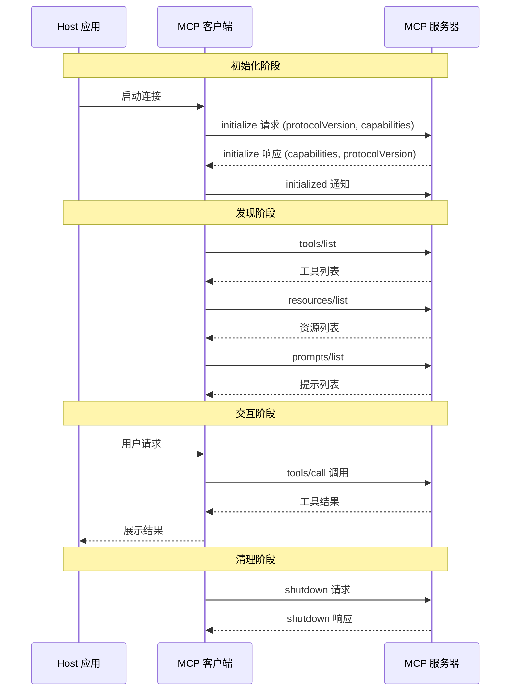
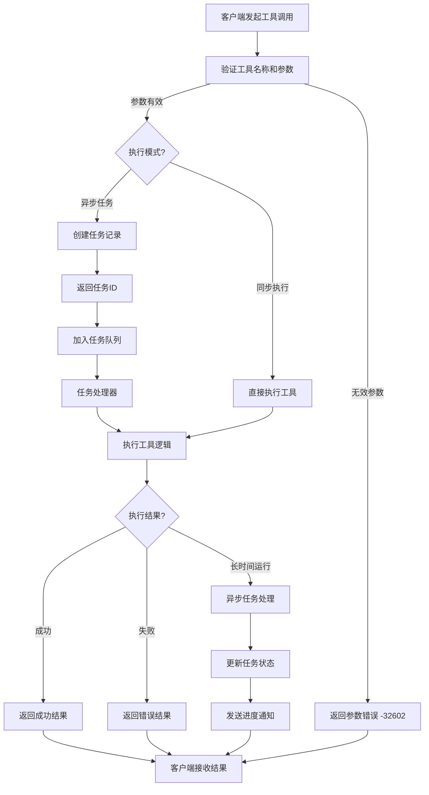
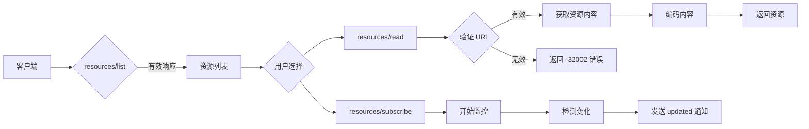
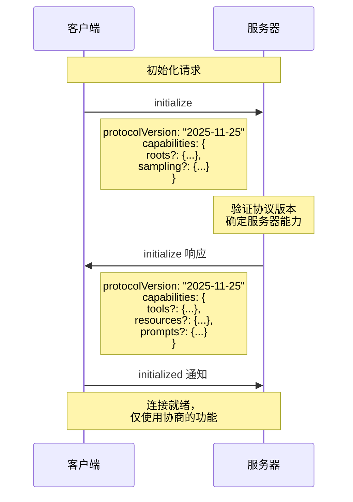
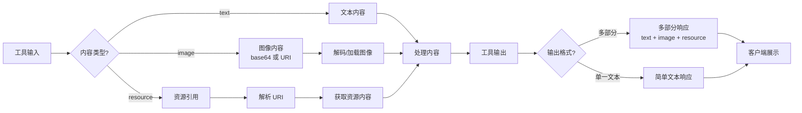
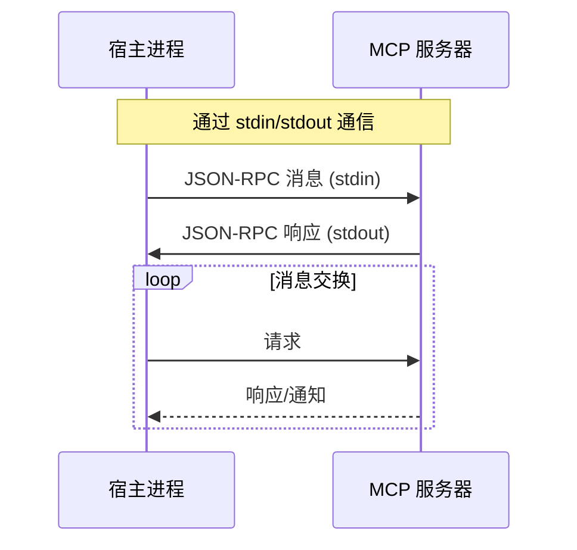
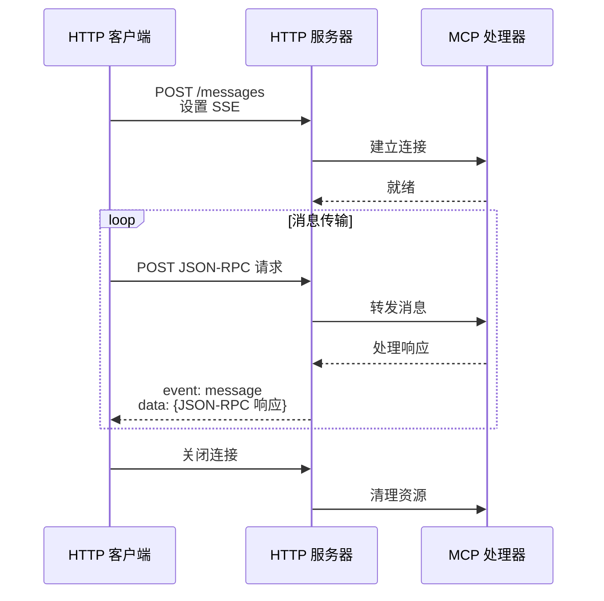
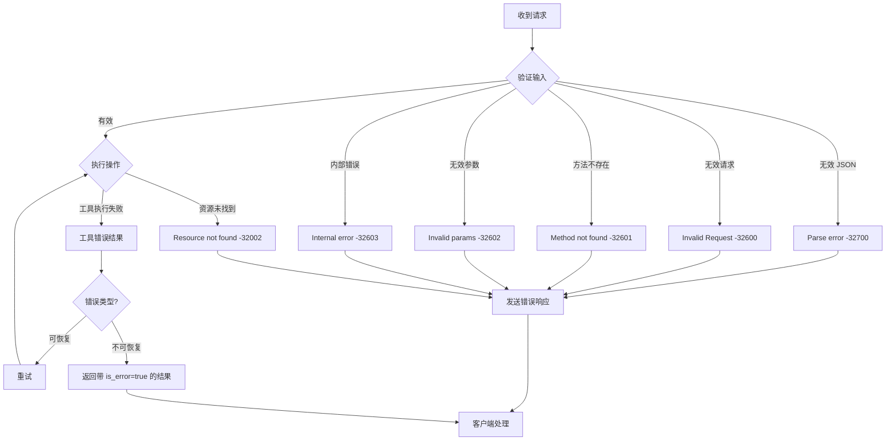
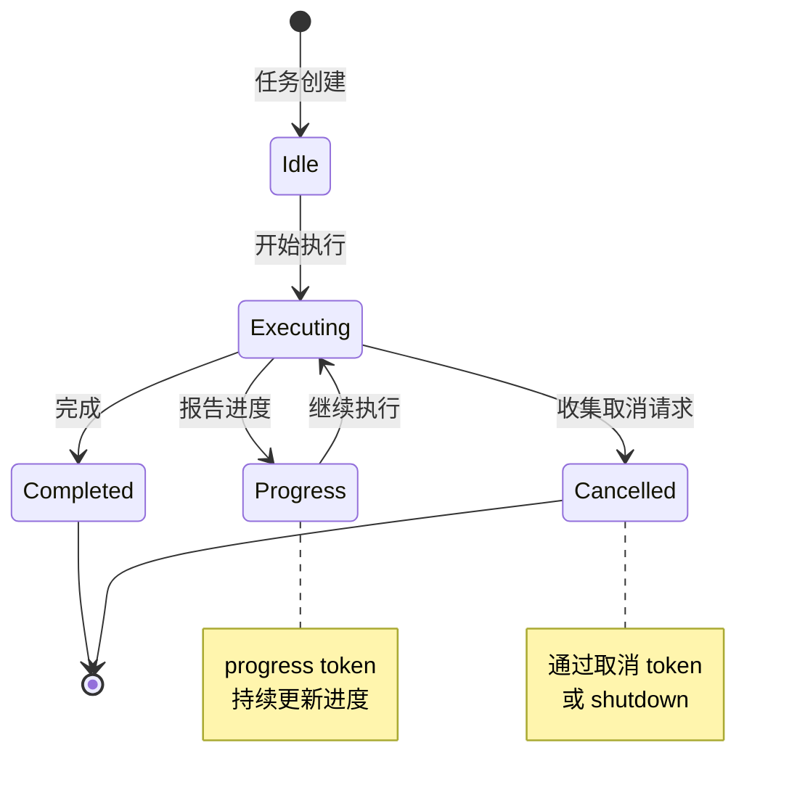
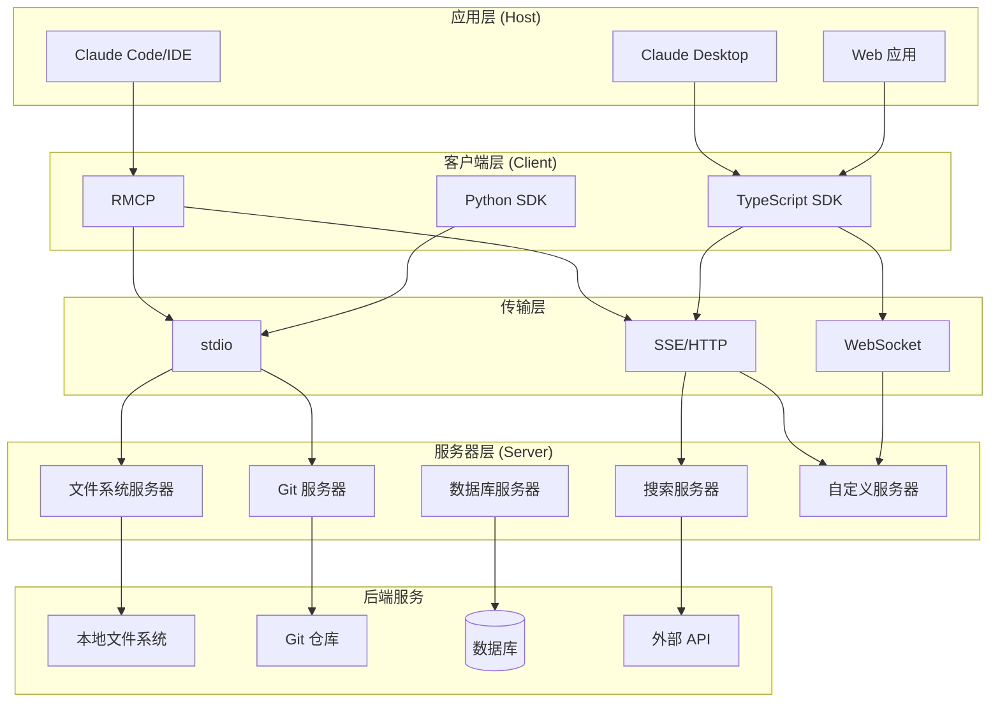

# MCP 交互流程图

本文档描述 Model Context Protocol (MCP) 的核心交互流程，基于 MCP 2025-11-25 规范。

## 架构概述

MCP 使用 JSON-RPC 2.0 消息格式，在三个角色之间建立通信：

- **Host（宿主应用）**: LLM 应用，发起连接
- **Client（客户端）**: 宿主应用内的连接器
- **Server（服务器）**: 提供上下文和能力的服务

---

## 1. 连接生命周期

---

## 2. 工具调用流程

---

## 3. 资源访问流程

---

## 4. 能力协商流程

### 服务器能力

| 能力 | 说明 |
|------|------|
| `tools` | 服务器提供可执行的工具 |
| `resources` | 服务器提供数据资源 |
| `prompts` | 服务器提供模板化提示 |

### 客户端能力

| 能力 | 说明 |
|------|------|
| `sampling` | 支持服务器发起的 LLM 采样 |
| `roots` | 支持服务器查询 URI/文件系统边界 |
| `elicitation` | 支持服务器请求额外用户信息 |

---

## 5. 多模态内容处理

---

## 6. 传输层

### 6.1 stdio 传输

### 6.2 HTTP/SSE 传输

---

## 7. 错误处理

### JSON-RPC 标准错误码

| 错误码 | 说明 |
|--------|------|
| `-32700` | Parse error（解析错误） |
| `-32600` | Invalid Request（无效请求） |
| `-32601` | Method not found（方法未找到） |
| `-32602` | Invalid params（无效参数） |
| `-32603` | Internal error（内部错误） |

### MCP 特定错误码

| 错误码 | 说明 |
|--------|------|
| `-32000` to `-32099` | 服务器/实现特定错误 |
| `-32002` | Resource not found（资源未找到） |

---

## 8. 进度和取消

---

## 9. 生态系统架构

---

## 相关资源

- [MCP 官方规范](https://modelcontextprotocol.io/specification/2025-11-25/)
- [MCP GitHub 仓库](https://github.com/modelcontextprotocol/modelcontextprotocol)
- [Anthropic MCP 文档](https://docs.anthropic.com/en/docs/mcp)
