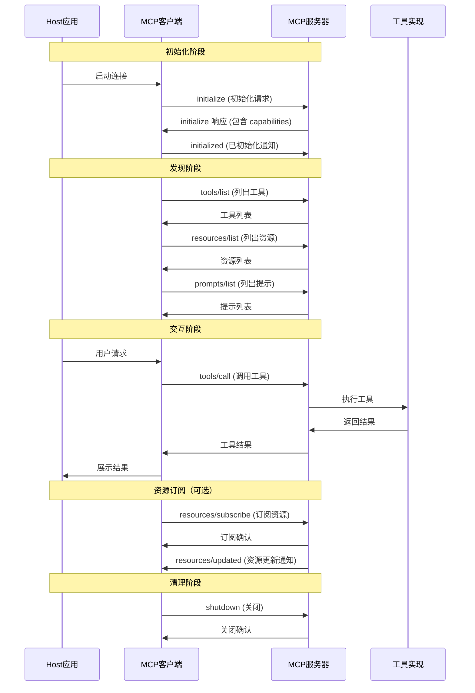
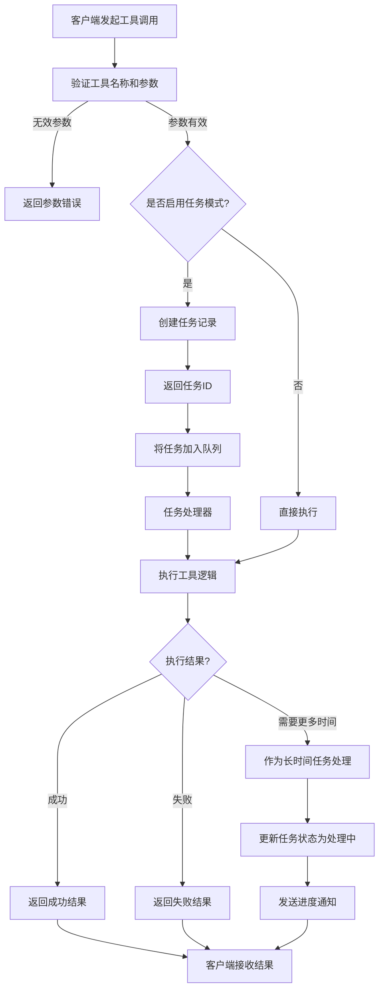
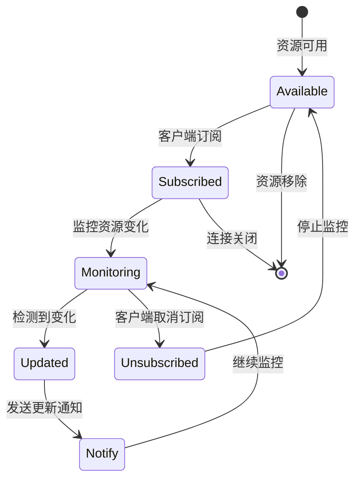
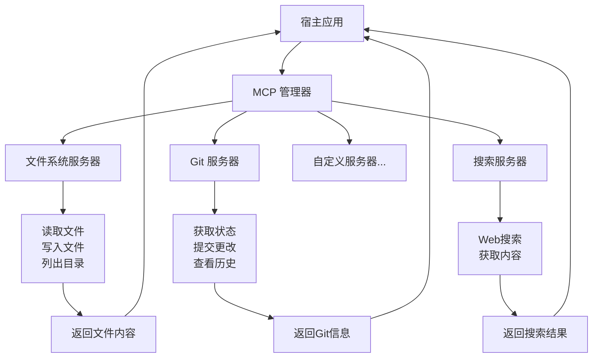
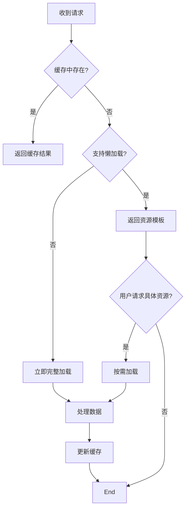
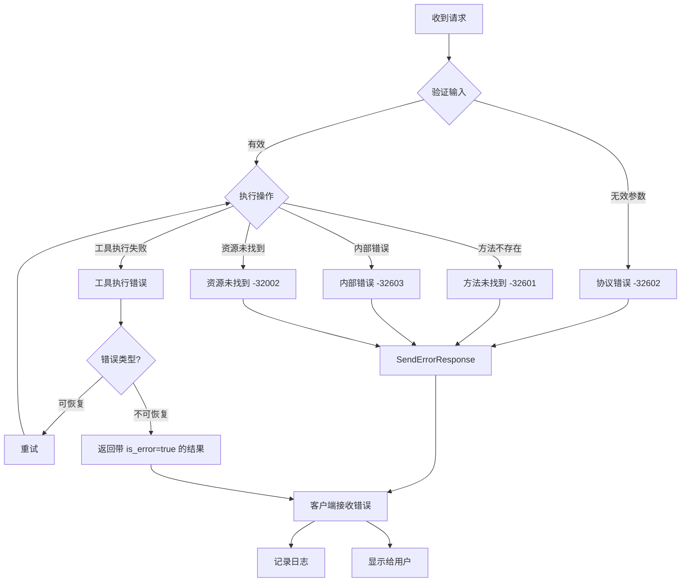
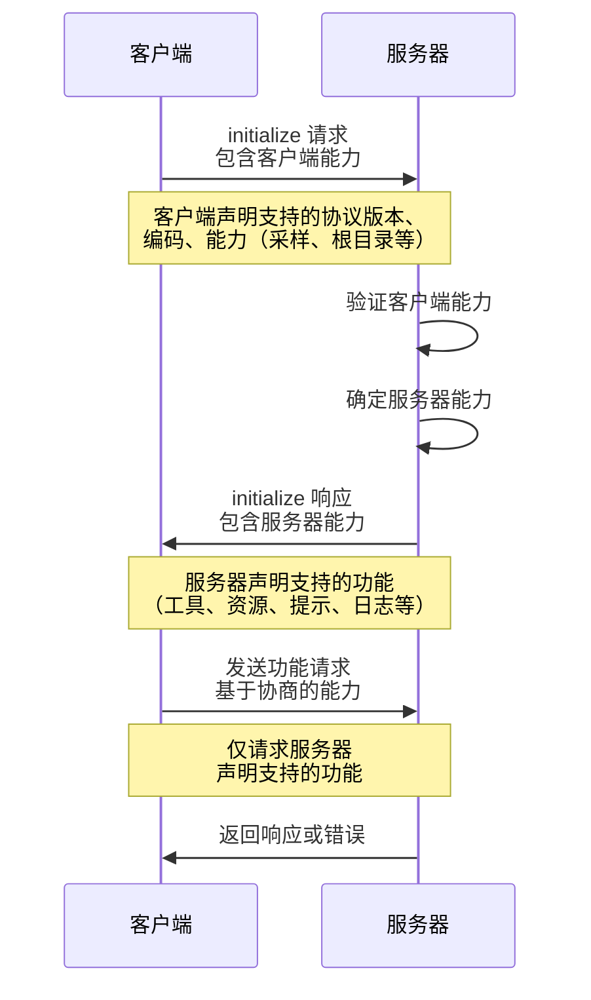
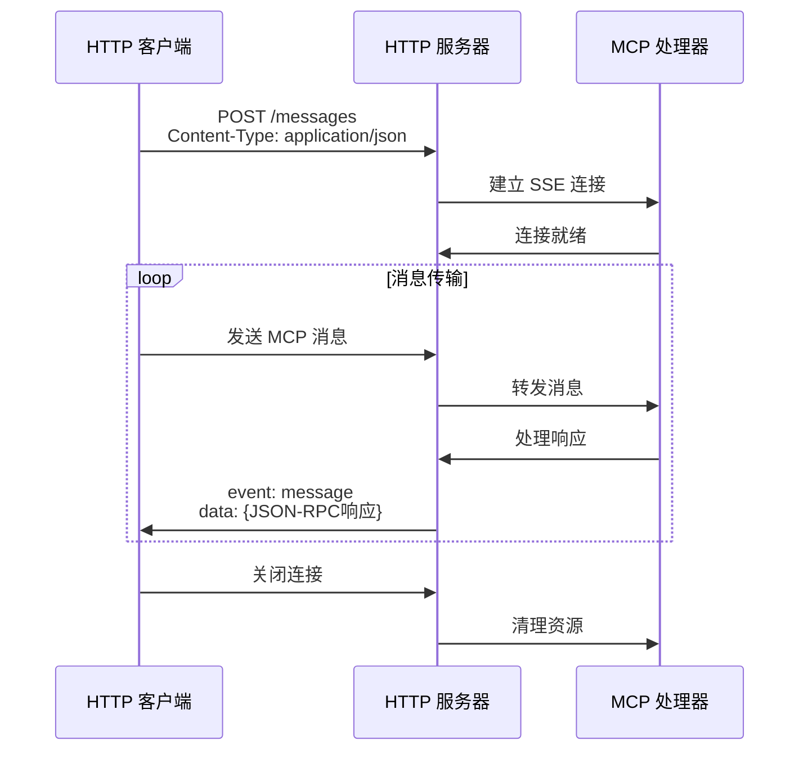
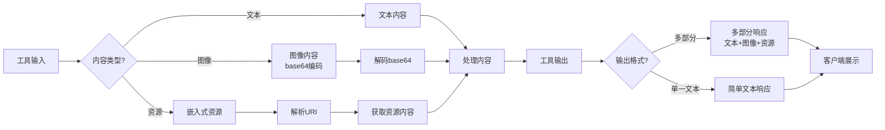
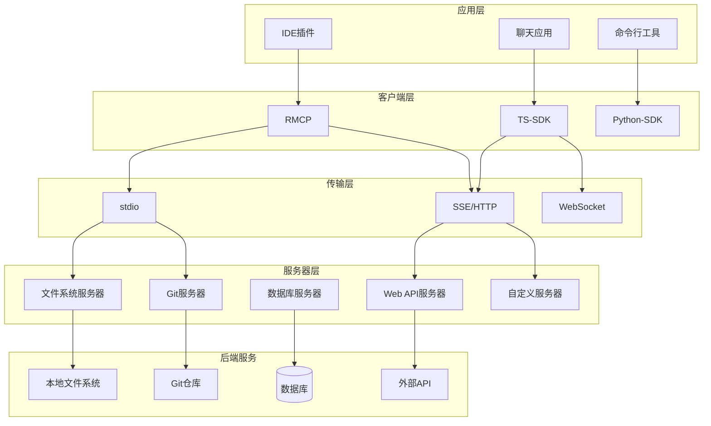

# MCP 交互流程图

## 1. 完整的 MCP 会话生命周期

```mermaid
sequenceDiagram
    participant Host as Host应用
    participant Client as MCP客户端
    participant Server as MCP服务器
    participant Tool as 工具实现

    Note over Host,Server: 初始化阶段
    Host->>Client: 启动连接
    Client->>Server: initialize (初始化请求)
    Server->>Client: initialize 响应 (包含 capabilities)
    Client->>Server: initialized (已初始化通知)

    Note over Host,Server: 发现阶段
    Client->>Server: tools/list (列出工具)
    Server->>Client: 工具列表
    Client->>Server: resources/list (列出资源)
    Server->>Client: 资源列表
    Client->>Server: prompts/list (列出提示)
    Server->>Client: 提示列表

    Note over Host,Server: 交互阶段
    Host->>Client: 用户请求
    Client->>Server: tools/call (调用工具)
    Server->>Tool: 执行工具
    Tool->>Server: 返回结果
    Server->>Client: 工具结果
    Client->>Host: 展示结果

    Note over Host,Server: 资源订阅（可选）
    Client->>Server: resources/subscribe (订阅资源)
    Server->>Client: 订阅确认
    Server->>Client: resources/updated (资源更新通知)

    Note over Host,Server: 清理阶段
    Client->>Server: shutdown (关闭)
    Server->>Client: 关闭确认
```

## 2. 工具调用详细流程

```mermaid
flowchart TD
    Start[客户端发起工具调用] --> Validate[验证工具名称和参数]
    Validate -->|无效参数| Error1[返回参数错误]
    Validate -->|参数有效| CheckTask{是否启用任务模式?}

    CheckTask -->|是| CreateTask[创建任务记录]
    CreateTask --> ReturnTaskId[返回任务ID]
    ReturnTaskId --> Queue[将任务加入队列]

    CheckTask -->|否| DirectExec[直接执行]

    Queue --> Process[任务处理器]
    Process --> Execute[执行工具逻辑]

    DirectExec --> Execute
    Execute --> CheckResult{执行结果?}

    CheckResult -->|成功| Success[返回成功结果]
    CheckResult -->|失败| Failure[返回失败结果]
    CheckResult -->|需要更多时间| LongRunning[作为长时间任务处理]

    LongRunning --> UpdateStatus[更新任务状态为处理中]
    UpdateStatus --> NotifyProgress[发送进度通知]

    Success --> End[客户端接收结果]
    Failure --> End
    NotifyProgress --> End
```

## 3. 资源订阅流程

```mermaid
stateDiagram-v2
    [*] --> Available: 资源可用
    Available --> Subscribed: 客户端订阅
    Subscribed --> Monitoring: 监控资源变化

    Monitoring --> Updated: 检测到变化
    Updated --> Notify: 发送更新通知
    Notify --> Monitoring: 继续监控

    Monitoring --> Unsubscribed: 客户端取消订阅
    Unsubscribed --> Available: 停止监控

    Available --> [*]: 资源移除
    Subscribed --> [*]: 连接关闭
```

## 4. 多服务器管理流程

```mermaid
graph TB
    Host[宿主应用] --> MCPManager[MCP 管理器]

    MCPManager --> Server1[文件系统服务器]
    MCPManager --> Server2[Git 服务器]
    MCPManager --> Server3[搜索服务器]
    MCPManager --> ServerN[自定义服务器...]

    Server1 --> Tools1[读取文件<br/>写入文件<br/>列出目录]
    Server2 --> Tools2[获取状态<br/>提交更改<br/>查看历史]
    Server3 --> Tools3[Web搜索<br/>获取内容]

    Tools1 --> Results1[返回文件内容]
    Tools2 --> Results2[返回Git信息]
    Tools3 --> Results3[返回搜索结果]

    Results1 --> Host
    Results2 --> Host
    Results3 --> Host
```

## 5. 懒加载实现流程

```mermaid
flowchart TD
    Start[收到请求] --> CheckCache{缓存中存在?}

    CheckCache -->|是| ReturnCached[返回缓存结果]
    CheckCache -->|否| CheckLazy{支持懒加载?}

    CheckLazy -->|否| LoadFull[立即完整加载]
    CheckLazy -->|是| ReturnTemplate[返回资源模板]

    LoadFull --> Process[处理数据]
    Process --> Cache[更新缓存]
    Cache --> End

    ReturnTemplate --> UserRequest{用户请求具体资源?}
    UserRequest -->|是| LoadOnDemand[按需加载]
    UserRequest -->|否| End

    LoadOnDemand --> Process
```

## 6. 错误处理流程

```mermaid
flowchart TD
    Request[收到请求] --> Validate{验证输入}

    Validate -->|无效参数| ProtocolError[协议错误 -32602]
    Validate -->|有效| Execute{执行操作}

    Execute -->|方法不存在| MethodNotFound[方法未找到 -32601]
    Execute -->|内部错误| InternalError[内部错误 -32603]
    Execute -->|资源未找到| ResourceNotFound[资源未找到 -32002]
    Execute -->|工具执行失败| ToolError[工具执行错误]

    ProtocolError --> SendErrorResponse
    MethodNotFound --> SendErrorResponse
    InternalError --> SendErrorResponse
    ResourceNotFound --> SendErrorResponse

    ToolError --> CheckErrorType{错误类型?}
    CheckErrorType -->|可恢复| Retry[重试]
    CheckErrorType -->|不可恢复| ReturnToolError[返回带 is_error=true 的结果]

    Retry --> Execute

    SendErrorResponse --> Client[客户端接收错误]
    ReturnToolError --> Client

    Client --> Log[记录日志]
    Client --> Display[显示给用户]
```

## 7. 服务器能力协商流程

```mermaid
sequenceDiagram
    participant C as 客户端
    participant S as 服务器

    C->>S: initialize 请求<br/>包含客户端能力
    Note over C,S: 客户端声明支持的协议版本、<br/>编码、能力（采样、根目录等）

    S->>S: 验证客户端能力
    S->>S: 确定服务器能力

    S->>C: initialize 响应<br/>包含服务器能力
    Note over C,S: 服务器声明支持的功能<br/>（工具、资源、提示、日志等）

    C->>S: 发送功能请求<br/>基于协商的能力
    Note over C,S: 仅请求服务器<br/>声明支持的功能

    S->>C: 返回响应或错误
```

## 8. 流式 HTTP 传输

```mermaid
sequenceDiagram
    participant Client as HTTP 客户端
    participant Server as HTTP 服务器
    participant MCP as MCP 处理器

    Client->>Server: POST /messages<br/>Content-Type: application/json

    Server->>MCP: 建立 SSE 连接
    MCP->>Server: 连接就绪

    loop 消息传输
        Client->>Server: 发送 MCP 消息
        Server->>MCP: 转发消息
        MCP->>Server: 处理响应
        Server->>Client: event: message<br/>data: {JSON-RPC响应}
    end

    Client->>Server: 关闭连接
    Server->>MCP: 清理资源
```

## 9. 多模态内容处理

```mermaid
flowchart LR
    Input[工具输入] --> Type{内容类型?}

    Type -->|文本| Text[文本内容]
    Type -->|图像| Image[图像内容<br/>base64编码]
    Type -->|资源| Resource[嵌入式资源]

    Text --> Process[处理内容]
    Image --> Decode[解码base64]
    Decode --> Process

    Resource --> Resolve[解析URI]
    Resolve --> Fetch[获取资源内容]
    Fetch --> Process

    Process --> Output[工具输出]
    Output --> Format{输出格式?}

    Format -->|单一文本| SimpleText[简单文本响应]
    Format -->|多部分| Multipart[多部分响应<br/>文本+图像+资源]

    Multipart --> Client[客户端展示]
    SimpleText --> Client
```

## 10. MCP 生态系统集成

```mermaid
graph TB
    subgraph "应用层"
        IDE[IDE插件]
        Chat[聊天应用]
        CLI[命令行工具]
    end

    subgraph "客户端层"
        RustClient[RMCP]
        TSClient[TS-SDK]
        PyClient[Python-SDK]
    end

    subgraph "传输层"
        Stdio[stdio]
        HTTP[SSE/HTTP]
        WebSocket[WebSocket]
    end

    subgraph "服务器层"
        FileSystem[文件系统服务器]
        Git[Git服务器]
        Database[数据库服务器]
        WebAPI[Web API服务器]
        Custom[自定义服务器]
    end

    subgraph "后端服务"
        Files[本地文件系统]
        GitRepo[Git仓库]
        DB[(数据库)]
        API[外部API]
    end

    IDE --> RustClient
    Chat --> TSClient
    CLI --> PyClient

    RustClient --> Stdio
    RustClient --> HTTP
    TSClient --> HTTP
    TSClient --> WebSocket

    Stdio --> FileSystem
    Stdio --> Git
    HTTP --> WebAPI
    HTTP --> Custom

    FileSystem --> Files
    Git --> GitRepo
    Database --> DB
    WebAPI --> API
```
