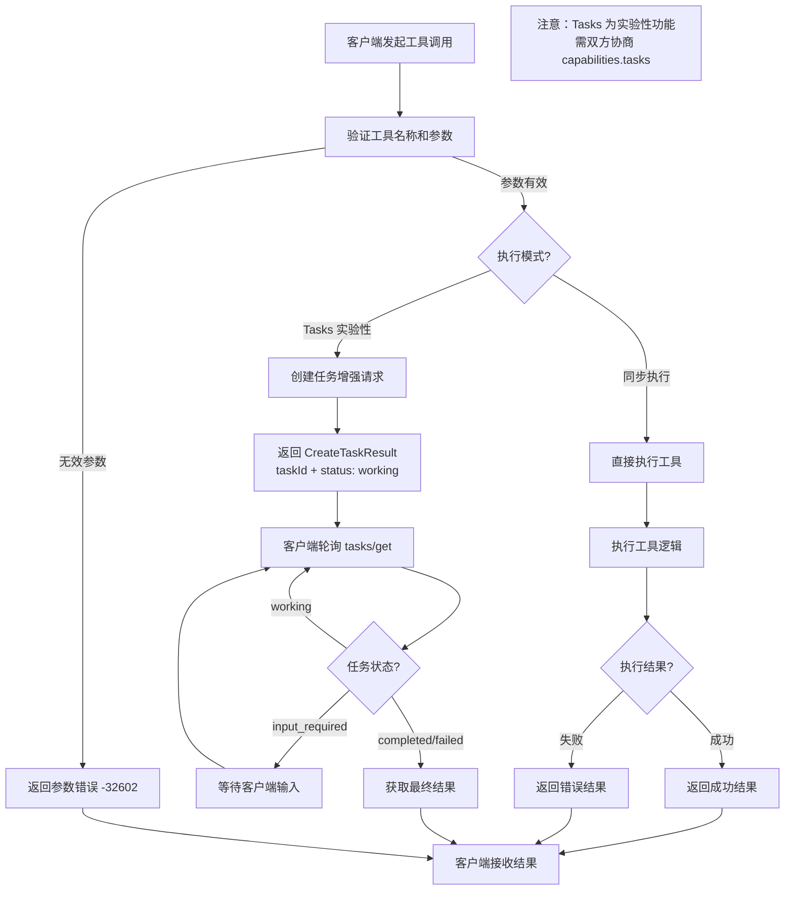
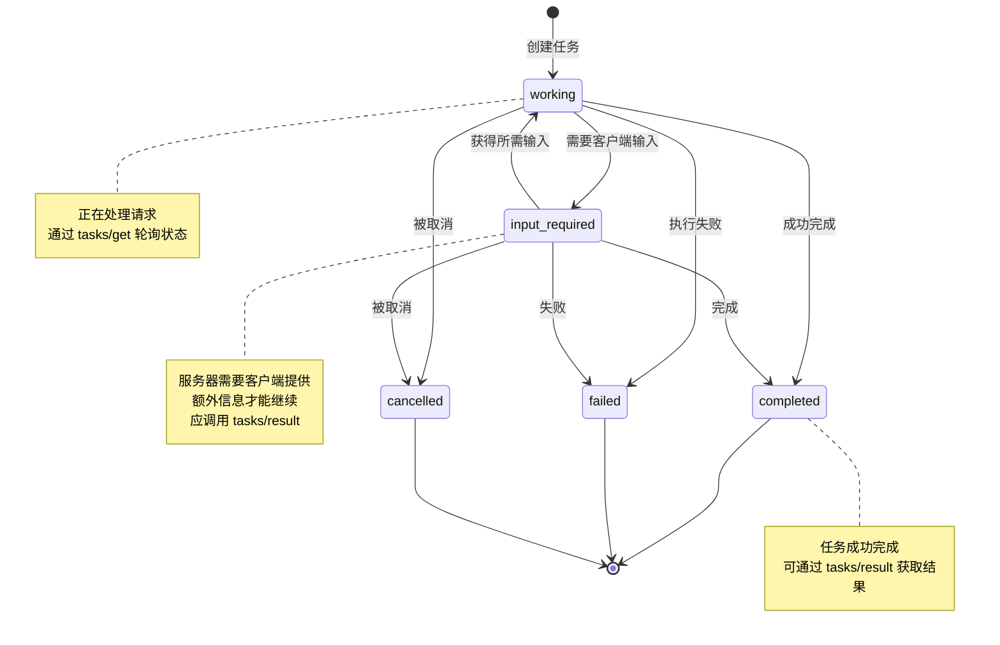
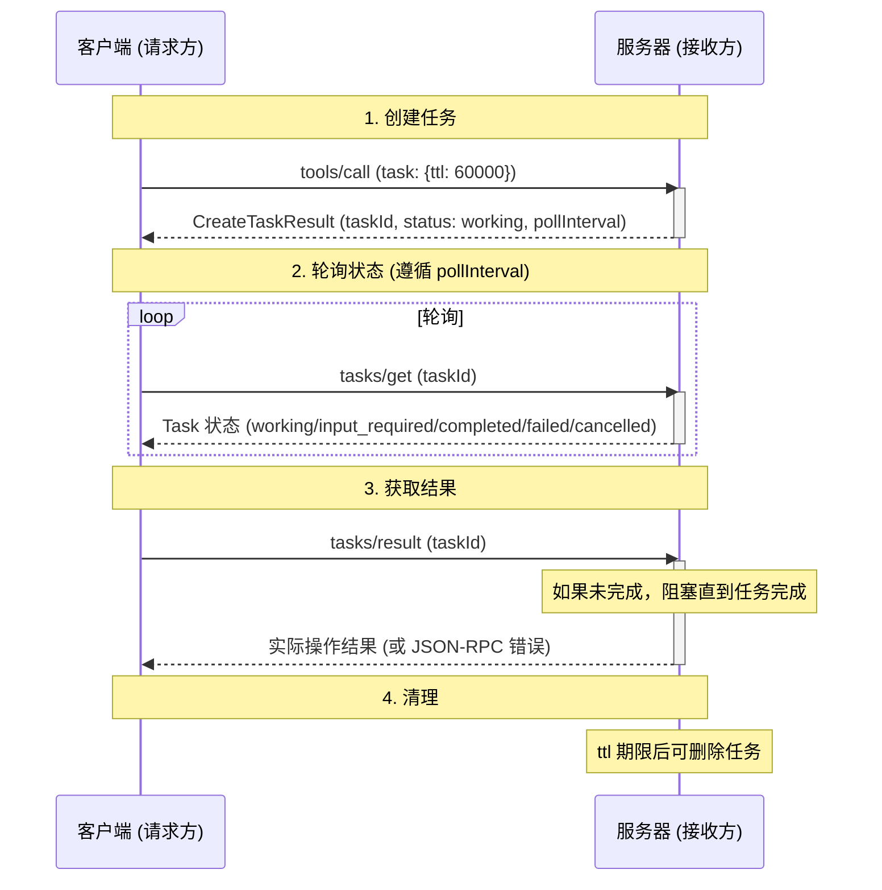

# MCP 交互流程图

本文档描述 Model Context Protocol (MCP) 的核心交互流程，基于 **MCP 2025-11-25** 规范。

**版本说明**：
- 当前协议版本：`2025-11-25`
- 新增实验性功能：Tasks（任务系统），支持长时间运行的异步操作
- 协议使用字符串版本标识符（`YYYY-MM-DD` 格式）

## 架构概述

MCP 使用 JSON-RPC 2.0 消息格式，在三个角色之间建立通信：

- **Host（宿主应用）**: LLM 应用，发起连接
- **Client（客户端）**: 宿主应用内的连接器
- **Server（服务器）**: 提供上下文和能力的服务

---

## 1. 连接生命周期


---

## 2. 工具调用流程



**工具级别任务支持协商**：

工具在 `tools/list` 响应中可通过 `execution.taskSupport` 声明任务支持级别：

| 值 | 说明 |
|---|---|
| `"required"` | 必须作为任务调用 |
| `"optional"` | 可选作为任务调用 |
| `"forbidden"` | 不支持任务调用 |

---

## 3. 资源访问流程


---

## 4. 能力协商流程


### 服务器能力

| 能力 | 说明 |
|------|------|
| `tools` | 服务器提供可执行的工具 |
| `resources` | 服务器提供数据资源 |
| `prompts` | 服务器提供模板化提示 |
| `tasks` | 实验性：支持任务增强的异步操作 |

### 客户端能力

| 能力 | 说明 |
|------|------|
| `sampling` | 支持服务器发起的 LLM 采样 |
| `roots` | 支持服务器查询 URI/文件系统边界 |
| `elicitation` | 支持服务器请求额外用户信息 |
| `tasks` | 实验性：支持任务增强的异步操作 |

---

## 5. 多模态内容处理


---

## 6. 传输层

### 6.1 stdio 传输


### 6.2 HTTP/SSE 传输


---

## 7. 错误处理


### JSON-RPC 标准错误码

| 错误码 | 说明 |
|--------|------|
| `-32700` | Parse error（解析错误） |
| `-32600` | Invalid Request（无效请求） |
| `-32601` | Method not found（方法未找到） |
| `-32602` | Invalid params（无效参数） |
| `-32603` | Internal error（内部错误） |

### MCP 特定错误码

| 错误码 | 说明 |
|--------|------|
| `-32000` to `-32099` | 服务器/实现特定错误 |
| `-32002` | Resource not found（资源未找到） |
| `-32601` | Method not found（方法不支持，如尝试对不支持 tasks 的工具使用任务增强） |

---

## 8. 进度和取消

### 8.1 传统进度机制


### 8.2 Tasks 系统（实验性功能）

> **注意**：Tasks 在 2025-11-25 版本中引入，目前为**实验性功能**。其设计和行为可能在未来的协议版本中发生变化。

Tasks 提供了一种持久化状态机，用于跟踪请求的执行状态，支持长时间运行的操作和延迟结果检索。

#### 任务状态流转



#### 任务交互流程



#### 任务能力协商

**服务器能力声明**：
```json
{
  "capabilities": {
    "tasks": {
      "list": {},
      "cancel": {},
      "requests": {
        "tools": {
          "call": {}
        }
      }
    }
  }
}
```

**客户端能力声明**：
```json
{
  "capabilities": {
    "tasks": {
      "list": {},
      "cancel": {},
      "requests": {
        "sampling": {
          "createMessage": {}
        }
      }
    }
  }
}
```

#### 关键操作

| 操作 | 说明 |
|------|------|
| `tasks/get` | 轮询任务状态 |
| `tasks/result` | 获取任务结果（会阻塞直到完成） |
| `tasks/list` | 列出所有任务（支持分页） |
| `tasks/cancel` | 取消任务 |
| `notifications/tasks/status` | 任务状态变化通知（可选） |

#### input_required 状态

当任务进入 `input_required` 状态时：
- 服务器需要客户端提供额外信息
- 客户端应调用 `tasks/result` 来接收输入请求
- 所有相关请求必须包含 `io.modelcontextprotocol/related-task` 元数据

---

## 9. 生态系统架构


---

## 相关资源

- [MCP 官方规范](https://modelcontextprotocol.io/specification/2025-11-25/)
  - [Tasks 规范（实验性）](https://modelcontextprotocol.io/specification/2025-11-25/basic/utilities/tasks)
  - [生命周期管理](https://modelcontextprotocol.io/specification/2025-11-25/basic/lifecycle)
  - [传输层](https://modelcontextprotocol.io/specification/2025-11-25/basic/transports)
- [MCP GitHub 仓库](https://github.com/modelcontextprotocol/modelcontextprotocol)
- [Anthropic MCP 文档](https://docs.anthropic.com/en/docs/mcp)
