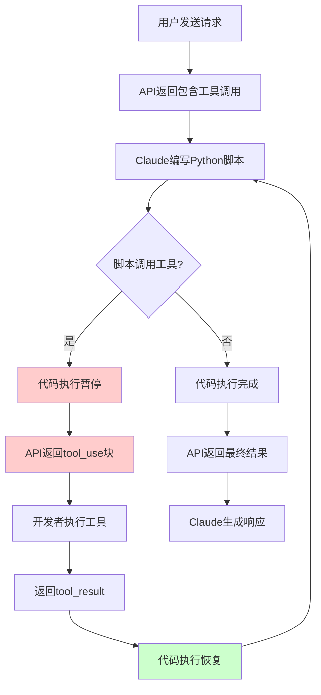

# Programmatic Tool Calling 完全探索报告

## 一、概述

Programmatic Tool Calling（程序化工具调用，简称PTC）允许 Claude 在代码执行容器中通过代码调用工具，而不需要为每个工具调用进行模型推理往返。这种方式显著降低多工具工作流程的端到端延迟，并通过允许 Claude 在数据进入其上下文窗口之前进行过滤或处理，大幅减少令牌消耗。

### 1.1 核心价值

PTC 解决了传统工具调用的两大根本问题：

- **推理开销**：传统模式下每次工具调用都需要完整的模型推理过程
- **上下文污染**：工具返回的大量原始数据会填满 Claude 的上下文窗口

通过让 Claude 在 Python 脚本中表达编排逻辑，PTC 实现了更高效的工具调用流程。在代码执行环境中批量处理多个工具调用，只有最终处理结果进入模型上下文。

**性能提升**：根据 Anthropic 内部测试，平均令牌使用量从 43,588 降至 27,297，降幅达 **37%**。

### 1.2 技术定位

PTC 是 Claude 高级工具使用功能之一，与 Tool Use Examples 和 Tool Search Tool 共同构成新一代 Claude 开发者平台的能力矩阵。该功能目前处于**正式发布（GA）**状态。

**重要说明**：该功能不受零数据保留（ZDR）安排保护，数据将按照功能的标准保留政策进行处理。

## 二、模型兼容性

PTC 需要启用 Code Execution 工具。该功能目前处于**正式发布（GA）**状态，无需特殊的 beta header。

### 支持的模型

| 模型名称 | Tool Version |
|---------|-------------|
| Claude Opus 4.6 (`claude-opus-4-6`) | `code_execution_20260120` |
| Claude Sonnet 4.6 (`claude-sonnet-4-6`) | `code_execution_20260120` |
| Claude Sonnet 4.5 (`claude-sonnet-4-5-20250929`) | `code_execution_20260120` |
| Claude Opus 4.5 (`claude-opus-4-5-20251101`) | `code_execution_20260120` |

通过 Claude API 和 Microsoft Foundry 提供服务。

## 三、核心概念

### 3.1 allowed_callers 字段

用于指定哪些上下文可以调用工具，实现工具的细粒度控制。

**可选值**：
- `["direct"]` - 仅允许 Claude 直接调用（默认值）
- `["code_execution_20260120"]` - 仅允许从代码执行中调用
- `["direct", "code_execution_20260120"]` - 两种方式都允许

**最佳实践**：为每个工具选择单一调用方式，以向 Claude 提供清晰的使用指导。

### 3.2 caller 字段

出现在工具使用块中，用于指示工具是如何被调用的。

- **直接调用**：`caller.type` 为 `"direct"`
- **程序化调用**：`caller.type` 为 `"code_execution_20260120"`，并包含 `tool_id` 引用发起调用的代码执行工具

### 3.3 响应格式类型

| 类型 | 用途 |
|-----|------|
| `tool_use` | 代码执行调用的工具请求（包含 caller 字段） |
| `code_execution_tool_result` | 工具结果返回给代码执行环境 |
| `server_tool_use` | 代码执行工具本身的使用块 |

### 3.4 容器生命周期

- **创建**：每个会话创建新容器，除非重用现有容器
- **过期**：约 4.5 分钟无活动后过期（可能变化）
- **重用**：通过传递 `container` ID 维护状态
- **过期处理**：监控 `expires_at` 字段，避免工具调用期间容器过期

## 四、工作流程

### 4.1 完整调用流程



### 4.2 关键步骤

1. **初始请求**：发送包含代码执行工具和允许程序化调用的工具的 API 请求
2. **代码生成**：Claude 编写 Python 脚本来编排工具调用
3. **工具调用**：当代码调用工具函数时，执行暂停并返回 tool_use 块
4. **结果返回**：提供工具结果，代码执行继续（中间结果不进入 Claude 上下文）
5. **完成处理**：所有工具调用完成后，Claude 接收最终输出并继续任务

### 4.3 消息格式限制

**重要**：当响应程序化工具调用时，消息必须**仅包含 tool_result 块**，不能包含任何文本内容。

**无效示例**（不能包含文本）：
```json
{
  "role": "user",
  "content": [
    {
      "type": "tool_result",
      "tool_use_id": "toolu_01",
      "content": "[{\"customer_id\": \"C1\", \"revenue\": 45000}]"
    },
    {
      "type": "text",
      "text": "What should I do next?"
    }
  ]
}
```

**有效示例**（仅包含 tool_result）：
```json
{
  "role": "user",
  "content": [
    {
      "type": "tool_result",
      "tool_use_id": "toolu_01",
      "content": "[{\"customer_id\": \"C1\", \"revenue\": 45000}]"
    }
  ]
}
```

此限制仅适用于程序化工具调用，常规客户端工具调用可在 tool_result 后包含文本。

## 五、高级模式

### 5.1 批处理与循环

处理多个项目时，循环模式显著减少模型往返次数。例如：查询多个地区的销售数据、批量检查端点健康状态等。

**优势**：
- 将 N 个模型往返减少为 1 个
- 在返回前程序化处理大型结果集
- 只返回聚合结论而非原始数据

### 5.2 提前终止

一旦满足成功条件即可停止处理。例如：查找第一个健康的端点后立即停止检查。

### 5.3 条件工具选择

根据中间结果决定使用哪个工具。例如：根据文件大小决定读取完整内容还是摘要。

### 5.4 数据过滤

程序化过滤大型数据集，只返回相关信息。例如：从日志中提取最后 10 条错误记录。

## 六、最佳实践

### 6.1 工具设计

- **提供详细输出描述**：在工具描述中明确说明返回数据的格式（JSON 结构、字段类型等）
- **返回结构化数据**：使用 JSON 或其他易解析格式
- **保持响应简洁**：只返回必要的数据

### 6.2 代码编写

- **使用异步代码**：PTC 自动将工具转换为异步 Python 函数
- **错误处理**：实现适当的超时和错误处理逻辑

### 6.3 性能优化

- **监控容器过期时间**：通过 `expires_at` 字段跟踪，避免工具调用期间容器过期
- **实现工具执行超时**：防止长时间运行的操作，如果工具响应时间过长，代码执行将收到 TimeoutError
- **拆分长操作**：将复杂操作分解为更小的块

## 七、限制与注意事项

### 7.1 功能不兼容性

| 功能 | 限制 |
|-----|------|
| Structured outputs | 带有 `strict: true` 的工具不支持程序化调用 |
| Tool choice | 无法通过 `tool_choice` 强制程序化调用特定工具 |
| Parallel tool use | `disable_parallel_tool_use: true` 不支持程序化调用 |

### 7.2 工具限制

目前不支持通过 MCP connector 提供的工具，未来版本可能添加支持。

### 7.3 安全注意事项

- **工具结果作为字符串返回**：工具结果作为字符串返回，可能包含代码片段或可执行命令，这些内容可能会被代码执行环境处理
- **验证外部工具结果**：如果工具返回外部数据或接受用户输入，注意代码注入风险，特别是在输出将被解释或执行为代码时
- **不在 ZDR 覆盖范围内**：该功能不受零数据保留（ZDR）安排保护

### 7.4 常见错误

| 错误 | 描述 | 解决方案 |
|-----|------|---------|
| `invalid_tool_input` | 工具输入与架构不匹配 | 验证工具的 `input_schema` |
| `tool_not_allowed` | 工具不允许请求的调用者类型 | 检查 `allowed_callers` 包含正确的上下文 |
| `missing_beta_header` | 缺少必需的 beta header | 添加必需的 beta headers |

## 八、使用场景

PTC 特别适用于以下场景：

- **大规模数据处理**：在数据进入 Claude 上下文前进行过滤或聚合
- **多步骤工作流**：串行或循环调用工具，无需中间模型采样
- **条件逻辑**：基于中间工具结果做出决策
- **跨多个项目的并行操作**：同时检查大量端点或数据项

## 九、总结

Programmatic Tool Calling 代表了 Claude 工具使用能力的重大升级。通过在代码执行环境中编排工具调用，PTC 实现了更高效的复杂工作流处理，显著降低令牌消耗和延迟，同时支持更复杂的条件逻辑和并行操作。

**核心优势**：
- 平均降低 37% 的令牌使用量
- 减少多工具工作流程的端到端延迟
- 支持复杂的数据处理和条件逻辑

## 十、参考资料

- [Programmatic Tool Calling - Claude API Docs](https://platform.claude.com/docs/en/agents-and-tools/tool-use/programmatic-tool-calling)
- [Advanced Tool Use - Anthropic Engineering](https://www.anthropic.com/engineering/advanced-tool-use)
- [Programmatic Tool Calling Cookbook](https://platform.claude.com/cookbook/tool-use-programmatic-tool-calling-ptc)
- [Claude Cookbooks - Programmatic Tool Calling Notebook](https://github.com/anthropics/claude-cookbooks/blob/main/tool_use/programmatic_tool_calling_ptc.ipynb)
