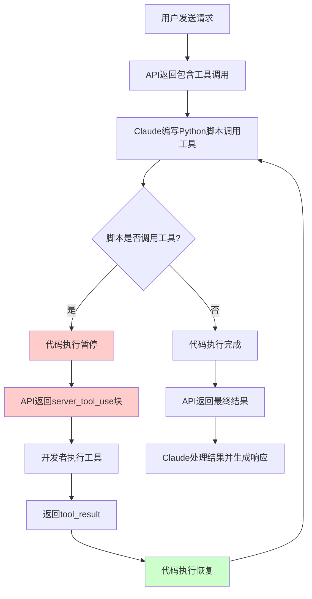
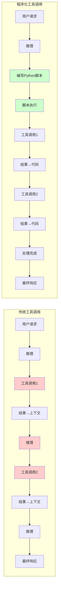

# Programmatic Tool Calling 完全探索报告

## 一、概述

Programmatic Tool Calling（程序化工具调用，简称PTC）是Claude API提供的一项高级功能，它允许Claude通过代码执行环境来调用工具，而不是通过传统的单个API往返调用。这种方式能够显著降低多工具工作流程的端到端延迟，并通过允许模型在数据进入其上下文窗口之前进行过滤或处理，从而大幅减少令牌消耗。

### 1.1 核心价值主张

Programmatic Tool Calling的出现是为了解决传统工具调用在处理复杂工作流程时面临的两大根本性问题。首先是推理开销和手动综合问题：每次工具调用都需要完整的模型推理过程，收到结果后，Claude必须“目视”数据以提取相关信息，推理各部分如何组合，并决定下一步行动。其次是上下文污染问题：当工具返回大量原始数据时，这些数据会填满Claude的上下文窗口，消耗本可以用于推理的Token。

Programmatic Tool Calling通过让Claude在Python代码中表达编排逻辑来解决这些问题。Claude擅长编写代码，通过让它用Python而不是自然语言来表达编排逻辑，可以实现更高效的工具调用流程。在传统工具调用中，每个工具的结果都会返回到Claude的上下文，而Programmatic Tool Calling则让Claude编写一个Python脚本来编排整个工作流程，该脚本在Code Execution工具（沙盒环境）中运行，当需要从工具获取结果时会暂停执行。

### 1.2 技术定位

Programmatic Tool Calling是Anthropic在2025年推出的高级工具使用功能之一，与Tool Use Examples（工具使用示例）和Tool Search Tool（工具搜索工具）共同构成了新一代Claude开发者平台的能力矩阵。这些功能使得构建能够跨数百或数千个工具工作的AI代理成为可能。

## 二、技术架构

### 2.1 支持的模型版本

Programmatic Tool Calling是一项功能特性，需要启用Code Execution工具才能使用。以下是支持该功能的模型列表：

| 模型名称 | 工具版本 |
|---------|---------|
| Claude Opus 4.6（claude-opus-4-6） | code_execution_20260120 |
| Claude Sonnet 4.6（claude-sonnet-4-6） | code_execution_20260120 |
| Claude Sonnet 4.5（claude-sonnet-4-5-20250929） | code_execution_20260120 |
| Claude Opus 4.5（claude-opus-4-5-20251101） | code_execution_20260120 |

需要注意的是，该功能通过Claude API和Microsoft Foundry提供。在使用Programmatic Tool Calling时，需要在API请求的anthropic-beta header中包含advanced-tool-use-2025-11-20。

### 2.2 核心概念详解

#### 2.2.1 allowed_callers字段

allowed_callers字段用于指定哪些上下文可以调用工具。这是一个关键的配置选项，它实现了工具的细粒度控制。通过这个字段，开发者可以决定工具是被传统方式调用（通过模型推理）、被代码执行调用，还是两者都可以。

```json
{
  "name": "query_database",
  "description": "Execute a SQL query against the sales database.",
  "input_schema": {
    "type": "object",
    "properties": {
      "sql": {
        "type": "string",
        "description": "The SQL query to execute"
      }
    },
    "required": ["sql"]
  },
  "allowed_callers": ["code_execution_20260120"]
}
```

#### 2.2.2 caller字段

caller字段出现在工具使用块中，用于指示工具是如何被调用的。这个字段的存在是区分传统工具调用和程序化工具调用的关键标志。

传统调用（直接调用）的响应格式如下：

```json
{
  "type": "tool_use",
  "id": "toolu_abc123",
  "name": "query_database",
  "input": {
    "sql": "SELECT * FROM sales WHERE region = 'West'"
  }
}
```

程序化调用的响应格式则包含caller字段：

```json
{
  "type": "tool_use",
  "id": "toolu_xyz789",
  "name": "query_database",
  "input": {
    "sql": "SELECT * FROM sales WHERE region = 'West'"
  },
  "caller": {
    "type": "code_execution_20260120",
    "tool_id": "srvtoolu_abc123"
  }
}
```

#### 2.2.3 server_tool_use与code_execution_tool_result

当代码执行环境调用工具时，API会返回server_tool_use块，这是Programmatic Tool Calling中的一个特殊内容块类型：

```json
{
  "type": "server_tool_use",
  "id": "srvtoolu_abc123",
  "name": "code_execution",
  "input": {
    "code": "results = await query_database('SELECT * FROM sales')"
  }
}
```

当工具结果返回时，使用code_execution_tool_result块：

```json
{
  "type": "code_execution_tool_result",
  "tool_use_id": "srvtoolu_abc123",
  "content": "[{\"region\": \"West\", \"revenue\": 50000}]"
}
```

## 三、工作流程

### 3.1 完整调用流程



### 3.2 详细步骤说明

#### 步骤一：初始请求

发送包含代码执行工具和允许程序化调用的工具的API请求：

```python
import anthropic

client = anthropic.Anthropic()

response = client.messages.create(
    model="claude-opus-4-6",
    max_tokens=4096,
    messages=[{
        "role": "user",
        "content": "Query sales data for the West, East, and Central regions"
    }],
    tools=[
        {
            "type": "code_execution_20260120",
            "name": "code_execution"
        },
        {
            "name": "query_database",
            "description": "Execute a SQL query against the sales database.",
            "input_schema": {
                "type": "object",
                "properties": {
                    "sql": {"type": "string"}
                },
                "required": ["sql"]
            },
            "allowed_callers": ["code_execution_20260120"]
        }
    ]
)
```

## 四、与传统工具调用的对比

### 4.1 传统工具调用的局限性

**推理开销问题**：每次工具调用都需要完整的模型推理过程。当Claude需要调用多个工具时，每个工具调用都会产生一次API往返。

**上下文污染问题**：每个工具调用的结果都会返回到Claude的上下文窗口中，消耗大量Token。

**缺乏编排灵活性**：传统模式下难以表达复杂的控制流逻辑。

### 4.2 Programmatic Tool Calling的优势



**令牌节省**：Anthropic的内部测试显示，平均令牌使用量从43,588降至27,297，降幅达37%。

**延迟降低**：通过在代码执行环境中批量处理多个工具调用，显著减少API往返次数。

**条件逻辑支持**：允许Claude根据中间工具结果做出决策。

## 五、API结构详解

### 5.1 请求格式

在API请求的tools参数中，需要同时包含Code Execution工具和允许程序化调用的自定义工具。需要在API请求中包含特定的beta header来启用高级工具使用功能：

```
anthropic-beta: advanced-tool-use-2025-11-20
```

### 5.2 响应格式

当代码执行调用工具时，响应中的工具使用块包含caller字段。返回工具结果时，需要使用code_execution_tool_result内容块类型。

## 六、使用场景与最佳实践

### 6.1 理想使用场景

**跨多个项目的并行操作**：当需要同时检查50个端点或处理大量数据项时。

**中间数据不应影响Claude推理的任务**：当工具返回的原始数据非常庞大，但只需要一个摘要或结论时。

**涉及3个或更多依赖工具调用的多步骤工作流**。

### 6.2 最佳实践

**保持响应简洁**：只返回必要的数据。

**提供详细的输出格式描述**：在工具描述中明确说明返回数据的格式。

**使用异步代码**：在代码中使用async/await模式。

## 七、技术限制与注意事项

### 7.1 已知限制

**模型兼容性**：Programmatic Tool Calling仅在特定模型版本上可用。

**代码执行超时**：代码执行容器有生命周期限制（约4.5分钟）。

**Beta状态**：该功能目前处于公开Beta阶段。

### 7.2 故障排除

**"Tool not allowed"错误**：检查是否使用了兼容的模型，并确保工具的allowed_callers字段包含code_execution_20260120。

**工具结果未正确返回**：确保使用code_execution_tool_result内容块类型。

## 八、总结

Programmatic Tool Calling代表了Claude工具使用能力的一次重大升级，它通过允许模型在代码执行环境中编排工具调用，实现了更高效的复杂工作流处理。与传统工具调用相比，能够显著降低Token消耗（平均降低37%）和延迟，同时支持更复杂的条件逻辑和并行操作。

## 九、参考资料

- [Programmatic Tool Calling - Claude API Docs](https://platform.claude.com/docs/en/agents-and-tools/tool-use/programmatic-tool-calling)
- [Advanced Tool Use - Anthropic Engineering](https://www.anthropic.com/engineering/advanced-tool-use)
- [Programmatic Tool Calling Cookbook](https://platform.claude.com/cookbook/tool-use-programmatic-tool-calling-ptc)
