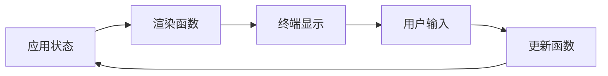
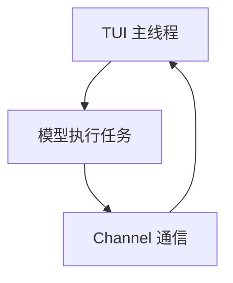

# Ratatui TUI 库深度探索报告

> 探索日期: 2026-02-27
> Ratatui版本: 0.30.0
> rust-version: 1.86.0
> 探索目标: 深度探索Ratatui TUI库的核心特性和应用场景

---

## 目录

- [1. 项目概览](#1-项目概览)
- [2. 核心架构](#2-核心架构)
- [3. Widget 系统](#3-widget-系统)
- [4. 布局机制](#4-布局机制)
- [5. 事件处理](#5-事件处理)
- [6. 异步与并发](#6-异步与并发)
- [7. 性能优化](#7-性能优化)
- [8. Neco 应用方案](#8-neco-应用方案)
- [9. 核心 API 参考](#9-核心-api-参考)

---

## 1. 项目概览

### 1.1 Ratatui 简介

**Ratatui** 是一个用 Rust 编写的终端用户界面(TUI)库，从 tui-rs 项目 fork 而来。

**核心特性：**
- 即时模式渲染 (Immediate Mode Rendering)
- 模块化架构 (0.30.0+)
- 高性能 (双缓冲区 + 差异算法)
- 多后端支持 (Crossterm/Termion/Termwiz)
- `no_std` 支持 (嵌入式目标)
- 滚动区域 (scrolling-regions)
- 调色板 (palette)
- Serde 支持 (主题配置)

### 1.2 模块化架构

```
ratatui 0.30.0 (主 crate)
├── ratatui-core 0.1.0     (核心类型)
├── ratatui-widgets 0.3.0  (内置组件)
├── ratatui-crossterm     (Crossterm 后端)
├── ratatui-termion       (Termion 后端)
├── ratatui-termwiz       (Termwiz 后端)
└── ratatui-macros        (宏支持)
```

---

## 2. 核心架构

### 2.1 即时模式渲染



**核心理念：**
- 单一数据源
- 纯函数渲染
- 事件驱动更新
- 无副作用

### 2.2 坐标系统

- 原点 `(0, 0)` 在左上角
- X 轴从左到右
- Y 轴从上到下
- 坐标和尺寸使用 `u16` 类型

---

## 3. Widget 系统

### 3.1 Widget Trait

所有 widget 实现的核心 trait：

```rust
pub trait Widget {
    fn render(self, area: Rect, buf: &mut Buffer);
}
```

**参数说明：**
- `self`: 接收所有权，允许编译器优化
- `area`: 渲染区域 (Rect)
- `buf`: 共享缓冲区

### 3.2 StatefulWidget

需要维护内部状态的 widget：

```rust
pub trait StatefulWidget: Widget {
    type State;
    fn render(self, area: Rect, buf: &mut Buffer, state: &mut Self::State);
}
```

**使用场景：** 可滚动列表、可编辑表格、带选中状态的组件

### 3.3 内置 Widget

| Widget | 用途 | StatefulWidget |
|--------|------|----------------|
| `Paragraph` | 文本段落 | 否 |
| `List` | 列表 | 是 |
| `Table` | 表格 | 是 |
| `Tabs` | 标签页 | 是 |
| `Block` | 边框容器 | 否 |
| `Chart` | 图表 | 否 |
| `Gauge` | 进度条 | 否 |
| `LineGauge` | 线性进度条 | 否 |
| `Sparkline` | 迷你图 | 否 |
| `BarChart` | 条形图(支持分组) | 否 |
| `Calendar` | 日历 | 否 |
| `Canvas` | 画布(新标记) | 否 |
| `Scrollbar` | 滚动条 | 是 |
| `Clear` | 清除区域 | 否 |

### 3.4 自定义 Widget 示例

```rust
use ratatui::{buffer::Buffer, layout::Rect, widgets::Widget, style::{Color, Style}};

pub struct ProgressBar {
    pub progress: u16,  // 0-100
}

impl Widget for ProgressBar {
    fn render(self, area: Rect, buf: &mut Buffer) {
        let filled = (self.progress * area.width) / 100;
        for x in area.left()..area.left() + filled {
            buf.get_mut(x, area.top())
                .set_symbol("█")
                .set_style(Style::default().fg(Color::Green));
        }
    }
}
```

---

## 4. 布局机制

### 4.1 Layout 系统

```rust
pub struct Layout;

impl Layout {
    pub fn vertical(constraints: &[Constraint]) -> Layout;
    pub fn horizontal(constraints: &[Constraint]) -> Layout;
    pub fn split(self, area: Rect) -> Vec<Rect>;
}
```

### 4.2 Constraint 类型

| Constraint | 说明 | 示例 |
|------------|------|------|
| `Length(u16)` | 固定长度 | `Length(3)` |
| `Min(u16)` | 最小长度 | `Min(0)` |
| `Max(u16)` | 最大长度 | `Max(20)` |
| `Percentage(u16)` | 百分比 | `Percentage(50)` |
| `Ratio(u32, u32)` | 比例 | `Ratio(1, 2)` |
| `Fill(u16)` | 填充剩余 | `Fill(1)` |

### 4.3 布局示例

```rust
use ratatui::layout::{Layout, Constraint};

// 垂直布局：标题栏 + 主内容 + 状态栏
let chunks = Layout::vertical([
    Constraint::Length(3),
    Constraint::Min(0),
    Constraint::Length(1),
])
.split(frame.area());

// 嵌套布局
let main_chunks = Layout::horizontal([
    Constraint::Percentage(30),
    Constraint::Percentage(70),
])
.split(chunks[1]);
```

### 4.4 Flex 布局

```rust
use ratatui::layout::{Flex, Direction};

let rects = Flex::default()
    .direction(Direction::Horizontal)
    .spacing(1)
    .child_width(20)
    .children(&[0, 1, 2])
    .split(area);
```

**Flex 模式** (0.30.0+):
- `Start`: 对齐到起始位置
- `End`: 对齐到结束位置
- `Center`: 居中对齐
- `SpaceBetween`: 元素之间均匀分布，边缘无空隙
- `SpaceAround`: 元素周围均匀分布，中间空隙是边缘的两倍
- `SpaceEvenly`: 元素和边缘之间均匀分布 (0.30.0 前的 `SpaceAround`)
- `Legacy`: 保留旧行为

---

## 5. 事件处理

### 5.1 事件类型

```rust
use crossterm::event::Event;

pub enum Event {
    Key(KeyEvent),
    Mouse(MouseEvent),
    Resize(u16, u16),
    FocusGained,
    FocusLost,
    Paste(String),
}
```

### 5.2 事件处理模式

#### 5.2.1 集中式处理

```rust
use crossterm::event::{self, KeyCode};

fn handle_events() -> std::io::Result<bool> {
    if event::poll(std::time::Duration::from_millis(250))? {
        if let Event::Key(key) = event::read()? {
            match key.code {
                KeyCode::Char('q') => return Ok(true),
                KeyCode::Char('j') => { /* 向下 */ }
                KeyCode::Char('k') => { /* 向上 */ }
                _ => {}
            }
        }
    }
    Ok(false)
}
```

#### 5.2.2 消息传递

```rust
enum Message {
    Quit,
    MoveUp,
    MoveDown,
    Refresh,
}

fn handle_event() -> std::io::Result<Option<Message>> {
    if event::poll(std::time::Duration::from_millis(250))? {
        match event::read()? {
            Event::Key(key) => Ok(map_key_event(key)),
            Event::Resize(_, _) => Ok(Some(Message::Refresh)),
            _ => Ok(None),
        }
    } else {
        Ok(None)
    }
}

fn map_key_event(key: KeyEvent) -> Option<Message> {
    match key.code {
        KeyCode::Char('q') => Some(Message::Quit),
        KeyCode::Down => Some(Message::MoveDown),
        KeyCode::Up => Some(Message::MoveUp),
        _ => None,
    }
}
```

### 5.3 异步事件流

```rust
use crossterm::event::EventStream;
use futures::StreamExt;

let mut events = EventStream::new();

loop {
    tokio::select! {
        Some(Ok(event)) = events.next() => {
            match event {
                Event::Key(key) => { /* 处理 */ }
                Event::Resize(x, y) => { /* 处理 */ }
                _ => {}
            }
        }
        _ = tokio::time::sleep(Duration::from_millis(16)) => {
            terminal.draw(|frame| render(frame))?;
        }
    }
}
```

---

## 6. 异步与并发

### 6.1 并发模型选择

| 模型 | 适用场景 | 优点 | 缺点 |
|------|----------|------|------|
| 单线程 + 异步 | I/O 密集型 | 简单高效 | CPU 密集任务需特殊处理 |
| 多线程 + Channel | CPU 密集型 | 隔离性好 | 复杂度高 |
| 混合模型 | 兼顾两者 | 灵活性高 | 需要协调 |

### 6.2 共享状态

#### Arc<RwLock<T>> - 读多写少

```rust
use std::sync::{Arc, RwLock};

let state = Arc::new(RwLock::new(Data::new()));

// 读取
let reader = state.read().unwrap();

// 写入
let mut writer = state.write().unwrap();
```

#### Arc<Mutex<T>> - 写多读少

```rust
use std::sync::{Arc, Mutex};

let state = Arc::new(Mutex::new(Data::new()));

// 访问
let mut data = state.lock().unwrap();
```

### 6.3 异步任务通信

```rust
use tokio::sync::mpsc;

enum AppEvent {
    UserInput(KeyEvent),
    DataUpdate(Vec<Item>),
    TaskComplete(Result<Data>),
}

let (tx, mut rx) = mpsc::channel(100);

// 发送
tx.send(AppEvent::DataUpdate(items)).await.ok();

// 接收
while let Some(event) = rx.recv().await {
    match event {
        AppEvent::UserInput(key) => { /* 处理 */ }
        AppEvent::DataUpdate(items) => { /* 处理 */ }
        _ => {}
    }
}
```

---

## 7. 性能优化

### 7.1 渲染优化

| 技术 | 说明 | 效果 |
|------|------|------|
| 双缓冲区 + Diff | 仅更新变化的单元格 | 减少 I/O |
| Layout 缓存 | 重用布局对象 | 减少计算 |
| Widget 复用 | 避免重复创建 | 减少分配 |
| 帧率限制 | 避免过度渲染 | 降低 CPU |

### 7.2 Layout 缓存

```rust
// 提升到循环外
let layout = Layout::vertical([
    Constraint::Length(3),
    Constraint::Min(0),
]);

loop {
    terminal.draw(|frame| {
        let chunks = layout.split(frame.area());
        // 使用 chunks
    })?;
}
```

### 7.3 部分渲染

```rust
struct App {
    dirty: bool,
}

impl App {
    fn needs_render(&self) -> bool {
        self.dirty
    }

    fn run(&mut self) -> std::io::Result<()> {
        loop {
            if self.needs_render() {
                terminal.draw(|frame| self.render(frame))?;
                self.dirty = false;
            }
        }
    }
}
```

---

## 8. Neco 应用方案

### 8.1 模型与 UI 分离



**推荐方案：** 异步任务 + 共享状态

```rust
use std::sync::{Arc, RwLock};

struct AppState {
    outputs: Vec<ChatOutput>,
    is_running: bool,
}

async fn run_model(state: Arc<RwLock<AppState>>, message: String) {
    tokio::spawn(async move {
        // 流式输出
        for chunk in model.stream(&message).await {
            let mut state = state.write().unwrap();
            state.outputs.push(ChatOutput::new(chunk));
        }
    });
}
```

### 8.2 REPL 实现

```rust
struct REPLState {
    input: String,
    output: Vec<String>,
    cursor: usize,
}

impl REPLState {
    fn handle_char(&mut self, c: char) {
        self.input.insert(self.cursor, c);
        self.cursor += 1;
    }

    fn backspace(&mut self) {
        if self.cursor > 0 {
            self.cursor -= 1;
            self.input.remove(self.cursor);
        }
    }

    fn submit(&mut self) -> String {
        let input = self.input.clone();
        if !input.is_empty() {
            self.output.push(format!("> {}", input));
            self.input.clear();
            self.cursor = 0;
        }
        input
    }
}
```

### 8.3 流式输出 Widget

```rust
struct StreamingOutput {
    content: String,
    is_streaming: bool,
}

impl StreamingOutput {
    fn append(&mut self, chunk: &str) {
        self.content.push_str(chunk);
        self.is_streaming = true;
    }

    fn finish(&mut self) {
        self.is_streaming = false;
    }
}

impl Widget for &StreamingOutput {
    fn render(self, area: Rect, buf: &mut Buffer) {
        let paragraph = Paragraph::new(&self.content)
            .wrap(Wrap { trim: false });
        paragraph.render(area, buf);
    }
}
```

### 8.4 多 Agent UI

```rust
struct AgentState {
    id: AgentId,
    status: AgentStatus,
    progress: f32,
    output: Vec<String>,
}

enum AgentStatus {
    Idle,
    Running,
    Completed,
    Error(String),
}

struct AgentManager {
    agents: HashMap<AgentId, AgentState>,
    active: Option<AgentId>,
}

impl AgentManager {
    fn update(&mut self, id: &AgentId, update: AgentUpdate) {
        if let Some(state) = self.agents.get_mut(id) {
            match update {
                AgentUpdate::Status(s) => state.status = s,
                AgentUpdate::Progress(p) => state.progress = p,
                AgentUpdate::Output(o) => state.output.push(o),
            }
        }
    }
}
```

### 8.5 Session 管理

```rust
struct Session {
    id: SessionId,
    title: String,
    messages: Vec<Message>,
    created_at: DateTime<Utc>,
}

struct SessionManager {
    sessions: HashMap<SessionId, Session>,
    current: Option<SessionId>,
    config_dir: PathBuf,
}

impl SessionManager {
    fn create(&mut self, title: String) -> Result<SessionId> {
        let id = SessionId::new();
        let session = Session::new(id.clone(), title);
        self.sessions.insert(id.clone(), session);
        self.save(&id)?;
        Ok(id)
    }

    fn switch(&mut self, id: SessionId) -> Result<()> {
        if self.sessions.contains_key(&id) {
            self.current = Some(id);
            Ok(())
        } else {
            Err(anyhow!("Session not found"))
        }
    }

    fn save(&self, id: &SessionId) -> Result<()> {
        let session = self.sessions.get(id).unwrap();
        let path = self.config_dir.join("sessions").join(format!("{}.json", id));
        let json = serde_json::to_string_pretty(session)?;
        std::fs::write(path, json)?;
        Ok(())
    }
}
```

---

## 9. 核心 API 参考

### 9.1 Terminal

```rust
pub struct Terminal<B: Backend>;

impl<B: Backend> Terminal<B> {
    // 初始化终端
    pub fn init() -> std::io::Result<Self>;

    // 恢复终端
    pub fn restore();

    // 绘制一帧
    pub fn draw<F>(&mut self, f: F) -> std::io::Result<()>
    where
        F: FnOnce(&mut Frame);

    // 获取终端尺寸
    pub fn size(&self) -> Rect;
}
```

### 9.2 Frame

```rust
pub struct Frame<'a>;

impl<'a> Frame<'a> {
    // 获取可绘制区域
    pub fn area(&self) -> Rect;

    // 渲染 widget
    pub fn render_widget<W>(&mut self, widget: W, area: Rect)
    where
        W: Widget;

    // 渲染 stateful widget
    pub fn render_stateful_widget<W>(
        &mut self,
        widget: W,
        area: Rect,
        state: &mut W::State,
    )
    where
        W: StatefulWidget;

    // 设置光标位置
    pub fn set_cursor(&mut self, x: u16, y: u16);

    // 获取缓冲区
    pub fn buffer_mut(&mut self) -> &mut Buffer;
}
```

### 9.3 Buffer

```rust
pub struct Buffer;

impl Buffer {
    // 创建空缓冲区
    pub fn empty(area: Rect) -> Self;

    // 获取单元格
    pub fn get(&self, x: u16, y: u16) -> &Cell;

    // 获取可变单元格
    pub fn get_mut(&mut self, x: u16, y: u16) -> &mut Cell;

    // 设置字符串
    pub fn set_string(&mut self, x: u16, y: u16, string: &str, style: Style);

    // 设置行
    pub fn set_line(&mut self, x: u16, y: u16, line: &Line);

    // 获取区域
    pub fn area(&self) -> Rect;
}
```

### 9.4 Rect

```rust
#[derive(Clone, Copy, Debug, Default, Eq, PartialEq)]
pub struct Rect {
    pub x: u16,
    pub y: u16,
    pub width: u16,
    pub height: u16,
}

impl Rect {
    pub fn new(x: u16, y: u16, width: u16, height: u16) -> Self;
    pub fn area(self) -> u16;
    pub fn left(self) -> u16;
    pub fn right(self) -> u16;
    pub fn top(self) -> u16;
    pub fn bottom(self) -> u16;
    pub fn union(self, other: Rect) -> Rect;
    pub fn intersection(self, other: Rect) -> Rect;
    pub fn center(self) -> Coord;  // 0.30.0+
}
```

### 9.5 Style

```rust
#[derive(Clone, Copy, Debug, Default)]
pub struct Style {
    pub fg: Option<Color>,
    pub bg: Option<Color>,
    pub add_modifier: Modifier,
    pub sub_modifier: Modifier,
}

impl Style {
    pub fn default() -> Self;
    pub fn fg(self, color: Color) -> Self;
    pub fn bg(self, color: Color) -> Self;
    pub fn add_modifier(self, modifier: Modifier) -> Self;
    pub fn has_modifier(self, modifier: Modifier) -> bool;  // 0.30.0+
}
```

### 9.6 Color

```rust
pub enum Color {
    Reset,
    Black,
    Red,
    Green,
    Yellow,
    Blue,
    Magenta,
    Cyan,
    Gray,
    DarkGray,
    LightRed,
    LightGreen,
    LightYellow,
    LightBlue,
    LightMagenta,
    LightCyan,
    White,
    Rgb(u8, u8, u8),
    Indexed(u8),
}
```

### 9.7 Text/Line/Span

```rust
// Span: 单个样式化的文本片段
pub struct Span<'a> {
    pub content: Cow<'a, str>,
    pub style: Style,
}

// Line: 由多个 Span 组成的行
pub struct Line<'a> {
    pub spans: Vec<Span<'a>>,
    pub alignment: Option<Alignment>,
}

// Text: 由多个 Line 组成的文本
pub struct Text<'a> {
    pub lines: Vec<Line<'a>>,
}
```

### 9.8 主要 Widget API

#### Paragraph

```rust
pub struct Paragraph<'a> {
    pub text: Text<'a>,
    pub block: Option<Block<'a>>,
    pub style: Style,
    pub wrap: Option<Wrap>,
    pub alignment: Alignment,
    pub scroll: (u16, u16),
}

impl<'a> Paragraph<'a> {
    pub fn new<T>(text: T) -> Self
    where
        T: Into<Text<'a>>;

    pub fn block(self, block: Block<'a>) -> Self;
    pub fn style(self, style: Style) -> Self;
    pub fn wrap(self, wrap: Wrap) -> Self;
    pub fn alignment(self, alignment: Alignment) -> Self;
}
```

#### List

```rust
pub struct List<'a> {
    pub block: Option<Block<'a>>,
    pub items: Vec<ListItem<'a>>,
    pub style: Style,
}

impl<'a> List<'a> {
    pub fn new<I>(items: I) -> Self
    where
        I: IntoIterator<Item = ListItem<'a>>;

    pub fn block(self, block: Block<'a>) -> Self;
    pub fn highlight_style(self, style: Style) -> Self;
}
```

#### Table

```rust
pub struct Table<'a> {
    pub header: Option<Row<'a>>,
    pub rows: Vec<Row<'a>>,
    pub widths: Vec<Constraint>,
    pub column_spacing: u16,
}

impl<'a> Table<'a> {
    pub fn new(rows: Vec<Row<'a>>) -> Self;
    pub fn header(self, header: Row<'a>) -> Self;
    pub fn widths(self, widths: Vec<Constraint>) -> Self;
}
```

#### LineGauge

```rust
pub struct LineGauge<'a> {
    pub block: Option<Block<'a>>,
    pub ratio: f32,
    pub label: Option<Span<'a>>,
    pub filled_style: Style,
    pub unfilled_style: Style,
    pub filled_symbol: String,  // 0.30.0+
    pub unfilled_symbol: String,  // 0.30.0+
}

impl<'a> LineGauge<'a> {
    pub fn new(ratio: f32) -> Self;
    pub fn filled_symbol<S: Into<String>>(self, symbol: S) -> Self;  // 0.30.0+
    pub fn unfilled_symbol<S: Into<String>>(self, symbol: S) -> Self;  // 0.30.0+
}
```

#### ScrollbarState

```rust
pub struct ScrollbarState {
    pub position: usize,
}

impl ScrollbarState {
    pub fn new(position: usize) -> Self;
    pub fn position(self, position: usize) -> Self;
    pub fn next(&mut self) -> usize;  // 0.30.0+
    pub fn prev(&mut self) -> usize;  // 0.30.0+
    pub fn get_position(&self) -> usize;  // 0.30.0+
}
```

#### BarChart (0.30.0+)

```rust
impl<'a> BarChart<'a> {
    pub fn grouped(groups: Vec<BarGroup<'a>>) -> Self;
}
```

#### Block

```rust
pub struct Block<'a> {
    pub title: Option<Vec<Line<'a>>>,
    pub borders: Borders,
    pub border_type: BorderType,
    pub style: Style,
}

impl<'a> Block<'a> {
    pub fn new() -> Self;
    pub fn bordered(self) -> Self;
    pub fn title<T>(self, title: T) -> Self
    where
        T: Into<Line<'a>>;
}
```

#### Canvas Marker (0.30.0+)

```rust
pub enum Marker {
    Dot,
    Block,
    Bar,
    Braille,
    HalfBlock,
    Quadrant,  // 0.30.0+ - 2x2 像素
    Sextant,   // 0.30.0+ - 2x3 像素
    Octant,    // 0.30.0+ - 与 Braille 相同分辨率，但更规则
}
```

### 9.9 初始化与清理 (0.30.0+)

```rust
use ratatui::{DefaultTerminal, init, restore};

// 简化的初始化
let terminal = init();

// 应用运行
let result = run(terminal);

// 简化的恢复
restore();
result
```

---

## 10. 0.30.0 版本更新要点

### 10.1 模块化架构
- `ratatui-core` (v0.1.0): 核心类型和 traits
- `ratatui-widgets` (v0.3.0): 内置组件集合
- 独立后端 crate: `ratatui-crossterm`, `ratatui-termion`, `ratatui-termwiz`

### 10.2 新增特性
- **no_std 支持**: 可用于嵌入式目标
- **scrolling-regions**: 滚动区域支持
- **palette**: 调色板特性
- **serde 增强**: 更好的主题配置支持

### 10.3 API 改进
- **Flex 布局**: 新增 `SpaceEvenly`，重构 `SpaceAround`
- **Rect**: 新增 `center()` 方法
- **Style**: 新增 `has_modifier()` 方法
- **ScrollbarState**: 新增 `get_position()` 方法
- **LineGauge**: 支持自定义填充/未填充符号
- **BarChart**: 新增 `grouped()` 构造器
- **Canvas**: 新增 `Quadrant`, `Sextant`, `Octant` 标记

### 10.4 依赖要求
- **最低 Rust 版本**: 1.86.0
- **可选依赖**: `portable-atomic` (无原子类型目标)

---

## 总结

Ratatui 是一个功能强大、设计优雅的 TUI 库，其即时模式渲染和模块化架构使其非常适合构建复杂的终端应用。对于 Neco 项目，推荐使用以下架构：

1. **UI 与模型分离**：使用异步任务 + 共享状态
2. **流式输出**：通过 Channel + Arc<RwLock> 实现
3. **多 Agent 支持**：使用 AgentManager 管理状态
4. **Session 持久化**：JSON 格式存储会话

关键优化点：
- Layout 缓存
- 部分渲染 (dirty flag)
- 帧率限制 (~60 FPS)
- 双缓冲区 + Diff 算法
