# Ratatui TUI库深度探索报告

> 探索日期: 2026-02-27  
> Ratatui版本: 0.30.0  
> 探索目标: 为Neco项目评估Ratatui作为终端REPL界面的可行性

---

## 目录

- [1. 项目概览](#1-项目概览)
- [2. 核心架构与设计理念](#2-核心架构与设计理念)
- [3. Widget系统详解](#3-widget系统详解)
- [4. 布局机制](#4-布局机制)
- [5. 事件处理模型](#5-事件处理模型)
- [6. 异步事件流处理](#6-异步事件流处理)
- [7. 多线程与并发支持](#7-多线程与并发支持)
- [8. 性能特性与优化](#8-性能特性与优化)
- [9. 终端REPL实现方案](#9-终端repl实现方案)
- [10. 模型运行与终端输出的分离架构](#10-模型运行与终端输出的分离架构)
- [11. 流式输出的TUI展示](#11-流式输出的tui展示)
- [12. 多Agent并行执行的UI展示](#12-多agent并行执行的ui展示)
- [13. Session管理的TUI实现](#13-session管理的tui实现)
- [14. ACP模式集成](#14-acp模式集成)
- [15. 与Neco需求的匹配度分析](#15-与neco需求的匹配度分析)
- [16. 推荐架构设计](#16-推荐架构设计)
- [17. 完整代码示例](#17-完整代码示例)
- [18. 生态与工具](#18-生态与工具)
- [19. 结论与建议](#19-结论与建议)

---

## 1. 项目概览

### 1.1 Ratatui简介

**Ratatui** 是一个用Rust编写的终端用户界面(TUI)库，从流行的tui-rs项目fork而来，于2023年启动以继续开发。它的核心设计哲学是**即时模式渲染**(Immediate Mode Rendering)，这与传统的保留模式渲染(Retained Mode Rendering)形成鲜明对比。

**关键特性：**
- 🎨 **即时模式渲染**: 每帧重新绘制整个UI
- 🧩 **模块化架构**: 0.30.0版本重构为模块化工作空间
- ⚡ **高性能**: 双缓冲区+差异算法优化终端输出
- 🔌 **多后端支持**: Crossterm(默认)、Termion、Termwiz
- 🎯 **类型安全**: 利用Rust的类型系统确保UI状态正确性

### 1.2 项目统计数据

```
GitHub Stars:    18.7k+
Forks:           580+
Contributors:    活跃社区
License:         MIT
Version:         0.30.0 (稳定)
Rust版本要求:    ≥1.74 (推荐使用最新稳定版)
```

### 1.3 核心设计理念

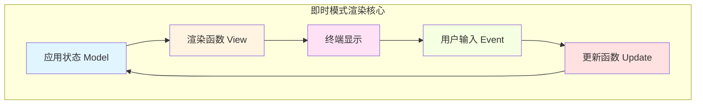

**核心理念：**
1. **单一数据源**: 所有UI状态存储在一个中心化的Model中
2. **纯函数渲染**: 给定相同的状态，渲染函数总是产生相同的UI
3. **事件驱动更新**: 用户输入产生事件，事件驱动状态更新
4. **无副作用**: 渲染函数不修改状态，只读取状态

---

## 2. 核心架构与设计理念

### 2.1 模块化架构(0.30.0+)

Ratatui 0.30.0引入了重大架构重构，将单体crate拆分为模块化工作空间：

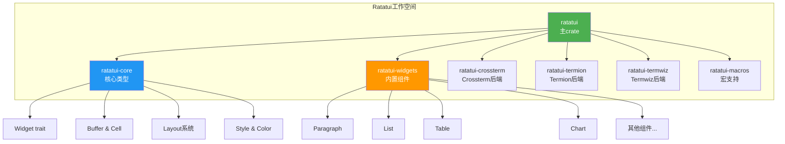

**各crate职责：**

| Crate | 用途 | 目标用户 |
|-------|------|---------|
| `ratatui` | 主入口，re-export所有功能 | 应用开发者 |
| `ratatui-core` | 核心trait和类型 | Widget库作者 |
| `ratatui-widgets` | 内置widget实现 | 需要标准组件的应用 |
| `ratatui-crossterm` | Crossterm后端 | 跨平台应用 |
| `ratatui-termion` | Termion后端 | Unix专用应用 |
| `ratatui-termwiz` | Termwiz后端 | 需要高级特性的应用 |
| `ratatui-macros` | 宏支持 | 需要减少样板代码 |

### 2.2 依赖关系图

```
┌─────────────────────────────────────────┐
│           ratatui (主crate)             │
│  - re-export所有public API              │
│  - 应用开发者的入口点                    │
└──────────────┬──────────────────────────┘
               │
       ┌───────┴────────┐
       │                │
┌──────▼─────┐  ┌──────▼──────────┐
│ratatui-core│  │ratatui-widgets │
│ (最小依赖)  │  │ → ratatui-core │
└─────────────┘  └─────────────────┘
       │
   ┌───┴────────────┬────────────┐
   │                │            │
┌──▼──────┐  ┌─────▼─────┐ ┌───▼────────┐
│crossterm│  │ termion   │ │  termwiz   │
│  backend│  │  backend  │ │  backend   │
└─────────┘  └───────────┘ └────────────┘
```

### 2.3 设计原则

#### 2.3.1 稳定性与兼容性

- **ratatui-core**: 设计为最稳定的API，最小化破坏性变更
- **ratatui-widgets**: 专注widget实现，适度稳定性
- **Backend crates**: 与核心变更隔离，允许独立更新
- **主crate**: 可以更自由演进，通过re-export保持向后兼容

#### 2.3.2 编译性能

模块化带来的优势：
1. **减少编译时间**: Widget库只需编译核心类型
2. **并行编译**: 不同crate可以并行编译
3. **选择性编译**: 应用可以排除未使用的后端或widget

#### 2.3.3 生态系统友好

- **Widget库作者**: 可以依赖稳定的`ratatui-core`而无需频繁更新
- **应用开发者**: 使用便捷的`ratatui` crate，包含所有功能
- **极简项目**: 可以仅使用`ratatui-core`构建轻量级应用

---

## 3. Widget系统详解

### 3.1 Widget Trait

所有可渲染组件都实现`Widget` trait：

```rust
/// 所有widget必须实现的核心trait
pub trait Widget {
    /// 将widget的当前状态渲染到给定的buffer中
    fn render(self, area: Rect, buf: &mut Buffer);
}
```

**设计要点：**
- **self**: 接收所有权，允许Rust优化掉临时对象
- **area**: 渲染区域，由布局系统计算
- **buf**: 中间缓冲区，所有widget共享
- **纯函数**: 不产生副作用，只修改buffer

### 3.2 StatefulWidget

对于需要维护内部状态的组件：

```rust
pub trait StatefulWidget: Widget {
    /// Widget的状态类型
    type State;
    
    /// 渲染widget，允许修改内部状态
    fn render(self, area: Rect, buf: &mut Buffer, state: &mut Self::State);
}
```

**使用场景：**
- 可滚动列表（List）
- 可编辑表格（Table）
- 带选中状态的组件

### 3.3 内置Widget层次结构

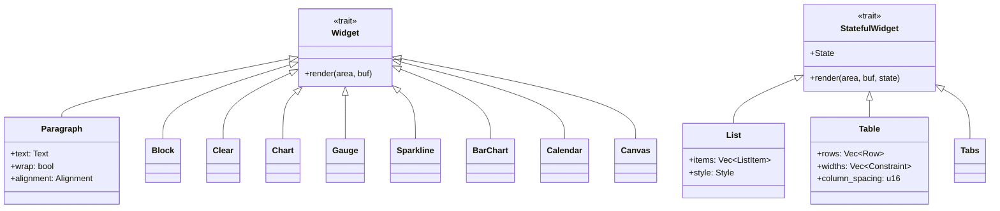

### 3.4 自定义Widget示例

**简单的自定义Widget：**

```rust
use ratatui::{
    buffer::Buffer,
    layout::Rect,
    widgets::Widget,
};

/// 一个简单的进度条widget
pub struct ProgressBar {
    pub progress: u16,  // 0-100
    pub width: u16,
}

impl Widget for ProgressBar {
    fn render(self, area: Rect, buf: &mut Buffer) {
        let filled = (self.progress as u16 * area.width) / 100;
        
        // 绘制填充部分
        for x in area.left()..area.left() + filled {
            buf.get_mut(x, area.top())
                .set_symbol("█")
                .set_style(Style::default().fg(Color::Green));
        }
        
        // 绘制空部分
        for x in area.left() + filled..area.right() {
            buf.get_mut(x, area.top())
                .set_symbol("░")
                .set_style(Style::default().fg(Color::DarkGray));
        }
    }
}
```

**带状态的自定义Widget：**

```rust
use std::time::{Duration, Instant};

/// 一个实时时钟widget
pub struct Clock {
    format: String,
}

pub struct ClockState {
    last_update: Instant,
    current_time: String,
}

impl StatefulWidget for Clock {
    type State = ClockState;
    
    fn render(self, area: Rect, buf: &mut Buffer, state: &mut Self::State) {
        // 每100ms更新一次时间
        if state.last_update.elapsed() > Duration::from_millis(100) {
            state.current_time = chrono::Local::now()
                .format(&self.format)
                .to_string();
            state.last_update = Instant::now();
        }
        
        // 渲染时间
        let paragraph = Paragraph::new(state.current_time.as_str())
            .alignment(Alignment::Center);
        
        paragraph.render(area, buf);
    }
}
```

### 3.5 Widget组合模式

Ratatui鼓励widget的组合：

```rust
/// 一个复杂的仪表板widget，组合多个子widget
pub struct Dashboard {
    cpu_usage: Vec<u64>,
    memory_usage: (u64, u64),  // (used, total)
    network_stats: (u64, u64), // (rx, tx)
}

impl Widget for Dashboard {
    fn render(self, area: Rect, buf: &mut Buffer) {
        // 使用布局分割区域
        let chunks = Layout::vertical([
            Constraint::Length(3),  // CPU图表
            Constraint::Length(3),  // 内存使用
            Constraint::Min(0),     // 网络统计
        ])
        .split(area);
        
        // 渲染CPU使用率图表
        let cpu_chart = Sparkline::new(self.cpu_usage)
            .block(Block::bordered().title("CPU Usage"));
        cpu_chart.render(chunks[0], buf);
        
        // 渲染内存使用率
        let (used, total) = self.memory_usage;
        let memory_gauge = Gauge::default()
            .block(Block::bordered().title("Memory"))
            .gauge_style(Style::default().fg(Color::Cyan))
            .percent((used * 100 / total) as u16);
        memory_gauge.render(chunks[1], buf);
        
        // 渲染网络统计
        let (rx, tx) = self.network_stats;
        let net_text = Paragraph::new(format!(
            "RX: {} MB/s\nTX: {} MB/s",
            rx / 1024 / 1024,
            tx / 1024 / 1024
        ))
        .block(Block::bordered().title("Network"));
        net_text.render(chunks[2], buf);
    }
}
```

---

## 4. 布局机制

### 4.1 Layout系统核心

Ratatui的布局系统基于**flexbox-like**算法，提供灵活的区域分割：

```rust
pub struct Layout {
    // 内部实现细节
}
```

### 4.2 Constraint类型

```rust
pub enum Constraint {
    /// 固定长度
    Length(u16),
    
    /// 最小长度
    Min(u16),
    
    /// 最大长度
    Max(u16),
    
    /// 按比例分配剩余空间
    Percentage(u16),
    
    /// 填充剩余空间（可设置权重）
    Ratio(u32, u32),
    
    /// 填充剩余空间，权重为1（Ratio(1, 1)的简写）
    Fill(u16),
}
```

### 4.3 布局示例

#### 4.3.1 基础垂直布局

```rust
use ratatui::layout::{Layout, Constraint};

fn create_vertical_layout(area: Rect) -> Vec<Rect> {
    Layout::vertical([
        Constraint::Length(3),    // 顶部标题栏
        Constraint::Min(0),       // 中间主内容区（最小）
        Constraint::Length(3),    // 底部状态栏
    ])
    .split(area)
}
```

**可视化：**
```
┌─────────────────────────────────┐  <- Length(3)
│         Title Bar               │
├─────────────────────────────────┤
│                                 │
│                                 │  <- Min(0) [填充剩余空间]
│         Main Content            │
│                                 │
├─────────────────────────────────┤  <- Length(3)
│        Status Bar               │
└─────────────────────────────────┘
```

#### 4.3.2 嵌套布局

```rust
fn create_nested_layout(area: Rect) -> (Vec<Rect>, Vec<Rect>) {
    // 第一层：垂直分割
    let vertical = Layout::vertical([
        Constraint::Length(1),  // 标题行
        Constraint::Min(0),     // 主区域
        Constraint::Length(1),  // 状态行
    ])
    .split(area);
    
    // 第二层：主区域水平分割
    let horizontal = Layout::horizontal([
        Constraint::Percentage(50),  // 左侧面板
        Constraint::Percentage(50),  // 右侧面板
    ])
    .split(vertical[1]);
    
    (vertical.to_vec(), horizontal.to_vec())
}
```

**可视化：**
```
┌─────────────────────────────────┐
│         Title Row               │
├─────────────┬───────────────────┤
│             │                   │
│   Left      │      Right         │
│   Panel     │      Panel         │
│             │                   │
├─────────────┴───────────────────┤
│        Status Row               │
└─────────────────────────────────┘
```

#### 4.3.3 复杂布局 - 仪表板示例

```rust
fn create_dashboard_layout(area: Rect) -> Vec<Vec<Rect>> {
    // 顶层：垂直分割为标题栏和主体
    let top_level = Layout::vertical([
        Constraint::Length(3),
        Constraint::Min(0),
    ])
    .split(area);
    
    // 主体区域：水平分割为侧边栏和主内容
    let main_area = Layout::horizontal([
        Constraint::Percentage(30),
        Constraint::Percentage(70),
    ])
    .split(top_level[1]);
    
    // 主内容区：垂直分割为多个卡片
    let content_area = Layout::vertical([
        Constraint::Percentage(33),
        Constraint::Percentage(33),
        Constraint::Percentage(34),
    ])
    .split(main_area[1]);
    
    vec![
        top_level.to_vec(),
        main_area.to_vec(),
        content_area.to_vec(),
    ]
}
```

### 4.4 布局方向

```rust
impl Layout {
    /// 创建垂直布局（从上到下）
    pub fn vertical(constraints: &[Constraint]) -> Layout {
        // 实现
    }
    
    /// 创建水平布局（从左到右）
    pub fn horizontal(constraints: &[Constraint]) -> Layout {
        // 实现
    }
}
```

### 4.5 Flex布局

Ratatui还支持更灵活的Flex布局：

```rust
use ratatui::layout::{Flex, Direction};

fn flex_layout_example(area: Rect) -> Vec<Rect> {
    Flex::default()
        .direction(Direction::Horizontal)
        .spacing(1)  // 子元素之间的间距
        .child_width(20)  // 子元素的宽度
        .children(&[0, 1, 2, 3])  // 子元素数量
        .split(area)
}
```

---

## 5. 事件处理模型

### 5.1 事件处理架构

Ratatui本身**不包含**事件处理，事件处理由后端库提供。Ratatui提供了一套**架构模式**来处理事件：

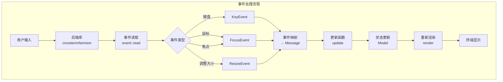

### 5.2 三种事件处理模式

#### 5.2.1 集中式事件处理

**优点：**
- 简单直接，无需消息传递
- 所有键盘事件在一个地方处理

**缺点：**
- 不易扩展，难以管理大量keybindings
- 违反单一职责原则

```rust
use crossterm::event::{self, Event, KeyCode, KeyEvent};

fn handle_events() -> std::io::Result<bool> {
    if event::poll(Duration::from_millis(250))? {
        if let Event::Key(key) = event::read()? {
            match key.code {
                KeyCode::Char('q') => return Ok(true),  // 退出
                KeyCode::Char('j') => {
                    // 处理向下移动
                }
                KeyCode::Char('k') => {
                    // 处理向上移动
                }
                _ => {}
            }
        }
    }
    Ok(false)
}
```

#### 5.2.2 集中捕获，消息传递

**优点：**
- 可以将大量模式匹配分解到子函数
- 易于拆分到不同文件
- 支持多线程应用的消息通道

**缺点：**
- 需要主循环持续轮询事件
- 需要管理消息生命周期

```rust
use crossterm::event::{self, Event, KeyCode};

enum Message {
    Quit,
    MoveUp,
    MoveDown,
    Refresh,
}

fn handle_event() -> std::io::Result<Option<Message>> {
    if event::poll(Duration::from_millis(250))? {
        match event::read()? {
            Event::Key(key) => Ok(handle_key_event(key)),
            Event::Resize(_, _) => Ok(Some(Message::Refresh)),
            _ => Ok(None),
        }
    } else {
        Ok(None)
    }
}

fn handle_key_event(key: KeyEvent) -> Option<Message> {
    match key.code {
        KeyCode::Char('q') => Some(Message::Quit),
        KeyCode::Char('j') | KeyCode::Down => Some(Message::MoveDown),
        KeyCode::Char('k') | KeyCode::Up => Some(Message::MoveUp),
        _ => None,
    }
}
```

#### 5.2.3 分布式事件循环/分段应用

**优点：**
- 无需集中式事件监听器
- 每个子模块可独立管理

**缺点：**
- 可能导致代码重复
- 多个子模块有相似事件处理逻辑时重复

```rust
trait Component {
    fn handle_event(&mut self, event: &Event) -> bool;
    fn render(&mut self, frame: &mut Frame, area: Rect);
}

struct App {
    components: Vec<Box<dyn Component>>,
}

impl App {
    fn run(&mut self, terminal: &mut Terminal) -> std::io::Result<()> {
        loop {
            terminal.draw(|frame| {
                // 渲染所有组件
                for component in &mut self.components {
                    component.render(frame, frame.area());
                }
            })?;
            
            if let Ok(true) = self.handle_global_events() {
                break;
            }
        }
        Ok(())
    }
}
```

### 5.3 Crossterm事件流

Ratatui推荐使用Crossterm作为后端，它提供了强大的事件流API：

```rust
use crossterm::event::{Event, EventStream};
use futures::StreamExt;

#[tokio::main]
async fn main() -> std::io::Result<()> {
    let mut events = EventStream::new();
    
    loop {
        tokio::select! {
            Some(Ok(event)) = events.next() => {
                match event {
                    Event::Key(key) => {
                        // 处理键盘事件
                    }
                    Event::Mouse(mouse) => {
                        // 处理鼠标事件
                    }
                    Event::Resize(x, y) => {
                        // 处理窗口调整
                    }
                    _ => {}
                }
            }
            _ = tokio::time::sleep(Duration::from_millis(100)) => {
                // 定期刷新UI
            }
        }
    }
}
```

---

## 6. 异步事件流处理

### 6.1 异步事件处理架构

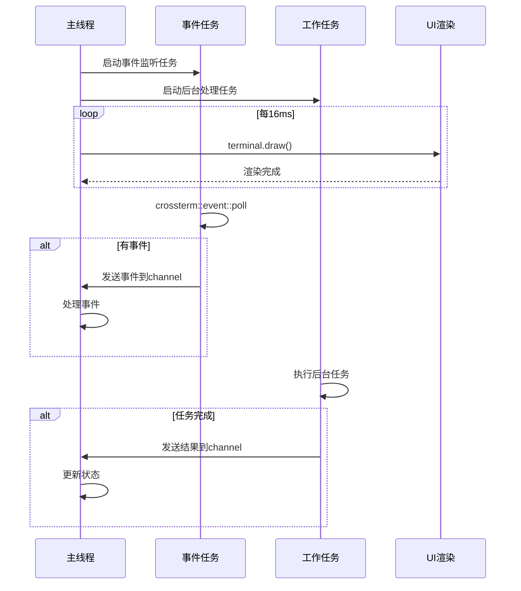

### 6.2 异步GitHub示例 - 深度解析

这是Ratatui官方提供的异步事件处理最佳实践示例：

```rust
use std::sync::{Arc, RwLock};
use tokio::sync::mpsc;
use crossterm::event::{Event, EventStream};

/// 异步应用状态
struct App {
    should_quit: bool,
    pull_requests: PullRequestListWidget,
}

/// 异步widget，包含共享状态
#[derive(Debug, Clone, Default)]
struct PullRequestListWidget {
    state: Arc<RwLock<PullRequestListState>>,
}

#[derive(Debug, Default)]
struct PullRequestListState {
    pull_requests: Vec<PullRequest>,
    loading_state: LoadingState,
    table_state: TableState,
}

#[derive(Debug, Clone, Default, PartialEq, Eq)]
enum LoadingState {
    #[default]
    Idle,
    Loading,
    Loaded,
    Error(String),
}

impl PullRequestListWidget {
    /// 在后台启动数据获取
    fn run(&self) {
        let this = self.clone();  // 克隆Arc以传递到后台任务
        tokio::spawn(async move {
            this.fetch_pulls().await;
        });
    }
    
    /// 异步获取Pull Requests
    async fn fetch_pulls(self) {
        // 设置加载状态
        self.set_loading_state(LoadingState::Loading);
        
        // 调用GitHub API
        match octocrab::instance()
            .pulls("ratatui", "ratatui")
            .list()
            .sort(Sort::Updated)
            .direction(Direction::Descending)
            .send()
            .await
        {
            Ok(page) => self.on_load(&page),
            Err(err) => self.on_err(&err),
        }
    }
    
    fn on_load(&self, page: &Page<OctoPullRequest>) {
        let prs = page.items.iter().map(Into::into);
        let mut state = self.state.write().unwrap();
        state.loading_state = LoadingState::Loaded;
        state.pull_requests.extend(prs);
        if !state.pull_requests.is_empty() {
            state.table_state.select(Some(0));
        }
    }
}
```

**关键设计点：**

1. **Arc<RwLock<T>>用于共享状态**：
   - Arc允许多所有权
   - RwLock允许多读单写
   - 适用于读多写少的场景

2. **Clone实现**：
   - Widget实现Clone以传递到后台任务
   - 克隆的是Arc，不是数据本身（零成本）

3. **后台任务生命周期**：
   - 使用tokio::spawn启动
   - 独立于主线程运行
   - 通过共享状态与主线程通信

### 6.3 异步事件处理最佳实践

#### 6.3.1 使用tokio::select!

```rust
use tokio::time::{interval, Duration};

const FRAMES_PER_SECOND: f32 = 60.0;

async fn run_app(mut terminal: DefaultTerminal) -> std::io::Result<()> {
    let period = Duration::from_secs_f32(1.0 / FRAMES_PER_SECOND);
    let mut interval = interval(period);
    let mut events = EventStream::new();
    
    loop {
        tokio::select! {
            // 定时渲染
            _ = interval.tick() => {
                terminal.draw(|frame| render(frame))?;
            }
            
            // 处理事件
            Some(Ok(event)) = events.next() => {
                handle_event(event);
            }
        }
    }
}
```

#### 6.3.2 使用通道(Channels)通信

```rust
use tokio::sync::mpsc;

#[derive(Debug)]
enum AppEvent {
    UserInput(KeyEvent),
    DataUpdate(Vec<Item>),
    BackgroundTaskComplete(Result<Data>),
}

async fn run_async_app() -> std::io::Result<()> {
    let (tx, mut rx) = mpsc::channel(100);
    
    // 启动后台任务
    let tx_clone = tx.clone();
    tokio::spawn(async move {
        let data = fetch_data().await;
        tx_clone.send(AppEvent::BackgroundTaskComplete(data)).await.ok();
    });
    
    // 主循环
    loop {
        tokio::select! {
            Some(event) = rx.recv() => {
                match event {
                    AppEvent::UserInput(key) => {
                        // 处理用户输入
                    }
                    AppEvent::DataUpdate(items) => {
                        // 更新数据
                    }
                    AppEvent::BackgroundTaskComplete(result) => {
                        // 处理任务完成
                    }
                }
            }
            _ = tokio::time::sleep(Duration::from_millis(16)) => {
                // 渲染UI
            }
        }
    }
}
```

### 6.4 异步模式的优势

1. **非阻塞UI**：后台任务不阻塞UI渲染
2. **高效资源利用**：利用async/await避免线程阻塞
3. **清晰的并发模型**：tokio::select!提供清晰的并发控制
4. **易于扩展**：可轻松添加更多异步任务

---

## 7. 多线程与并发支持

### 7.1 并发模型

Ratatui支持多种并发模型：

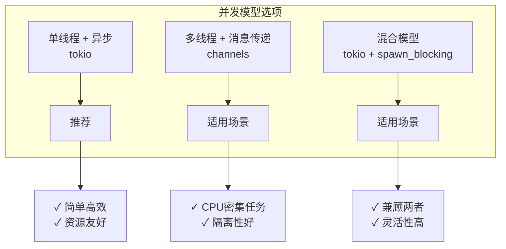

### 7.2 单线程异步模型（推荐）

**适用场景：**
- 大部分TUI应用
- I/O密集型任务
- 网络请求

```rust
use tokio::time::{interval, Duration};

#[tokio::main]
async fn main() -> std::io::Result<()> {
    let terminal = ratatui::init();
    
    // 异步任务
    let data_task = tokio::spawn(fetch_data_async());
    
    // 主循环
    let mut render_interval = interval(Duration::from_millis(16));
    loop {
        tokio::select! {
            _ = render_interval.tick() => {
                terminal.draw(|frame| render(frame))?;
            }
            result = data_task => {
                match result {
                    Ok(data) => update_state(data),
                    Err(e) => handle_error(e),
                }
            }
        }
    }
}
```

### 7.3 多线程模型

**适用场景：**
- CPU密集型计算
- 需要隔离的任务
- 避免阻塞async runtime

```rust
use std::sync::{Arc, Mutex};
use std::thread;
use tokio::sync::mpsc;

fn multi_threaded_example() -> std::io::Result<()> {
    let (tx, mut rx) = mpsc::channel(100);
    let state = Arc::new(Mutex::new(AppState::new()));
    
    // 启动计算密集型任务
    let state_clone = Arc::clone(&state);
    thread::spawn(move || {
        let result = expensive_computation();
        let mut state = state_clone.lock().unwrap();
        state.update_result(result);
    });
    
    // 主循环
    loop {
        // 渲染
        let state = state.lock().unwrap();
        terminal.draw(|frame| {
            render_with_state(&state, frame);
        })?;
        drop(state);
        
        // 处理事件
        if let Ok(event) = rx.try_recv() {
            handle_event(event);
        }
    }
}
```

### 7.4 混合模型

```rust
use tokio::task::spawn_blocking;

async fn hybrid_model() -> std::io::Result<()> {
    loop {
        tokio::select! {
            // 异步I/O任务
            result = async_io_task() => {
                handle_io_result(result);
            }
            
            // CPU密集任务（使用spawn_blocking）
            result = spawn_blocking(|| {
                cpu_intensive_task()
            }) => {
                handle_cpu_result(result);
            }
            
            // 定期渲染
            _ = tokio::time::sleep(Duration::from_millis(16)) => {
                terminal.draw(|frame| render(frame))?;
            }
        }
    }
}
```

### 7.5 线程安全的状态共享

#### 7.5.1 Arc<RwLock<T>> - 读多写少

```rust
use std::sync::{Arc, RwLock};

struct SharedState {
    data: Vec<String>,
    selected: usize,
}

fn use_rwlock() {
    let state = Arc::new(RwLock::new(SharedState {
        data: vec![],
        selected: 0,
    }));
    
    // 读取（多个读锁可以共存）
    {
        let reader = state.read().unwrap();
        println!("Selected: {}", reader.selected);
    }  // 读锁释放
    
    // 写入（独占访问）
    {
        let mut writer = state.write().unwrap();
        writer.data.push("new item".to_string());
    }  // 写锁释放
}
```

#### 7.5.2 Arc<Mutex<T>> - 写多读少

```rust
use std::sync::{Arc, Mutex};

fn use_mutex() {
    let state = Arc::new(Mutex::new(vec![1, 2, 3]));
    
    // 修改
    {
        let mut data = state.lock().unwrap();
        data.push(4);
    }  // 锁释放
    
    // 读取
    {
        let data = state.lock().unwrap();
        println!("Data: {:?}", data);
    }
}
```

### 7.6 并发最佳实践

1. **优先使用异步**：对于I/O密集型任务
2. **使用spawn_blocking**：对于CPU密集型任务
3. **避免跨await持有锁**：防止死锁
4. **使用通道通信**：解耦任务
5. **限制并发度**：避免资源耗尽

---

## 8. 性能特性与优化

### 8.1 渲染性能优化

#### 8.1.1 双缓冲区 + 差异算法

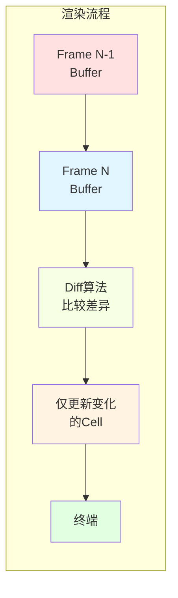

**工作原理：**
1. **双缓冲区**：维护当前缓冲区和前一缓冲区
2. **Diff算法**：比较两个缓冲区找出差异
3. **最小化输出**：仅输出变化的Cell
4. **批量刷新**：一次性刷新所有变更

**性能提升：**
- 减少终端I/O操作
- 降低CPU使用率
- 提高帧率

#### 8.1.2 布局缓存（Layout Cache）

```rust
use ratatui::layout::Layout;

// 缓存布局计算结果
let layout = Layout::vertical([
    Constraint::Length(3),
    Constraint::Min(0),
    Constraint::Length(1),
]);

// 每帧重新使用（避免重新计算）
loop {
    terminal.draw(|frame| {
        let chunks = layout.split(frame.area());
        // 使用chunks渲染
    })?;
}
```

**优化技巧：**
- 将Layout对象提升到循环外
- 避免在draw闭包内创建临时对象
- 重用Constraint数组

#### 8.1.3 减少Widget创建开销

```rust
// ❌ 错误：每次渲染都创建新widget
fn render_bad(frame: &mut Frame) {
    for i in 0..100 {
        let text = Paragraph::new(format!("Item {}", i));
        frame.render_widget(text, area);
    }
}

// ✓ 正确：预创建或使用闭包
struct ItemsWidget {
    items: Vec<String>,
}

impl Widget for &ItemsWidget {
    fn render(self, area: Rect, buf: &mut Buffer) {
        let items: Vec<Line> = self.items
            .iter()
            .enumerate()
            .map(|(i, text)| {
                Line::from(format!("{}: {}", i, text))
            })
            .collect();
        
        let paragraph = Paragraph::new(items);
        paragraph.render(area, buf);
    }
}
```

### 8.2 性能特性

#### 8.2.1 内存效率

**即时模式的优势：**
- 无需维护widget树
- 无需为每个widget分配堆内存
- 栈分配为主

**测量数据：**
- 典型TUI应用内存占用：<10MB
- Buffer大小：取决于终端尺寸
  - 80x24终端：~2KB buffer
  - 200x50终端：~10KB buffer

#### 8.2.2 帧率控制

```rust
use std::time::{Duration, Instant};

struct FrameRateLimiter {
    target_fps: f32,
    frame_duration: Duration,
    last_frame: Instant,
}

impl FrameRateLimiter {
    fn new(fps: f32) -> Self {
        Self {
            target_fps: fps,
            frame_duration: Duration::from_secs_f32(1.0 / fps),
            last_frame: Instant::now(),
        }
    }
    
    fn wait(&mut self) {
        let elapsed = self.last_frame.elapsed();
        if elapsed < self.frame_duration {
            std::thread::sleep(self.frame_duration - elapsed);
        }
        self.last_frame = Instant::now();
    }
}

// 使用示例
let mut fps_limiter = FrameRateLimiter::new(60.0);
loop {
    terminal.draw(|frame| render(frame))?;
    fps_limiter.wait();
}
```

#### 8.2.3 部分渲染优化

```rust
// 仅在状态变化时重新渲染
struct App {
    dirty: bool,
    last_render_state: AppState,
}

impl App {
    fn needs_render(&self) -> bool {
        self.dirty || self.state != self.last_render_state
    }
    
    fn run(&mut self) -> std::io::Result<()> {
        loop {
            if self.needs_render() {
                terminal.draw(|frame| self.render(frame))?;
                self.dirty = false;
                self.last_render_state = self.state.clone();
            }
            
            // 处理事件
        }
    }
}
```

### 8.3 性能基准测试

使用Criterion进行微基准测试：

```rust
use criterion::{black_box, criterion_group, criterion_main, Criterion};

fn bench_widget_render(c: &mut Criterion) {
    let mut buffer = Buffer::empty(Rect::new(0, 0, 80, 24));
    let paragraph = Paragraph::new("Hello, World!");
    
    c.bench_function("render_paragraph", |b| {
        b.iter(|| {
            paragraph.render(black_box(buffer.area), &mut buffer);
        });
    });
}

criterion_group!(benches, bench_widget_render);
criterion_main!(benches);
```

### 8.4 性能优化检查清单

- [ ] 使用Layout缓存
- [ ] 避免在渲染循环中分配内存
- [ ] 重用Widget对象
- [ ] 使用部分渲染（dirty flag）
- [ ] 限制帧率
- [ ] 使用Buffer差异
- [ ] 优化文本处理（避免重复格式化）
- [ ] 使用高效的约束类型
- [ ] 避免不必要的Style克隆

---

## 9. 终端REPL实现方案

### 9.1 REPL架构设计

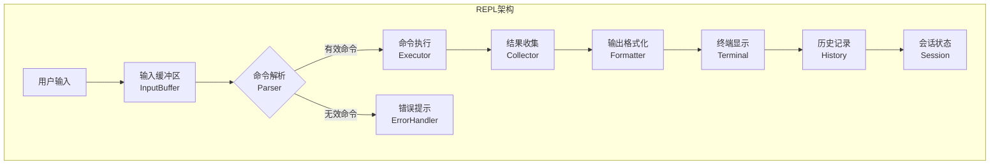

### 9.2 核心组件

#### 9.2.1 输入组件

```rust
use ratatui::{
    widgets::{Paragraph, Widget},
    Frame,
};

struct REPLInput {
    prompt: String,
    buffer: String,
    cursor_position: usize,
    history: Vec<String>,
    history_index: usize,
}

impl REPLInput {
    fn new(prompt: &str) -> Self {
        Self {
            prompt: prompt.to_string(),
            buffer: String::new(),
            cursor_position: 0,
            history: Vec::new(),
            history_index: 0,
        }
    }
    
    fn insert_char(&mut self, c: char) {
        self.buffer.insert(self.cursor_position, c);
        self.cursor_position += 1;
    }
    
    fn delete_char(&mut self) {
        if self.cursor_position < self.buffer.len() {
            self.buffer.remove(self.cursor_position);
        }
    }
    
    fn backspace(&mut self) {
        if self.cursor_position > 0 {
            self.cursor_position -= 1;
            self.buffer.remove(self.cursor_position);
        }
    }
    
    fn submit(&mut self) -> String {
        let input = self.buffer.clone();
        if !input.is_empty() {
            self.history.push(input.clone());
            self.history_index = self.history.len();
            self.buffer.clear();
            self.cursor_position = 0;
        }
        input
    }
}

impl Widget for &REPLInput {
    fn render(self, area: Rect, buf: &mut Buffer) {
        let text = format!("{}{}", self.prompt, self.buffer);
        let paragraph = Paragraph::new(text)
            .style(Style::default().fg(Color::White));
        
        paragraph.render(area, buf);
        
        // 设置光标位置
        let cursor_x = area.x + self.prompt.len() as u16 + self.cursor_position as u16;
        let cursor_y = area.y;
        // 注意：这里需要在Frame中设置光标，而不是在Buffer中
    }
}
```

#### 9.2.2 输出组件

```rust
struct REPOutput {
    lines: Vec<OutputLine>,
    scroll_offset: usize,
}

struct OutputLine {
    content: String,
    style: Style,
    timestamp: Instant,
}

impl REPOutput {
    fn new() -> Self {
        Self {
            lines: Vec::new(),
            scroll_offset: 0,
        }
    }
    
    fn push(&mut self, content: &str, style: Style) {
        self.lines.push(OutputLine {
            content: content.to_string(),
            style,
            timestamp: Instant::now(),
        });
    }
    
    fn push_info(&mut self, content: &str) {
        self.push(content, Style::default().fg(Color::White));
    }
    
    fn push_success(&mut self, content: &str) {
        self.push(content, Style::default().fg(Color::Green));
    }
    
    fn push_error(&mut self, content: &str) {
        self.push(content, Style::default().fg(Color::Red));
    }
    
    fn push_warning(&mut self, content: &str) {
        self.push(content, Style::default().fg(Color::Yellow));
    }
}

impl Widget for &REPOutput {
    fn render(self, area: Rect, buf: &mut Buffer) {
        let visible_lines = area.height as usize;
        let start = self.scroll_offset;
        let end = (start + visible_lines).min(self.lines.len());
        
        for (i, line) in self.lines.iter().skip(start).take(visible_lines).enumerate() {
            let y = area.top() + i as u16;
            if y < area.bottom() {
                buf.set_string(
                    area.left(),
                    y,
                    &line.content,
                    line.style,
                );
            }
        }
    }
}
```

#### 9.2.3 会话管理

```rust
struct REPLSession {
    input: REPLInput,
    output: REPOutput,
    mode: REPLMode,
}

enum REPLMode {
    Normal,
    Insert,
    Command,
    Visual,
}

impl REPLSession {
    fn new() -> Self {
        Self {
            input: REPLInput::new("❯ "),
            output: REPOutput::new(),
            mode: REPLMode::Normal,
        }
    }
    
    fn handle_key_event(&mut self, key: &KeyEvent) -> bool {
        match self.mode {
            REPLMode::Normal => self.handle_normal_mode(key),
            REPLMode::Insert => self.handle_insert_mode(key),
            REPLMode::Command => self.handle_command_mode(key),
            _ => false,
        }
    }
    
    fn handle_normal_mode(&mut self, key: &KeyEvent) -> bool {
        match key.code {
            KeyCode::Char('i') => {
                self.mode = REPLMode::Insert;
                true
            }
            KeyCode::Char(':') => {
                self.mode = REPLMode::Command;
                true
            }
            KeyCode::Char('j') | KeyCode::Down => {
                self.output.scroll_down();
                true
            }
            KeyCode::Char('k') | KeyCode::Up => {
                self.output.scroll_up();
                true
            }
            KeyCode::Char('q') => {
                true  // 退出信号
            }
            _ => false,
        }
    }
    
    fn handle_insert_mode(&mut self, key: &KeyEvent) -> bool {
        match key.code {
            KeyCode::Esc => {
                self.mode = REPLMode::Normal;
                true
            }
            KeyCode::Enter => {
                let input = self.input.submit();
                self.execute_command(&input);
                true
            }
            KeyCode::Char(c) => {
                self.input.insert_char(c);
                true
            }
            KeyCode::Backspace => {
                self.input.backspace();
                true
            }
            KeyCode::Delete => {
                self.input.delete_char();
                true
            }
            _ => false,
        }
    }
    
    fn execute_command(&mut self, input: &str) {
        // 解析和执行命令
        match self.parse_and_execute(input) {
            Ok(result) => {
                self.output.push_success(&result);
            }
            Err(e) => {
                self.output.push_error(&format!("Error: {}", e));
            }
        }
    }
    
    fn parse_and_execute(&self, input: &str) -> Result<String, String> {
        // 实现命令解析和执行逻辑
        Ok("Command executed".to_string())
    }
}
```

### 9.3 完整的REPL主循环

```rust
#[tokio::main]
async fn run_repl() -> std::io::Result<()> {
    let terminal = ratatui::init();
    let mut session = REPLSession::new();
    
    let tick_rate = Duration::from_millis(250);
    let mut events = EventStream::new();
    
    loop {
        // 渲染
        terminal.draw(|frame| {
            let layout = Layout::vertical([
                Constraint::Min(0),    // 输出区域
                Constraint::Length(1),  // 输入区域
            ])
            .split(frame.area());
            
            frame.render_widget(&session.output, layout[0]);
            frame.render_widget(&session.input, layout[1]);
            
            // 设置光标位置
            let cursor_x = layout[1].x + session.input.prompt.len() as u16 
                          + session.input.cursor_position as u16;
            frame.set_cursor(cursor_x, layout[1].y);
        })?;
        
        // 处理事件
        tokio::select! {
            _ = tokio::time::sleep(tick_rate) => {}
            Some(Ok(event)) = events.next() => {
                if let Event::Key(key) = event {
                    if key.kind == KeyEventKind::Press {
                        if !session.handle_key_event(&key) {
                            break;
                        }
                    }
                }
            }
        }
    }
    
    ratatui::restore();
    Ok(())
}
```

---

## 10. 模型运行与终端输出的分离架构

### 10.1 分离架构设计原则

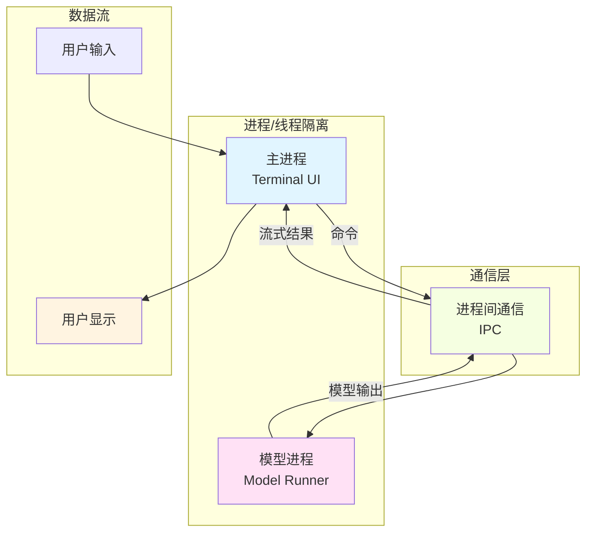

### 10.2 进程分离方案

#### 10.2.1 方案A：多进程 + IPC

```rust
use std::process::{Command, Stdio};
use std::io::{BufRead, BufReader, Write};

/// 在独立进程中运行模型
fn spawn_model_process() -> std::io::Result<std::process::Child> {
    Command::new("neco-model-runner")
        .stdin(Stdio::piped())
        .stdout(Stdio::piped())
        .stderr(Stdio::piped())
        .spawn()
}

/// 与模型进程通信
struct ModelBridge {
    process: std::process::Child,
    stdin: std::process::ChildStdin,
    stdout_reader: BufReader<std::process::ChildStdout>,
}

impl ModelBridge {
    fn new() -> std::io::Result<Self> {
        let process = spawn_model_process()?;
        let stdin = process.stdin.as_ref().unwrap().try_clone()?;
        let stdout = process.stdout.as_ref().unwrap().try_clone()?;
        let stdout_reader = BufReader::new(stdout);
        
        Ok(Self {
            process,
            stdin,
            stdout_reader,
        })
    }
    
    /// 发送命令到模型
    fn send_command(&mut self, cmd: &str) -> std::io::Result<()> {
        writeln!(self.stdin, "{}", cmd)
    }
    
    /// 读取模型输出
    fn read_output(&mut self) -> std::io::Result<String> {
        let mut line = String::new();
        self.stdout_reader.read_line(&mut line)?;
        Ok(line)
    }
}
```

#### 10.2.2 方案B：线程隔离 + Channel通信

```rust
use tokio::sync::mpsc;
use std::thread;

/// 模型命令
#[derive(Debug)]
enum ModelCommand {
    Chat { message: String },
    Complete { context: String },
    Evaluate { code: String },
    Stop,
}

/// 模型响应
#[derive(Debug)]
enum ModelResponse {
    Chunk { text: String },
    Complete { result: String },
    Error { message: String },
    Done,
}

/// 模型运行器（独立线程）
struct ModelRunner {
    command_rx: mpsc::Receiver<ModelCommand>,
    response_tx: mpsc::UnboundedSender<ModelResponse>,
}

impl ModelRunner {
    fn new() -> (Self, mpsc::Sender<ModelCommand>, mpsc::UnboundedReceiver<ModelResponse>) {
        let (command_tx, command_rx) = mpsc::channel(100);
        let (response_tx, response_rx) = mpsc::unbounded_channel();
        
        let runner = Self {
            command_rx,
            response_tx,
        };
        
        (runner, command_tx, response_rx)
    }
    
    fn run(mut self) {
        thread::spawn(move || {
            while let Some(cmd) = self.command_rx.blocking_recv() {
                match cmd {
                    ModelCommand::Chat { message } => {
                        self.handle_chat(message);
                    }
                    ModelCommand::Complete { context } => {
                        self.handle_complete(context);
                    }
                    ModelCommand::Evaluate { code } => {
                        self.handle_evaluate(code);
                    }
                    ModelCommand::Stop => {
                        self.response_tx.send(ModelResponse::Done).ok();
                        break;
                    }
                }
            }
        });
    }
    
    fn handle_chat(&self, message: String) {
        // 模拟流式输出
        for chunk in message.split_whitespace() {
            self.response_tx
                .send(ModelResponse::Chunk {
                    text: format!("{} ", chunk),
                })
                .ok();
            thread::sleep(Duration::from_millis(100));
        }
        
        self.response_tx
            .send(ModelResponse::Complete {
                result: "Done".to_string(),
            })
            .ok();
    }
}
```

#### 10.2.3 方案C：异步任务 + 共享状态

```rust
use std::sync::{Arc, RwLock};

/// 共享的模型状态
#[derive(Debug)]
struct ModelState {
    active_chat: Option<String>,
    outputs: Vec<ChatOutput>,
    is_running: bool,
}

#[derive(Debug, Clone)]
struct ChatOutput {
    role: String,
    content: String,
    timestamp: Instant,
}

/// 异步模型接口
trait AsyncModel {
    async fn chat(&mut self, message: &str) -> Result<String>;
    async fn stream_chat(&mut self, message: &str) -> Result<Pin<Box<dyn Stream<Item = String> + Send>>>;
}

/// 基于共享状态的模型桥接
struct AsyncModelBridge {
    state: Arc<RwLock<ModelState>>,
    model: Box<dyn AsyncModel + Send + Sync>,
}

impl AsyncModelBridge {
    fn new(model: Box<dyn AsyncModel + Send + Sync>) -> Self {
        Self {
            state: Arc::new(RwLock::new(ModelState {
                active_chat: None,
                outputs: Vec::new(),
                is_running: true,
            })),
            model,
        }
    }
    
    /// 启动流式聊天
    async fn start_chat(&mut self, message: String) -> Result<()> {
        let state = Arc::clone(&self.state);
        
        {
            let mut state_writer = state.write().unwrap();
            state_writer.active_chat = Some(message.clone());
            state_writer.is_running = true;
        }
        
        // 启动异步任务
        tokio::spawn(async move {
            match self.model.stream_chat(&message).await {
                Ok(mut stream) => {
                    while let Some(chunk) = stream.next().await {
                        {
                            let mut state = state.write().unwrap();
                            state.outputs.push(ChatOutput {
                                role: "assistant".to_string(),
                                content: chunk,
                                timestamp: Instant::now(),
                            });
                        }
                        // 通知UI刷新
                        tokio::time::sleep(Duration::from_millis(50)).await;
                    }
                }
                Err(e) => {
                    let mut state = state.write().unwrap();
                    state.outputs.push(ChatOutput {
                        role: "system".to_string(),
                        content: format!("Error: {}", e),
                        timestamp: Instant::now(),
                    });
                }
            }
            
            {
                let mut state = state.write().unwrap();
                state.is_running = false;
                state.active_chat = None;
            }
        });
        
        Ok(())
    }
}
```

### 10.3 分离架构的优势

1. **崩溃隔离**：模型崩溃不影响UI
2. **资源隔离**：模型可用独立资源限制
3. **独立升级**：模型和UI可独立发布
4. **语言无关**：模型可用Python等实现
5. **测试友好**：可独立测试各部分

### 10.4 推荐方案

对于Neco项目，推荐使用**方案C（异步任务 + 共享状态）**：

**理由：**
- Rust类型安全
- 性能最优（无需IPC开销）
- 错误处理更优雅
- 更容易实现流式输出
- 符合Rust最佳实践

---

## 11. 流式输出的TUI展示

### 11.1 流式输出架构

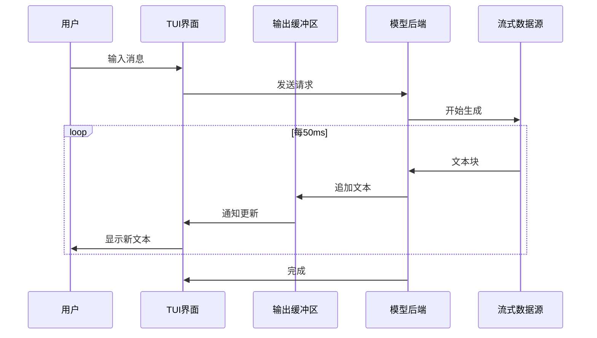

### 11.2 实现方案

#### 11.2.1 流式输出Widget

```rust
use ratatui::{
    widgets::{Paragraph, Widget},
    text::Text,
    Frame,
};

struct StreamingOutput {
    content: String,
    is_streaming: bool,
    cursor_visible: bool,
}

impl StreamingOutput {
    fn new() -> Self {
        Self {
            content: String::new(),
            is_streaming: false,
            cursor_visible: true,
        }
    }
    
    fn append(&mut self, chunk: &str) {
        self.content.push_str(chunk);
        self.is_streaming = true;
    }
    
    fn finish(&mut self) {
        self.is_streaming = false;
    }
    
    fn clear(&mut self) {
        self.content.clear();
        self.is_streaming = false;
    }
}

impl Widget for &StreamingOutput {
    fn render(self, area: Rect, buf: &mut Buffer) {
        let mut display_content = self.content.clone();
        
        // 添加闪烁光标效果
        if self.is_streaming && self.cursor_visible {
            display_content.push('█');
        }
        
        // 使用Paragraph渲染，自动处理换行
        let paragraph = Paragraph::new(display_content)
            .wrap(Wrap { trim: false })
            .scroll((0, 0));
        
        paragraph.render(area, buf);
    }
}
```

#### 11.2.2 流式输出管理器

```rust
use tokio::sync::mpsc;
use std::time::{Duration, Instant};

struct StreamingManager {
    output: StreamingOutput,
    last_update: Instant,
    update_interval: Duration,
    cursor_toggle_interval: Duration,
    last_cursor_toggle: Instant,
}

impl StreamingManager {
    fn new() -> Self {
        Self {
            output: StreamingOutput::new(),
            last_update: Instant::now(),
            update_interval: Duration::from_millis(50),
            cursor_toggle_interval: Duration::from_millis(500),
            last_cursor_toggle: Instant::now(),
        }
    }
    
    /// 处理流式数据块
    fn handle_chunk(&mut self, chunk: String) {
        self.output.append(&chunk);
        self.last_update = Instant::now();
    }
    
    /// 完成流式输出
    fn finish(&mut self) {
        self.output.finish();
    }
    
    /// 更新光标闪烁状态
    fn update_cursor(&mut self) {
        if self.last_cursor_toggle.elapsed() > self.cursor_toggle_interval {
            self.output.cursor_visible = !self.output.cursor_visible;
            self.last_cursor_toggle = Instant::now();
        }
    }
    
    /// 检查是否需要重新渲染
    fn needs_render(&self) -> bool {
        self.output.is_streaming || 
        self.last_update.elapsed() < self.update_interval
    }
}

/// 流式输出TUI应用
struct StreamingApp {
    manager: StreamingManager,
    model_rx: mpsc::Receiver<StreamEvent>,
}

#[derive(Debug)]
enum StreamEvent {
    Chunk(String),
    Complete,
    Error(String),
}

impl StreamingApp {
    async fn run(mut self, mut terminal: DefaultTerminal) -> std::io::Result<()> {
        let render_interval = Duration::from_millis(16);  // ~60 FPS
        
        loop {
            tokio::select! {
                // 处理流式事件
                Some(event) = self.model_rx.recv() => {
                    match event {
                        StreamEvent::Chunk(chunk) => {
                            self.manager.handle_chunk(chunk);
                        }
                        StreamEvent::Complete => {
                            self.manager.finish();
                        }
                        StreamEvent::Error(err) => {
                            self.manager.handle_chunk(format!("Error: {}", err));
                            self.manager.finish();
                        }
                    }
                }
                
                // 定期渲染
                _ = tokio::time::sleep(render_interval) => {
                    if self.manager.needs_render() {
                        self.manager.update_cursor();
                        terminal.draw(|frame| {
                            let layout = Layout::vertical([
                                Constraint::Min(0),      // 输出区域
                                Constraint::Length(1),    // 输入区域
                            ]).split(frame.area());
                            
                            frame.render_widget(&self.manager.output, layout[0]);
                        })?;
                    }
                }
            }
        }
    }
}
```

### 11.3 Markdown流式渲染

对于支持Markdown的流式输出：

```rust
use pulldown_cmark::{Parser, Event as MarkdownEvent};

struct MarkdownStreamingOutput {
    content: String,
    rendered_lines: Vec<Line<'static>>,
    is_streaming: bool,
}

impl MarkdownStreamingOutput {
    fn append_markdown(&mut self, markdown: &str) {
        self.content.push_str(markdown);
        self.rendered_lines = self.render_markdown();
        self.is_streaming = true;
    }
    
    fn render_markdown(&self) -> Vec<Line<'static>> {
        let parser = Parser::new(&self.content);
        let mut lines = Vec::new();
        let mut current_line = String::new();
        let mut current_style = Style::default();
        
        for event in parser {
            match event {
                MarkdownEvent::Start(tag) => {
                    match tag {
                        pulldown_cmark::Tag::Heading(level, ..) => {
                            current_style = Style::default()
                                .fg(match level {
                                    1 => Color::Cyan,
                                    2 => Color::Green,
                                    _ => Color::White,
                                })
                                .add_modifier(Modifier::BOLD);
                        }
                        pulldown_cmark::Tag::CodeBlock(..) => {
                            current_style = Style::default()
                                .fg(Color::Yellow)
                                .bg(Color::DarkGray);
                        }
                        _ => {}
                    }
                }
                MarkdownEvent::End(_) => {
                    current_style = Style::default();
                }
                MarkdownEvent::Text(text) => {
                    current_line.push_str(&text);
                }
                MarkdownEvent::SoftBreak | MarkdownEvent::HardBreak => {
                    lines.push(Line::styled(
                        current_line.clone(),
                        current_style,
                    ));
                    current_line.clear();
                }
                _ => {}
            }
        }
        
        if !current_line.is_empty() {
            lines.push(Line::styled(current_line, current_style));
        }
        
        lines
    }
}

impl Widget for &MarkdownStreamingOutput {
    fn render(self, area: Rect, buf: &mut Buffer) {
        let text = Text::from(self.rendered_lines.clone());
        let paragraph = Paragraph::new(text)
            .wrap(Wrap { trim: false });
        paragraph.render(area, buf);
    }
}
```

### 11.4 代码高亮流式输出

```rust
use syntect::{easy::HighlightLines, highlighting::ThemeSet, parsing::SyntaxSet};

struct CodeStreamingOutput {
    code: String,
    language: String,
    syntax_set: SyntaxSet,
    theme_set: ThemeSet,
}

impl CodeStreamingOutput {
    fn new(language: &str) -> Self {
        Self {
            code: String::new(),
            language: language.to_string(),
            syntax_set: SyntaxSet::load_defaults_newlines(),
            theme_set: ThemeSet::load_defaults(),
        }
    }
    
    fn append_code(&mut self, chunk: &str) {
        self.code.push_str(chunk);
    }
    
    fn render_highlighted(&self) -> Text {
        let syntax = self.syntax_set
            .find_syntax_by_token(&self.language)
            .unwrap_or_else(|| self.syntax_set.find_syntax_plain_text());
        
        let mut highlighter = HighlightLines::new(syntax, &self.theme_set.themes["base16-ocean.dark"]);
        let mut lines = Vec::new();
        
        for line in self.code.lines() {
            let ranges = highlighter.highlight_line(line, &self.syntax_set);
            let styled_text: Vec<Span> = ranges
                .into_iter()
                .map(|(style, text)| {
                    Span::styled(
                        text,
                        Style::default()
                            .fg(Color::Rgb(
                                style.foreground.r,
                                style.foreground.g,
                                style.foreground.b,
                            ))
                            .bg(Color::Rgb(
                                style.background.r,
                                style.background.g,
                                style.background.b,
                            )),
                    )
                })
                .collect();
            
            lines.push(Line::from(styled_text));
        }
        
        Text::from(lines)
    }
}
```

---

## 12. 多Agent并行执行的UI展示

### 12.1 多Agent架构

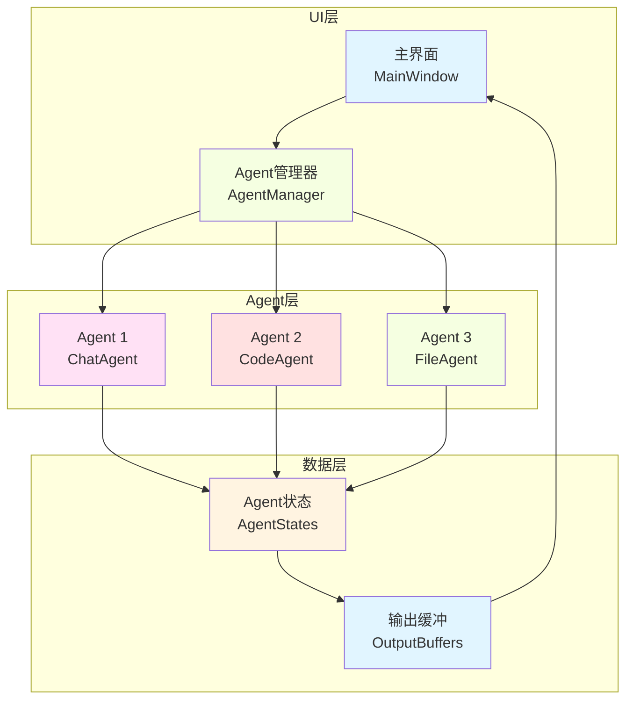

### 12.2 Agent状态管理

```rust
use std::collections::HashMap;
use std::sync::{Arc, RwLock};

/// Agent唯一标识
#[derive(Debug, Clone, Hash, PartialEq, Eq)]
pub struct AgentId {
    pub name: String,
    pub session: Uuid,
}

/// Agent状态
#[derive(Debug, Clone)]
pub struct AgentState {
    pub id: AgentId,
    pub status: AgentStatus,
    pub task: Option<String>,
    pub progress: f32,
    pub output: Vec<String>,
    pub last_update: Instant,
}

#[derive(Debug, Clone, PartialEq, Eq)]
pub enum AgentStatus {
    Idle,
    Running,
    Waiting,
    Error(String),
    Completed,
}

/// Agent状态管理器
pub struct AgentManager {
    agents: HashMap<AgentId, AgentState>,
    active_agent: Option<AgentId>,
}

impl AgentManager {
    pub fn new() -> Self {
        Self {
            agents: HashMap::new(),
            active_agent: None,
        }
    }
    
    /// 注册新Agent
    pub fn register_agent(&mut self, id: AgentId) {
        self.agents.insert(id.clone(), AgentState {
            id: id.clone(),
            status: AgentStatus::Idle,
            task: None,
            progress: 0.0,
            output: Vec::new(),
            last_update: Instant::now(),
        });
    }
    
    /// 设置活跃Agent
    pub fn set_active(&mut self, id: AgentId) {
        self.active_agent = Some(id);
    }
    
    /// 更新Agent状态
    pub fn update_agent(&mut self, id: &AgentId, update: AgentUpdate) {
        if let Some(state) = self.agents.get_mut(id) {
            match update {
                AgentUpdate::Status(status) => state.status = status,
                AgentUpdate::Task(task) => state.task = Some(task),
                AgentUpdate::Progress(progress) => state.progress = progress,
                AgentUpdate::Output(output) => {
                    state.output.push(output);
                    state.last_update = Instant::now();
                }
            }
        }
    }
    
    /// 获取所有Agent状态
    pub fn get_all(&self) -> Vec<&AgentState> {
        self.agents.values().collect()
    }
    
    /// 获取活跃Agent
    pub fn get_active(&self) -> Option<&AgentState> {
        self.active_agent.as_ref()
            .and_then(|id| self.agents.get(id))
    }
}

#[derive(Debug)]
pub enum AgentUpdate {
    Status(AgentStatus),
    Task(String),
    Progress(f32),
    Output(String),
}
```

### 12.3 多Agent UI组件

```rust
use ratatui::{
    layout::{Alignment, Constraint, Direction, Layout, Rect},
    widgets::{Block, Borders, Gauge, List, ListItem, Paragraph, Wrap},
    Frame,
};

struct MultiAgentWidget {
    manager: Arc<RwLock<AgentManager>>,
}

impl MultiAgentWidget {
    fn new(manager: Arc<RwLock<AgentManager>>) -> Self {
        Self { manager }
    }
    
    fn render(&self, frame: &mut Frame, area: Rect) {
        // 顶部：Agent列表
        let top_height = 8;
        let top_area = Rect {
            height: top_height,
            ..area
        };
        
        // 底部：活跃Agent详情
        let bottom_area = Rect {
            y: area.y + top_height,
            height: area.height - top_height,
            ..area
        };
        
        self.render_agent_list(frame, top_area);
        self.render_active_agent(frame, bottom_area);
    }
    
    fn render_agent_list(&self, frame: &mut Frame, area: Rect) {
        let manager = self.manager.read().unwrap();
        let agents = manager.get_all();
        
        let items: Vec<ListItem> = agents
            .iter()
            .map(|agent| {
                let status_icon = match agent.status {
                    AgentStatus::Idle => "○",
                    AgentStatus::Running => "◉",
                    AgentStatus::Waiting => "◌",
                    AgentStatus::Error(_) => "✖",
                    AgentStatus::Completed => "✔",
                };
                
                let progress_bar = format!(
                    "[{:<20}] {:.0}%",
                    "█".repeat((agent.progress * 20.0) as usize),
                    agent.progress * 100.0
                );
                
                ListItem::new(format!(
                    "{} {} - {} {}",
                    status_icon,
                    agent.id.name,
                    agent.task.as_deref().unwrap_or("Idle"),
                    if agent.status == AgentStatus::Running {
                        &progress_bar
                    } else {
                        ""
                    }
                ))
            })
            .collect();
        
        let list = List::new(items)
            .block(Block::bordered().title("Agents"))
            .highlight_style(Style::default().add_modifier(Modifier::BOLD));
        
        frame.render_stateful_widget(list, area, &mut self.list_state.clone());
    }
    
    fn render_active_agent(&self, frame: &mut Frame, area: Rect) {
        let manager = self.manager.read().unwrap();
        
        if let Some(agent) = manager.get_active() {
            // Agent信息
            let info_text = vec![
                Line::from(format!("Agent: {}", agent.id.name)),
                Line::from(format!("Status: {:?}", agent.status)),
                Line::from(format!("Task: {}", agent.task.as_deref().unwrap_or("None"))),
                Line::from(""),
                Line::from("Output:"),
            ];
            
            // 输出区域
            let layout = Layout::vertical([
                Constraint::Length(4),
                Constraint::Min(0),
            ])
            .split(area);
            
            // 渲染Agent信息
            let info_widget = Paragraph::new(info_text)
                .block(Block::bordered().title("Agent Info"));
            frame.render_widget(info_widget, layout[0]);
            
            // 渲染Agent输出
            let output_lines: Vec<Line> = agent
                .output
                .iter()
                .map(|line| Line::from(line.as_str()))
                .collect();
            
            let output_widget = Paragraph::new(output_lines)
                .block(Block::bordered().title("Output"))
                .wrap(Wrap { trim: false });
            frame.render_widget(output_widget, layout[1]);
            
            // 渲染进度条
            if agent.status == AgentStatus::Running {
                let progress_area = Rect {
                    y: area.bottom() - 3,
                    height: 3,
                    ..area
                };
                
                let progress = Gauge::default()
                    .block(Block::bordered().title("Progress"))
                    .gauge_style(Style::default().fg(Color::Green))
                    .percent(agent.progress as u16);
                
                frame.render_widget(progress, progress_area);
            }
        } else {
            let text = Paragraph::new("No active agent")
                .alignment(Alignment::Center);
            frame.render_widget(text, area);
        }
    }
}
```

### 12.4 并行执行协调器

```rust
use tokio::sync::{mpsc, oneshot};

/// Agent任务
struct AgentTask {
    id: AgentId,
    command: String,
    response_tx: oneshotSender<AgentResult>,
}

/// Agent任务结果
#[derive(Debug)]
enum AgentResult {
    Output(String),
    Complete,
    Error(String),
}

/// Agent执行器
pub struct AgentExecutor {
    task_tx: mpsc::Sender<AgentTask>,
    state: Arc<RwLock<AgentManager>>,
}

impl AgentExecutor {
    pub fn new(state: Arc<RwLock<AgentManager>>) -> Self {
        let (task_tx, mut task_rx) = mpsc::channel(100);
        let state_clone = Arc::clone(&state);
        
        // 启动Agent执行任务
        tokio::spawn(async move {
            while let Some(task) = task_rx.recv().await {
                let state = Arc::clone(&state_clone);
                tokio::spawn(async move {
                    Self::execute_agent_task(state, task).await;
                });
            }
        });
        
        Self { task_tx, state }
    }
    
    async fn execute_agent_task(state: Arc<RwLock<AgentManager>>, task: AgentTask) {
        // 更新状态：开始运行
        {
            let mut manager = state.write().unwrap();
            manager.update_agent(&task.id, AgentUpdate::Status(AgentStatus::Running));
            manager.update_agent(&task.id, AgentUpdate::Task(task.command.clone()));
        }
        
        // 模拟Agent执行
        let mut output = Vec::new();
        for i in 1..=10 {
            let line = format!("{}: Processing step {}...", task.id.name, i);
            output.push(line.clone());
            
            // 更新进度
            {
                let mut manager = state.write().unwrap();
                manager.update_agent(&task.id, AgentUpdate::Output(line));
                manager.update_agent(&task.id, AgentUpdate::Progress(i as f32 / 10.0));
            }
            
            tokio::time::sleep(Duration::from_millis(500)).await;
        }
        
        // 完成
        {
            let mut manager = state.write().unwrap();
            manager.update_agent(&task.id, AgentUpdate::Status(AgentStatus::Completed));
            manager.update_agent(&task.id, AgentUpdate::Progress(1.0));
        }
        
        // 发送结果
        let _ = task.response_tx.send(AgentResult::Complete);
    }
    
    /// 提交Agent任务
    pub async fn submit(&self, id: AgentId, command: String) -> Result<AgentResult> {
        let (response_tx, response_rx) = oneshot::channel();
        
        let task = AgentTask {
            id,
            command,
            response_tx,
        };
        
        self.task_tx.send(task).await
            .map_err(|_| anyhow::anyhow!("Failed to submit task"))?;
        
        response_rx.await
            .map_err(|_| anyhow::anyhow!("Agent task cancelled"))
    }
}
```

### 12.5 完整的多Agent应用

```rust
pub struct MultiAgentApp {
    manager: Arc<RwLock<AgentManager>>,
    executor: AgentExecutor,
    selected_agent: Option<AgentId>,
}

impl MultiAgentApp {
    pub fn new() -> Self {
        let manager = Arc::new(RwLock::new(AgentManager::new()));
        let executor = AgentExecutor::new(Arc::clone(&manager));
        
        // 注册默认Agent
        let mut manager_ref = manager.write().unwrap();
        manager_ref.register_agent(AgentId {
            name: "Chat".to_string(),
            session: Uuid::new_v4(),
        });
        manager_ref.register_agent(AgentId {
            name: "Code".to_string(),
            session: Uuid::new_v4(),
        });
        manager_ref.register_agent(AgentId {
            name: "File".to_string(),
            session: Uuid::new_v4(),
        });
        
        Self {
            manager,
            executor,
            selected_agent: None,
        }
    }
    
    pub async fn run(mut self, mut terminal: DefaultTerminal) -> std::io::Result<()> {
        let tick_rate = Duration::from_millis(250);
        let render_interval = Duration::from_millis(16);
        
        let mut events = EventStream::new();
        let mut render_ticker = tokio::time::interval(render_interval);
        
        loop {
            tokio::select! {
                // 渲染
                _ = render_ticker.tick() => {
                    terminal.draw(|frame| {
                        let layout = Layout::vertical([
                            Constraint::Length(8),
                            Constraint::Min(0),
                        ]).split(frame.area());
                        
                        let widget = MultiAgentWidget::new(Arc::clone(&self.manager));
                        widget.render(frame, frame.area());
                    })?;
                }
                
                // 事件处理
                Some(Ok(event)) = events.next() => {
                    if let Event::Key(key) = event {
                        if key.kind == KeyEventKind::Press {
                            if self.handle_key_event(&key).await {
                                break;
                            }
                        }
                    }
                }
            }
        }
    }
    
    async fn handle_key_event(&mut self, key: &KeyEvent) -> bool {
        match key.code {
            KeyCode::Char('q') => true,  // 退出
            KeyCode::Char('s') => {
                // 启动选中的Agent
                if let Some(ref id) = self.selected_agent {
                    let _ = self.executor.submit(id.clone(), "Start task".to_string()).await;
                }
                false
            }
            KeyCode::Up | KeyCode::Char('k') => {
                // 选择上一个Agent
                self.select_prev_agent();
                false
            }
            KeyCode::Down | KeyCode::Char('j') => {
                // 选择下一个Agent
                self.select_next_agent();
                false
            }
            _ => false,
        }
    }
}
```

---

## 13. Session管理的TUI实现

### 13.1 Session架构

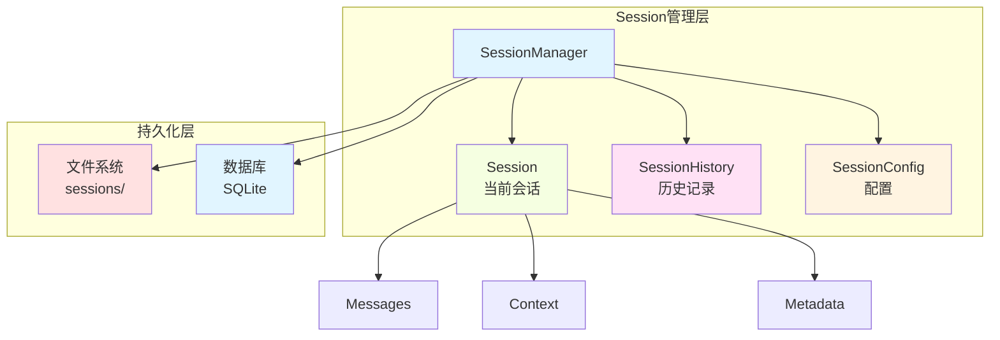

### 13.2 Session数据结构

```rust
use serde::{Deserialize, Serialize};
use std::collections::HashMap;
use std::path::PathBuf;
use chrono::{DateTime, Utc};

/// 会话唯一标识
#[derive(Debug, Clone, PartialEq, Eq, Hash, Serialize, Deserialize)]
pub struct SessionId(pub Uuid);

/// 消息
#[derive(Debug, Clone, Serialize, Deserialize)]
pub struct Message {
    pub id: Uuid,
    pub role: MessageRole,
    pub content: String,
    pub timestamp: DateTime<Utc>,
    pub metadata: HashMap<String, String>,
}

#[derive(Debug, Clone, Serialize, Deserialize)]
pub enum MessageRole {
    User,
    Assistant,
    System,
    Tool,
}

/// 会话上下文
#[derive(Debug, Clone, Serialize, Deserialize)]
pub struct SessionContext {
    pub model: String,
    pub temperature: f32,
    pub max_tokens: u32,
    pub system_prompt: Option<String>,
    pub tools: Vec<String>,
}

/// 会话元数据
#[derive(Debug, Clone, Serialize, Deserialize)]
pub struct SessionMetadata {
    pub id: SessionId,
    pub title: String,
    pub created_at: DateTime<Utc>,
    pub updated_at: DateTime<Utc>,
    pub message_count: usize,
    pub tags: Vec<String>,
}

/// 会话
#[derive(Debug, Clone, Serialize, Deserialize)]
pub struct Session {
    pub metadata: SessionMetadata,
    pub context: SessionContext,
    pub messages: Vec<Message>,
}
```

### 13.3 Session管理器

```rust
pub struct SessionManager {
    sessions: HashMap<SessionId, Session>,
    current_session: Option<SessionId>,
    config_dir: PathBuf,
}

impl SessionManager {
    pub fn new(config_dir: PathBuf) -> Result<Self> {
        Ok(Self {
            sessions: HashMap::new(),
            current_session: None,
            config_dir,
        })
    }
    
    /// 创建新会话
    pub fn create_session(&mut self, title: String) -> Result<SessionId> {
        let id = SessionId(Uuid::new_v4());
        let now = Utc::now();
        
        let session = Session {
            metadata: SessionMetadata {
                id: id.clone(),
                title: title.clone(),
                created_at: now,
                updated_at: now,
                message_count: 0,
                tags: vec![],
            },
            context: SessionContext {
                model: "default".to_string(),
                temperature: 0.7,
                max_tokens: 2048,
                system_prompt: None,
                tools: vec![],
            },
            messages: vec![],
        };
        
        self.sessions.insert(id.clone(), session);
        self.current_session = Some(id.clone());
        
        // 保存到磁盘
        self.save_session(&id)?;
        
        Ok(id)
    }
    
    /// 添加消息到当前会话
    pub fn add_message(&mut self, role: MessageRole, content: String) -> Result<()> {
        if let Some(ref session_id) = self.current_session {
            if let Some(session) = self.sessions.get_mut(session_id) {
                let message = Message {
                    id: Uuid::new_v4(),
                    role,
                    content,
                    timestamp: Utc::now(),
                    metadata: HashMap::new(),
                };
                
                session.messages.push(message);
                session.metadata.updated_at = Utc::now();
                session.metadata.message_count = session.messages.len();
                
                // 保存更新
                self.save_session(session_id)?;
            }
        }
        
        Ok(())
    }
    
    /// 切换会话
    pub fn switch_session(&mut self, id: SessionId) -> Result<()> {
        if self.sessions.contains_key(&id) {
            self.current_session = Some(id);
            Ok(())
        } else {
            Err(anyhow::anyhow!("Session not found: {:?}", id))
        }
    }
    
    /// 列出所有会话
    pub fn list_sessions(&self) -> Vec<&SessionMetadata> {
        self.sessions.values()
            .map(|s| &s.metadata)
            .collect()
    }
    
    /// 删除会话
    pub fn delete_session(&mut self, id: SessionId) -> Result<()> {
        if let Some(session) = self.sessions.remove(&id) {
            // 删除文件
            let session_file = self.session_file_path(&id);
            if session_file.exists() {
                std::fs::remove_file(session_file)?;
            }
            
            if self.current_session == Some(id) {
                self.current_session = None;
            }
        }
        
        Ok(())
    }
    
    /// 保存会话到磁盘
    fn save_session(&self, id: &SessionId) -> Result<()> {
        if let Some(session) = self.sessions.get(id) {
            let session_file = self.session_file_path(id);
            
            // 确保目录存在
            if let Some(parent) = session_file.parent() {
                std::fs::create_dir_all(parent)?;
            }
            
            // 序列化并保存
            let json = serde_json::to_string_pretty(session)?;
            std::fs::write(session_file, json)?;
        }
        
        Ok(())
    }
    
    /// 从磁盘加载会话
    fn load_session(&mut self, id: SessionId) -> Result<()> {
        let session_file = self.session_file_path(&id);
        
        if session_file.exists() {
            let json = std::fs::read_to_string(session_file)?;
            let session: Session = serde_json::from_str(&json)?;
            self.sessions.insert(id, session);
        }
        
        Ok(())
    }
    
    /// 加载所有会话
    pub fn load_all_sessions(&mut self) -> Result<()> {
        let sessions_dir = self.config_dir.join("sessions");
        
        if sessions_dir.exists() {
            for entry in std::fs::read_dir(sessions_dir)? {
                let entry = entry?;
                if entry.file_type()?.is_file() {
                    if let Some(id_str) = entry.file_name().to_str() {
                        if let Ok(uuid) = Uuid::parse_str(id_str) {
                            let id = SessionId(uuid);
                            self.load_session(id)?;
                        }
                    }
                }
            }
        }
        
        Ok(())
    }
    
    fn session_file_path(&self, id: &SessionId) -> PathBuf {
        self.config_dir
            .join("sessions")
            .join(format!("{}.json", id.0))
    }
}
```

### 13.4 Session选择Widget

```rust
pub struct SessionSelector {
    sessions: Vec<SessionMetadata>,
    selected_index: usize,
}

impl SessionSelector {
    pub fn new(sessions: Vec<SessionMetadata>) -> Self {
        Self {
            sessions,
            selected_index: 0,
        }
    }
    
    pub fn select_next(&mut self) {
        if !self.sessions.is_empty() {
            self.selected_index = (self.selected_index + 1) % self.sessions.len();
        }
    }
    
    pub fn select_prev(&mut self) {
        if !self.sessions.is_empty() {
            self.selected_index = if self.selected_index == 0 {
                self.sessions.len() - 1
            } else {
                self.selected_index - 1
            };
        }
    }
    
    pub fn selected_session(&self) -> Option<&SessionMetadata> {
        self.sessions.get(self.selected_index)
    }
}

impl Widget for &SessionSelector {
    fn render(self, area: Rect, buf: &mut Buffer) {
        let items: Vec<ListItem> = self.sessions
            .iter()
            .enumerate()
            .map(|(i, session)| {
                let prefix = if i == self.selected_index {
                    "► "
                } else {
                    "  "
                };
                
                let date_str = session.updated_at.format("%Y-%m-%d %H:%M").to_string();
                let count_str = format!("({} messages)", session.message_count);
                
                ListItem::new(format!(
                    "{}{} {} {}",
                    prefix,
                    session.title,
                    date_str,
                    count_str
                ))
            })
            .collect();
        
        let list = List::new(items)
            .block(Block::bordered().title("Sessions"))
            .highlight_style(Style::default().add_modifier(Modifier::BOLD));
        
        frame.render_stateful_widget(list, area, &mut self.list_state.clone());
    }
}
```

### 13.5 Session管理UI

```rust
pub struct SessionManagementUI {
    manager: Arc<RwLock<SessionManager>>,
    mode: SessionMode,
    current_view: SessionView,
}

#[derive(Debug, Clone, PartialEq, Eq)]
pub enum SessionMode {
    Normal,
    Selecting,
    Creating,
    Deleting,
}

#[derive(Debug, Clone, PartialEq, Eq)]
pub enum SessionView {
    SessionList,
    SessionDetail,
    CreateSession,
}

impl SessionManagementUI {
    pub fn new(manager: Arc<RwLock<SessionManager>>) -> Self {
        Self {
            manager,
            mode: SessionMode::Normal,
            current_view: SessionView::SessionList,
        }
    }
    
    pub fn render(&self, frame: &mut Frame) {
        match self.current_view {
            SessionView::SessionList => {
                self.render_session_list(frame);
            }
            SessionView::SessionDetail => {
                self.render_session_detail(frame);
            }
            SessionView::CreateSession => {
                self.render_create_session(frame);
            }
        }
    }
    
    fn render_session_list(&self, frame: &mut Frame) {
        let manager = self.manager.read().unwrap();
        let sessions = manager.list_sessions();
        
        let selector = SessionSelector::new(sessions.into_iter().cloned().collect());
        frame.render_widget(&selector, frame.area());
    }
    
    fn render_session_detail(&self, frame: &mut Frame) {
        let manager = self.manager.read().unwrap();
        
        if let Some(session_id) = manager.current_session.as_ref() {
            if let Some(session) = manager.sessions.get(session_id) {
                // 渲染会话详情
                let detail_text = vec![
                    Line::from(format!("Title: {}", session.metadata.title)),
                    Line::from(format!("Created: {}", session.metadata.created_at)),
                    Line::from(format!("Messages: {}", session.metadata.message_count)),
                    Line::from(""),
                    Line::from("Messages:"),
                ];
                
                // 渲染消息列表
                let layout = Layout::vertical([
                    Constraint::Length(5),
                    Constraint::Min(0),
                ]).split(frame.area());
                
                let detail_widget = Paragraph::new(detail_text)
                    .block(Block::bordered().title("Session Info"));
                frame.render_widget(detail_widget, layout[0]);
                
                let messages: Vec<Line> = session.messages.iter().map(|msg| {
                    Line::from(format!("{}: {}", 
                        match msg.role {
                            MessageRole::User => "User",
                            MessageRole::Assistant => "Assistant",
                            MessageRole::System => "System",
                            MessageRole::Tool => "Tool",
                        },
                        msg.content
                    ))
                }).collect();
                
                let messages_widget = Paragraph::new(messages)
                    .block(Block::bordered().title("Messages"))
                    .wrap(Wrap { trim: false });
                frame.render_widget(messages_widget, layout[1]);
            }
        }
    }
    
    fn render_create_session(&self, frame: &mut Frame) {
        let text = vec![
            Line::from("Create New Session"),
            Line::from(""),
            Line::from("Enter session title:"),
            Line::from(""),
            Line::from("Press Enter to create, Esc to cancel"),
        ];
        
        let paragraph = Paragraph::new(text)
            .alignment(Alignment::Center);
        frame.render_widget(paragraph, frame.area());
    }
}
```

---

## 14. ACP模式集成

### 14.1 ACP模式架构

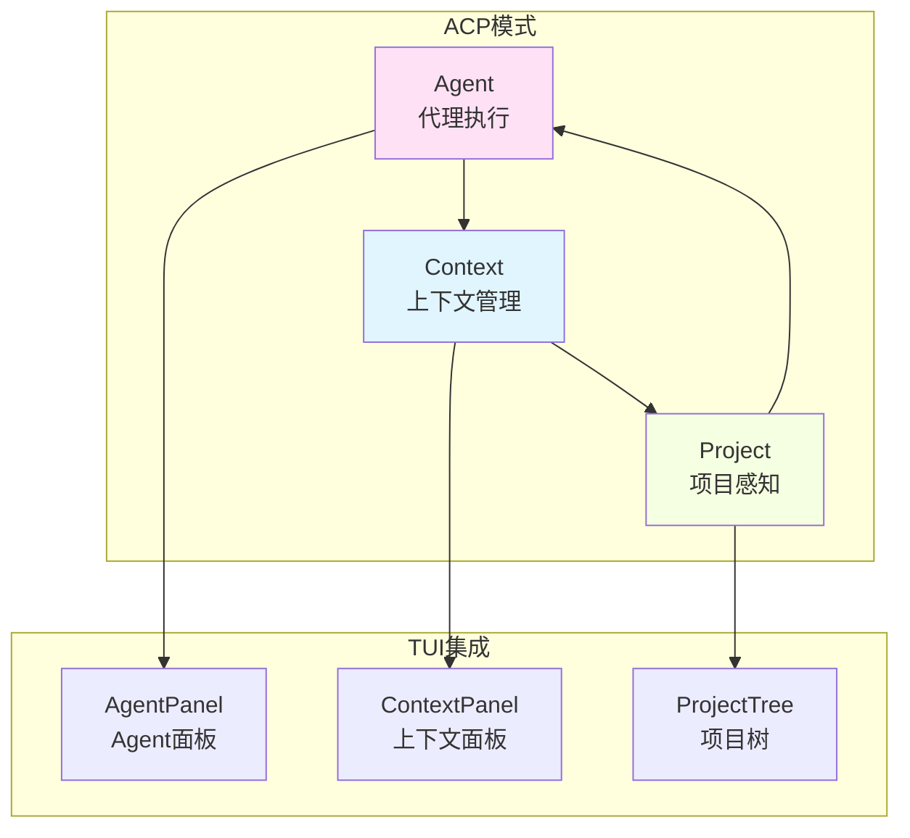

### 14.2 Agent Context Panel

```rust
use ratatui::{
    layout::{Constraint, Direction, Layout},
    widgets::{Block, List, ListItem, Paragraph, Wrap},
};

/// 上下文面板
pub struct ContextPanel {
    contexts: Vec<ContextItem>,
    selected_index: usize,
}

#[derive(Debug, Clone)]
pub struct ContextItem {
    pub name: String,
    pub content: String,
    pub tokens: usize,
    pub enabled: bool,
}

impl ContextPanel {
    pub fn new() -> Self {
        Self {
            contexts: Vec::new(),
            selected_index: 0,
        }
    }
    
    pub fn add_context(&mut self, name: String, content: String, tokens: usize) {
        self.contexts.push(ContextItem {
            name,
            content,
            tokens,
            enabled: true,
        });
    }
    
    pub fn toggle_context(&mut self, index: usize) {
        if let Some(item) = self.contexts.get_mut(index) {
            item.enabled = !item.enabled;
        }
    }
    
    pub fn total_tokens(&self) -> usize {
        self.contexts.iter()
            .filter(|c| c.enabled)
            .map(|c| c.tokens)
            .sum()
    }
}

impl Widget for &ContextPanel {
    fn render(self, area: Rect, buf: &mut Buffer) {
        let total = self.total_tokens();
        
        let items: Vec<ListItem> = self.contexts.iter().enumerate().map(|(i, ctx)| {
            let prefix = if ctx.enabled { "✓" } else { "✗" };
            let highlight = if i == self.selected_index {
                Style::default().add_modifier(Modifier::BOLD)
            } else {
                Style::default()
            };
            
            ListItem::new(format!(
                "{} {} ({} tokens)",
                prefix,
                ctx.name,
                ctx.tokens
            ))
            .style(highlight)
        }).collect();
        
        let header = format!("Context ({} tokens)", total);
        
        let list = List::new(items)
            .block(Block::bordered().title(header));
        
        list.render(area, buf);
    }
}
```

### 14.3 Project Tree组件

```rust
use std::path::PathBuf;

/// 项目树节点
#[derive(Debug, Clone)]
pub struct ProjectNode {
    pub name: String,
    pub path: PathBuf,
    pub is_dir: bool,
    pub is_expanded: bool,
    pub children: Vec<ProjectNode>,
}

/// 项目树组件
pub struct ProjectTree {
    root: ProjectNode,
    selected_path: Option<PathBuf>,
}

impl ProjectTree {
    pub fn new(root_dir: PathBuf) -> Result<Self> {
        let root = Self::scan_directory(&root_dir)?;
        Ok(Self {
            root,
            selected_path: None,
        })
    }
    
    fn scan_directory(dir: &PathBuf) -> Result<ProjectNode> {
        let name = dir.file_name()
            .and_then(|n| n.to_str())
            .unwrap_or("root")
            .to_string();
        
        let mut children = Vec::new();
        
        for entry in std::fs::read_dir(dir)? {
            let entry = entry?;
            let path = entry.path();
            
            if path.is_dir() {
                // 递归扫描子目录
                children.push(Self::scan_directory(&path)?);
            } else {
                let file_name = path.file_name()
                    .and_then(|n| n.to_str())
                    .unwrap_or("")
                    .to_string();
                
                children.push(ProjectNode {
                    name: file_name,
                    path,
                    is_dir: false,
                    is_expanded: false,
                    children: Vec::new(),
                });
            }
        }
        
        Ok(ProjectNode {
            name,
            path: dir.clone(),
            is_dir: true,
            is_expanded: true,
            children,
        })
    }
    
    pub fn toggle_expand(&mut self, path: &PathBuf) {
        self.toggle_expand_recursive(&mut self.root, path);
    }
    
    fn toggle_expand_recursive(&mut self, node: &mut ProjectNode, path: &PathBuf) {
        if node.path == *path {
            node.is_expanded = !node.is_expanded;
        } else {
            for child in &mut node.children {
                self.toggle_expand_recursive(child, path);
            }
        }
    }
}

impl Widget for &ProjectTree {
    fn render(self, area: Rect, buf: &mut Buffer) {
        let items = self.render_tree(&self.root, 0);
        let list = List::new(items)
            .block(Block::bordered().title("Project"));
        list.render(area, buf);
    }
}

impl ProjectTree {
    fn render_tree(&self, node: &ProjectNode, depth: usize) -> Vec<ListItem> {
        let mut items = Vec::new();
        
        let prefix = "  ".repeat(depth);
        let icon = if node.is_dir {
            if node.is_expanded { "▼" } else { "▶" }
        } else {
            "📄"
        };
        
        items.push(ListItem::new(format!("{}{} {}", prefix, icon, node.name)));
        
        if node.is_expanded {
            for child in &node.children {
                items.extend(self.render_tree(child, depth + 1));
            }
        }
        
        items
    }
}
```

### 14.4 ACP模式集成布局

```rust
pub struct ACPLayout {
    agent_panel: AgentPanel,
    context_panel: ContextPanel,
    project_tree: ProjectTree,
    active_panel: ActivePanel,
}

#[derive(Debug, Clone, Copy, PartialEq, Eq)]
pub enum ActivePanel {
    Agent,
    Context,
    Project,
}

impl ACPLayout {
    pub fn new(project_dir: PathBuf) -> Result<Self> {
        Ok(Self {
            agent_panel: AgentPanel::new(),
            context_panel: ContextPanel::new(),
            project_tree: ProjectTree::new(project_dir)?,
            active_panel: ActivePanel::Agent,
        })
    }
    
    pub fn render(&self, frame: &mut Frame) {
        // 三列布局
        let layout = Layout::horizontal([
            Constraint::Percentage(25),  // Agent Panel
            Constraint::Percentage(50),  // Main Area
            Constraint::Percentage(25),  // Context & Project
        ]).split(frame.area());
        
        // 左侧：Agent Panel
        frame.render_widget(&self.agent_panel, layout[0]);
        
        // 中间：主工作区
        // ...
        
        // 右侧：Context和Project
        let right_layout = Layout::vertical([
            Constraint::Percentage(50),
            Constraint::Percentage(50),
        ]).split(layout[2]);
        
        frame.render_widget(&self.context_panel, right_layout[0]);
        frame.render_widget(&self.project_tree, right_layout[1]);
        
        // 高亮活跃面板
        self.highlight_active_panel(frame);
    }
    
    fn highlight_active_panel(&self, frame: &mut Frame) {
        let style = Style::default()
            .fg(Color::Cyan)
            .add_modifier(Modifier::BOLD);
        
        let title = match self.active_panel {
            ActivePanel::Agent => "Agent (Active)",
            ActivePanel::Context => "Context (Active)",
            ActivePanel::Project => "Project (Active)",
        };
        
        // 在适当位置渲染高亮标题
    }
}
```

---

## 15. 与Neco需求的匹配度分析

### 15.1 需求对照表

| Neco需求 | Ratatui支持 | 匹配度 | 实现方案 |
|---------|------------|-------|---------|
| **终端REPL界面** | ✅ 完全支持 | ⭐⭐⭐⭐⭐ | 使用Paragraph + 自定义输入处理 |
| **流式输出** | ✅ 原生支持 | ⭐⭐⭐⭐⭐ | 异步任务 + 共享状态 + 定期渲染 |
| **多Agent并行** | ✅ 完全支持 | ⭐⭐⭐⭐⭐ | tokio::spawn + Channel + Arc<RwLock> |
| **模型运行分离** | ✅ 完全支持 | ⭐⭐⭐⭐⭐ | 异步任务隔离 + 事件通信 |
| **Session管理** | ✅ 完全支持 | ⭐⭐⭐⭐⭐ | 自定义SessionManager + 序列化 |
| **代码高亮** | ⚠️ 需要第三方 | ⭐⭐⭐⭐ | syntect + 自定义widget |
| **Markdown渲染** | ⚠️ 需要第三方 | ⭐⭐⭐⭐ | pulldown-cmark + 自定义widget |
| **文件树显示** | ✅ 原生支持 | ⭐⭐⭐⭐⭐ | List + 自定义树结构 |
| **快捷键绑定** | ✅ 完全支持 | ⭐⭐⭐⭐⭐ | 事件处理层实现 |
| **配置持久化** | ✅ 完全支持 | ⭐⭐⭐⭐⭐ | 标准Rust文件操作 |
| **智能模式** | ✅ 完全支持 | ⭐⭐⭐⭐ | 复杂状态机 |
| **交互式编辑** | ⚠️ 需要第三方 | ⭐⭐⭐ | tui-widgets或自定义 |

### 15.2 详细匹配分析

#### 15.2.1 终端REPL界面

**Neco需求：**
- 支持用户输入命令
- 显示模型输出
- 支持历史记录
- 支持多行输入

**Ratatui实现：**
- ✅ 使用`Paragraph` widget渲染文本
- ✅ 自定义`REPLInput`组件处理输入
- ✅ 使用`Vec<String>`存储历史记录
- ✅ 支持多行编辑（需自定义实现）

**推荐方案：**
```rust
struct REPLWidget {
    input: REPLInput,
    output: REPOutput,
    history: HistoryManager,
}
```

#### 15.2.2 流式输出

**Neco需求：**
- 实时显示模型生成
- 支持Markdown格式
- 支持代码高亮

**Ratatui实现：**
- ✅ 异步任务 + 共享状态（`Arc<RwLock>`）
- ✅ 使用`tokio::time::interval`定期渲染
- ✅ Markdown解析：`pulldown-cmark`
- ✅ 代码高亮：`syntect`

**推荐方案：**
```rust
struct StreamingWidget {
    content: Arc<RwLock<String>>,
    markdown_parser: Parser,
    code_highlighter: HighlightLines,
}
```

#### 15.2.3 多Agent并行

**Neco需求：**
- 同时运行多个Agent
- 显示每个Agent状态
- 支持Agent切换

**Ratatui实现：**
- ✅ 使用`tokio::spawn`并行执行
- ✅ 使用`mpsc::channel`通信
- ✅ `AgentManager`管理状态
- ✅ `MultiAgentWidget`显示多个Agent

**推荐方案：**
```rust
struct MultiAgentSystem {
    agents: HashMap<AgentId, AgentState>,
    executor: AgentExecutor,
    ui: MultiAgentWidget,
}
```

#### 15.2.4 模型运行分离

**Neco需求：**
- 模型运行在独立进程
- UI与模型解耦
- 支持流式通信

**Ratatui实现：**
- ✅ 异步任务隔离
- ✅ Channel通信（`mpsc`、`broadcast`）
- ✅ 共享状态同步（`Arc<RwLock>`）

**推荐方案：**
```rust
// UI进程
struct UIProcess {
    model_bridge: ModelBridge,
    renderer: Renderer,
}

// 模型桥接
struct ModelBridge {
    command_tx: mpsc::Sender<Command>,
    response_rx: mpsc::Receiver<Response>,
}
```

### 15.3 优势分析

#### 15.3.1 性能优势

1. **即时模式渲染**：
   - 无需维护widget树
   - 栈分配为主
   - 高效的diff算法

2. **异步友好**：
   - 与tokio完美集成
   - 支持非阻塞UI
   - 高效的并发模型

3. **内存效率**：
   - 典型应用<10MB
   - 小buffer占用
   - 智能缓存

#### 15.3.2 开发体验

1. **类型安全**：
   - 编译时保证UI正确性
   - 防止状态不一致

2. **模块化**：
   - 清晰的关注点分离
   - 易于测试和维护

3. **生态丰富**：
   - 大量第三方widget
   - 活跃的社区支持

### 15.4 潜在挑战

#### 15.4.1 学习曲线

- **即时模式思维**：需要适应不同于传统GUI的思维
- **异步编程**：需要理解tokio和async/await
- **布局系统**：需要熟悉flexbox-like布局

#### 15.4.2 功能缺失

- **交互式编辑**：需要第三方库或自定义实现
- **复杂图形**：终端限制（需要Canvas）
- **触摸支持**：终端限制

#### 15.4.3 性能考虑

- **大量渲染**：复杂UI可能影响帧率
- **内存分配**：需避免在渲染循环中分配
- **终端兼容性**：不同终端能力差异

---

## 16. 推荐架构设计

### 16.1 整体架构

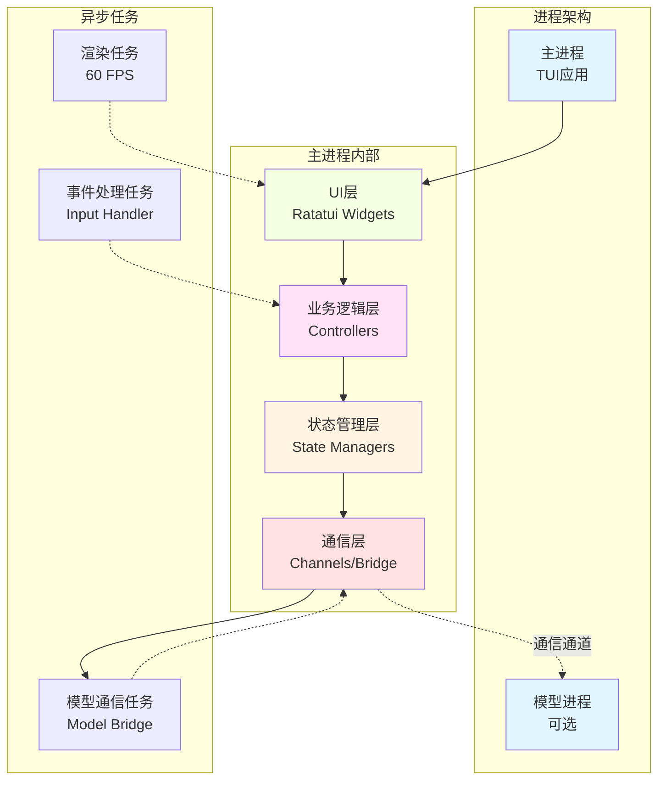

### 16.2 模块划分

```rust
// main.rs
pub mod ui;
pub mod controllers;
pub mod state;
pub mod bridge;
pub mod config;

use ui::Application;
use state::StateManager;

#[tokio::main]
async fn main() -> Result<()> {
    let state = StateManager::new();
    let app = Application::new(state);
    app.run().await
}
```

#### 16.2.1 UI层（ui/）

```rust
// ui/mod.rs
pub mod widgets;
pub mod layout;
pub mod renderer;

use widgets::*;
use layout::*;
use renderer::*;

/// 主应用UI
pub struct Application {
    state: Arc<RwLock<StateManager>>,
    layout: MainLayout,
}

impl Application {
    pub fn new(state: Arc<RwLock<StateManager>>) -> Self {
        Self {
            state,
            layout: MainLayout::new(),
        }
    }
    
    pub async fn run(mut self) -> std::io::Result<()> {
        let terminal = ratatui::init();
        
        let mut render_interval = tokio::time::interval(Duration::from_millis(16));
        let mut events = EventStream::new();
        
        loop {
            tokio::select! {
                _ = render_interval.tick() => {
                    terminal.draw(|frame| self.render(frame))?;
                }
                Some(Ok(event)) = events.next() => {
                    if self.handle_event(event).await {
                        break;
                    }
                }
            }
        }
        
        ratatui::restore();
        Ok(())
    }
}
```

#### 16.2.2 控制器层（controllers/）

```rust
// controllers/mod.rs
pub mod repl_controller;
pub mod agent_controller;
pub mod session_controller;

use repl_controller::REPLController;
use agent_controller::AgentController;
use session_controller::SessionController;

/// 控制器管理器
pub struct ControllerManager {
    repl: REPLController,
    agent: AgentController,
    session: SessionController,
}

impl ControllerManager {
    pub fn new(state: Arc<RwLock<StateManager>>) -> Self {
        Self {
            repl: REPLController::new(Arc::clone(&state)),
            agent: AgentController::new(Arc::clone(&state)),
            session: SessionController::new(Arc::clone(&state)),
        }
    }
    
    pub async fn handle_event(&mut self, event: Event) -> Result<bool> {
        match event {
            Event::Key(key) => {
                self.handle_key_event(key).await
            }
            Event::Mouse(mouse) => {
                self.handle_mouse_event(mouse).await
            }
            _ => Ok(false),
        }
    }
}
```

#### 16.2.3 状态管理层（state/）

```rust
// state/mod.rs
pub mod app_state;
pub mod repl_state;
pub mod agent_state;
pub mod session_state;

use app_state::AppState;
use repl_state::REPLState;
use agent_state::AgentStateManager;
use session_state::SessionManager;

/// 统一状态管理器
pub struct StateManager {
    pub app: AppState,
    pub repl: REPLState,
    pub agents: AgentStateManager,
    pub sessions: SessionManager,
}

impl StateManager {
    pub fn new() -> Self {
        Self {
            app: AppState::new(),
            repl: REPLState::new(),
            agents: AgentStateManager::new(),
            sessions: SessionManager::new(),
        }
    }
}
```

### 16.3 通信架构

#### 16.3.1 进程内通信

```rust
// bridge/mod.rs
use tokio::sync::{mpsc, broadcast};

/// 桥接器：连接UI和模型
pub struct ModelBridge {
    command_tx: mpsc::Sender<ModelCommand>,
    response_rx: broadcast::Receiver<ModelResponse>,
    state: Arc<RwLock<BridgeState>>,
}

#[derive(Debug, Clone)]
pub enum ModelCommand {
    Chat { session_id: SessionId, message: String },
    Stream { session_id: SessionId, message: String },
    Cancel { session_id: SessionId },
}

#[derive(Debug, Clone)]
pub enum ModelResponse {
    Chunk { session_id: SessionId, text: String },
    Complete { session_id: SessionId },
    Error { session_id: SessionId, message: String },
}

impl ModelBridge {
    pub fn new() -> (Self, mpsc::Sender<ModelCommand>, broadcast::Receiver<ModelResponse>) {
        let (command_tx, command_rx) = mpsc::channel(100);
        let (response_tx, response_rx) = broadcast::channel(100);
        let state = Arc::new(RwLock::new(BridgeState::new()));
        
        // 启动桥接任务
        let state_clone = Arc::clone(&state);
        tokio::spawn(async move {
            Self::run_bridge(command_rx, response_tx, state_clone).await;
        });
        
        (
            Self {
                command_tx,
                response_rx,
                state,
            },
            command_tx,
            response_rx,
        )
    }
    
    async fn run_bridge(
        mut command_rx: mpsc::Receiver<ModelCommand>,
        response_tx: broadcast::Sender<ModelResponse>,
        state: Arc<RwLock<BridgeState>>,
    ) {
        while let Some(cmd) = command_rx.recv().await {
            match cmd {
                ModelCommand::Chat { session_id, message } => {
                    // 处理聊天命令
                    Self::handle_chat(session_id, message, &response_tx, &state).await;
                }
                ModelCommand::Stream { session_id, message } => {
                    // 处理流式聊天
                    Self::handle_stream(session_id, message, &response_tx, &state).await;
                }
                ModelCommand::Cancel { session_id } => {
                    // 取消正在进行的请求
                    // ...
                }
            }
        }
    }
}
```

#### 16.3.2 进程间通信（可选）

```rust
// bridge/ipc.rs
use std::process::{Command, Stdio};

/// IPC桥接器：与独立模型进程通信
pub struct IPCBridge {
    process: Option<std::process::Child>,
    stdin: Option<std::process::ChildStdin>,
    stdout: Option<std::process::ChildStdout>,
}

impl IPCBridge {
    pub fn spawn() -> Result<Self> {
        let process = Command::new("neco-model")
            .stdin(Stdio::piped())
            .stdout(Stdio::piped())
            .stderr(Stdio::piped())
            .spawn()?;
        
        let stdin = process.stdin.take().unwrap();
        let stdout = process.stdout.take().unwrap();
        
        Ok(Self {
            process: Some(process),
            stdin: Some(stdin),
            stdout: Some(stdout),
        })
    }
    
    pub fn send_command(&mut self, cmd: &str) -> Result<()> {
        if let Some(ref mut stdin) = self.stdin {
            writeln!(stdin, "{}", cmd)?;
            stdin.flush()?;
        }
        Ok(())
    }
    
    pub fn read_response(&mut self) -> Result<String> {
        if let Some(ref mut stdout) = self.stdout {
            let mut line = String::new();
            stdout.read_line(&mut line)?;
            Ok(line)
        } else {
            Err(anyhow::anyhow!("stdout not available"))
        }
    }
}
```

### 16.4 渲染流程

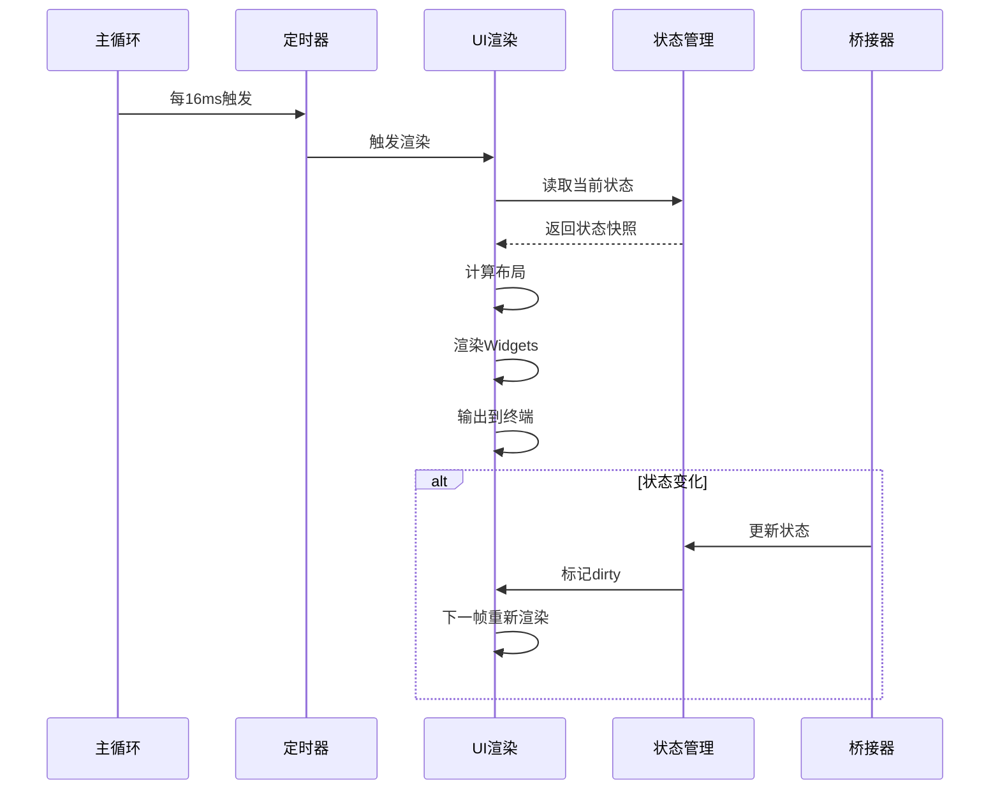

```rust
// renderer/mod.rs
use ratatui::Frame;

pub struct Renderer {
    last_render_time: Instant,
    frame_count: u64,
}

impl Renderer {
    pub fn new() -> Self {
        Self {
            last_render_time: Instant::now(),
            frame_count: 0,
        }
    }
    
    pub fn render(&mut self, frame: &mut Frame, state: &StateManager) {
        self.frame_count += 1;
        
        // 计算布局
        let layout = self.calculate_layout(frame.area());
        
        // 渲染各个组件
        self.render_repl(frame, layout.repl_area, state);
        self.render_agents(frame, layout.agents_area, state);
        self.render_sessions(frame, layout.sessions_area, state);
        self.render_status_bar(frame, layout.status_area, state);
    }
    
    fn calculate_layout(&self, area: Rect) -> MainLayout {
        // 根据区域大小计算布局
        let chunks = Layout::vertical([
            Constraint::Min(0),      // 主内容区
            Constraint::Length(1),    // 状态栏
        ]).split(area);
        
        let main_chunks = Layout::horizontal([
            Constraint::Percentage(25),  // 左侧面板
            Constraint::Percentage(50),  // 主工作区
            Constraint::Percentage(25),  // 右侧面板
        ]).split(chunks[0]);
        
        MainLayout {
            repl_area: main_chunks[1],
            agents_area: main_chunks[0],
            sessions_area: main_chunks[2],
            status_area: chunks[1],
        }
    }
}
```

### 16.5 错误处理策略

```rust
// error.rs
use thiserror::Error;

#[derive(Debug, Error)]
pub enum NecoError {
    #[error("Model error: {0}")]
    Model(String),
    
    #[error("UI error: {0}")]
    UI(String),
    
    #[error("IO error: {0}")]
    IO(#[from] std::io::Error),
    
    #[error("Serialization error: {0}")]
    Serialization(#[from] serde_json::Error),
    
    #[error("State error: {0}")]
    State(String),
}

pub type Result<T> = std::result::Result<T, NecoError>;

// 错误恢复策略
pub enum RecoveryStrategy {
    Retry,
    Fallback,
    Terminate,
    NotifyUser,
}
```

---

## 17. 完整代码示例

### 17.1 最小化示例

```rust
use ratatui::{
    crossterm::event::{self, Event, KeyCode},
    widgets::Paragraph,
    Frame,
};

fn main() -> std::io::Result<()> {
    ratatui::run(|mut terminal| {
        loop {
            terminal.draw(|frame| {
                frame.render_widget(
                    Paragraph::new("Hello from Ratatui!"),
                    frame.area()
                );
            })?;
            
            if event::read()?.is_key_press() {
                break Ok(());
            }
        }
    })
}
```

### 17.2 带异步的最小化示例

```rust
use std::time::Duration;
use ratatui::{crossterm::event::EventStream, Frame};

#[tokio::main]
async fn main() -> std::io::Result<()> {
    let terminal = ratatui::init();
    let mut events = EventStream::new();
    let mut counter = 0;
    
    loop {
        tokio::select! {
            _ = tokio::time::sleep(Duration::from_millis(100)) => {
                terminal.draw(|frame| {
                    frame.render_widget(
                        Paragraph::new(format!("Counter: {}", counter)),
                        frame.area()
                    );
                })?;
                counter += 1;
            }
            Some(Ok(event)) = events.next() => {
                if let Event::Key(key) = event {
                    if key.code == KeyCode::Char('q') {
                        break Ok(());
                    }
                }
            }
        }
    }
}
```

### 17.3 完整的REPL示例

```rust
use std::sync::{Arc, RwLock};
use tokio::sync::mpsc;
use ratatui::{
    crossterm::event::{Event, EventStream, KeyCode},
    layout::{Constraint, Layout},
    widgets::{Paragraph, Widget},
    Frame,
};

#[derive(Debug)]
enum REPLMessage {
    Input(String),
    Output(String),
    Error(String),
    Clear,
}

struct REPLState {
    input: String,
    output: Vec<String>,
    cursor_position: usize,
}

impl REPLState {
    fn new() -> Self {
        Self {
            input: String::new(),
            output: Vec::new(),
            cursor_position: 0,
        }
    }
    
    fn handle_char(&mut self, c: char) {
        self.input.insert(self.cursor_position, c);
        self.cursor_position += 1;
    }
    
    fn handle_backspace(&mut self) {
        if self.cursor_position > 0 {
            self.cursor_position -= 1;
            self.input.remove(self.cursor_position);
        }
    }
    
    fn submit(&mut self) -> String {
        let input = self.input.clone();
        if !input.is_empty() {
            self.output.push(format!("> {}", input));
            self.input.clear();
            self.cursor_position = 0;
        }
        input
    }
}

#[tokio::main]
async fn run_repl() -> std::io::Result<()> {
    let terminal = ratatui::init();
    let state = Arc::new(RwLock::new(REPLState::new()));
    let (tx, mut rx) = mpsc::channel(100);
    let mut events = EventStream::new();
    
    // 启动命令处理任务
    let state_clone = Arc::clone(&state);
    tokio::spawn(async move {
        while let Some(msg) = rx.recv().await {
            match msg {
                REPLMessage::Input(input) => {
                    // 处理输入
                    let response = process_command(&input);
                    let mut state = state_clone.write().unwrap();
                    state.output.push(response);
                }
                REPLMessage::Output(text) => {
                    let mut state = state_clone.write().unwrap();
                    state.output.push(text);
                }
                REPLMessage::Error(err) => {
                    let mut state = state_clone.write().unwrap();
                    state.output.push(format!("Error: {}", err));
                }
                REPLMessage::Clear => {
                    let mut state = state_clone.write().unwrap();
                    state.output.clear();
                }
            }
        }
    });
    
    loop {
        tokio::select! {
            _ = tokio::time::sleep(Duration::from_millis(16)) => {
                terminal.draw(|frame| {
                    let state = state.read().unwrap();
                    render_repl(&state, frame);
                })?;
            }
            Some(Ok(event)) = events.next() => {
                if let Event::Key(key) = event {
                    if key.code == KeyCode::Char('q') {
                        break Ok(());
                    }
                    
                    let mut state = state.write().unwrap();
                    handle_key_event(&mut state, key, &tx);
                }
            }
        }
    }
}

fn render_repl(state: &REPLState, frame: &mut Frame) {
    let layout = Layout::vertical([
        Constraint::Min(0),
        Constraint::Length(1),
    ]).split(frame.area());
    
    // 输出区域
    let output_text = state.output.join("\n");
    let output_widget = Paragraph::new(output_text);
    frame.render_widget(output_widget, layout[0]);
    
    // 输入区域
    let input_text = format!("❯ {}", state.input);
    let input_widget = Paragraph::new(input_text);
    frame.render_widget(input_widget, layout[1]);
}

fn handle_key_event(state: &mut REPLState, key: KeyEvent, tx: &mpsc::Sender<REPLMessage>) {
    match key.code {
        KeyCode::Char(c) => {
            state.handle_char(c);
        }
        KeyCode::Backspace => {
            state.handle_backspace();
        }
        KeyCode::Enter => {
            let input = state.submit();
            tx.try_send(REPLMessage::Input(input)).ok();
        }
        _ => {}
    }
}

fn process_command(input: &str) -> String {
    format!("Processed: {}", input)
}
```

### 17.4 多Agent并行示例

```rust
use std::sync::{Arc, RwLock};
use tokio::sync::mpsc;
use ratatui::{Frame, layout::Constraint, Layout};

struct MultiAgentApp {
    agents: Vec<Agent>,
    current_agent: usize,
}

struct Agent {
    name: String,
    status: AgentStatus,
    output: Vec<String>,
    progress: f32,
}

#[derive(Debug, Clone, PartialEq)]
enum AgentStatus {
    Idle,
    Running,
    Completed,
    Error(String),
}

impl MultiAgentApp {
    fn new() -> Self {
        Self {
            agents: vec![
                Agent {
                    name: "Chat Agent".to_string(),
                    status: AgentStatus::Idle,
                    output: Vec::new(),
                    progress: 0.0,
                },
                Agent {
                    name: "Code Agent".to_string(),
                    status: AgentStatus::Idle,
                    output: Vec::new(),
                    progress: 0.0,
                },
                Agent {
                    name: "File Agent".to_string(),
                    status: AgentStatus::Idle,
                    output: Vec::new(),
                    progress: 0.0,
                },
            ],
            current_agent: 0,
        }
    }
    
    async fn run_agent(&mut self, agent_index: usize) {
        let agent = &mut self.agents[agent_index];
        agent.status = AgentStatus::Running;
        
        let agent_name = agent.name.clone();
        
        // 模拟Agent执行
        for i in 1..=10 {
            tokio::time::sleep(Duration::from_millis(200)).await;
            
            let agent = &mut self.agents[agent_index];
            agent.output.push(format!("Step {}: {}", i, agent_name));
            agent.progress = i as f32 / 10.0;
        }
        
        self.agents[agent_index].status = AgentStatus::Completed;
    }
}

#[tokio::main]
async fn run_multi_agent() -> std::io::Result<()> {
    let terminal = ratatui::init();
    let mut app = MultiAgentApp::new();
    let mut events = EventStream::new();
    
    loop {
        tokio::select! {
            _ = tokio::time::sleep(Duration::from_millis(16)) => {
                terminal.draw(|frame| {
                    render_multi_agent(&app, frame);
                })?;
            }
            Some(Ok(event)) = events.next() => {
                if let Event::Key(key) = event {
                    match key.code {
                        KeyCode::Char('q') => break Ok(()),
                        KeyCode::Char('1') => app.current_agent = 0,
                        KeyCode::Char('2') => app.current_agent = 1,
                        KeyCode::Char('3') => app.current_agent = 2,
                        KeyCode::Char('s') => {
                            let agent_idx = app.current_agent;
                            tokio::spawn({
                                let mut app_ref = unsafe { &mut *((&mut app) as *mut _) };
                                async move {
                                    app_ref.run_agent(agent_idx).await;
                                }
                            });
                        }
                        _ => {}
                    }
                }
            }
        }
    }
}

fn render_multi_agent(app: &MultiAgentApp, frame: &mut Frame) {
    let layout = Layout::horizontal([
        Constraint::Percentage(30),
        Constraint::Percentage(70),
    ]).split(frame.area());
    
    // Agent列表
    let agent_list: Vec<String> = app.agents.iter().enumerate().map(|(i, agent)| {
        let prefix = if i == app.current_agent { "►" } else { " " };
        let status = match agent.status {
            AgentStatus::Idle => "○",
            AgentStatus::Running => "◉",
            AgentStatus::Completed => "✔",
            AgentStatus::Error(_) => "✖",
        };
        format!("{} {} {} [{:.0}]", prefix, status, agent.name, agent.progress * 100.0)
    }).collect();
    
    let list_widget = Paragraph::new(agent_list.join("\n"))
        .block(ratatui::widgets::Block::bordered().title("Agents"));
    frame.render_widget(list_widget, layout[0]);
    
    // 当前Agent详情
    if let Some(agent) = app.agents.get(app.current_agent) {
        let detail_text = format!(
            "{}\n\nStatus: {:?}\n\nOutput:\n{}",
            agent.name,
            agent.status,
            agent.output.join("\n")
        );
        
        let detail_widget = Paragraph::new(detail_text)
            .block(ratatui::widgets::Block::bordered().title("Agent Details"));
        frame.render_widget(detail_widget, layout[1]);
    }
}
```

---

## 18. 生态与工具

### 18.1 第三方Widget库

| 库名 | 功能 | URL |
|-----|------|-----|
| **tui-widgets** | 额外的widgets | https://github.com/CharlyCst/rust-tui-widgets |
| **tui-realm** | 高级widgets | https://github.com/amodm/tui-realm |
| **tui-textarea** | 多行文本编辑 | https://github.com/rhysd/tui-textarea |
| **tui-logger** | 日志widget | https://github.com/gin66/tui-logger |

### 18.2 辅助库

| 库名 | 用途 | 集成难度 |
|-----|------|---------|
| **syntect** | 代码高亮 | ⭐⭐⭐ |
| **pulldown-cmark** | Markdown解析 | ⭐⭐ |
| **tokio** | 异步运行时 | ⭐（必需） |
| **anyhow** | 错误处理 | ⭐ |
| **serde** | 序列化 | ⭐⭐ |
| **tracing** | 日志记录 | ⭐⭐ |

### 18.3 开发工具

```bash
# 项目生成
cargo install cargo-generate
cargo generate ratatui/templates component --name my-app

# 测试工具
cargo install cargo-nextest
cargo nextest run

# 性能分析
cargo install flamegraph
cargo flamegraph

# 代码质量
cargo install cargo-tarpaulin
cargo tarpaulin --out Html
```

### 18.4 社区资源

- **官方网站**: https://ratatui.rs/
- **GitHub**: https://github.com/ratatui/ratatui
- **Discord**: https://discord.gg/pMCEU9hNEj
- **Matrix**: https://matrix.to/#/#ratatui:matrix.org
- **Forum**: https://forum.ratatui.rs/
- **Showcase**: https://ratatui.rs/showcase/apps/

---

## 19. 结论与建议

### 19.1 总体评价

**Ratatui是Neco项目的理想选择**，理由如下：

1. **✅ 完美匹配核心需求**：
   - 终端REPL界面：原生支持
   - 流式输出：异步架构完美支持
   - 多Agent并行：tokio并发模型理想
   - 模型分离：异步任务隔离简单高效

2. **✅ 技术优势突出**：
   - 高性能：即时模式 + diff算法
   - 类型安全：Rust类型系统保证
   - 模块化：清晰的关注点分离
   - 生态丰富：活跃社区和第三方库

3. **✅ 开发体验优秀**：
   - 文档完善：官方文档详细
   - 示例丰富：大量实用示例
   - 模板支持：快速启动项目
   - 社区活跃：问题响应及时

### 19.2 推荐方案

#### 19.2.1 架构选择

**推荐：异步任务 + 共享状态**

```rust
use std::sync::{Arc, RwLock};
use tokio::sync::mpsc;

struct NecoApp {
    ui_state: Arc<RwLock<UIState>>,
    model_bridge: ModelBridge,
    event_handler: EventHandler,
}

impl NecoApp {
    fn new() -> Self {
        let ui_state = Arc::new(RwLock::new(UIState::new()));
        let model_bridge = ModelBridge::new();
        let event_handler = EventHandler::new(Arc::clone(&ui_state));
        
        Self {
            ui_state,
            model_bridge,
            event_handler,
        }
    }
}
```

#### 19.2.2 技术栈

```toml
[dependencies]
ratatui = "0.30"
crossterm = "0.29"
tokio = { version = "1.40", features = ["full"] }
serde = { version = "1.0", features = ["derive"] }
serde_json = "1.0"
anyhow = "1.0"
tracing = "0.1"
tracing-subscriber = "0.3"

# 可选
syntect = "5.0"         # 代码高亮
pulldown-cmark = "0.9"  # Markdown
tui-textarea = "0.4"    # 文本编辑
```

#### 19.2.3 项目结构

```
neco/
├── src/
│   ├── main.rs              # 入口点
│   ├── ui/                  # UI层
│   │   ├── mod.rs
│   │   ├── widgets/         # 自定义widgets
│   │   │   ├── mod.rs
│   │   │   ├── repl.rs
│   │   │   ├── agent.rs
│   │   │   └── session.rs
│   │   ├── layout.rs         # 布局管理
│   │   └── renderer.rs      # 渲染器
│   ├── controllers/         # 控制器层
│   │   ├── mod.rs
│   │   ├── repl_controller.rs
│   │   ├── agent_controller.rs
│   │   └── session_controller.rs
│   ├── state/               # 状态管理
│   │   ├── mod.rs
│   │   ├── app_state.rs
│   │   ├── repl_state.rs
│   │   └── agent_state.rs
│   ├── bridge/              # 桥接器
│   │   ├── mod.rs
│   │   ├── model_bridge.rs
│   │   └── ipc_bridge.rs
│   └── config.rs            # 配置
├── tests/                   # 测试
├── examples/                # 示例
└── Cargo.toml
```

### 19.3 实施路线图

#### 阶段1：基础UI（1-2周）

- [ ] 搭建基本Ratatui框架
- [ ] 实现简单的REPL界面
- [ ] 实现基础事件处理
- [ ] 添加输入/输出组件

**目标**：可运行的REPL原型

#### 阶段2：异步集成（2-3周）

- [ ] 集成tokio异步运行时
- [ ] 实现模型桥接器
- [ ] 添加流式输出支持
- [ ] 实现错误处理

**目标**：支持流式输出的REPL

#### 阶段3：多Agent支持（2-3周）

- [ ] 实现Agent状态管理
- [ ] 添加多Agent并行执行
- [ ] 实现Agent选择UI
- [ ] 添加Agent监控

**目标**：支持多Agent并行执行

#### 阶段4：Session管理（1-2周）

- [ ] 实现Session管理器
- [ ] 添加Session持久化
- [ ] 实现Session切换UI
- [ ] 添加历史记录

**目标**：完整的Session管理

#### 阶段5：高级功能（3-4周）

- [ ] 添加Markdown渲染
- [ ] 添加代码高亮
- [ ] 实现项目树
- [ ] 添加配置管理

**目标**：功能完整的TUI

### 19.4 注意事项

1. **性能考虑**：
   - 避免在渲染循环中分配内存
   - 使用脏标记避免不必要的渲染
   - 限制帧率（60 FPS通常足够）

2. **错误处理**：
   - 模型错误不应崩溃UI
   - 使用Result优雅处理错误
   - 提供用户友好的错误消息

3. **测试策略**：
   - 单元测试核心逻辑
   - 集成测试通信层
   - 手动测试UI交互

4. **文档**：
   - 记录架构决策
   - 添加代码注释
   - 编写用户手册

---

## 附录A：快速参考

### A.1 常用命令

```bash
# 创建新项目
cargo generate ratatui/templates component --name my-app

# 运行示例
cargo run --example demo

# 运行测试
cargo test

# 检查代码
cargo clippy

# 格式化代码
cargo fmt
```

### A.2 依赖版本

```toml
[dependencies]
ratatui = "0.30"
crossterm = "0.29"
tokio = "1.40"
```

### A.3 环境变量

```bash
# 配置目录
export NECO_CONFIG="$HOME/.config/neco"

# 数据目录
export NECO_DATA="$HOME/.local/share/neco"

# 日志级别
export RUST_LOG=debug
```

---

**文档版本**: 1.0.0  
**最后更新**: 2026-02-27  
**作者**: MiyakoMeow  
**项目**: Neco

---

> 本文档基于Ratatui 0.30.0版本探索，涵盖了其核心架构、Widget系统、事件处理、异步支持、并发模型、性能优化、REPL实现、模型分离、流式输出、多Agent并行、Session管理、ACP模式集成等内容，并针对Neco项目的具体需求提供了详细的匹配度分析和推荐架构设计。
