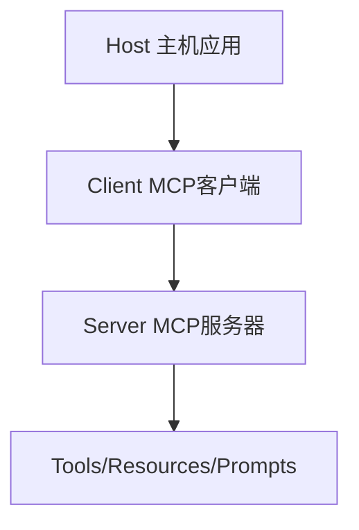
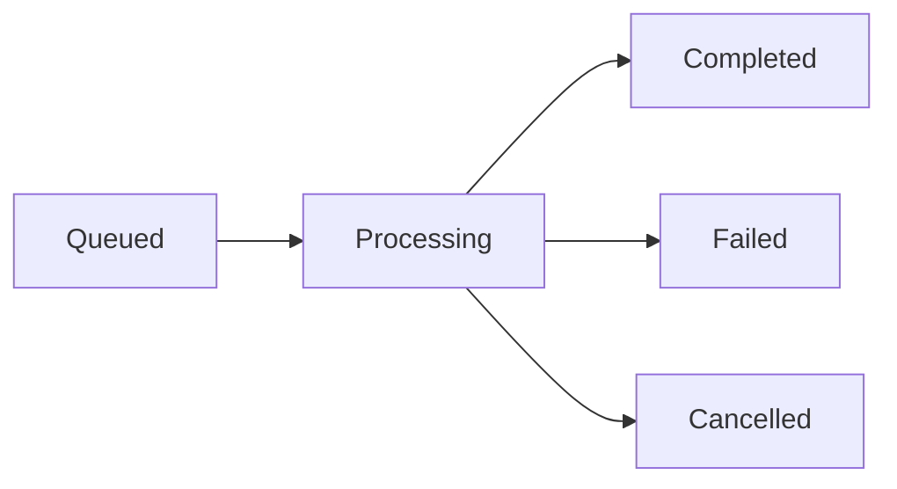

# RMCP 探索总结

> 探索日期：2026-02-27
> 探索范围：Rust MCP Client (rmcp) v0.16.0

---

## 探索目标

1. ✅ 理解 MCP 协议规范
2. ✅ 掌握 RMCP 核心架构和 API
3. ✅ 研究服务器和客户端实现模式
4. ✅ 分析工具、资源、提示系统
5. ✅ 探索懒加载机制

---

## 核心发现

### 1. MCP 协议架构

MCP (Model Context Protocol) 是一个开放协议，用于标准化 LLM 应用与外部系统的集成。

**三层架构：**


**核心特性：**
- 基于 JSON-RPC 2.0
- 支持有状态连接
- 能力协商机制
- 三大核心功能：工具、资源、提示

**三种控制级别：**

| 功能 | 控制方 | 交互模式 | 示例 |
|------|--------|----------|------|
| **Prompts** | 用户控制 | 主动选择 | 斜杠命令 |
| **Resources** | 应用控制 | 自动附加 | 文件内容 |
| **Tools** | 模型控制 | 自动调用 | API操作 |

### 2. RMCP 核心架构

**模块结构：**
```
rmcp/
├── handler/         # 处理器实现
│   ├── server/     # 服务器端
│   └── client/     # 客户端端
├── model/          # 数据模型
├── service/        # 服务层
└── transport/      # 传输层
```

**关键特性：**
- ✅ 完全异步（Tokio）
- ✅ 类型安全（Rust 类型系统）
- ✅ 模块化设计（Feature flags）
- ✅ 丰富的传输层（stdio、HTTP SSE、子进程）
- ✅ 支持任务系统（SEP-1686）

**依赖项：**
- `tokio` - 异步运行时
- `serde` - 序列化/反序列化
- `schemars` - JSON Schema 生成
- `async-trait` - 异步 trait

### 3. 服务器实现

**核心组件：**

1. **ServerHandler trait** - 服务器处理器
2. **ToolRouter** - 工具路由
3. **ResourceHandler** - 资源处理器
4. **PromptHandler** - 提示处理器

**宏系统：**
```rust
#[tool_router]      // 自动注册工具
#[tool(...)]        // 定义工具
#[tool_handler]     // 实现服务器处理器
#[resource_handler] // 实现资源处理器
#[prompt_handler]   // 实现提示处理器
```

**结构化输出：**
```rust
#[tool]
async fn calculate(
    &self,
    params: Parameters<Request>,
) -> Result<Json<Response>, String> {
    // 自动生成 JSON Schema
}
```

### 4. 客户端实现

**核心功能：**

1. **服务发现** - list_tools, list_resources, list_prompts
2. **工具调用** - call_tool
3. **资源访问** - read_resource
4. **订阅管理** - subscribe/unsubscribe

**连接模式：**
```rust
// 子进程连接
TokioChildProcess::new(Command::new("mcp-server"))?

// HTTP SSE 连接
StreamableHttpClientTransport::new(url)?

// 自定义传输
(tx, rx).into_transport()
```

### 5. 工具系统

**工具定义：**
```rust
#[tool(description = "Get weather")]
async fn get_weather(
    &self,
    #[tool(arg)] location: String,
) -> Result<CallToolResult, McpError> {
    // 实现
}
```

**内容类型：**
- **Text** - 纯文本
- **Image** - Base64 编码图像
- **Resource** - 嵌入式资源

**错误处理：**
- 协议错误（JSON-RPC 标准错误）
- 工具执行错误（is_error: true）

### 6. 资源管理

**资源定义：**
```rust
Resource {
    uri: "file:///path".into(),
    name: "file.txt".into(),
    mime_type: Some("text/plain".into()),
    ..
}
```

**资源模板：**
```rust
ResourceTemplate {
    uri_template: "file:///{path}".into(),
    name: "Project Files".into(),
    ..
}
```

**订阅机制：**
- 支持资源变更通知
- 客户端可订阅特定资源

### 7. 提示系统

**提示定义：**
```rust
Prompt {
    name: "code_review".into(),
    description: Some("Review code".into()),
    arguments: Some(vec![...]),
    ..
}
```

**消息类型：**
- Text - 文本内容
- Image - 图像内容
- Resource - 资源引用

### 8. 传输层

**支持的传输：**

| 传输类型 | 服务器 | 客户端 | 特点 |
|----------|--------|--------|------|
| stdio | ✅ | ✅ | 标准 I/O，广泛支持 |
| HTTP SSE | ✅ | ✅ | Web 应用，流式传输 |
| Child Process | - | ✅ | 独立进程，隔离性好 |
| Custom | - | - | 可扩展 |

**Transport trait：**
```rust
pub trait Transport {
    fn send_msg(&self, msg: Message) -> BoxFuture<Result<()>>;
    fn recv_msg(&self) -> BoxFuture<Result<Option<Message>>>;
}
```

### 9. 任务系统

**任务生命周期：**


**任务操作：**
- `tools/call` with `task: true` - 创建任务
- `tasks/get` - 查询任务信息
- `tasks/result` - 获取任务结果
- `tasks/cancel` - 取消任务

**处理器：**
```rust
#[task_handler]
impl TaskHandler for MyServer {
    type Processor = OperationProcessor<Self>;
}
```

### 10. 懒加载机制

**实现策略：**

1. **延迟初始化**
```rust
pub struct LazyServer {
    resource: Arc<Mutex<Option<HeavyResource>>>,
}
```

2. **按需加载**
```rust
async fn read_resource(&self, request: ReadResourceRequestParams) {
    // 仅在请求时加载
    let data = load_data(&request.uri).await?;
}
```

3. **资源模板优先**
```rust
// 先暴露模板，不立即加载内容
ResourceTemplate { uri_template: "data:///{id}", .. }
```

### 11. 错误处理

**错误类型：**

1. **协议错误** (-32700, -32600, -32601, -32602, -32603)
2. **应用错误** (-32002 资源未找到, -32004 功能不支持)
3. **工具错误** (is_error: true)

**最佳实践：**
- 使用 `thiserror` 定义自定义错误
- 实现合适的错误转换
- 提供有用的错误信息

---

## 安全考虑

### 必须实施的安全措施

1. **输入验证**
   - ✅ 路径遍历防护
   - ✅ 参数类型检查
   - ✅ 长度限制

2. **访问控制**
   - ✅ 明确的允许路径
   - ✅ 资源权限检查
   - ✅ 用户同意机制

3. **速率限制**
   - ✅ 防止滥用
   - ✅ 配额管理
   - ✅ 超时控制

4. **审计日志**
   - ✅ 记录所有工具调用
   - ✅ 敏感操作追踪
   - ✅ 错误日志

---

## 性能优化

### 优化策略

1. **并发处理**
   - 使用 Tokio 异步运行时
   - 批量工具调用
   - 连接池

2. **内存优化**
   - 避免不必要的克隆
   - 使用 `Cow` 借用
   - 合理使用缓存

3. **懒加载**
   - 延迟初始化资源
   - 按需加载内容
   - 资源模板优先

4. **流式处理**
   - 大文件流式读取
   - 结果流式返回
   - 进度通知

---

## 最佳实践

### 开发建议

1. **类型安全**
   - 使用强类型参数
   - 利用 Rust 类型系统
   - 定义清晰的错误类型

2. **错误处理**
   - 区分协议错误和应用错误
   - 提供有用的错误信息
   - 适当的重试策略

3. **测试**
   - 单元测试工具逻辑
   - 集成测试端到端流程
   - Mock 测试隔离依赖

4. **文档**
   - 完整的 API 文档
   - 使用示例
   - 集成指南

---

## 相关资源

### 官方资源

- **MCP 规范**: https://modelcontextprotocol.io/specification/2024-11-05
- **RMCP 仓库**: https://github.com/modelcontextprotocol/rust-sdk
- **文档**: https://docs.rs/rmcp

### 相关项目

基于 RMCP 构建的项目：
- `rustfs-mcp` - S3 对象存储
- `containerd-mcp-server` - 容器管理
- `nvim-mcp` - Neovim 集成
- `terminator` - 桌面自动化
- `video-transcriber-mcp-rs` - 视频转录
- `spreadsheet-mcp` - 电子表格分析

### 扩展库

- `rmcp-actix-web` - Actix-Web 后端
- `rmcp-openapi` - OpenAPI 转换

---

## 下一步行动

### 学习路径

1. **基础** - 阅读 MCP 规范
2. **实践** - 运行 RMCP 示例
3. **深入** - 研究源代码
4. **扩展** - 开发自定义服务器

---

## 探索文档索引

1. **主文档**: `external-rmcp.md` - 完整的技术文档
2. **流程图**: `mcp-interaction-flows.md` - 10 个 Mermaid 流程图
3. **示例**: `rmcp-examples.md` - 实用代码示例

---

## 总结

RMCP 是一个功能强大、设计优秀的 MCP Rust 实现。它提供了：

✅ **完整的协议支持** - 工具、资源、提示全覆盖
✅ **类型安全** - Rust 类型系统保证
✅ **高性能** - 基于 Tokio 的异步 I/O
✅ **灵活的传输层** - 多种传输方式
✅ **良好的扩展性** - 模块化设计

**推荐指数**: ⭐⭐⭐⭐⭐

---

**探索完成时间**: 2026-02-27
**版本**: 1.0.0
