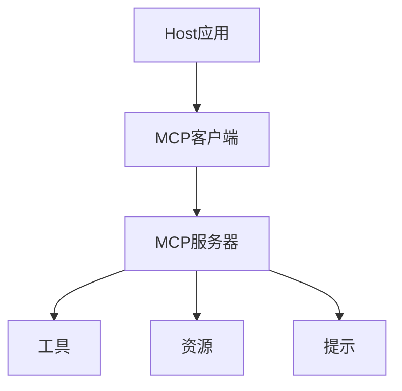
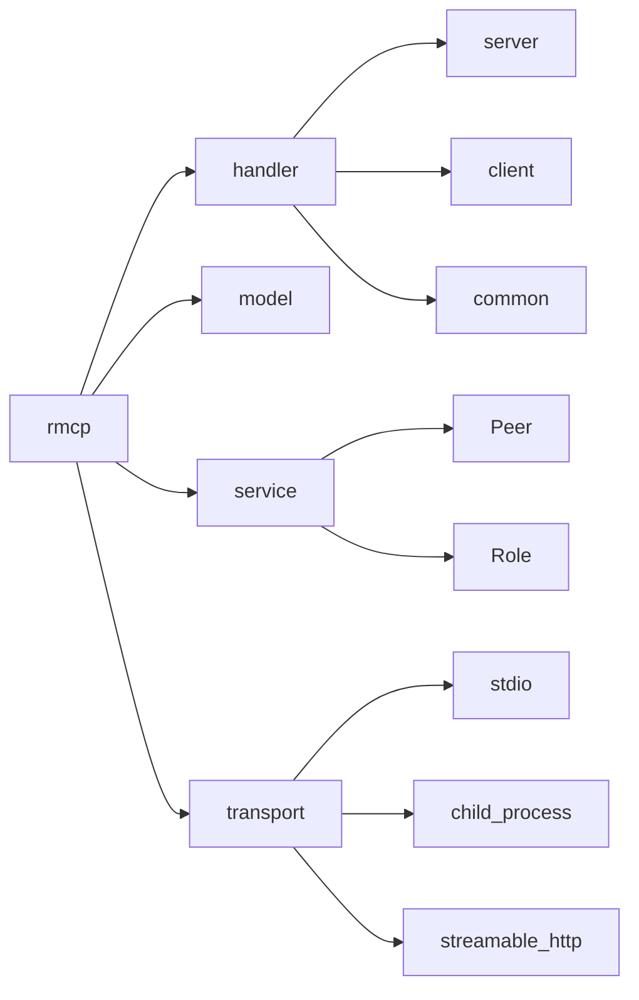
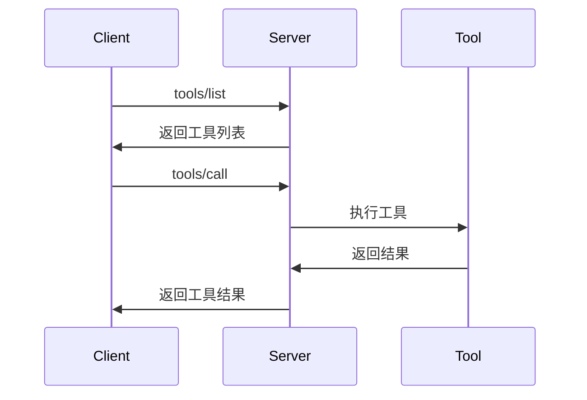
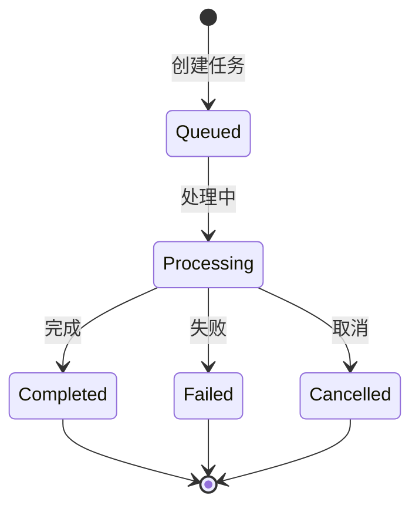

# RMCP (Rust MCP Client) 深度探索

> 版本: v0.16.0 | 更新时间: 2026-02-27

## 目录

1. [概述](#概述)
2. [MCP协议规范](#mcp协议规范)
3. [RMCP核心架构](#rmcp核心架构)
4. [服务器实现](#服务器实现)
5. [客户端实现](#客户端实现)
6. [工具系统](#工具系统)
7. [资源管理](#资源管理)
8. [提示系统](#提示系统)
9. [传输层](#传输层)
10. [任务系统](#任务系统)
11. [懒加载机制](#懒加载机制)
12. [错误处理](#错误处理)
13. [完整示例](#完整示例)
14. [高级模式](#高级模式)
15. [测试策略](#测试策略)
16. [性能优化](#性能优化)
17. [安全性最佳实践](#安全性最佳实践)
18. [部署建议](#部署建议)

---

## 概述

### 什么是RMCP

RMCP (Rust Model Context Protocol) 是 Model Context Protocol (MCP) 的官方 Rust 实现。MCP 是一个开放协议,用于在 LLM(大语言模型)应用与外部数据源和工具之间建立标准化的连接方式。

### 核心特性

- **双向通信**: 基于 JSON-RPC 2.0 的消息协议
- **异步运行时**: 基于 Tokio 的高性能异步处理
- **类型安全**: Rust 的类型系统提供编译时安全保证
- **模块化设计**: 支持服务器、客户端或两者同时启用
- **丰富的传输层**: 支持 stdio、HTTP (SSE)、子进程等多种传输方式

### 项目信息

| 属性 | 值 |
|------|-----|
| **GitHub仓库** | [modelcontextprotocol/rust-sdk](https://github.com/modelcontextprotocol/rust-sdk) |
| **Crates.io** | [rmcp](https://crates.io/crates/rmcp) |
| **文档** | [docs.rs/rmcp](https://docs.rs/rmcp) |
| **最新版本** | v0.16.0 (2026-02-17) |
| **下载量** | 4,238,870 总下载,2,723,117 近期下载 |
| **许可证** | Apache-2.0 |
| **依赖** | tokio, serde, schemars |

---

## MCP协议规范

### 协议架构

MCP 采用三层架构:



### 核心概念

#### 1. 角色(Roles)

- **Host(主机)**: 发起连接的 LLM 应用
- **Client(客户端)**: 主机应用中的连接器
- **Server(服务器)**: 提供上下文和功能的服务

#### 2. 基础协议

- **消息格式**: JSON-RPC 2.0
- **连接类型**: 有状态连接
- **能力协商**: 服务器和客户端之间进行能力协商

#### 3. 服务器功能(Server Features)

| 功能 | 控制方 | 描述 | 示例 |
|------|--------|------|------|
| **Prompts** | 用户控制 | 交互式模板,由用户选择触发 | 斜杠命令、菜单选项 |
| **Resources** | 应用控制 | 由客户端附加和管理的上下文数据 | 文件内容、git历史 |
| **Tools** | 模型控制 | 暴露给LLM执行的操作函数 | API POST请求、文件写入 |

### 安全原则

MCP 强调以下安全原则:

1. **用户同意和控制**: 用户必须明确同意并理解所有数据访问和操作
2. **数据隐私**: 主机必须获得明确同意才能向服务器暴露用户数据
3. **工具安全**: 工具代表任意代码执行,必须谨慎处理
4. **LLM采样控制**: 用户必须明确批准任何LLM采样请求

---

## RMCP核心架构

### 模块结构



### 核心组件

#### 1. Handler(处理器)

处理器负责处理协议消息:

- **ServerHandler**: 服务器端处理器
- **ClientHandler**: 客户端处理器
- **ToolHandler**: 工具调用处理器

#### 2. Model(数据模型)

定义协议数据结构:

- **请求/响应类型**: 各种 JSON-RPC 消息
- **内容类型**: 文本、图像、资源等
- **错误类型**: 协议错误和应用错误

#### 3. Service(服务层)

提供高层API:

- **Peer**: 对等端点抽象
- **Role**: 客户端/服务器角色标记
- **ServiceExt**: 服务扩展trait

#### 4. Transport(传输层)

抽象通信传输:

- **Transport trait**: 统一传输接口
- **IntoTransport trait**: 类型转换辅助
- **具体实现**: stdio、HTTP、子进程等

### Feature Flags

RMCP 使用 Cargo feature flags 控制组件:

| Feature | 描述 |
|---------|------|
| `client` | 启用客户端功能 |
| `server` | 启用服务器功能(默认) |
| `macros` | 启用 `#[tool]` 宏(默认) |
| `transport-io` | I/O流支持 |
| `transport-child-process` | 子进程支持 |
| `transport-streamable-http-client` | HTTP流客户端 |
| `transport-streamable-http-server` | HTTP流服务器 |
| `auth` | OAuth2认证支持 |
| `schemars` | JSON Schema生成 |

### 依赖项

```toml
[dependencies]
rmcp = { version = "0.16", features = ["server", "client"] }

# 依赖项
tokio = { version = "1", features = ["full"] }
serde = { version = "1", features = ["derive"] }
serde_json = "1"
schemars = "0.8"  # JSON Schema生成
async-trait = "0.1"
futures = "0.3"
```

---

## 服务器实现

### 基础服务器

```rust
use rmcp::{
    ServerHandler, ServiceExt,
    handler::server::tool::{ToolRouter, tool, tool_router, tool_handler},
    model::*,
    transport::stdio,
    ErrorData as McpError,
};
use std::sync::Arc;
use tokio::sync::Mutex;

#[derive(Clone)]
pub struct MyServer {
    tool_router: ToolRouter<Self>,
}

#[tool_router]
impl MyServer {
    fn new() -> Self {
        Self {
            tool_router: Self::tool_router(),
        }
    }

    #[tool(description = "Say hello")]
    async fn hello(&self, #[tool(arg)] name: String) -> Result<CallToolResult, McpError> {
        Ok(CallToolResult::success(vec![
            Content::text(format!("Hello, {}!", name))
        ]))
    }
}

#[tool_handler]
impl ServerHandler for MyServer {
    fn get_info(&self) -> ServerInfo {
        ServerInfo {
            name: "my-server".into(),
            version: "1.0.0".into(),
            instructions: Some("A simple MCP server".into()),
            capabilities: ServerCapabilities::builder()
                .enable_tools()
                .build(),
            ..Default::default()
        }
    }
}

#[tokio::main]
async fn main() -> Result<(), Box<dyn std::error::Error>> {
    let server = MyServer::new();
    let service = server.serve(stdio()).await?;
    service.waiting().await?;
    Ok(())
}
```

### 结构化输出

使用 `Json` 包装器返回结构化数据:

```rust
use rmcp::handler::server::wrapper::Json;
use serde::{Deserialize, Serialize};

#[derive(Serialize, Deserialize, JsonSchema)]
struct CalculatorRequest {
    a: i32,
    b: i32,
    operation: String,
}

#[derive(Serialize, Deserialize, JsonSchema)]
struct CalculatorResult {
    result: i32,
    operation: String,
}

#[tool(name = "calculate", description = "Perform calculation")]
async fn calculate(
    &self,
    params: Parameters<CalculatorRequest>,
) -> Result<Json<CalculatorResult>, String> {
    let result = match params.0.operation.as_str() {
        "add" => params.0.a + params.0.b,
        "multiply" => params.0.a * params.0.b,
        _ => return Err("Unknown operation".to_string()),
    };

    Ok(Json(CalculatorResult {
        result,
        operation: params.0.operation,
    }))
}
```

### 服务器能力

```rust
let capabilities = ServerCapabilities::builder()
    .enable_tools()                    // 启用工具
    .enable_resources()                // 启用资源
    .enable_prompts()                  // 启用提示
    .enable_logging()                  // 启用日志
    .enable_completions()              // 启用自动完成
    .resources(ResourcesCapability {
        subscribe: true,               // 支持资源订阅
        list_changed: true,            // 支持列表变更通知
    })
    .tools(ToolsCapability {
        list_changed: true,            // 支持工具列表变更通知
    })
    .build();
```

### 访问对等端点

```rust
impl ServerHandler for MyHandler {
    async fn on_progress(
        &self,
        notification: ProgressNotificationParam,
        context: NotificationContext<RoleServer>,
    ) {
        let peer = context.peer;

        // 发送日志消息
        let _ = peer
            .notify_logging_message(LoggingMessageNotificationParam {
                level: LoggingLevel::Info,
                logger: None,
                data: serde_json::json!({
                    "message": format!("Progress: {}", notification.progress)
                }),
            })
            .await;
    }
}
```

---

## 客户端实现

### 基础客户端

```rust
use rmcp::{
    ServiceExt,
    model::CallToolRequestParams,
    transport::{ConfigureCommandExt, TokioChildProcess},
};
use tokio::process::Command;

#[tokio::main]
async fn main() -> Result<(), Box<dyn std::error::Error>> {
    // 连接到子进程服务器
    let service = ()
        .serve(TokioChildProcess::new(
            Command::new("uvx").configure(|cmd| {
                cmd.arg("mcp-server-git");
            })?
        )?)
        .await?;

    // 获取服务器信息
    let server_info = service.peer_info();
    println!("Connected to: {:#?}", server_info);

    // 列出可用工具
    let tools = service.list_tools(Default::default()).await?;
    println!("Available tools: {:#?}", tools);

    // 调用工具
    let result = service
        .call_tool(CallToolRequestParams {
            meta: None,
            name: "git_status".into(),
            arguments: serde_json::json!({ "repo_path": "." }).as_object().cloned(),
            task: None,
        })
        .await?;

    println!("Result: {:#?}", result);

    // 优雅关闭
    service.cancel().await?;
    Ok(())
}
```

### 客户端能力协商

```rust
use rmcp::model::{ClientCapabilities, ClientInfo};

let client_info = ClientInfo {
    name: "my-client".into(),
    version: "1.0.0".into(),
    ..Default::default()
};

let capabilities = ClientCapabilities::builder()
    .enable_sampling()              // 支持采样功能
    .enable_roots()                 // 支持根目录
    .build();
```

---

## 工具系统

### 工具定义

工具是可由语言模型调用的可执行函数:

```rust
#[tool(description = "Get weather information")]
async fn get_weather(
    &self,
    #[tool(arg)] location: String,
) -> Result<CallToolResult, McpError> {
    Ok(CallToolResult::success(vec![
        Content::text(format!("Weather in {}: Sunny, 72°F", location))
    ]))
}
```

### 工具路由

```rust
#[tool_router]
impl MyServer {
    // 所有标记为 #[tool] 的方法都会自动注册
}
```

### 工具调用流程



### 工具消息类型

#### 1. 文本内容

```rust
Content::text("Hello, world!")
```

#### 2. 图像内容

```rust
Content::image(
    "base64-encoded-data",
    "image/png"
)
```

#### 3. 嵌入式资源

```rust
Content::resource(ResourceContents {
    uri: "file:///example.txt".into(),
    mime_type: Some("text/plain".into()),
    text: Some("Resource content".into()),
    ..Default::default()
})
```

---

## 资源管理

### 资源定义

资源是服务器提供的上下文数据,通过 URI 唯一标识:

```rust
use rmcp::{ServerHandler, handler::server::resource::{ResourceHandler, resource_handler}};

#[resource_handler]
impl ResourceHandler for MyServer {
    async fn list_resources(
        &self,
        _request: ListResourcesRequestParams,
    ) -> Result<ListResourcesResult, McpError> {
        Ok(ListResourcesResult {
            resources: vec![
                Resource {
                    uri: "file:///project/src/main.rs".into(),
                    name: "main.rs".into(),
                    description: Some("Main entry point".into()),
                    mime_type: Some("text/x-rust".into()),
                    ..Default::default()
                }
            ],
            ..Default::default()
        })
    }

    async fn read_resource(
        &self,
        request: ReadResourceRequestParams,
    ) -> Result<ReadResourceResult, McpError> {
        Ok(ReadResourceResult {
            contents: vec![
                ResourceContents {
                    uri: request.uri.clone(),
                    mime_type: Some("text/plain".into()),
                    text: Some("fn main() { println!(\"Hello\"); }".into()),
                    ..Default::default()
                }
            ],
        })
    }
}
```

### 资源订阅

```rust
#[resource_handler]
impl ResourceHandler for MyServer {
    async fn subscribe(
        &self,
        request: SubscribeRequestParams,
    ) -> Result<(), McpError> {
        // 处理订阅请求
        Ok(())
    }

    async fn unsubscribe(
        &self,
        request: UnsubscribeRequestParams,
    ) -> Result<(), McpError> {
        // 处理取消订阅
        Ok(())
    }
}
```

### 资源模板

```rust
async fn list_resource_templates(
    &self,
    _request: ListResourceTemplatesRequestParams,
) -> Result<ListResourceTemplatesResult, McpError> {
    Ok(ListResourceTemplatesResult {
        resource_templates: vec![
            ResourceTemplate {
                uri_template: "file:///{path}".into(),
                name: "Project Files".into(),
                description: Some("Access project files".into()),
                mime_type: Some("application/octet-stream".into()),
                ..Default::default()
            }
        ],
        ..Default::default()
    })
}
```

---

## 提示系统

### 提示定义

提示是预定义的模板消息,由用户控制:

```rust
use rmcp::handler::server::prompt::{PromptHandler, prompt_handler};

#[prompt_handler]
impl PromptHandler for MyServer {
    async fn list_prompts(
        &self,
        _request: ListPromptsRequestParams,
    ) -> Result<ListPromptsResult, McpError> {
        Ok(ListPromptsResult {
            prompts: vec![
                Prompt {
                    name: "code_review".into(),
                    description: Some("Review code quality".into()),
                    arguments: Some(vec![
                        PromptArgument {
                            name: "code".into(),
                            description: Some("The code to review".into()),
                            required: Some(true),
                            ..Default::default()
                        }
                    ]),
                    ..Default::default()
                }
            ],
            ..Default::default()
        })
    }

    async fn get_prompt(
        &self,
        request: GetPromptRequestParams,
    ) -> Result<GetPromptResult, McpError> {
        let code = request.arguments
            .and_then(|args| args.get("code").cloned())
            .and_then(|v| v.as_str().map(|s| s.to_string()))
            .unwrap_or_default();

        Ok(GetPromptResult {
            description: Some("Code review prompt".into()),
            messages: vec![
                PromptMessage {
                    role: PromptMessageRole::User,
                    content: PromptMessageContent::text(
                        format!("Please review this code:\n{}", code)
                    ),
                }
            ],
            ..Default::default()
        })
    }
}
```

### 提示消息类型

```rust
// 文本内容
PromptMessageContent::Text(TextContent {
    type: "text".into(),
    text: "Hello, world!".into(),
})

// 图像内容
PromptMessageContent::Image(ImageContent {
    type: "image".into(),
    data: "base64-data".into(),
    mime_type: "image/png".into(),
})

// 资源内容
PromptMessageContent::Resource(ResourcePromptContent {
    type: "resource".into(),
    resource: ResourceContents {
        uri: "file:///example".into(),
        ..Default::default()
    },
})
```

---

## 传输层

### Transport Trait

所有传输类型实现 `Transport` trait:

```rust
pub trait Transport: Send + Sync + 'static {
    /// 并发发送消息
    fn send_msg(&self, msg: Message) -> BoxFuture<'_, Result<(), Error>>;

    /// 顺序接收消息
    fn recv_msg(&self) -> BoxFuture<'_, Result<Option<Message>, Error>>;
}
```

### 1. STDIO 传输

#### 服务器端(stdio)

```rust
use rmcp::transport::stdio;

let service = server.serve(stdio()).await?;
```

#### 客户端端(子进程)

```rust
use rmcp::transport::TokioChildProcess;
use tokio::process::Command;

let transport = TokioChildProcess::new(
    Command::new("mcp-server")
)?;
```

### 2. HTTP 流传输

#### 服务器端

```rust
use rmcp::transport::streamable_http_server::tower::StreamableHttpService;
use tower::ServiceBuilder;

let service = StreamableHttpService::new(server);
```

#### 客户端端

```rust
use rmcp::transport::streamable_http_client::StreamableHttpClientTransport;

let transport = StreamableHttpClientTransport::new(url)?;
```

### 3. 自定义传输

```rust
use futures::{Sink, Stream};
use rmcp::transport::{Transport, IntoTransport};

// 从 Sink + Stream 创建
let transport = (sink, stream).into_transport();

// 从 AsyncRead + AsyncWrite 创建
let transport = (reader, writer).into_transport();
```

### 传输类型对比

| 传输类型 | 用途 | 服务器 | 客户端 | 特点 |
|----------|------|--------|--------|------|
| stdio | 本地进程通信 | ✓ | ✓ | 简单、广泛支持 |
| HTTP SSE | Web应用 | ✓ | ✓ | 支持流式传输 |
| Child Process | 独立进程 | - | ✓ | 隔离性好 |
| Custom | 自定义协议 | - | - | 灵活定制 |

---

## 任务系统

RMCP 实现了 SEP-1686 任务生命周期,支持长时间运行的异步工具调用。

### 任务生命周期



### 任务操作

#### 1. 创建任务

```rust
let result = service
    .call_tool(CallToolRequestParams {
        name: "long_running_task".into(),
        arguments: None,
        task: Some(true),  // 启用任务模式
        ..Default::default()
    })
    .await?;

let task_id = result.task_id.unwrap();
```

#### 2. 查询任务信息

```rust
let task_info = service
    .get_task_info(GetTaskInfoRequestParams {
        id: task_id.clone(),
        ..Default::default()
    })
    .await?;
```

#### 3. 获取任务结果

```rust
let task_result = service
    .get_task_result(GetTaskResultRequestParams {
        id: task_id.clone(),
        ..Default::default()
    })
    .await?;
```

#### 4. 取消任务

```rust
service
    .cancel_task(CancelTaskRequestParams {
        id: task_id,
        ..Default::default()
    })
    .await?;
```

### 任务处理器

```rust
use rmcp::handler::server::task::{TaskHandler, task_handler, OperationProcessor};

#[task_handler]
impl TaskHandler for MyServer {
    type Processor = OperationProcessor<Self>;

    fn processor(&self) -> Self::Processor {
        OperationProcessor::new(self.clone())
    }
}
```

### 任务元数据

```rust
pub struct TaskInfo {
    pub id: String,
    pub status: TaskStatus,
    pub created_at: DateTime<Utc>,
    pub updated_at: DateTime<Utc>,
    pub expires_at: Option<DateTime<Utc>>,
    pub poll_interval: Option<Duration>,
}

pub enum TaskStatus {
    Queued,
    Processing,
    Completed,
    Failed,
    Cancelled,
}
```

---

## 懒加载机制

### 概念

RMCP 支持按需加载服务器功能,避免初始化时加载所有资源。

### 懒加载实现

#### 1. 延迟初始化

```rust
use std::sync::Arc;
use tokio::sync::Mutex;
use tokio::sync::Lazy;

pub struct LazyServer {
    heavy_resource: Arc<Mutex<Option<Arc<HeavyResource>>>>,
}

impl LazyServer {
    async fn get_resource(&self) -> Result<Arc<HeavyResource>, McpError> {
        let mut guard = self.heavy_resource.lock().await;

        if guard.is_none() {
            *guard = Some(Arc::new(HeavyResource::load().await?));
        }

        Ok(guard.as_ref().unwrap().clone())
    }
}
```

#### 2. 按需工具注册

```rust
#[tool_router]
impl LazyServer {
    #[tool(description = "Load data on demand")]
    async fn load_data(&self, path: String) -> Result<CallToolResult, McpError> {
        // 仅在调用时加载数据
        let data = load_data_from_path(&path).await?;
        Ok(CallToolResult::success(vec![Content::text(data)]))
    }
}
```

#### 3. 资源模板懒加载

```rust
async fn list_resource_templates(
    &self,
    _request: ListResourceTemplatesRequestParams,
) -> Result<ListResourceTemplatesResult, McpError> {
    Ok(ListResourceTemplatesResult {
        resource_templates: vec![
            // 不立即加载,仅提供模板
            ResourceTemplate {
                uri_template: "data:///{id}".into(),
                name: "Data Resource".into(),
                description: Some("Load data by ID".into()),
                ..Default::default()
            }
        ],
        ..Default::default()
    })
}

async fn read_resource(
    &self,
    request: ReadResourceRequestParams,
) -> Result<ReadResourceResult, McpError> {
    // 解析URI并按需加载
    let id = extract_id_from_uri(&request.uri)?;
    let data = load_data_by_id(id).await?;

    Ok(ReadResourceResult {
        contents: vec![ResourceContents {
            uri: request.uri.clone(),
            text: Some(data),
            ..Default::default()
        }],
    })
}
```

### 懒加载最佳实践

1. **延迟初始化**: 仅在首次使用时初始化资源
2. **模板优先**: 先暴露资源模板,按需加载内容
3. **缓存策略**: 合理使用缓存避免重复加载
4. **生命周期管理**: 正确管理资源生命周期

---

## 错误处理

### 错误类型

#### 1. 协议错误

```rust
use rmcp::model::{ErrorCode, ErrorData};

// JSON-RPC 标准错误
let error = ErrorData {
    code: ErrorCode::InvalidParams,     // -32602
    message: "Invalid parameters".into(),
    data: None,
};
```

#### 2. 应用错误

```rust
use rmcp::ErrorData as McpError;

// 工具执行错误
let tool_error = CallToolResult {
    content: vec![Content::text("Operation failed")],
    is_error: Some(true),
    ..Default::default()
};
```

### 错误代码

| 代码 | 名称 | 描述 |
|------|------|------|
| -32700 | Parse error | JSON 解析错误 |
| -32600 | Invalid Request | 无效请求 |
| -32601 | Method not found | 方法未找到 |
| -32602 | Invalid params | 无效参数 |
| -32603 | Internal error | 内部错误 |
| -32002 | Resource not found | 资源未找到 |
| -32004 | Feature not supported | 功能不支持 |

### 错误处理示例

```rust
#[tool]
async fn safe_operation(
    &self,
    input: String,
) -> Result<CallToolResult, McpError> {
    match process_input(&input) {
        Ok(result) => Ok(CallToolResult::success(vec![
            Content::text(result)
        ])),
        Err(e) => Ok(CallToolResult {
            content: vec![Content::text(format!("Error: {}", e))],
            is_error: Some(true),
            ..Default::default()
        }),
    }
}
```

### 自定义错误

```rust
use thiserror::Error;

#[derive(Error, Debug)]
pub enum MyError {
    #[error("IO error: {0}")]
    Io(#[from] std::io::Error),

    #[error("Parse error: {0}")]
    Parse(String),

    #[error("Not found: {0}")]
    NotFound(String),
}

impl From<MyError> for McpError {
    fn from(err: MyError) -> Self {
        ErrorData {
            code: match err {
                MyError::NotFound(_) => ErrorCode::Custom(-32002),
                _ => ErrorCode::InternalError,
            },
            message: err.to_string(),
            data: None,
        }
    }
}
```

---

## 完整示例

### 文件系统服务器

```rust
use rmcp::{
    ServerHandler, ServiceExt,
    handler::server::{
        tool::{ToolRouter, tool, tool_router, tool_handler},
        resource::{ResourceHandler, resource_handler},
    },
    model::*,
    transport::stdio,
    ErrorData as McpError,
};
use std::{path::Path, sync::Arc};
use tokio::sync::RwLock;

#[derive(Clone)]
pub struct FileSystemServer {
    base_path: Arc<Path>,
    tool_router: ToolRouter<Self>,
}

impl FileSystemServer {
    pub fn new(base_path: String) -> Result<Self, std::io::Error> {
        let path = Path::new(&base_path).canonicalize()?;
        Ok(Self {
            base_path: Arc::new(path),
            tool_router: Self::tool_router(),
        })
    }
}

#[tool_router]
impl FileSystemServer {
    /// 读取文件内容
    #[tool(description = "Read the contents of a file")]
    async fn read_file(
        &self,
        #[tool(arg)] path: String,
    ) -> Result<CallToolResult, McpError> {
        let full_path = self.safe_path(&path)?;

        let content = tokio::fs::read_to_string(&full_path)
            .await
            .map_err(|e| McpError {
                code: ErrorCode::InternalError,
                message: format!("Failed to read file: {}", e),
                data: None,
            })?;

        Ok(CallToolResult::success(vec![
            Content::text(content)
        ]))
    }

    /// 写入文件
    #[tool(description = "Write content to a file")]
    async fn write_file(
        &self,
        #[tool(arg)] path: String,
        #[tool(arg)] content: String,
    ) -> Result<CallToolResult, McpError> {
        let full_path = self.safe_path(&path)?;

        if let Some(parent) = full_path.parent() {
            tokio::fs::create_dir_all(parent).await
                .map_err(|e| McpError {
                    code: ErrorCode::InternalError,
                    message: format!("Failed to create directory: {}", e),
                    data: None,
                })?;
        }

        tokio::fs::write(&full_path, content)
            .await
            .map_err(|e| McpError {
                code: ErrorCode::InternalError,
                message: format!("Failed to write file: {}", e),
                data: None,
            })?;

        Ok(CallToolResult::success(vec![
            Content::text(format!("File written: {}", path))
        ]))
    }

    // 安全路径解析
    fn safe_path(&self, path: &str) -> Result<std::path::PathBuf, McpError> {
        let full_path = self.base_path.join(path);
        
        let base_canonical = self.base_path.canonicalize()
            .map_err(|e| McpError {
                code: ErrorCode::InternalError,
                message: format!("Invalid base path: {}", e),
                data: None,
            })?;
        
        match full_path.canonicalize() {
            Ok(canonical) => {
                if !canonical.starts_with(&base_canonical) {
                    return Err(McpError {
                        code: ErrorCode::InvalidParams,
                        message: "Path traversal detected".into(),
                        data: None,
                    });
                }
                Ok(canonical)
            }
            Err(e) if e.kind() == std::io::ErrorKind::NotFound => {
                let mut normalized = base_canonical.clone();
                let relative_path = std::path::Path::new(path);
                
                for component in relative_path.components() {
                    match component {
                        std::path::Component::CurDir => {}
                        std::path::Component::ParentDir => {
                            if !normalized.pop() {
                                return Err(McpError {
                                    code: ErrorCode::InvalidParams,
                                    message: "Path traversal detected".into(),
                                    data: None,
                                });
                            }
                        }
                        std::path::Component::Normal(name) => {
                            normalized.push(name);
                        }
                        _ => {
                            return Err(McpError {
                                code: ErrorCode::InvalidParams,
                                message: "Absolute path not allowed".into(),
                                data: None,
                            });
                        }
                    }
                }
                
                if !normalized.starts_with(&base_canonical) {
                    return Err(McpError {
                        code: ErrorCode::InvalidParams,
                        message: "Path traversal detected".into(),
                        data: None,
                    });
                }
                
                Ok(normalized)
            }
            Err(e) => {
                Err(McpError {
                    code: ErrorCode::InternalError,
                    message: format!("Invalid path: {}", e),
                    data: None,
                })
            }
        }
    }
}

#[tool_handler]
impl ServerHandler for FileSystemServer {
    fn get_info(&self) -> ServerInfo {
        ServerInfo {
            name: "filesystem-server".into(),
            version: "1.0.0".into(),
            instructions: Some(
                "A secure file system server with path traversal protection".into()
            ),
            capabilities: ServerCapabilities::builder()
                .enable_tools()
                .enable_resources()
                .build(),
            ..Default::default()
        }
    }
}

#[resource_handler]
impl ResourceHandler for FileSystemServer {
    async fn list_resources(
        &self,
        _request: ListResourcesRequestParams,
    ) -> Result<ListResourcesResult, McpError> {
        Ok(ListResourcesResult {
            resources: vec![
                Resource {
                    uri: "file://README.md".into(),
                    name: "README".into(),
                    description: Some("Project README".into()),
                    mime_type: Some("text/markdown".into()),
                    ..Default::default()
                }
            ],
            ..Default::default()
        })
    }

    async fn read_resource(
        &self,
        request: ReadResourceRequestParams,
    ) -> Result<ReadResourceResult, McpError> {
        let path = request.uri.strip_prefix("file://")
            .ok_or_else(|| McpError {
                code: ErrorCode::InvalidParams,
                message: "Invalid URI scheme".into(),
                data: None,
            })?;

        let full_path = self.safe_path(path)?;

        let content = tokio::fs::read_to_string(&full_path)
            .await
            .map_err(|e| McpError {
                code: ErrorCode::InternalError,
                message: format!("Failed to read: {}", e),
                data: None,
            })?;

        Ok(ReadResourceResult {
            contents: vec![
                ResourceContents {
                    uri: request.uri.clone(),
                    mime_type: Some("text/plain".into()),
                    text: Some(content),
                    ..Default::default()
                }
            ],
        })
    }
}

#[tokio::main]
async fn main() -> Result<(), Box<dyn std::error::Error>> {
    let server = FileSystemServer::new("/allowed/path")?;

    let service = server.serve(stdio()).await?;
    service.waiting().await?;

    Ok(())
}
```

### MCP 集成客户端

```rust
use rmcp::{
    ServiceExt,
    model::*,
    transport::{TokioChildProcess, ConfigureCommandExt},
};
use std::{collections::HashMap, sync::Arc};
use tokio::{process::Command, sync::RwLock};

#[derive(Clone)]
pub struct McpClient {
    name: String,
    service: DynClient,
    tools: Arc<RwLock<HashMap<String, Tool>>>,
}

impl McpClient {
    /// 创建新的客户端连接
    pub async fn new(name: String, command: &str) -> Result<Self, Box<dyn std::error::Error>> {
        let parts: Vec<&str> = command.split_whitespace().collect();
        let mut cmd = Command::new(parts[0]);

        for arg in &parts[1..] {
            cmd.arg(arg);
        }

        let service = ()
            .serve(TokioChildProcess::new(cmd)?)
            .await?
            .into_dyn();

        // 初始化时获取所有工具
        let tools_response = service.list_tools(Default::default()).await?;
        let mut tools_map = HashMap::new();

        for tool in tools_response.tools {
            tools_map.insert(tool.name.clone(), tool);
        }

        Ok(Self {
            name,
            service,
            tools: Arc::new(RwLock::new(tools_map)),
        })
    }

    /// 获取所有可用工具
    pub async fn list_tools(&self) -> Vec<Tool> {
        self.tools.read().await.values().cloned().collect()
    }

    /// 获取特定工具信息
    pub async fn get_tool(&self, name: &str) -> Option<Tool> {
        self.tools.read().await.get(name).cloned()
    }

    /// 调用工具(带重试)
    pub async fn call_tool_with_retry(
        &self,
        name: String,
        arguments: Option<serde_json::Value>,
        max_retries: u32,
    ) -> Result<CallToolResult, Box<dyn std::error::Error>> {
        let mut last_error = None;

        for attempt in 0..max_retries {
            match self.call_tool(name.clone(), arguments.clone()).await {
                Ok(result) => {
                    if result.is_error.unwrap_or(false) {
                        last_error = Some(format!("Tool returned error: {:?}", result).into());
                    } else {
                        return Ok(result);
                    }
                }
                Err(e) => {
                    last_error = Some(e);
                }
            }

            if attempt < max_retries - 1 {
                tokio::time::sleep(tokio::time::Duration::from_millis(100 * (attempt + 1) as u64)).await;
            }
        }

        Err(last_error.unwrap_or_else(|| "Max retries exceeded".into()))
    }

    /// 调用工具(带超时)
    pub async fn call_tool_with_timeout(
        &self,
        name: String,
        arguments: Option<serde_json::Value>,
        timeout_secs: u64,
    ) -> Result<CallToolResult, Box<dyn std::error::Error>> {
        let call = self.call_tool(name, arguments);

        tokio::time::timeout(
            tokio::time::Duration::from_secs(timeout_secs),
            call
        )
        .await
        .map_err(|_| "Tool call timed out".into())?
    }

    /// 调用工具
    pub async fn call_tool(
        &self,
        name: String,
        arguments: Option<serde_json::Value>,
    ) -> Result<CallToolResult, Box<dyn std::error::Error>> {
        let result = self.service
            .call_tool(CallToolRequestParams {
                meta: None,
                name,
                arguments,
                task: None,
            })
            .await?;

        Ok(result)
    }

    /// 获取服务器信息
    pub async fn get_server_info(&self) -> ServerInfo {
        self.service.peer_info()
    }

    /// 列出资源
    pub async fn list_resources(&self) -> Result<Vec<Resource>, Box<dyn std::error::Error>> {
        let response = self.service.list_resources(Default::default()).await?;
        Ok(response.resources)
    }

    /// 读取资源
    pub async fn read_resource(&self, uri: String) -> Result<ResourceContents, Box<dyn std::error::Error>> {
        let response = self.service
            .read_resource(ReadResourceRequestParams {
                uri,
                ..Default::default()
            })
            .await?;

        response.contents.into_iter().next()
            .ok_or_else(|| "No content found".into())
    }
}

/// 多服务器管理器
pub struct McpManager {
    clients: Arc<RwLock<HashMap<String, Arc<McpClient>>>>,
}

impl McpManager {
    pub fn new() -> Self {
        Self {
            clients: Arc::new(RwLock::new(HashMap::new())),
        }
    }

    /// 添加服务器(懒加载)
    pub async fn get_or_create_client(
        &self,
        name: String,
        command: String,
    ) -> Result<Arc<McpClient>, Box<dyn std::error::Error>> {
        {
            let readers = self.clients.read().await;
            if let Some(client) = readers.get(&name) {
                return Ok(client.clone());
            }
        }

        {
            let mut writers = self.clients.write().await;
            if let Some(client) = writers.get(&name) {
                return Ok(client.clone());
            }

            let client = Arc::new(McpClient::new(name.clone(), &command).await?);
            writers.insert(name.clone(), client.clone());

            Ok(client)
        }
    }

    /// 在所有服务器上搜索工具
    pub async fn find_tool(&self, tool_name: &str) -> Vec<(String, Tool)> {
        let mut results = Vec::new();
        let readers = self.clients.read().await;

        for (server_name, client) in readers.iter() {
            if let Some(tool) = client.get_tool(tool_name).await {
                results.push((server_name.clone(), tool));
            }
        }

        results
    }

    /// 调用工具(自动查找服务器)
    pub async fn call_tool_auto(
        &self,
        tool_name: String,
        arguments: Option<serde_json::Value>,
    ) -> Result<CallToolResult, Box<dyn std::error::Error>> {
        let servers = self.find_tool(&tool_name).await;

        if servers.is_empty() {
            return Err(format!("Tool '{}' not found on any server", tool_name).into());
        }

        if servers.len() > 1 {
            return Err(format!(
                "Tool '{}' found on multiple servers: {:?}. Please specify server.",
                tool_name,
                servers.iter().map(|(n, _)| n).collect::<Vec<_>>()
            ).into());
        }

        let (server_name, _tool) = &servers[0];
        let client = self.get_or_create_client(server_name.clone(), String::new()).await?;
        client.call_tool(tool_name, arguments).await
    }
}

impl Default for McpManager {
    fn default() -> Self {
        Self::new()
    }
}

#[tokio::main]
async fn main() -> Result<(), Box<dyn std::error::Error>> {
    let manager = McpManager::new();

    // 添加文件系统服务器
    let fs_client = manager.get_or_create_client(
        "filesystem".into(),
        "uvx mcp-server-filesystem /tmp/allowed".into()
    ).await?;

    // 列出可用工具
    let tools = fs_client.list_tools().await;
    println!("Available tools:");
    for tool in tools {
        println!("  - {}: {}", tool.name, tool.description.as_deref().unwrap_or("No description"));
    }

    // 调用工具
    let result = fs_client.call_tool(
        "read_file".into(),
        Some(serde_json::json!({
            "path": "test.txt"
        }))
    ).await?;

    println!("Result: {:#?}", result);

    Ok(())
}
```

---

## 高级模式

### 1. 流式工具实现

```rust
use futures::Stream;

#[tool(description = "Stream large file content")]
async fn stream_file(
    &self,
    #[tool(arg)] path: String,
) -> Result<impl Stream<Item = String>, McpError> {
    let file = tokio::fs::File::open(path).await?;

    Ok(async_stream::stream! {
        let reader = tokio::io::BufReader::new(file);
        use tokio::io::AsyncBufReadExt;
        let mut lines = reader.lines();

        while let Some(line) = lines.next_line().await.unwrap() {
            yield line;
        }
    })
}
```

### 2. 批量工具调用

```rust
impl McpManager {
    pub async fn call_tools_batch(
        &self,
        calls: Vec<(String, String, Option<serde_json::Value>)>,
    ) -> Vec<Result<CallToolResult, Box<dyn std::error::Error>>> {
        let futures = calls.into_iter().map(|(server, tool, args)| {
            let manager = self.clone();
            async move {
                manager.call_tool_on_server(&server, tool, args).await
            }
        });

        futures::future::join_all(futures).await
    }
}
```

### 3. 工具链(Pipeline)

```rust
pub struct ToolChain {
    steps: Vec<ChainStep>,
}

pub struct ChainStep {
    server: String,
    tool: String,
    input_mapping: HashMap<String, String>,
}

impl ToolChain {
    pub async fn execute(
        &self,
        manager: &McpManager,
        initial_input: serde_json::Value,
    ) -> Result<serde_json::Value, Box<dyn std::error::Error>> {
        let mut current_output = initial_input;

        for step in &self.steps {
            let args = self.map_input(&current_output, &step.input_mapping)?;
            let result = manager.call_tool_on_server(
                &step.server,
                step.tool.clone(),
                Some(args)
            ).await?;

            current_output = self.extract_output(result)?;
        }

        Ok(current_output)
    }
}
```

### 4. 缓存层

```rust
use lru::LruCache;
use std::num::NonZeroUsize;

pub struct CachedMcpClient {
    inner: Arc<McpClient>,
    cache: Arc<Mutex<LruCache<String, CallToolResult>>>,
}

impl CachedMcpClient {
    pub fn new(inner: Arc<McpClient>, cache_size: usize) -> Self {
        Self {
            inner,
            cache: Arc::new(Mutex::new(LruCache::new(
                NonZeroUsize::new(cache_size).unwrap()
            ))),
        }
    }

    pub async fn call_tool_cached(
        &self,
        name: String,
        arguments: Option<serde_json::Value>,
    ) -> Result<CallToolResult, Box<dyn std::error::Error>> {
        // 生成缓存键
        let cache_key = format!("{}:{:?}", name, arguments);

        // 检查缓存
        {
            let mut cache = self.cache.lock().await;
            if let Some(result) = cache.get(&cache_key) {
                return Ok(result.clone());
            }
        }

        // 调用工具
        let result = self.inner.call_tool(name, arguments).await?;

        // 更新缓存
        {
            let mut cache = self.cache.lock().await;
            cache.put(cache_key, result.clone());
        }

        Ok(result)
    }
}
```

---

## 测试策略

### 单元测试工具

```rust
#[cfg(test)]
mod tests {
    use super::*;

    #[tokio::test]
    async fn test_safe_path() {
        let server = FileSystemServer::new("/tmp/test").unwrap();

        // 有效路径
        assert!(server.safe_path("file.txt").is_ok());

        // 路径穿越攻击
        assert!(server.safe_path("../../../etc/passwd").is_err());
    }

    #[tokio::test]
    async fn test_tool_call() {
        let server = FileSystemServer::new("/tmp/test").unwrap();

        let result = server.write_file("test.txt".into(), "Hello".into()).await;
        assert!(result.is_ok());

        let result = server.read_file("test.txt".into()).await;
        assert!(result.is_ok());
    }
}
```

### 集成测试

```rust
#[tokio::test]
async fn test_mcp_integration() {
    // 启动测试服务器
    let server = FileSystemServer::new("/tmp/test").unwrap();
    let service = server.serve(stdio()).await.unwrap();

    // 创建客户端连接
    let client = McpClient::new(
        "test".into(),
        "cargo run --bin test-server"
    ).await.unwrap();

    // 测试工具列表
    let tools = client.list_tools().await;
    assert!(!tools.is_empty());

    // 测试工具调用
    let result = client.call_tool(
        "read_file".into(),
        Some(serde_json::json!({"path": "test.txt"}))
    ).await;

    assert!(result.is_ok());
}
```

### Mock 测试

```rust
struct MockMcpClient {
    responses: HashMap<String, CallToolResult>,
}

impl MockMcpClient {
    fn new() -> Self {
        Self {
            responses: HashMap::new(),
        }
    }

    fn set_response(&mut self, tool: &str, response: CallToolResult) {
        self.responses.insert(tool.to_string(), response);
    }
}

#[async_trait::async_trait]
impl McpClient for MockMcpClient {
    async fn call_tool(
        &self,
        name: String,
        _arguments: Option<serde_json::Value>,
    ) -> Result<CallToolResult, Box<dyn std::error::Error>> {
        self.responses
            .get(&name)
            .cloned()
            .ok_or_else(|| "Tool not found".into())
    }
}
```

---

## 性能优化

### 1. 连接池

```rust
pub struct ConnectionPool {
    connections: Arc<RwLock<Vec<Arc<McpClient>>>>,
    max_size: usize,
}

impl ConnectionPool {
    pub fn new(max_size: usize) -> Self {
        Self {
            connections: Arc::new(RwLock::new(Vec::new())),
            max_size,
        }
    }

    pub async fn acquire(&self, name: String, command: String) -> Result<Arc<McpClient>, Box<dyn std::error::Error>> {
        let mut connections = self.connections.write().await;

        if connections.len() < self.max_size {
            let client = Arc::new(McpClient::new(name, &command).await?);
            connections.push(client.clone());
            Ok(client)
        } else {
            // 轮询返回连接
            let index = rand::random::<usize>() % connections.len();
            Ok(connections[index].clone())
        }
    }
}
```

### 2. 批量操作优化

```rust
use futures::stream::{self, StreamExt};

impl McpManager {
    pub async fn call_tools_concurrent(
        &self,
        calls: Vec<(String, String, Option<serde_json::Value>)>,
        max_concurrent: usize,
    ) -> Vec<Result<CallToolResult, Box<dyn std::error::Error>>> {
        stream::iter(calls)
            .map(|(server, tool, args)| {
                let manager = self.clone();
                async move {
                    manager.call_tool_on_server(&server, tool, args).await
                }
            })
            .buffer_unordered(max_concurrent)
            .collect()
            .await
    }
}
```

### 3. 内存优化

```rust
// 使用 Cow 避免不必要的克隆
use std::borrow::Cow;

#[tool]
async fn process_data(
    &self,
    #[tool(arg)] data: Cow<str>,
) -> Result<CallToolResult, McpError> {
    // data 可能是借用的或拥有的
    Ok(CallToolResult::success(vec![
        Content::text(format!("Processed: {}", data))
    ]))
}
```

---

## 安全性最佳实践

### 1. 输入验证

```rust
fn validate_path(path: &str) -> Result<(), McpError> {
    // 检查空路径
    if path.is_empty() {
        return Err(McpError {
            code: ErrorCode::InvalidParams,
            message: "Path cannot be empty".into(),
            data: None,
        });
    }

    // 检查路径长度
    if path.len() > 1024 {
        return Err(McpError {
            code: ErrorCode::InvalidParams,
            message: "Path too long".into(),
            data: None,
        });
    }

    // 检查非法字符
    if path.contains('\0') {
        return Err(McpError {
            code: ErrorCode::InvalidParams,
            message: "Null character detected".into(),
            data: None,
        });
    }

    Ok(())
}
```

### 2. 沙箱执行

```rust
use tempfile::TempDir;

pub struct SandboxedExecutor {
    temp_dir: TempDir,
}

impl SandboxedExecutor {
    pub fn new() -> Result<Self, std::io::Error> {
        Ok(Self {
            temp_dir: TempDir::new()?,
        })
    }

    pub async fn execute_tool(&self, tool_code: &str) -> Result<String, Box<dyn std::error::Error>> {
        // 在临时目录中执行工具
        let output = tokio::process::Command::new("secure-executor")
            .current_dir(self.temp_dir.path())
            .arg(tool_code)
            .output()
            .await?;

        if output.status.success() {
            Ok(String::from_utf8_lossy(&output.stdout).to_string())
        } else {
            Err(format!("Execution failed: {}", String::from_utf8_lossy(&output.stderr)).into())
        }
    }
}
```

### 3. 速率限制

```rust
use governor::{Quota, RateLimiter};

pub struct RateLimitedClient {
    inner: Arc<McpClient>,
    limiter: RateLimiter<...>,
}

impl RateLimitedClient {
    pub fn new(inner: Arc<McpClient>, calls_per_second: u32) -> Self {
        let quota = Quota::per_second(nonzero!(calls_per_second));
        let limiter = RateLimiter::direct(quota);

        Self { inner, limiter }
    }

    pub async fn call_tool(
        &self,
        name: String,
        arguments: Option<serde_json::Value>,
    ) -> Result<CallToolResult, Box<dyn std::error::Error>> {
        // 等待速率限制
        self.limiter.until_ready().await;

        self.inner.call_tool(name, arguments).await
    }
}
```

---

## 部署建议

### 1. Docker 部署

```dockerfile
FROM rust:1.85 as builder

WORKDIR /app
COPY . .

RUN cargo build --release

FROM debian:bookworm-slim

RUN apt-get update && \
    apt-get install -y ca-certificates && \
    rm -rf /var/lib/apt/lists/*

COPY --from=builder /app/target/release/mcp-server /usr/local/bin/

EXPOSE 8080

CMD ["mcp-server"]
```

### 2. Systemd 服务

```ini
[Unit]
Description=MCP Server
After=network.target

[Service]
Type=simple
User=mcp
ExecStart=/usr/local/bin/mcp-server
Restart=always
RestartSec=5

Environment="RUST_LOG=info"

[Install]
WantedBy=multi-user.target
```

### 3. 配置管理

```toml
# config.toml

[server]
name = "my-mcp-server"
version = "1.0.0"

[transport]
type = "stdio"  # 或 "http"

[http]
host = "127.0.0.1"
port = 8080

[security]
enable_auth = false
max_request_size = 10485760  # 10MB

[limits]
max_concurrent_requests = 100
request_timeout_secs = 30
```

```rust
use serde::Deserialize;

#[derive(Deserialize)]
struct ServerConfig {
    server: ServerSection,
    transport: TransportSection,
    security: SecuritySection,
    limits: LimitsSection,
}

async fn load_config(path: &str) -> Result<ServerConfig, Box<dyn std::error::Error>> {
    let content = tokio::fs::read_to_string(path).await?;
    Ok(toml::from_str(&content)?)
}
```

---

## 总结

### RMCP 核心优势

1. **类型安全**: Rust 类型系统确保编译时正确性
2. **高性能**: 基于 Tokio 的异步 I/O
3. **灵活传输**: 支持多种传输层
4. **丰富功能**: 工具、资源、提示全覆盖
5. **规范兼容**: 完全遵循 MCP 协议规范

### 适用场景

- **AI IDE 插件**: 为编码助手提供额外上下文
- **聊天机器人**: 扩展 LLM 功能
- **工作流自动化**: 构建 AI 驱动的自动化工具
- **数据分析**: 提供数据查询和分析能力

---

## 参考资料

- [MCP 官方规范](https://modelcontextprotocol.io/specification/2024-11-05)
- [RMCP GitHub 仓库](https://github.com/modelcontextprotocol/rust-sdk)
- [RMCP 文档](https://docs.rs/rmcp)
- [MCP TypeScript SDK](https://github.com/modelcontextprotocol/typescript-sdk)
- [相关工作项目](https://github.com/modelcontextprotocol/rust-sdk#related-projects)

---

## Neco集成参考

### MCP传输抽象

Neco使用rmcp实现MCP传输层抽象,支持stdio和http等多种传输方式。完整的传输层设计参见 [TECH.md §9.1 MCP集成](TECH.md#mcp接口契约)。

**关键集成点**:
- McpTransport trait实现
- StdioTransport子进程通信
- HttpTransport远程服务调用

### MCP客户端实现

Neco通过rmcp的MCP客户端与MCP服务器交互。完整的客户端接口参见 [TECH.md §9.1](TECH.md#mcp接口契约)。

### MCP注册表管理

Neco实现MCP服务器注册表,支持懒加载和工具索引。接口契约参见 [TECH.md §9.1](TECH.md#mcp接口契约)。

### 工具执行器

Neco的工具执行器集成MCP工具调用。接口契约参见 [TECH.md §6.2 工具执行层](TECH.md#toolexecutor接口契约)。

### 返回TECH.md

← [返回Neco技术设计文档](TECH.md)

---

**文档版本**: 2.0.0
**最后更新**: 2026-02-27
