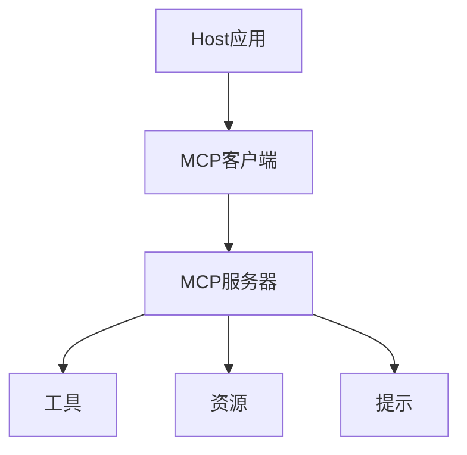
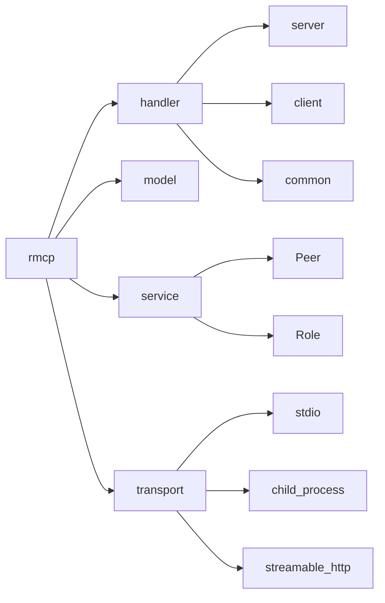
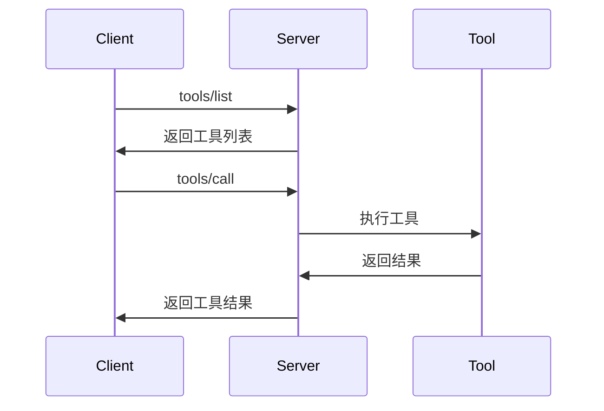
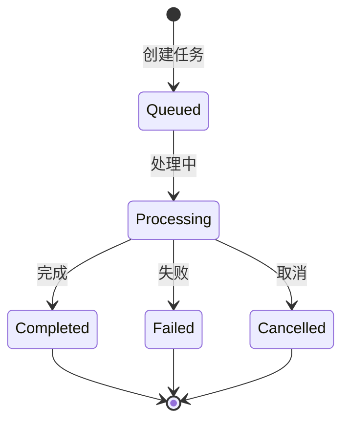
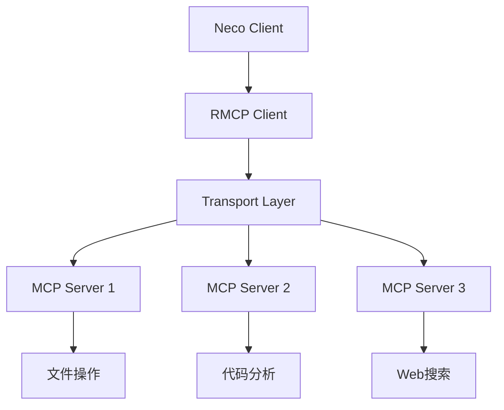
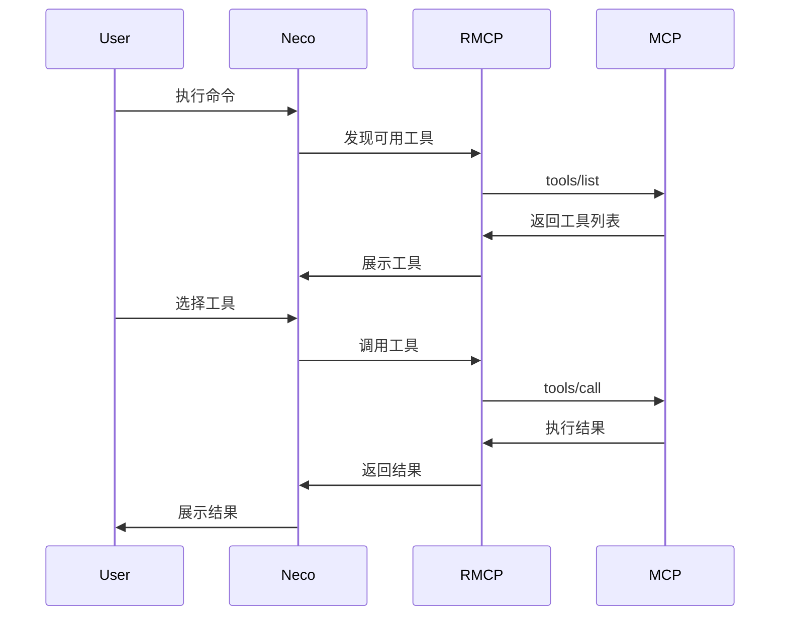

# RMCP (Rust MCP Client) 深度探索

> 版本：v0.16.0 | 更新时间：2026-02-27

## 目录

1. [概述](#概述)
2. [MCP协议规范](#mcp协议规范)
3. [RMCP核心架构](#rmcp核心架构)
4. [服务器实现](#服务器实现)
5. [客户端实现](#客户端实现)
6. [工具系统](#工具系统)
7. [资源管理](#资源管理)
8. [提示系统](#提示系统)
9. [传输层](#传输层)
10. [任务系统](#任务系统)
11. [懒加载机制](#懒加载机制)
12. [错误处理](#错误处理)
13. [与Neco的集成](#与neco的集成)

---

## 概述

### 什么是RMCP

RMCP (Rust Model Context Protocol) 是 Model Context Protocol (MCP) 的官方 Rust 实现。MCP 是一个开放协议，用于在 LLM（大语言模型）应用与外部数据源和工具之间建立标准化的连接方式。

### 核心特性

- **双向通信**：基于 JSON-RPC 2.0 的消息协议
- **异步运行时**：基于 Tokio 的高性能异步处理
- **类型安全**：Rust 的类型系统提供编译时安全保证
- **模块化设计**：支持服务器、客户端或两者同时启用
- **丰富的传输层**：支持 stdio、HTTP (SSE)、子进程等多种传输方式

### 项目信息

| 属性 | 值 |
|------|-----|
| **GitHub仓库** | [modelcontextprotocol/rust-sdk](https://github.com/modelcontextprotocol/rust-sdk) |
| **Crates.io** | [rmcp](https://crates.io/crates/rmcp) |
| **文档** | [docs.rs/rmcp](https://docs.rs/rmcp) |
| **最新版本** | v0.16.0 (2026-02-17) |
| **下载量** | 4,238,870 总下载，2,723,117 近期下载 |
| **许可证** | Apache-2.0 |
| **依赖** | tokio, serde, schemars |

---

## MCP协议规范

### 协议架构

MCP 采用三层架构：



### 核心概念

#### 1. 角色（Roles）

- **Host（主机）**：发起连接的 LLM 应用
- **Client（客户端）**：主机应用中的连接器
- **Server（服务器）**：提供上下文和功能的服务

#### 2. 基础协议

- **消息格式**：JSON-RPC 2.0
- **连接类型**：有状态连接
- **能力协商**：服务器和客户端之间进行能力协商

#### 3. 服务器功能（Server Features）

| 功能 | 控制方 | 描述 | 示例 |
|------|--------|------|------|
| **Prompts** | 用户控制 | 交互式模板，由用户选择触发 | 斜杠命令、菜单选项 |
| **Resources** | 应用控制 | 由客户端附加和管理的上下文数据 | 文件内容、git历史 |
| **Tools** | 模型控制 | 暴露给LLM执行的操作函数 | API POST请求、文件写入 |

### 安全原则

MCP 强调以下安全原则：

1. **用户同意和控制**：用户必须明确同意并理解所有数据访问和操作
2. **数据隐私**：主机必须获得明确同意才能向服务器暴露用户数据
3. **工具安全**：工具代表任意代码执行，必须谨慎处理
4. **LLM采样控制**：用户必须明确批准任何LLM采样请求

---

## RMCP核心架构

### 模块结构



### 核心组件

#### 1. Handler（处理器）

处理器负责处理协议消息：

- **ServerHandler**：服务器端处理器
- **ClientHandler**：客户端处理器
- **ToolHandler**：工具调用处理器

#### 2. Model（数据模型）

定义协议数据结构：

- **请求/响应类型**：各种 JSON-RPC 消息
- **内容类型**：文本、图像、资源等
- **错误类型**：协议错误和应用错误

#### 3. Service（服务层）

提供高层API：

- **Peer**：对等端点抽象
- **Role**：客户端/服务器角色标记
- **ServiceExt**：服务扩展trait

#### 4. Transport（传输层）

抽象通信传输：

- **Transport trait**：统一传输接口
- **IntoTransport trait**：类型转换辅助
- **具体实现**：stdio、HTTP、子进程等

### Feature Flags

RMCP 使用 Cargo feature flags 控制组件：

| Feature | 描述 |
|---------|------|
| `client` | 启用客户端功能 |
| `server` | 启用服务器功能（默认） |
| `macros` | 启用 `#[tool]` 宏（默认） |
| `transport-io` | I/O流支持 |
| `transport-child-process` | 子进程支持 |
| `transport-streamable-http-client` | HTTP流客户端 |
| `transport-streamable-http-server` | HTTP流服务器 |
| `auth` | OAuth2认证支持 |
| `schemars` | JSON Schema生成 |

### 依赖项

```toml
[dependencies]
rmcp = { version = "0.16", features = ["server", "client"] }

# 依赖项
tokio = { version = "1", features = ["full"] }
serde = { version = "1", features = ["derive"] }
serde_json = "1"
schemars = "0.8"  # JSON Schema生成
async-trait = "0.1"
futures = "0.3"
```

---

## 服务器实现

### 基础服务器

```rust
use rmcp::{
    ServerHandler, ServiceExt,
    handler::server::tool::{ToolRouter, tool, tool_router, tool_handler},
    model::*,
    transport::stdio,
    ErrorData as McpError,
};
use std::sync::Arc;
use tokio::sync::Mutex;

#[derive(Clone)]
pub struct MyServer {
    tool_router: ToolRouter<Self>,
}

#[tool_router]
impl MyServer {
    fn new() -> Self {
        Self {
            tool_router: Self::tool_router(),
        }
    }

    #[tool(description = "Say hello")]
    async fn hello(&self, #[tool(arg)] name: String) -> Result<CallToolResult, McpError> {
        Ok(CallToolResult::success(vec![
            Content::text(format!("Hello, {}!", name))
        ]))
    }
}

#[tool_handler]
impl ServerHandler for MyServer {
    fn get_info(&self) -> ServerInfo {
        ServerInfo {
            name: "my-server".into(),
            version: "1.0.0".into(),
            instructions: Some("A simple MCP server".into()),
            capabilities: ServerCapabilities::builder()
                .enable_tools()
                .build(),
            ..Default::default()
        }
    }
}

#[tokio::main]
async fn main() -> Result<(), Box<dyn std::error::Error>> {
    let server = MyServer::new();
    let service = server.serve(stdio()).await?;
    service.waiting().await?;
    Ok(())
}
```

### 结构化输出

使用 `Json` 包装器返回结构化数据：

```rust
use rmcp::handler::server::wrapper::Json;
use serde::{Deserialize, Serialize};

#[derive(Serialize, Deserialize, JsonSchema)]
struct CalculatorRequest {
    a: i32,
    b: i32,
    operation: String,
}

#[derive(Serialize, Deserialize, JsonSchema)]
struct CalculatorResult {
    result: i32,
    operation: String,
}

#[tool(name = "calculate", description = "Perform calculation")]
async fn calculate(
    &self,
    params: Parameters<CalculatorRequest>,
) -> Result<Json<CalculatorResult>, String> {
    let result = match params.0.operation.as_str() {
        "add" => params.0.a + params.0.b,
        "multiply" => params.0.a * params.0.b,
        _ => return Err("Unknown operation".to_string()),
    };

    Ok(Json(CalculatorResult {
        result,
        operation: params.0.operation,
    }))
}
```

### 服务器能力

```rust
let capabilities = ServerCapabilities::builder()
    .enable_tools()                    // 启用工具
    .enable_resources()                // 启用资源
    .enable_prompts()                  // 启用提示
    .enable_logging()                  // 启用日志
    .enable_completions()              // 启用自动完成
    .resources(ResourcesCapability {
        subscribe: true,               // 支持资源订阅
        list_changed: true,            // 支持列表变更通知
    })
    .tools(ToolsCapability {
        list_changed: true,            // 支持工具列表变更通知
    })
    .build();
```

### 访问对等端点

```rust
impl ServerHandler for MyHandler {
    async fn on_progress(
        &self,
        notification: ProgressNotificationParam,
        context: NotificationContext<RoleServer>,
    ) {
        let peer = context.peer;

        // 发送日志消息
        let _ = peer
            .notify_logging_message(LoggingMessageNotificationParam {
                level: LoggingLevel::Info,
                logger: None,
                data: serde_json::json!({
                    "message": format!("Progress: {}", notification.progress)
                }),
            })
            .await;
    }
}
```

---

## 客户端实现

### 基础客户端

```rust
use rmcp::{
    ServiceExt,
    model::CallToolRequestParams,
    transport::{ConfigureCommandExt, TokioChildProcess},
};
use tokio::process::Command;

#[tokio::main]
async fn main() -> Result<(), Box<dyn std::error::Error>> {
    // 连接到子进程服务器
    let service = ()
        .serve(TokioChildProcess::new(
            Command::new("uvx").configure(|cmd| {
                cmd.arg("mcp-server-git");
            })?
        )?)
        .await?;

    // 获取服务器信息
    let server_info = service.peer_info();
    println!("Connected to: {:#?}", server_info);

    // 列出可用工具
    let tools = service.list_tools(Default::default()).await?;
    println!("Available tools: {:#?}", tools);

    // 调用工具
    let result = service
        .call_tool(CallToolRequestParams {
            meta: None,
            name: "git_status".into(),
            arguments: serde_json::json!({ "repo_path": "." }).as_object().cloned(),
            task: None,
        })
        .await?;

    println!("Result: {:#?}", result);

    // 优雅关闭
    service.cancel().await?;
    Ok(())
}
```

### 客户端能力协商

```rust
use rmcp::model::{ClientCapabilities, ClientInfo};

let client_info = ClientInfo {
    name: "my-client".into(),
    version: "1.0.0".into(),
    ..Default::default()
};

let capabilities = ClientCapabilities::builder()
    .enable_sampling()              // 支持采样功能
    .enable_roots()                 // 支持根目录
    .build();
```

---

## 工具系统

### 工具定义

工具是可由语言模型调用的可执行函数：

```rust
#[tool(description = "Get weather information")]
async fn get_weather(
    &self,
    #[tool(arg)] location: String,
) -> Result<CallToolResult, McpError> {
    Ok(CallToolResult::success(vec![
        Content::text(format!("Weather in {}: Sunny, 72°F", location))
    ]))
}
```

### 工具路由

```rust
#[tool_router]
impl MyServer {
    // 所有标记为 #[tool] 的方法都会自动注册
}
```

### 工具调用流程



### 工具消息类型

#### 1. 文本内容

```rust
Content::text("Hello, world!")
```

#### 2. 图像内容

```rust
Content::image(
    "base64-encoded-data",
    "image/png"
)
```

#### 3. 嵌入式资源

```rust
Content::resource(ResourceContents {
    uri: "file:///example.txt".into(),
    mime_type: Some("text/plain".into()),
    text: Some("Resource content".into()),
    ..Default::default()
})
```

---

## 资源管理

### 资源定义

资源是服务器提供的上下文数据，通过 URI 唯一标识：

```rust
use rmcp::{ServerHandler, handler::server::resource::{ResourceHandler, resource_handler}};

#[resource_handler]
impl ResourceHandler for MyServer {
    async fn list_resources(
        &self,
        _request: ListResourcesRequestParams,
    ) -> Result<ListResourcesResult, McpError> {
        Ok(ListResourcesResult {
            resources: vec![
                Resource {
                    uri: "file:///project/src/main.rs".into(),
                    name: "main.rs".into(),
                    description: Some("Main entry point".into()),
                    mime_type: Some("text/x-rust".into()),
                    ..Default::default()
                }
            ],
            ..Default::default()
        })
    }

    async fn read_resource(
        &self,
        request: ReadResourceRequestParams,
    ) -> Result<ReadResourceResult, McpError> {
        Ok(ReadResourceResult {
            contents: vec![
                ResourceContents {
                    uri: request.uri.clone(),
                    mime_type: Some("text/plain".into()),
                    text: Some("fn main() { println!(\"Hello\"); }".into()),
                    ..Default::default()
                }
            ],
        })
    }
}
```

### 资源订阅

```rust
#[resource_handler]
impl ResourceHandler for MyServer {
    async fn subscribe(
        &self,
        request: SubscribeRequestParams,
    ) -> Result<(), McpError> {
        // 处理订阅请求
        Ok(())
    }

    async fn unsubscribe(
        &self,
        request: UnsubscribeRequestParams,
    ) -> Result<(), McpError> {
        // 处理取消订阅
        Ok(())
    }
}
```

### 资源模板

```rust
async fn list_resource_templates(
    &self,
    _request: ListResourceTemplatesRequestParams,
) -> Result<ListResourceTemplatesResult, McpError> {
    Ok(ListResourceTemplatesResult {
        resource_templates: vec![
            ResourceTemplate {
                uri_template: "file:///{path}".into(),
                name: "Project Files".into(),
                description: Some("Access project files".into()),
                mime_type: Some("application/octet-stream".into()),
                ..Default::default()
            }
        ],
        ..Default::default()
    })
}
```

---

## 提示系统

### 提示定义

提示是预定义的模板消息，由用户控制：

```rust
use rmcp::handler::server::prompt::{PromptHandler, prompt_handler};

#[prompt_handler]
impl PromptHandler for MyServer {
    async fn list_prompts(
        &self,
        _request: ListPromptsRequestParams,
    ) -> Result<ListPromptsResult, McpError> {
        Ok(ListPromptsResult {
            prompts: vec![
                Prompt {
                    name: "code_review".into(),
                    description: Some("Review code quality".into()),
                    arguments: Some(vec![
                        PromptArgument {
                            name: "code".into(),
                            description: Some("The code to review".into()),
                            required: Some(true),
                            ..Default::default()
                        }
                    ]),
                    ..Default::default()
                }
            ],
            ..Default::default()
        })
    }

    async fn get_prompt(
        &self,
        request: GetPromptRequestParams,
    ) -> Result<GetPromptResult, McpError> {
        let code = request.arguments
            .and_then(|args| args.get("code").cloned())
            .and_then(|v| v.as_str().map(|s| s.to_string()))
            .unwrap_or_default();

        Ok(GetPromptResult {
            description: Some("Code review prompt".into()),
            messages: vec![
                PromptMessage {
                    role: PromptMessageRole::User,
                    content: PromptMessageContent::text(
                        format!("Please review this code:\n{}", code)
                    ),
                }
            ],
            ..Default::default()
        })
    }
}
```

### 提示消息类型

```rust
// 文本内容
PromptMessageContent::Text(TextContent {
    type: "text".into(),
    text: "Hello, world!".into(),
})

// 图像内容
PromptMessageContent::Image(ImageContent {
    type: "image".into(),
    data: "base64-data".into(),
    mime_type: "image/png".into(),
})

// 资源内容
PromptMessageContent::Resource(ResourcePromptContent {
    type: "resource".into(),
    resource: ResourceContents {
        uri: "file:///example".into(),
        ..Default::default()
    },
})
```

---

## 传输层

### Transport Trait

所有传输类型实现 `Transport` trait：

```rust
pub trait Transport: Send + Sync + 'static {
    /// 并发发送消息
    fn send_msg(&self, msg: Message) -> BoxFuture<'_, Result<(), Error>>;

    /// 顺序接收消息
    fn recv_msg(&self) -> BoxFuture<'_, Result<Option<Message>, Error>>;
}
```

### 1. STDIO 传输

#### 服务器端（stdio）

```rust
use rmcp::transport::stdio;

let service = server.serve(stdio()).await?;
```

#### 客户端端（子进程）

```rust
use rmcp::transport::TokioChildProcess;
use tokio::process::Command;

let transport = TokioChildProcess::new(
    Command::new("mcp-server")
)?;
```

### 2. HTTP 流传输

#### 服务器端

```rust
use rmcp::transport::streamable_http_server::tower::StreamableHttpService;
use tower::ServiceBuilder;

let service = StreamableHttpService::new(server);
```

#### 客户端端

```rust
use rmcp::transport::streamable_http_client::StreamableHttpClientTransport;

let transport = StreamableHttpClientTransport::new(url)?;
```

### 3. 自定义传输

```rust
use futures::{Sink, Stream};
use rmcp::transport::{Transport, IntoTransport};

// 从 Sink + Stream 创建
let transport = (sink, stream).into_transport();

// 从 AsyncRead + AsyncWrite 创建
let transport = (reader, writer).into_transport();
```

### 传输类型对比

| 传输类型 | 用途 | 服务器 | 客户端 | 特点 |
|----------|------|--------|--------|------|
| stdio | 本地进程通信 | ✓ | ✓ | 简单、广泛支持 |
| HTTP SSE | Web应用 | ✓ | ✓ | 支持流式传输 |
| Child Process | 独立进程 | - | ✓ | 隔离性好 |
| Custom | 自定义协议 | - | - | 灵活定制 |

---

## 任务系统

RMCP 实现了 SEP-1686 任务生命周期，支持长时间运行的异步工具调用。

### 任务生命周期



### 任务操作

#### 1. 创建任务

```rust
let result = service
    .call_tool(CallToolRequestParams {
        name: "long_running_task".into(),
        arguments: None,
        task: Some(true),  // 启用任务模式
        ..Default::default()
    })
    .await?;

let task_id = result.task_id.unwrap();
```

#### 2. 查询任务信息

```rust
let task_info = service
    .get_task_info(GetTaskInfoRequestParams {
        id: task_id.clone(),
        ..Default::default()
    })
    .await?;
```

#### 3. 获取任务结果

```rust
let task_result = service
    .get_task_result(GetTaskResultRequestParams {
        id: task_id.clone(),
        ..Default::default()
    })
    .await?;
```

#### 4. 取消任务

```rust
service
    .cancel_task(CancelTaskRequestParams {
        id: task_id,
        ..Default::default()
    })
    .await?;
```

### 任务处理器

```rust
use rmcp::handler::server::task::{TaskHandler, task_handler, OperationProcessor};

#[task_handler]
impl TaskHandler for MyServer {
    type Processor = OperationProcessor<Self>;

    fn processor(&self) -> Self::Processor {
        OperationProcessor::new(self.clone())
    }
}
```

### 任务元数据

```rust
pub struct TaskInfo {
    pub id: String,
    pub status: TaskStatus,
    pub created_at: DateTime<Utc>,
    pub updated_at: DateTime<Utc>,
    pub expires_at: Option<DateTime<Utc>>,
    pub poll_interval: Option<Duration>,
}

pub enum TaskStatus {
    Queued,
    Processing,
    Completed,
    Failed,
    Cancelled,
}
```

---

## 懒加载机制

### 概念

RMCP 支持按需加载服务器功能，避免初始化时加载所有资源。

### 懒加载实现

#### 1. 延迟初始化

```rust
use std::sync::{Arc, Mutex};
use tokio::sync::Lazy;

pub struct LazyServer {
    heavy_resource: Arc<Mutex<Option<HeavyResource>>>,
}

impl LazyServer {
    async fn get_resource(&self) -> Result<&HeavyResource, McpError> {
        let mut guard = self.heavy_resource.lock().await;

        if guard.is_none() {
            *guard = Some(HeavyResource::load().await?);
        }

        Ok(guard.as_ref().unwrap())
    }
}
```

#### 2. 按需工具注册

```rust
#[tool_router]
impl LazyServer {
    #[tool(description = "Load data on demand")]
    async fn load_data(&self, path: String) -> Result<CallToolResult, McpError> {
        // 仅在调用时加载数据
        let data = load_data_from_path(&path).await?;
        Ok(CallToolResult::success(vec![Content::text(data)]))
    }
}
```

#### 3. 资源模板懒加载

```rust
async fn list_resource_templates(
    &self,
    _request: ListResourceTemplatesRequestParams,
) -> Result<ListResourceTemplatesResult, McpError> {
    Ok(ListResourceTemplatesResult {
        resource_templates: vec![
            // 不立即加载，仅提供模板
            ResourceTemplate {
                uri_template: "data:///{id}".into(),
                name: "Data Resource".into(),
                description: Some("Load data by ID".into()),
                ..Default::default()
            }
        ],
        ..Default::default()
    })
}

async fn read_resource(
    &self,
    request: ReadResourceRequestParams,
) -> Result<ReadResourceResult, McpError> {
    // 解析URI并按需加载
    let id = extract_id_from_uri(&request.uri)?;
    let data = load_data_by_id(id).await?;

    Ok(ReadResourceResult {
        contents: vec![ResourceContents {
            uri: request.uri.clone(),
            text: Some(data),
            ..Default::default()
        }],
    })
}
```

### 懒加载最佳实践

1. **延迟初始化**：仅在首次使用时初始化资源
2. **模板优先**：先暴露资源模板，按需加载内容
3. **缓存策略**：合理使用缓存避免重复加载
4. **生命周期管理**：正确管理资源生命周期

---

## 错误处理

### 错误类型

#### 1. 协议错误

```rust
use rmcp::model::{ErrorCode, ErrorData};

// JSON-RPC 标准错误
let error = ErrorData {
    code: ErrorCode::InvalidParams,     // -32602
    message: "Invalid parameters".into(),
    data: None,
};
```

#### 2. 应用错误

```rust
use rmcp::ErrorData as McpError;

// 工具执行错误
let tool_error = CallToolResult {
    content: vec![Content::text("Operation failed")],
    is_error: Some(true),
    ..Default::default()
};
```

### 错误代码

| 代码 | 名称 | 描述 |
|------|------|------|
| -32700 | Parse error | JSON 解析错误 |
| -32600 | Invalid Request | 无效请求 |
| -32601 | Method not found | 方法未找到 |
| -32602 | Invalid params | 无效参数 |
| -32603 | Internal error | 内部错误 |
| -32002 | Resource not found | 资源未找到 |
| -32004 | Feature not supported | 功能不支持 |

### 错误处理示例

```rust
#[tool]
async fn safe_operation(
    &self,
    input: String,
) -> Result<CallToolResult, McpError> {
    match process_input(&input) {
        Ok(result) => Ok(CallToolResult::success(vec![
            Content::text(result)
        ])),
        Err(e) => Ok(CallToolResult {
            content: vec![Content::text(format!("Error: {}", e))],
            is_error: Some(true),
            ..Default::default()
        }),
    }
}
```

### 自定义错误

```rust
use thiserror::Error;

#[derive(Error, Debug)]
pub enum MyError {
    #[error("IO error: {0}")]
    Io(#[from] std::io::Error),

    #[error("Parse error: {0}")]
    Parse(String),

    #[error("Not found: {0}")]
    NotFound(String),
}

impl From<MyError> for McpError {
    fn from(err: MyError) -> Self {
        ErrorData {
            code: match err {
                MyError::NotFound(_) => ErrorCode::Custom(-32002),
                _ => ErrorCode::InternalError,
            },
            message: err.to_string(),
            data: None,
        }
    }
}
```

---

## 与Neco的集成

### Neco概述

Neco 是一个 Rust 编写的 AI 编码助手，需要与 MCP 服务器集成以扩展其能力。

### 集成架构



### 集成步骤

#### 1. 添加依赖

```toml
[dependencies]
rmcp = { version = "0.16", features = ["client"] }
tokio = { version = "1", features = ["full"] }
```

#### 2. 初始化 RMCP 客户端

```rust
use rmcp::{ServiceExt, transport::TokioChildProcess};
use tokio::process::Command;

pub struct NecoMcpClient {
    service: DynClient,
}

impl NecoMcpClient {
    pub async fn new(server_command: &str) -> Result<Self, Box<dyn std::error::Error>> {
        let parts: Vec<&str> = server_command.split_whitespace().collect();
        let mut cmd = Command::new(parts[0]);

        for arg in &parts[1..] {
            cmd.arg(arg);
        }

        let service = ()
            .serve(TokioChildProcess::new(cmd)?)
            .await?;

        Ok(Self {
            service: service.into_dyn(),
        })
    }

    pub async fn list_available_tools(&self) -> Result<Vec<Tool>, Box<dyn std::error::Error>> {
        let response = self.service.list_tools(Default::default()).await?;
        Ok(response.tools)
    }

    pub async fn call_tool(
        &self,
        name: String,
        arguments: Option<serde_json::Value>,
    ) -> Result<CallToolResult, Box<dyn std::error::Error>> {
        let result = self.service
            .call_tool(CallToolRequestParams {
                name,
                arguments,
                ..Default::default()
            })
            .await?;

        Ok(result)
    }
}
```

#### 3. 管理多个 MCP 服务器

```rust
use std::collections::HashMap;
use std::sync::Arc;

pub struct NecoMcpManager {
    clients: HashMap<String, Arc<NecoMcpClient>>,
}

impl NecoMcpManager {
    pub async fn new() -> Self {
        Self {
            clients: HashMap::new(),
        }
    }

    pub async fn add_server(
        &mut self,
        name: String,
        command: String,
    ) -> Result<(), Box<dyn std::error::Error>> {
        let client = NecoMcpClient::new(&command).await?;
        self.clients.insert(name, Arc::new(client));
        Ok(())
    }

    pub async fn list_all_tools(&self) -> HashMap<String, Vec<Tool>> {
        let mut all_tools = HashMap::new();

        for (name, client) in &self.clients {
            if let Ok(tools) = client.list_available_tools().await {
                all_tools.insert(name.clone(), tools);
            }
        }

        all_tools
    }

    pub async fn call_tool_on_server(
        &self,
        server_name: &str,
        tool_name: String,
        arguments: Option<serde_json::Value>,
    ) -> Result<CallToolResult, Box<dyn std::error::Error>> {
        let client = self.clients
            .get(server_name)
            .ok_or("Server not found")?;

        client.call_tool(tool_name, arguments).await
    }
}
```

#### 4. 与 Neco 主系统集成

```rust
pub struct NecoCore {
    mcp_manager: Arc<NecoMcpManager>,
}

impl NecoCore {
    pub async fn new() -> Result<Self, Box<dyn std::error::Error>> {
        let mut mcp_manager = NecoMcpManager::new().await;

        // 添加预设 MCP 服务器
        mcp_manager.add_server(
            "filesystem".into(),
            "uvx mcp-server-filesystem /path/to/allowed".into()
        ).await?;

        mcp_manager.add_server(
            "git".into(),
            "uvx mcp-server-git".into()
        ).await?;

        Ok(Self {
            mcp_manager: Arc::new(mcp_manager),
        })
    }

    pub async fn execute_tool(
        &self,
        server: String,
        tool: String,
        args: serde_json::Value,
    ) -> Result<String, Box<dyn std::error::Error>> {
        let result = self.mcp_manager
            .call_tool_on_server(&server, tool, Some(args))
            .await?;

        // 提取文本内容
        let text = result.content
            .iter()
            .filter_map(|c| match c {
                Content::Text(t) => Some(t.text.clone()),
                _ => None,
            })
            .collect::<Vec<_>>()
            .join("\n");

        Ok(text)
    }
}
```

### MCP 交互流程



### 懒加载集成

```rust
impl NecoMcpManager {
    pub async fn get_server_lazy(
        &mut self,
        name: String,
        command: String,
    ) -> Result<Arc<NecoMcpClient>, Box<dyn std::error::Error>> {
        // 如果已存在，直接返回
        if let Some(client) = self.clients.get(&name) {
            return Ok(client.clone());
        }

        // 否则创建新连接
        let client = NecoMcpClient::new(&command).await?;
        self.clients.insert(name.clone(), Arc::new(client));

        Ok(self.clients.get(&name).unwrap().clone())
    }
}
```

### 配置管理

```toml
# config.toml

[[mcp_servers]]
name = "filesystem"
command = "uvx"
args = ["mcp-server-filesystem", "/path/to/allowed"]
enabled = true

[[mcp_servers]]
name = "git"
command = "uvx"
args = ["mcp-server-git"]
enabled = true

[[mcp_servers]]
name = "brave-search"
command = "uvx"
args = ["mcp-server-brave-search"]
env = { BRAVE_API_KEY = "your-key" }
enabled = false
```

```rust
use serde::Deserialize;

#[derive(Deserialize)]
struct McpServerConfig {
    name: String,
    command: String,
    args: Vec<String>,
    env: Option<std::collections::HashMap<String, String>>,
    enabled: bool,
}

#[derive(Deserialize)]
struct Config {
    mcp_servers: Vec<McpServerConfig>,
}

impl NecoMcpManager {
    pub async fn from_config(config: Config) -> Result<Self, Box<dyn std::error::Error>> {
        let mut manager = Self::new().await;

        for server in config.mcp_servers {
            if !server.enabled {
                continue;
            }

            let full_command = format!("{} {}", server.command, server.args.join(" "));

            manager.add_server(server.name, full_command).await?;
        }

        Ok(manager)
    }
}
```

### 安全考虑

1. **验证工具输入**：在传递给 MCP 服务器前验证所有参数
2. **限制访问范围**：为文件系统等敏感工具设置明确的访问路径
3. **用户同意**：对敏感操作要求用户明确批准
4. **审计日志**：记录所有工具调用以便审查
5. **超时控制**：为所有工具调用设置合理的超时

---

## 总结

### RMCP 核心优势

1. **类型安全**：Rust 类型系统确保编译时正确性
2. **高性能**：基于 Tokio 的异步 I/O
3. **灵活传输**：支持多种传输层
4. **丰富功能**：工具、资源、提示全覆盖
5. **规范兼容**：完全遵循 MCP 协议规范

### 适用场景

- **AI IDE 插件**：为编码助手提供额外上下文
- **聊天机器人**：扩展 LLM 功能
- **工作流自动化**：构建 AI 驱动的自动化工具
- **数据分析**：提供数据查询和分析能力

### 与 Neco 集成价值

1. **能力扩展**：通过 MCP 服务器快速添加新功能
2. **模块化设计**：不同功能由独立服务器提供
3. **懒加载支持**：按需启动服务器，节省资源
4. **标准化协议**：使用统一的 MCP 协议
5. **生态系统**：可利用现有的 MCP 服务器生态

---

## 参考资料

- [MCP 官方规范](https://modelcontextprotocol.io/specification/2024-11-05)
- [RMCP GitHub 仓库](https://github.com/modelcontextprotocol/rust-sdk)
- [RMCP 文档](https://docs.rs/rmcp)
- [MCP TypeScript SDK](https://github.com/modelcontextprotocol/typescript-sdk)
- [相关工作项目](https://github.com/modelcontextprotocol/rust-sdk#related-projects)

---

**文档版本**: 1.0.0
**最后更新**: 2026-02-27
**作者**: Neco Team
