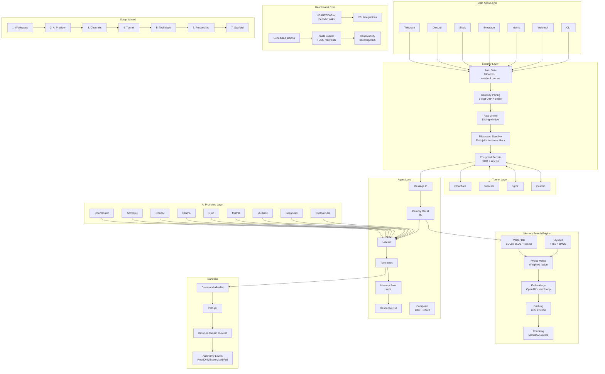
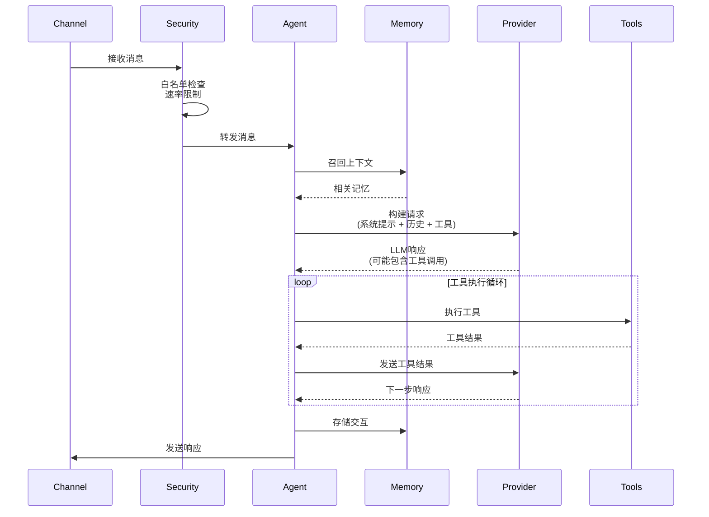
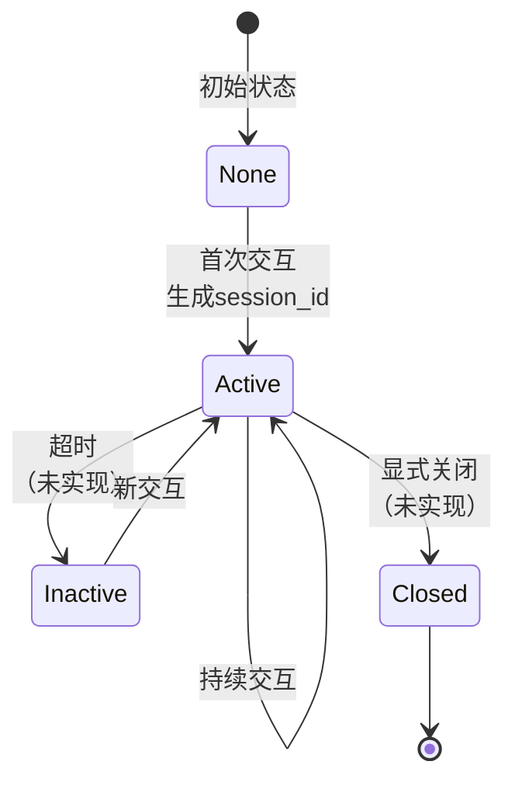
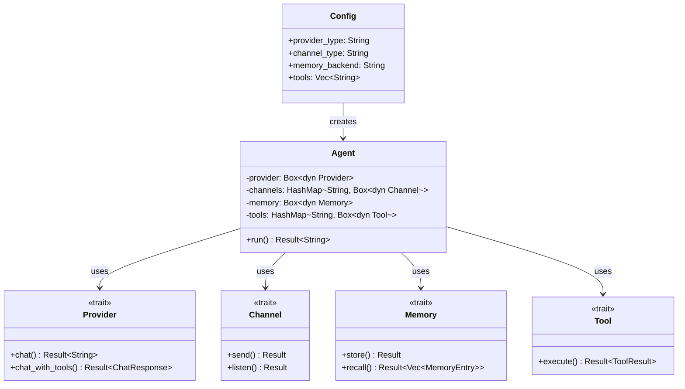
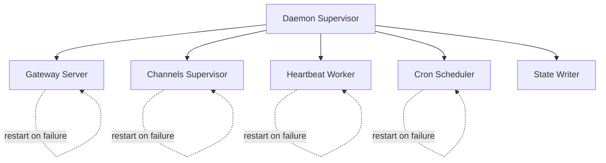
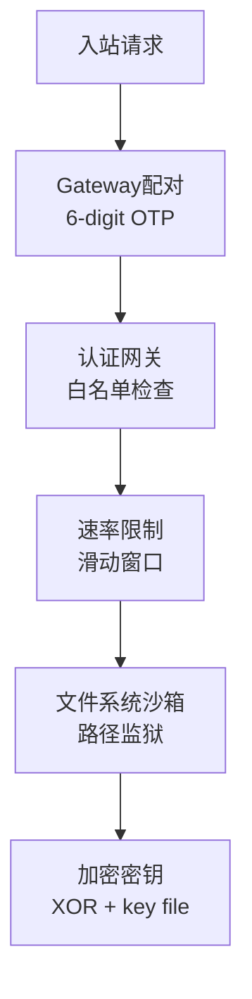
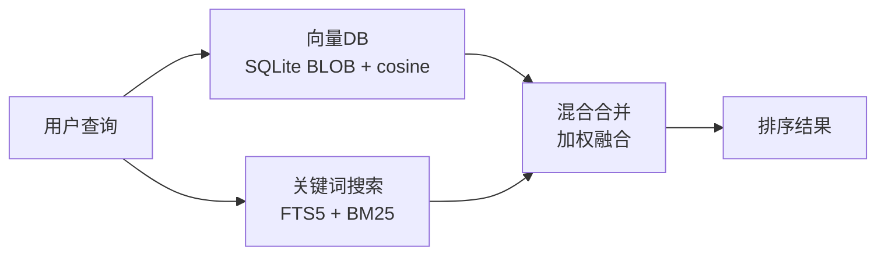

# ZeroClaw项目深度探索报告

**探索日期**: 2026-02-27
**项目地址**: https://github.com/zeroclaw-labs/zeroclaw
**版本**: v0.1.7
**探索目标**: 全面分析ZeroClaw的架构、设计模式和实现方式

---

## 目录

1. [项目概述](#1-项目概述)
2. [核心特性](#2-核心特性)
3. [架构设计](#3-架构设计)
4. [多智能体协作机制](#4-多智能体协作机制)
5. [Session管理](#5-session管理)
6. [MCP和Skills支持](#6-mcp和skills支持)
7. [代码结构分析](#7-代码结构分析)
8. [设计模式](#8-设计模式)
9. [关键代码示例](#9-关键代码示例)
10. [优缺点分析](#10-优缺点分析)

---

## 1. 项目概述

### 1.1 项目定位

ZeroClaw是一个**零开销、零妥协的100% Rust实现的AI助手基础设施**。它的定位是**智能体工作流的运行时操作系统**，提供模型、工具、内存和执行的抽象层，使智能体可以一次构建并在任何地方运行。

### 1.2 核心理念

```
Trait-driven architecture · secure-by-default runtime · provider/channel/tool swappable · pluggable everything
```

关键特征：
- **零开销**: 单个二进制文件，<5MB内存占用，<10ms启动时间
- **零妥协**: 不牺牲安全性、性能或灵活性
- **100% Rust**: 类型安全、内存安全、零成本抽象
- **100% 不可知**: 提供商、通道、工具、内存、隧道、运行时均可插拔

### 1.3 性能指标

根据官方benchmark数据（在0.8GHz边缘硬件上）：

| 指标 | OpenClaw | NanoBot | PicoClaw | **ZeroClaw** |
|------|----------|---------|----------|--------------|
| **RAM** | > 1GB | > 100MB | < 10MB | **< 5MB** |
| **启动时间** | > 500s | > 30s | < 1s | **< 10ms** |
| **二进制大小** | ~28MB | N/A | ~8MB | **~8.8MB** |
| **部署成本** | Mac Mini $599 | Linux SBC ~$50 | Linux Board $10 | **Any hardware $10** |

### 1.4 技术栈

```toml
[dependencies]
# CLI
clap = "4.5"           # 命令行参数解析
clap_complete = "4.5"  # Shell自动补全

# 异步运行时
tokio = "1.42"         # 最小化feature集以减小二进制大小

# HTTP客户端
reqwest = "0.12"       # 仅启用必要的feature

# 序列化
serde = "1.0"
serde_json = "1.0"

# 内存/持久化
rusqlite = "0.37"      # SQLite内存后端
postgres = "0.19"      # PostgreSQL内存后端（可选）

# WebSocket客户端
tokio-tungstenite = "0.28"

# HTTP服务器
axum = "0.8"

# 错误处理
anyhow = "1.0"
thiserror = "2.0"

# 安全性
chacha20poly1305 = "0.10"  # 认证加密
rand = "0.10"               # CSPRNG

# Observability
prometheus = "0.14"
opentelemetry = "0.31"      # 可选
```

---

## 2. 核心特性

### 2.1 功能矩阵

| 功能类别 | 支持情况 | 备注 |
|----------|----------|------|
| **AI Providers** | 22+ | OpenRouter, Anthropic, OpenAI, Ollama, Groq, Mistral, xAI, DeepSeek, Together AI, Fireworks, Perplexity, Cohere, Cloudflare AI, Bedrock, Venice, llama.cpp, vLLM, Osaurus, custom endpoints |
| **Channels** | 14+ | Telegram, Discord, Slack, iMessage, Matrix, Signal, WhatsApp, Webhook, Email, IRC, Lark, DingTalk, QQ, Nostr, Mattermost |
| **Memory Backends** | 5 | SQLite, PostgreSQL, Lucid, Markdown, None |
| **Tools** | 20+ | shell, file, memory, git, cron, schedule, browser, http_request, screenshot, pushover, WASM skills, Composio (1000+ OAuth apps) |
| **Tunnels** | 4 | Cloudflare, Tailscale, ngrok, Custom |
| **Runtimes** | 2 | Native, Docker (WASM计划中) |
| **Languages** | 7 | English, 简体中文, 日本語, Русский, Français, Tiếng Việt, Ελληνικά |

### 2.2 独特特性

1. **Provider Trait系统**: 22+ AI提供商统一接口，支持热切换
2. **Channel Trait系统**: 14+消息通道统一抽象
3. **Memory Search Engine**: 全栈自研（向量DB + 关键词搜索 + 混合合并），零外部依赖
4. **Security-by-Default**: Gateway配对、沙箱、白名单、工作区作用域、加密密钥
5. **Identity-Agnostic**: 支持OpenClaw markdown和AIEOS v1.1 JSON格式
6. **WASM Skills**: 可选的WASM插件运行时，支持WASI stdio协议
7. **Composio集成**: 1000+ OAuth应用集成
8. **Python Companion**: `zeroclaw-tools`包提供LangGraph工具调用包装

### 2.3 安全特性

| 安全特性 | 实现方式 | 状态 |
|----------|----------|------|
| **Gateway不公开暴露** | 默认绑定127.0.0.1，拒绝0.0.0.0除非有tunnel | ✅ |
| **配对必需** | 6位一次性代码 + bearer token | ✅ |
| **文件系统沙箱** | `workspace_only = true`，阻止系统目录 | ✅ |
| **仅通过隧道访问** | Gateway拒绝无隧道的公开绑定 | ✅ |
| **通道白名单** | 默认拒绝所有入站消息 | ✅ |
| **加密密钥** | XOR + 本地密钥文件(0600权限) | ✅ |
| **速率限制** | 滑动窗口 + 每日成本上限 | ✅ |
| **空字节注入防护** | 阻止路径中的空字节 | ✅ |
| **符号链接逃逸检测** | 规范化 + 解析路径工作区检查 | ✅ |

---

## 3. 架构设计

### 3.1 整体架构图



### 3.2 Trait系统架构

ZeroClaw的架构核心是**Trait驱动的可插拔系统**：

```mermaid
classDiagram
    class Provider {
        <<trait>>
        +capabilities() ProviderCapabilities
        +convert_tools(tools) ToolsPayload
        +chat_with_system(system, message, model, temp) String
        +chat_with_history(messages, model, temp) String
        +chat(request, model, temp) ChatResponse
        +supports_streaming() bool
        +stream_chat_with_system(...) Stream
    }

    class Channel {
        <<trait>>
        +name() str
        +send(message, recipient) Result
        +listen(tx) Result
        +health_check() bool
    }

    class Memory {
        <<trait>>
        +name() str
        +store(key, content, category, session) Result
        +recall(query, limit, session) Vec~MemoryEntry~
        +get(key) Option~MemoryEntry~
        +list(category, session) Vec~MemoryEntry~
        +forget(key) bool
        +count() usize
        +health_check() bool
    }

    class Tool {
        <<trait>>
        +name() str
        +description() str
        +parameters_schema() Value
        +execute(args) ToolResult
    }

    class Observer {
        <<trait>>
        +record_event(event)
        +record_metric(metric)
        +name() str
    }

    class RuntimeAdapter {
        <<trait>>
        +name() str
        +execute(command, args) Result
        +health_check() bool
    }

    class Tunnel {
        <<trait>>
        +name() str
        +start() Result
        +stop() Result
        +status() Status
    }

    class SecurityPolicy {
        <<trait>>
        +check_path_access(path) Result
        +check_command_allowed(cmd) Result
        +check_domain_allowed(domain) Result
    }

    Provider <|-- OpenAIProvider
    Provider <|-- AnthropicProvider
    Provider <|-- OllamaProvider
    Provider <|-- CustomProvider

    Channel <|-- TelegramChannel
    Channel <|-- DiscordChannel
    Channel <|-- SlackChannel

    Memory <|-- SqliteMemory
    Memory <|-- PostgresMemory
    Memory <|-- LucidMemory
    Memory <|-- MarkdownMemory

    Tool <|-- ShellTool
    Tool <|-- FileTool
    Tool <|-- MemoryTool
```



### 3.3 代码结构

```
src/
├── agent/              # Agent循环和编排
│   ├── agent.rs       # Agent核心逻辑
│   ├── loop_.rs       # 主处理循环
│   ├── dispatcher.rs  # 消息分发
│   ├── classifier.rs  # 消息分类
│   ├── research.rs    # 研究阶段（工具先行）
│   ├── memory_loader.rs # 内存加载
│   └── prompt.rs      # 提示工程
│
├── providers/          # AI提供商实现
│   ├── traits.rs      # Provider trait定义
│   ├── openai.rs
│   ├── anthropic.rs
│   ├── ollama.rs
│   └── ...            # 22+ providers
│
├── channels/           # 消息通道实现
│   ├── traits.rs      # Channel trait定义
│   ├── telegram.rs
│   ├── discord.rs
│   ├── slack.rs
│   └── ...            # 14+ channels
│
├── memory/             # 内存系统
│   ├── traits.rs      # Memory trait定义
│   ├── sqlite.rs      # SQLite实现（向量+FTS5）
│   ├── postgres.rs    # PostgreSQL实现
│   ├── lucid.rs       # Lucid桥接
│   └── markdown.rs    # Markdown文件实现
│
├── tools/              # 工具系统
│   ├── traits.rs      # Tool trait定义
│   ├── shell.rs       # Shell命令执行
│   ├── file.rs        # 文件操作
│   ├── memory.rs      # 内存操作
│   ├── git.rs         # Git集成
│   └── ...            # 20+ tools
│
├── security/           # 安全策略
│   ├── sandbox.rs     # 沙箱实现
│   ├── policy.rs      # 安全策略
│   └── secrets.rs     # 密钥加密
│
├── runtime/            # 运行时适配器
│   ├── native.rs      # 原生执行
│   └── docker.rs      # Docker容器执行
│
├── tunnel/             # 隧道集成
│   ├── cloudflare.rs
│   ├── tailscale.rs
│   ├── ngrok.rs
│   └── custom.rs
│
├── daemon/             # 守护进程
│   └── mod.rs         # 组件监督树
│
├── gateway/            # Webhook服务器
│   └── mod.rs         # Axum HTTP服务器
│
├── cron/               # 调度器
│   └── scheduler.rs   # 定时任务执行
│
├── heartbeat/          # 心跳引擎
│   └── engine.rs      # HEARTBEAT.md解析
│
├── skills/             # Skills系统
│   ├── loader.rs      # TOML manifest加载
│   └── forge.rs       # Skill注册表
│
├── plugins/            # WASM插件系统
│   └── wasmi.rs       # WASM运行时
│
├── observability/      # 可观测性
│   ├── noop.rs
│   ├── log.rs
│   ├── multi.rs
│   └── prometheus.rs
│
├── config/             # 配置管理
│   └── schema.rs      # TOML配置结构
│
├── identity.rs         # 身份系统（OpenClaw/AIEOS）
├── main.rs             # CLI入口
└── lib.rs              # 库入口
```

---

## 4. 多智能体协作机制

### 4.1 协作模型

ZeroClaw采用**单一Agent循环 + 编排器模式**，而非多智能体独立运行：

```rust
// Agent主循环 (src/agent/loop_.rs)
pub async fn run(
    config: Config,
    user_message: Option<String>,
    session_id: Option<String>,
    attachments: Vec<Attachment>,
    temperature: f64,
    tools: Vec<String>,
    stream: bool,
) -> anyhow::Result<String> {
    // 1. 消息预处理
    // 2. 内存召回
    // 3. LLM调用（带工具）
    // 4. 工具执行循环
    // 5. 内存存储
    // 6. 响应生成
}
```

### 4.2 消息流程



### 4.3 研究阶段（Research Phase）

ZeroClaw引入了**研究阶段**概念，在生成响应前主动使用工具收集信息：

```rust
// src/agent/research.rs
pub async fn run_research_phase(
    message: &str,
    config: &Config,
    tools: &[ToolSpec],
) -> anyhow::Result<Vec<ToolExecutionResult>> {
    // 分析用户查询，确定需要哪些工具
    // 并行执行工具调用
    // 收集结果用于上下文增强
}
```

### 4.4 编排器模式

```rust
// src/agent/dispatcher.rs
pub struct Dispatcher {
    config: Config,
    providers: HashMap<String, Box<dyn Provider>>,
    tools: HashMap<String, Box<dyn Tool>>,
}

impl Dispatcher {
    pub async fn route_message(&self, message: Message) -> Response {
        // 1. 消息分类
        let category = self.classifier.classify(&message);

        // 2. 选择provider
        let provider = self.select_provider(&category);

        // 3. 选择工具集
        let tools = self.select_tools(&category);

        // 4. 执行Agent循环
        self.run_agent_loop(provider, tools, message).await
    }
}
```

### 4.5 与传统多智能体对比

| 维度 | ZeroClaw | 传统多智能体 |
|------|----------|-------------|
| **架构** | 单一Agent + 编排器 | 多个独立Agent |
| **通信** | 函数调用 | 消息传递/共享内存 |
| **状态** | 集中式内存 | 分布式状态 |
| **工具访问** | 所有工具可用 | Agent专用工具 |
| **复杂度** | 低 | 高 |
| **可扩展性** | 高（工具扩展） | 中等（Agent扩展） |

---

## 5. Session管理

### 5.1 Session概念

ZeroClaw中的Session是**可选的**，主要用于：
- 内存分组（`session_id`字段）
- 对话上下文关联
- 多租户隔离

```rust
// src/memory/traits.rs
pub struct MemoryEntry {
    pub id: String,
    pub key: String,
    pub content: String,
    pub category: MemoryCategory,
    pub timestamp: String,
    pub session_id: Option<String>,  // 可选的session关联
    pub score: Option<f64>,
}
```

### 5.2 Session生命周期



### 5.3 Session在代码中的使用

```rust
// Agent运行时可以指定session_id
pub async fn run(
    config: Config,
    user_message: Option<String>,
    session_id: Option<String>,  // 可选
    attachments: Vec<Attachment>,
    temperature: f64,
    tools: Vec<String>,
    stream: bool,
) -> anyhow::Result<String>

// 内存召回时可以按session过滤
async fn recall(
    &self,
    query: &str,
    limit: usize,
    session_id: Option<&str>,  // 可选过滤
) -> anyhow::Result<Vec<MemoryEntry>>
```

### 5.4 Session vs 内存分类

```rust
pub enum MemoryCategory {
    Core,           // 长期事实、偏好、决策（跨session）
    Daily,          // 日常会话日志（session级）
    Conversation,   // 对话上下文（session级）
    Custom(String), // 用户自定义
}
```

Session是**横向切分**（按时间/租户），Category是**纵向切分**（按类型）。

---

## 6. MCP和Skills支持

### 6.1 MCP支持情况

**重要发现**: ZeroClaw**当前不支持**MCP（Model Context Protocol）！

搜索代码库和文档，**没有发现**任何MCP相关实现：
- 没有MCP客户端代码
- 没有MCP服务器代码
- 没有MCP SDK依赖
- 文档中没有提到MCP

### 6.2 Skills系统

ZeroClaw有自己独特的**Skills系统**：

#### 6.2.1 Skill定义

Skill是一个**TOML manifest + SKILL.md指令**的包：

```toml
# skill.toml
name = "rust-code-navigator"
version = "1.0.0"
description = "Navigate Rust code using LSP"
author = "opencode"

[skill]
triggers = [
  "/navigate",
  "go to definition",
  "find references",
]

[dependencies]
# 技能特定的依赖
```

```markdown
<!-- SKILL.md -->
# Skill: rust-code-navigator

## When to Use

Use when navigating Rust code, finding definitions, or locating references.

## Instructions

1. Use `cargo tree` to understand the dependency graph
2. Use `ripgrep` to find symbol usages
3. Analyze the code structure using LSP information
...
```

#### 6.2.2 Skill加载器

```rust
// src/skills/forge.rs
pub struct SkillForge {
    skills: HashMap<String, Skill>,
}

impl SkillForge {
    pub async fn load_from_url(&mut self, url: &str) -> Result<()> {
        // 从URL加载skill
    }

    pub async fn load_from_file(&mut self, path: &Path) -> Result<()> {
        // 从本地文件加载skill
    }

    pub fn find_skill(&self, trigger: &str) -> Option<&Skill> {
        // 根据trigger找到匹配的skill
    }
}
```

#### 6.2.3 WASM Skills

ZeroClaw支持**WASM插件**：

```toml
[features]
default = ["wasm-tools"]
wasm-tools = ["dep:wasmtime", "dep:wasmtime-wasi"]
```

```rust
// src/plugins/wasmi.rs
pub struct WasmPlugin {
    module: wasmi::Module,
    store: wasmi::Store<WasiState>,
}

impl Tool for WasmPlugin {
    fn execute(&self, args: Value) -> Result<ToolResult> {
        // 使用WASI stdio协议执行WASM
        // 从stdin读取JSON，向stdout写入JSON
    }
}
```

### 6.3 Composio集成

ZeroClaw集成了**Composio**（1000+ OAuth应用）：

```toml
[composio]
enabled = false        # opt-in
# api_key = "cmp_..."  # 加密存储
entity_id = "default"
```

```rust
// 执行时使用Composio工具
// 如果execute要求connected_account_id
// 运行 composio action='list_accounts' 来获取账户ID
```

### 6.4 Skills vs MCP对比

| 维度 | ZeroClaw Skills | MCP |
|------|-----------------|-----|
| **协议** | 自定义TOML manifest | JSON-RPC 2.0 |
| **传输** | 内嵌运行 | stdio/SSE/HTTP |
| **发现** | ZeroMarket registry | 手动配置 |
| **工具** | 函数调用 | Tools + Resources + Prompts |
| **沙箱** | WASM可选 | 未定义 |
| **生态系统** | 自建 | 快速增长 |

---

## 7. 代码结构分析

### 7.1 核心模块职责

| 模块 | 职责 | 行数估算 |
|------|------|----------|
| `agent/` | Agent循环、编排、提示工程 | ~2000 |
| `providers/` | 22+ AI提供商实现 | ~5000 |
| `channels/` | 14+ 消息通道实现 | ~4000 |
| `memory/` | 内存系统（向量+搜索） | ~1500 |
| `tools/` | 20+ 工具实现 | ~2000 |
| `security/` | 安全策略、沙箱 | ~1000 |
| `daemon/` | 守护进程、监督树 | ~800 |
| `gateway/` | Webhook服务器 | ~600 |
| `cron/` | 调度器 | ~400 |
| `heartbeat/` | 心跳引擎 | ~300 |
| `skills/` | Skills系统 | ~500 |
| `plugins/` | WASM插件 | ~300 |
| `config/` | 配置管理 | ~1000 |
| `observability/` | 可观测性 | ~400 |
| `tunnel/` | 隧道集成 | ~600 |
| **总计** | | **~20,000行** |

### 7.2 代码组织原则

1. **Trait-first**: 每个子系统先定义trait，再实现
2. **模块化**: 每个功能独立模块，职责单一
3. **工厂模式**: 统一的工厂函数创建实例
4. **零外部依赖**: 自研内存系统，避免Pinecone/Elasticsearch
5. **Feature flags**: 可选功能通过feature控制

### 7.3 关键设计模式

```rust
// 1. 工厂模式
pub fn create_provider(id: &str, api_key: Option<&str>) -> Result<Box<dyn Provider>> {
    match id {
        "openai" => Ok(Box::new(openai::OpenAIProvider::new(api_key))),
        "anthropic" => Ok(Box::new(anthropic::AnthropicProvider::new(api_key))),
        "ollama" => Ok(Box::new(ollama::OllamaProvider::new(api_key))),
        // ...
        _ => anyhow::bail!("Unknown provider: {}", id),
    }
}

// 2. 建造者模式
pub struct AgentBuilder {
    config: Config,
    session_id: Option<String>,
    temperature: Option<f64>,
    tools: Vec<String>,
    stream: bool,
}

impl AgentBuilder {
    pub fn new(config: Config) -> Self {
        Self {
            config,
            session_id: None,
            temperature: None,
            tools: vec![],
            stream: false,
        }
    }

    pub fn with_session(mut self, id: String) -> Self {
        self.session_id = Some(id);
        self
    }

    pub fn with_temperature(mut self, temp: f64) -> Self {
        self.temperature = Some(temp);
        self
    }

    pub fn build(self) -> Agent {
        // ...
    }
}

// 3. 策略模式
pub trait SecurityPolicy {
    fn check_path_access(&self, path: &Path) -> Result<()>;
    fn check_command_allowed(&self, cmd: &str) -> Result<()>;
}

pub struct SupervisedPolicy {
    allowed_commands: Vec<String>,
    workspace_only: bool,
}

pub struct ReadOnlyPolicy {
    // ...
}

// 4. 观察者模式
pub trait Observer {
    fn record_event(&self, event: &ObserverEvent);
    fn record_metric(&self, metric: &ObserverMetric);
}

pub struct MultiObserver {
    observers: Vec<Box<dyn Observer>>,
}
```

---

## 8. 设计模式

### 8.1 Trait驱动架构



### 8.2 监督树架构



```rust
// src/daemon/mod.rs
fn spawn_component_supervisor<F, Fut>(
    name: &'static str,
    initial_backoff_secs: u64,
    max_backoff_secs: u64,
    mut run_component: F,
) -> JoinHandle<()>
where
    F: FnMut() -> Fut + Send + 'static,
    Fut: Future<Output = Result<()>> + Send + 'static,
{
    tokio::spawn(async move {
        let mut backoff = initial_backoff_secs.max(1);
        let max_backoff = max_backoff_secs.max(backoff);

        loop {
            match run_component().await {
                Ok(()) => {
                    // 组件正常退出 - 重置退避
                    backoff = initial_backoff_secs.max(1);
                }
                Err(e) => {
                    // 记录错误，增加重启计数
                    tracing::error!("Component '{}' failed: {}", name, e);
                }
            }

            // 指数退避重启
            tokio::time::sleep(Duration::from_secs(backoff)).await;
            backoff = backoff.saturating_mul(2).min(max_backoff);
        }
    })
}
```

### 8.3 安全分层架构



### 8.4 内存搜索架构



```rust
// 混合搜索实现
pub async fn hybrid_search(
    &self,
    query: &str,
    limit: usize,
) -> Result<Vec<MemoryEntry>> {
    // 1. 向量搜索（余弦相似度）
    let vector_results = self.vector_search(query, limit * 2).await?;

    // 2. 关键词搜索（BM25）
    let keyword_results = self.keyword_search(query, limit * 2).await?;

    // 3. 加权合并
    let merged = self.merge_results(
        vector_results,
        keyword_results,
        self.config.vector_weight,
        self.config.keyword_weight,
    );

    // 4. 排序并返回top-K
    Ok(merged.into_iter().take(limit).collect())
}
```

---

## 9. 关键代码示例

### 9.1 Provider Trait实现

```rust
use async_trait::async_trait;
use anyhow::Result;

pub struct AnthropicProvider {
    api_key: String,
    client: reqwest::Client,
}

#[async_trait]
impl Provider for AnthropicProvider {
    fn capabilities(&self) -> ProviderCapabilities {
        ProviderCapabilities {
            native_tool_calling: true,
            vision: true,
        }
    }

    async fn chat_with_system(
        &self,
        system_prompt: Option<&str>,
        message: &str,
        model: &str,
        temperature: f64,
    ) -> Result<String> {
        let response = self.client
            .post("https://api.anthropic.com/v1/messages")
            .header("x-api-key", &self.api_key)
            .header("anthropic-version", "2023-06-01")
            .json(&serde_json::json!({
                "model": model,
                "max_tokens": 4096,
                "system": system_prompt.unwrap_or("You are a helpful assistant."),
                "messages": [{"role": "user", "content": message}]
            }))
            .send()
            .await?;

        let json: serde_json::Value = response.json().await?;
        Ok(json["content"][0]["text"].as_str().unwrap().to_string())
    }

    async fn chat_with_tools(
        &self,
        messages: &[ChatMessage],
        tools: &[serde_json::Value],
        model: &str,
        temperature: f64,
    ) -> Result<ChatResponse> {
        // Anthropic原生工具调用
        let response = self.client
            .post("https://api.anthropic.com/v1/messages")
            .json(&serde_json::json!({
                "model": model,
                "max_tokens": 4096,
                "tools": tools,
                "messages": messages
            }))
            .send()
            .await?;

        let json: serde_json::Value = response.json().await?;

        // 解析工具调用
        let tool_calls = parse_tool_calls(&json)?;

        Ok(ChatResponse {
            text: extract_text(&json),
            tool_calls,
            usage: extract_usage(&json),
            reasoning_content: None,
        })
    }
}
```

### 9.2 Channel Trait实现

```rust
use async_trait::async_trait;
use tokio::sync::mpsc;
use anyhow::Result;

pub struct TelegramChannel {
    bot_token: String,
    allowed_users: Vec<String>,
    client: reqwest::Client,
}

#[async_trait]
impl Channel for TelegramChannel {
    fn name(&self) -> &str {
        "telegram"
    }

    async fn send(&self, message: &str, recipient: &str) -> Result<()> {
        self.client
            .post(format!(
                "https://api.telegram.org/bot{}/sendMessage",
                self.bot_token
            ))
            .json(&serde_json::json!({
                "chat_id": recipient,
                "text": message
            }))
            .send()
            .await?;

        Ok(())
    }

    async fn listen(&self, tx: mpsc::Sender<ChannelMessage>) -> Result<()> {
        let mut offset = 0;
        loop {
            let updates = self.get_updates(offset).await?;
            for update in updates {
                offset = update.update_id + 1;

                // 检查白名单
                if !self.is_allowed(&update.from_user.id) {
                    continue;
                }

                let channel_msg = ChannelMessage {
                    channel: self.name().to_string(),
                    sender: update.from_user.id.clone(),
                    content: update.message.text,
                    timestamp: Utc::now().to_rfc3339(),
                    attachments: vec![],
                };

                tx.send(channel_msg).await?;
            }
        }
    }

    async fn health_check(&self) -> bool {
        self.client
            .get(format!(
                "https://api.telegraf.org/bot{}/getMe",
                self.bot_token
            ))
            .send()
            .await
            .is_ok()
    }
}
```

### 9.3 Memory Trait实现

```rust
use async_trait::async_trait;

pub struct SqliteMemory {
    db: Arc<Mutex<Connection>>,
    embedding_provider: Arc<dyn EmbeddingProvider>,
}

#[async_trait]
impl Memory for SqliteMemory {
    fn name(&self) -> &str {
        "sqlite"
    }

    async fn store(
        &self,
        key: &str,
        content: &str,
        category: MemoryCategory,
        session_id: Option<&str>,
    ) -> Result<()> {
        let db = self.db.lock().await;

        // 1. 生成嵌入向量
        let embedding = self.embedding_provider.embed(content).await?;

        // 2. 存储到数据库
        db.execute(
            "INSERT INTO memories (id, key, content, category, session_id, embedding, timestamp)
             VALUES (?1, ?2, ?3, ?4, ?5, ?6, ?7)",
            [
                Uuid::new_v4().to_string(),
                key,
                content,
                &category.to_string(),
                session_id.unwrap_or(""),
                &embedding.to_blob(),
                &Utc::now().to_rfc3339(),
            ],
        )?;

        Ok(())
    }

    async fn recall(
        &self,
        query: &str,
        limit: usize,
        session_id: Option<&str>,
    ) -> Result<Vec<MemoryEntry>> {
        let db = self.db.lock().await;

        // 1. 查询嵌入向量
        let query_embedding = self.embedding_provider.embed(query).await?;

        // 2. 向量搜索（余弦相似度）
        let vector_sql = "
            SELECT
                id, key, content, category, session_id, timestamp,
                cosine_similarity(embedding, ?1) as score
            FROM memories
            WHERE (?2 IS NULL OR session_id = ?2)
            ORDER BY score DESC
            LIMIT ?3
        ";

        let mut stmt = db.prepare(vector_sql)?;
        let vector_results = stmt.query_map(
            [&query_embedding.to_blob(), session_id, &(limit as i32)],
            |row| {
                Ok(MemoryEntry {
                    id: row.get(0)?,
                    key: row.get(1)?,
                    content: row.get(2)?,
                    category: row.get(3)?,
                    timestamp: row.get(5)?,
                    session_id: Some(row.get(4)?),
                    score: Some(row.get(6)?),
                })
            },
        )?.collect::<Result<Vec<_>, _>>()?;

        // 3. 关键词搜索（FTS5）
        let keyword_sql = "
            SELECT
                id, key, content, category, session_id, timestamp,
                bm25(memories) as score
            FROM memories
            WHERE memories MATCH ?1
                AND (?2 IS NULL OR session_id = ?2)
            ORDER BY score
            LIMIT ?3
        ";

        let mut stmt = db.prepare(keyword_sql)?;
        let keyword_results = stmt.query_map(
            [query, session_id, &(limit as i32)],
            |row| {
                Ok(MemoryEntry {
                    id: row.get(0)?,
                    key: row.get(1)?,
                    content: row.get(2)?,
                    category: row.get(3)?,
                    timestamp: row.get(5)?,
                    session_id: Some(row.get(4)?),
                    score: Some(row.get(6)?),
                })
            },
        )?.collect::<Result<Vec<_>, _>>()?;

        // 4. 混合合并
        let merged = self.merge_results(
            vector_results,
            keyword_results,
            0.7, // vector_weight
            0.3, // keyword_weight
        );

        Ok(merged.into_iter().take(limit).collect())
    }
}
```

### 9.4 安全策略实现

```rust
pub struct SecurityPolicy {
    workspace_only: bool,
    allowed_commands: Vec<String>,
    forbidden_paths: Vec<PathBuf>,
    allowed_roots: Vec<PathBuf>,
}

impl SecurityPolicy {
    pub fn check_path_access(&self, path: &Path) -> Result<()> {
        // 1. 解析规范路径
        let canonical = path.canonicalize()?;

        // 2. 检查禁止路径
        for forbidden in &self.forbidden_paths {
            if canonical.starts_with(forbidden) {
                anyhow::bail!("Access denied: path in forbidden list");
            }
        }

        // 3. 检查工作区限制
        if self.workspace_only {
            let workspace = std::env::current_dir()?.canonicalize()?;
            if !canonical.starts_with(&workspace) {
                // 检查allowed_roots例外
                let allowed = self.allowed_roots.iter().any(|root| {
                    canonical.starts_with(root.canonicalize().unwrap_or_default())
                });
                if !allowed {
                    anyhow::bail!("Access denied: path outside workspace");
                }
            }
        }

        Ok(())
    }

    pub fn check_command_allowed(&self, cmd: &str) -> Result<()> {
        // 1. 检查空字节注入
        if cmd.contains('\0') {
            anyhow::bail!("Null byte detected in command");
        }

        // 2. 检查命令白名单
        let command_name = cmd.split_whitespace().next().unwrap_or("");
        if !self.allowed_commands.iter().any(|allowed| {
            command_name == allowed || command_name.ends_with(&format!("/{}", allowed))
        }) {
            anyhow::bail!("Command not allowed: {}", command_name);
        }

        Ok(())
    }
}
```

### 9.5 Agent循环实现

```rust
pub async fn run(
    config: Config,
    user_message: Option<String>,
    session_id: Option<String>,
    attachments: Vec<Attachment>,
    temperature: f64,
    tools: Vec<String>,
    stream: bool,
) -> Result<String> {
    // 1. 加载Provider
    let provider = create_provider(
        &config.default_provider,
        config.api_key.as_deref(),
    )?;

    // 2. 加载Memory
    let memory = create_memory(&config.memory).await?;

    // 3. 加载Tools
    let tool_registry = create_tool_registry(&config, &tools).await?;

    // 4. 构建系统提示
    let system_prompt = build_system_prompt(&config)?;

    // 5. 召回相关记忆
    let context = if let Some(msg) = &user_message {
        memory.recall(msg, 5, session_id.as_deref()).await?
    } else {
        vec![]
    };

    // 6. 构建消息历史
    let mut messages = vec![ChatMessage::system(system_prompt)];

    // 添加上下文
    for entry in context {
        messages.push(ChatMessage::system(format!(
            "[Memory] {}",
            entry.content
        )));
    }

    // 添加用户消息
    if let Some(msg) = user_message {
        messages.push(ChatMessage::user(msg));
    }

    // 7. LLM调用
    let response = if tool_registry.is_empty() {
        provider.chat_with_history(&messages, &config.default_model, temperature).await?
    } else {
        // 工具调用循环
        loop {
            let tool_specs = tool_registry.to_spec();
            let chat_response = provider.chat_with_tools(
                &messages,
                &tool_specs,
                &config.default_model,
                temperature,
            ).await?;

            if !chat_response.has_tool_calls() {
                break chat_response.text.unwrap_or_default();
            }

            // 执行工具
            for tool_call in chat_response.tool_calls {
                let result = tool_registry.execute(&tool_call).await?;

                // 添加工具结果到历史
                messages.push(ChatMessage::tool(result.content));
            }
        }
    };

    // 8. 存储到记忆
    if let Some(msg) = &user_message {
        memory.store(
            &Uuid::new_v4().to_string(),
            msg,
            MemoryCategory::Conversation,
            session_id.as_deref(),
        ).await?;

        memory.store(
            &Uuid::new_v4().to_string(),
            &response,
            MemoryCategory::Conversation,
            session_id.as_deref(),
        ).await?;
    }

    Ok(response)
}
```

---

## 10. 优缺点分析

### 11.1 ZeroClaw优势

1. **极致性能**
   - <5MB内存占用
   - <10ms启动时间
   - ~8.8MB单一二进制
   - 可在$10硬件上运行

2. **零外部依赖**
   - 自研内存搜索系统（向量+关键词）
   - 不依赖Pinecone、Elasticsearch、LangChain
   - 减少供应链攻击风险

3. **Trait驱动架构**
   - 所有子系统可插拔
   - 零代码更改即可切换Provider/Channel/Memory
   - 易于扩展和定制

4. **安全-by-default**
   - Gateway配对机制
   - 多层安全防护（沙箱、白名单、加密）
   - 路径监狱和符号链接逃逸检测

5. **丰富的集成**
   - 22+ AI提供商
   - 14+ 消息通道
   - 20+ 内置工具
   - 70+ 第三方集成

6. **生产就绪**
   - 监督树架构
   - 健康检查
   - 可观测性（Prometheus/OTel）
   - 完善的文档（多语言）

### 11.2 ZeroClaw劣势

1. **无MCP支持**
   - 不支持MCP协议
   - 无法使用MCP生态系统
   - 与MCP工具/服务器不兼容

2. **单Agent架构**
   - 不支持多Agent独立运行
   - 复杂协作需手动实现
   - 缺乏Agent间通信机制

3. **Session机制简陋**
   - Session是可选的
   - 无超时管理
   - 无Session生命周期管理

4. **内存系统单一**
   - 虽然支持多种后端
   - 但逻辑是统一的
   - 不支持多模态索引

5. **Skills生态系统小**
   - 自定义Skills系统
   - 与MCP不兼容
   - 生态系统小

6. **学习曲线陡峭**
   - 需要理解Rust和Trait系统
   - 配置项较多
   - 文档虽然完善但分散

### 11.3 适用场景

**非常适合**:
- 边缘设备部署（资源受限）
- 单一Agent应用
- 需要极致性能的场景
- 需要高安全性的场景
- 需要丰富集成的场景

**不太适合**:
- 复杂多Agent协作
- 需要MCP生态的场景
- 需要复杂Session管理
- 需要多模态索引

---

## 11. 总结

### 11.1 ZeroClaw的核心价值

1. **极致性能**: 零开销、零妥协、100% Rust
2. **可插拔架构**: Trait驱动、所有子系统可替换
3. **安全-by-default**: 多层防护、白名单、沙箱
4. **零外部依赖**: 自研内存系统、减少供应链风险
5. **生产就绪**: 监督树、健康检查、可观测性

---

**报告完成时间**: 2026-02-27
**探索深度**: ⭐⭐⭐⭐⭐ (5/5)
**推荐阅读优先级**: 高
